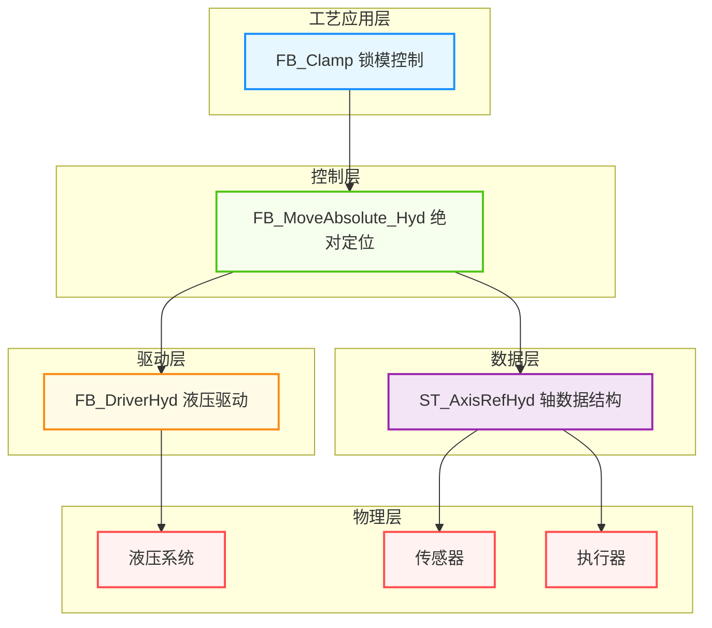
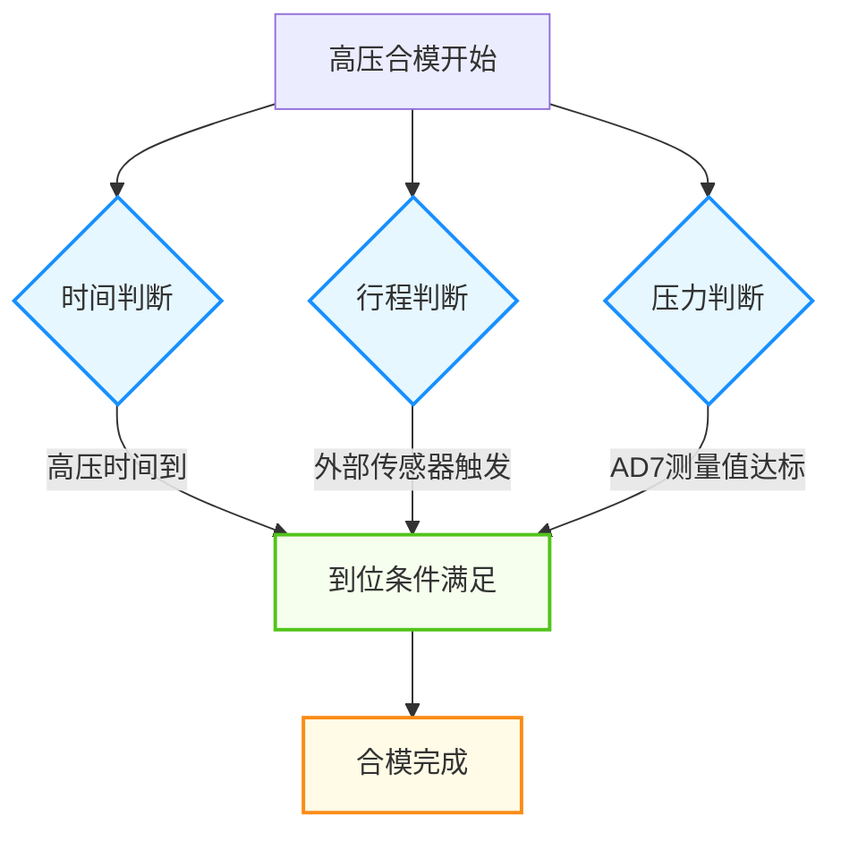
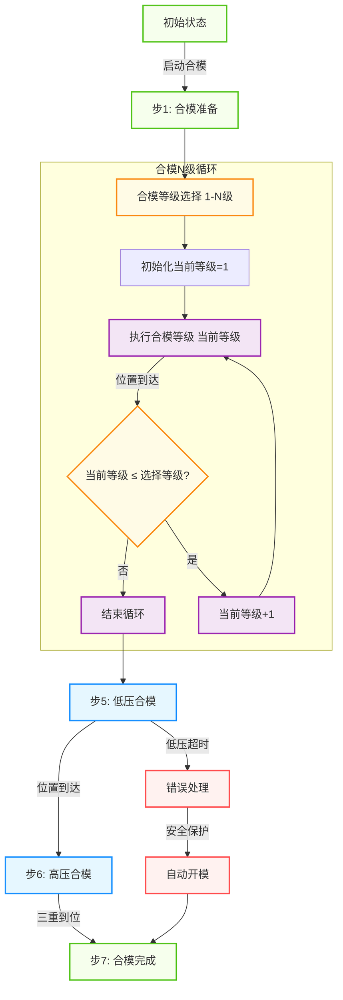
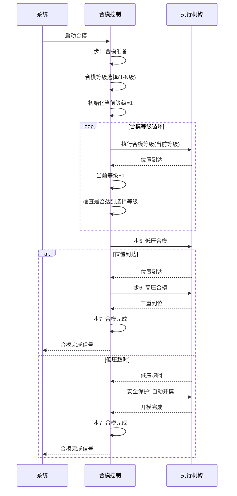
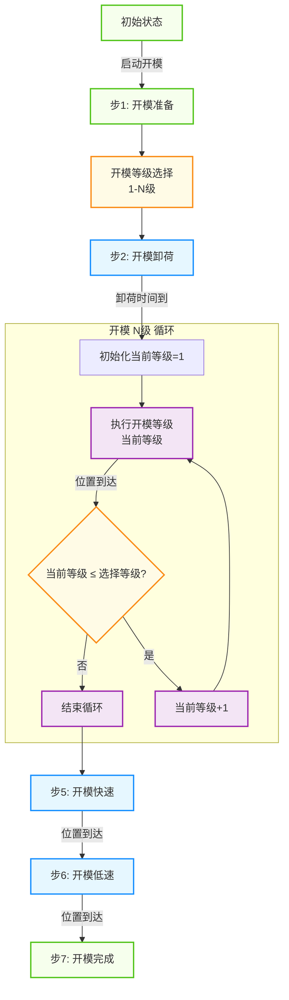
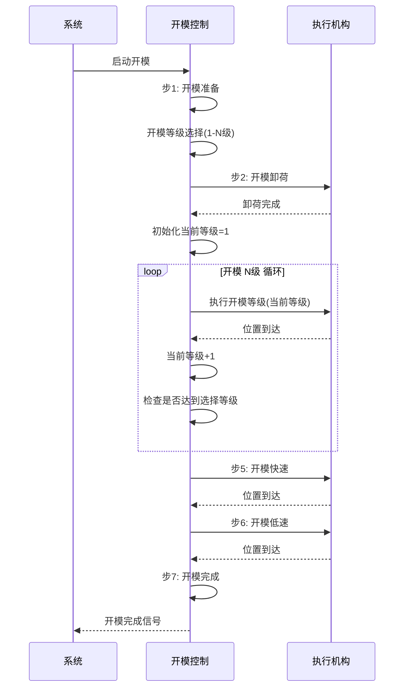
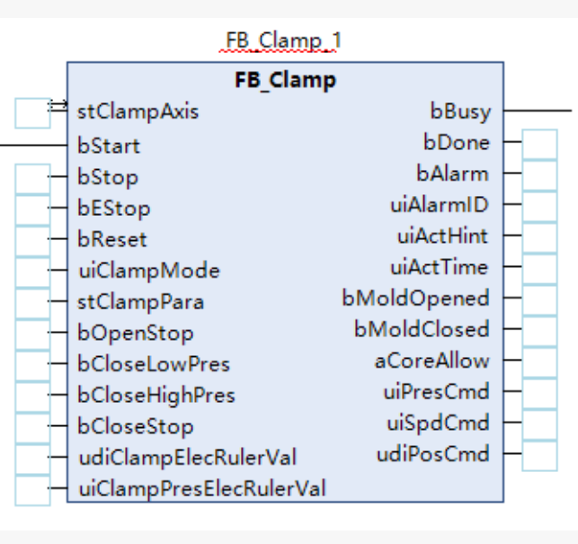
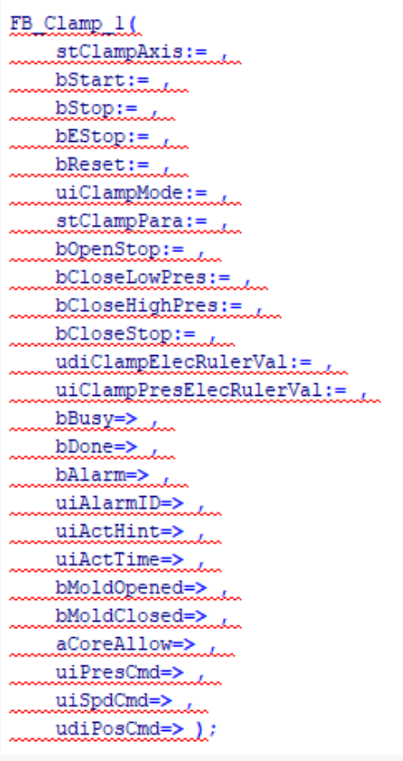
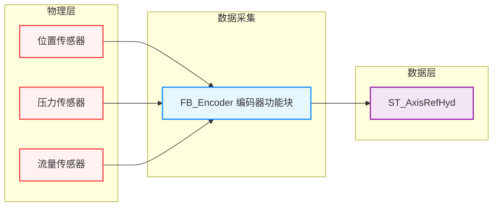
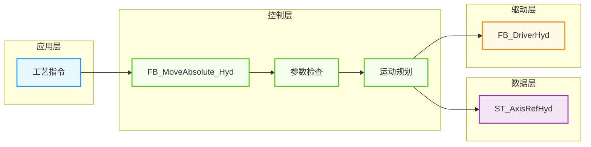

# 注塑机开合模功能

## 1. 概述

### 1.1 功能简介

开合模功能是注塑机最基本和核心的功能之一，负责模具的打开和闭合过程控制。该功能通过精确控制压力、流量和位置参数，确保模具运动平稳、安全且高效，为注塑成型提供坚实基础。

### 1.2 工艺特点

- **合模过程**：遵循从快到慢的速度递减原则，通过多级减速确保模具接近时的安全性
- **开模过程**：按照从近到远的顺序，确保模具平稳打开并停在正确位置
- **安全机制**：包含低压保护、超时保护、三重到位判断等多重安全保障
- **平台兼容性**：支持Luban平台（基于Beremiz二次开发）运行，采用标准IEC 61131-3 ST语法实现

### 1.3 技术架构

本功能采用分层架构设计，参考研发部提供的液压系统建模方案，结合倍福TF8560塑料技术功能标准，实现模块化、标准化设计。



---

## 2. 核心控制机制

### 2.1 合模到位判断机制

合模到位判断采用三重机制，与是否使用电子尺无关，确保合模到位的可靠性：



1. **时间判断**：通过计算高压锁模阶段的持续时间

   - 触发条件：高压锁模时间达到设定值
   - 对应参数：高压锁模时间
2. **行程判断**：通过外部DI传感器信号直接检测

   - 触发条件：外部到位传感器信号触发
   - 对应参数：外部到位传感器输入信号
3. **压力判断**：通过第7路模拟量输入AD7测量值判断

   - 触发条件：`AD7的测量值 > 设定高压压力`
   - 对应参数：AD7模拟量输入、高压压力设定值

### 2.2 电子尺功能说明

电子尺主要用于提供精确的位置反馈，用于控制合模过程中的速度切换点：

- **阶段切换控制**：通过电子尺反馈的位置值控制各阶段的切换
- **参数映射**：合模目标位置、低压转高压位置等参数用于阶段控制
- **不影响到位判断**：电子尺不直接参与到位判断，到位判断始终基于三重机制

---

## 3. 功能阶段定义

### 3.1 合模功能阶段

| 阶段编号 | 阶段名称 | 主要功能             | 控制参数                 | 阶段转换条件           |
| -------- | -------- | -------------------- | ------------------------ | ---------------------- |
| 1        | 合模准备 | 初始化参数，准备合模 | 无                       | 启动信号触发           |
| 2        | 合模一级 | 初始快速合模         | 压力、流量、目标位置     | 当前位置 ≤ 设定位置   |
| 3        | 合模二级 | 减速继续合模         | 压力、流量、目标位置     | 当前位置 ≤ 设定位置   |
| 4        | 合模三级 | 进一步减速           | 压力、流量、目标位置     | 当前位置 ≤ 设定位置   |
| 5        | 低压合模 | 模具接近时的安全保护 | 低压压力、流量、保护时间 | 当前位置 ≤ 转高压位置 |
| 6        | 高压合模 | 建立最终锁模力       | 高压压力、流量、锁模时间 | 三重到位判断条件满足   |
| 7        | 合模完成 | 保持锁模状态         | 无                       | 到达完成状态           |

### 3.2 开模功能阶段

| 阶段编号 | 阶段名称 | 主要功能             | 控制参数             | 阶段转换条件         |
| -------- | -------- | -------------------- | -------------------- | -------------------- |
| 1        | 开模准备 | 初始化参数，准备开模 | 无                   | 启动信号触发         |
| 2        | 开模卸荷 | 释放锁模压力         | 卸荷压力、流量、时间 | 卸荷时间达到设定值   |
| 3        | 开模一级 | 初始开模             | 压力、流量、目标位置 | 当前位置 ≥ 设定位置 |
| 4        | 开模二级 | 继续开模             | 压力、流量、目标位置 | 当前位置 ≥ 设定位置 |
| 5        | 开模快速 | 快速开模             | 压力、流量、目标位置 | 当前位置 ≥ 设定位置 |
| 6        | 开模低速 | 接近终点时减速       | 压力、流量、目标位置 | 当前位置 ≥ 设定位置 |
| 7        | 开模完成 | 保持开模状态         | 无                   | 到达完成状态         |

---

## 4. 控制流程

### 4.1 合模过程流程

#### 4.1.1 合模流程示意图



#### 4.1.2 合模流程序列图



> ⚠️ **重要说明**：
>
> 1. 整个合模过程中遇到中子进都需要暂停合模，待中子进完成后继续合模流程
> 2. 可设定合模段数，见流程图中⭐标识

### 4.2 开模过程流程

#### 4.2.1 开模流程示意图



#### 4.2.2 开模流程序列图



> ⚠️ **重要说明**：
>
> 1. 整个开模过程中遇到中子退都需要暂停开模，待中子退完成后继续开模流程
> 2. 可设定开模段数，见流程图中⭐标识

---

## 5. 数据结构与功能块

### 5.1 核心数据结构

#### 5.1.1 ST_AxisRefHyd 结构体

**用途**：封装油缸的所有静态参数和实时运行状态

| 字段名                 | 类型           | 说明                        |
| ---------------------- | -------------- | --------------------------- |
| `bActive`            | BOOL           | 轴是否激活                  |
| `eAxisState`         | E_AxisState    | 轴状态: Idle, Running, Stop |
| `nAxisID`            | INT            | 轴ID号                      |
| `rMaxCylinderStroke` | LREAL          | 最大油缸行程                |
| `rMaxVelocity`       | LREAL          | 最大速度                    |
| `rMaxPressure`       | LREAL          | 最大压力                    |
| `rSetPosition`       | LREAL          | 目标位置                    |
| `rSetVelocity`       | LREAL          | 目标速度                    |
| `rSetPressure`       | LREAL          | 目标压力                    |
| `rActualPosition`    | LREAL          | 实际位置                    |
| `rActualVelocity`    | LREAL          | 实际速度                    |
| `rActualPressure`    | LREAL          | 实际压力                    |
| `stPumpRequest`      | ST_PumpRequest | 向泵发送的请求              |
| `nFaultCode`         | INT            | 故障码                      |

#### 5.1.2 ST_ClampSeg 结构体

**用途**：定义开合模各阶段的工艺参数

| 字段名         | 类型  | 说明         |
| -------------- | ----- | ------------ |
| `uiPres`     | UINT  | 设定压力     |
| `uiSpd`      | UINT  | 设定速度     |
| `udiPos`     | UDINT | 设定位置     |
| `uiTime`     | UINT  | 设定时间     |
| `uiPresGrad` | UINT  | 设定压力斜率 |
| `uiSpdGrad`  | UINT  | 设定速度斜率 |

#### 5.1.3 ST_ClampPara 结构体

**用途**：封装开合模的所有工艺参数

| 字段名                      | 类型                       | 说明                                       |
| --------------------------- | -------------------------- | ------------------------------------------ |
| `uiOpenSegCnt`            | UINT                       | 开模段数选择                               |
| `uiOpenMode`              | UINT                       | 开模方式选择 0:电子尺  1:行程              |
| `uiOpenLimitTime`         | UINT                       | 开模限制时间                               |
| `stOpenUnloadPres`        | ST_ClampSeg                | 开模卸荷设定参数                           |
| `aOpenSeg`                | ARRAY[1..5] OF ST_ClampSeg | 开模多段设定参数                           |
| `uiOpenPresStartGrad`     | UINT                       | 压力启动斜率                               |
| `uiOpenPresStopGrad`      | UINT                       | 压力停止斜率                               |
| `uiOpenSpdStartGrad`      | UINT                       | 速度启动斜率                               |
| `uiOpenSpdStopGrad`       | UINT                       | 速度停止斜率                               |
| `uiCloseSegCnt`           | UINT                       | 合模段数选择                               |
| `uiCloseMode`             | UINT                       | 合模方式选择  0:电子尺  1:行程             |
| `uiCloseLimitTime`        | UINT                       | 合模限制时间                               |
| `uiCloseLowPresLimitTime` | UINT                       | 合模低压保护时间                           |
| `uiCloseEndMode`          | UINT                       | 合模终止方式选择  0：时间 1：行程 2： 压力 |
| `uiCloseEndHighPres`      | UINT                       | 合模高压压力                               |
| `aCloseSeg`               | ARRAY[1..3] OF ST_ClampSeg | 合模多段设定参数                           |
| `stCloseLowPres`          | ST_ClampSeg                | 合模低压设定参数                           |
| `stCloseHighPres`         | ST_ClampSeg                | 合模高压设定参数                           |
| `uiClosePresStartGrad`    | UINT                       | 压力启动斜率                               |
| `uiClosePresStopGrad`     | UINT                       | 压力停止斜率                               |
| `uiCloseSpdStartGrad`     | UINT                       | 速度启动斜率                               |
| `uiCloseSpdStopGrad`      | UINT                       | 速度停止斜率                               |
| `aCoreFn`                 | ARRAY[1..8] OF UINT        | 中子功能  0:不使用 1:使用  1..8组          |
| `aCoreInMode`             | ARRAY[1..8] OF UINT        | 中子进 开始方式 0:行程 1:位置  1..8组      |
| `aCoreInStroke`           | ARRAY[1..8] OF UINT        | 中子进 开始行程  1..8组                    |
| `aCoreInPos`              | ARRAY[1..8] OF UDINT       | 中子进 开始位置  1..8组                    |
| `aCoreOutMode`            | ARRAY[1..8] OF UINT        | 中子退 开始方式 0:行程 1:位置  1..8组      |
| `aCoreOutStroke`          | ARRAY[1..8] OF UINT        | 中子退 开始行程  1..8组                    |
| `aCoreOutPos`             | ARRAY[1..8] OF UDINT       | 中子退 开始位置  1..8组                    |

### 5.2 功能块定义

#### 5.2.1 FB_Clamp 功能块

**用途**：完整的锁模机构控制功能块，集成开模和合模控制
**指令格式**：

| 指令          | 名称 | FB/FC | LD/FBD表示                                           | ST表现                                               | 说明 |
| ------------- | ---- | ----- | ---------------------------------------------------- | ---------------------------------------------------- | ---- |
| `FB_Clamp0` | 锁模 | FB    |  |  | -    |

**输入输出参数**：

| 参数名        | 名称   | 类型 | 有效范围 | 初始值 | 说明       |
| ------------- | ------ | ---- | -------- | ------ | ---------- |
| `ClampAxis` | 锁模轴 |      | -        | -      | 锁模轴引用 |

**输入参数**：

| 参数名                      | 名称         | 类型         | 有效范围     | 初始值 | 说明                                           |
| --------------------------- | ------------ | ------------ | ------------ | ------ | ---------------------------------------------- |
| `bStart`                  | 启动         | BOOL         | FALSE,TRUE   | FALSE  | 启动                                           |
| `bStop`                   | 停止         | BOOL         | FALSE,TRUE   | FALSE  | 停止(有减速停)                                 |
| `bEStop`                  | 急停         | BOOL         | FALSE,TRUE   | FALSE  | 急停(立即停止，无减速停)                       |
| `bReset`                  | 复位         | BOOL         | FALSE,TRUE   | FALSE  | 复位                                           |
| `uiClampMode`             | 模式选择     | UINT         | 0-2          | 0      | 0:无模式 1:开模模式 2:合模模式                 |
| `stClampPara`             | 锁模参数     | ST_ClampPara | -            | -      | 上位机设定参数输入（包含开合模参数和中子参数） |
| `bOpenStop`               | 开模停止     | BOOL         | FALSE,TRUE   | FALSE  | 开模停止                                       |
| `bCloseLowPres`           | 合模低压     | BOOL         | FALSE,TRUE   | FALSE  | 合模低压                                       |
| `bCloseHighPres`          | 合模高压     | BOOL         | FALSE,TRUE   | FALSE  | 合模高压                                       |
| `bCloseStop`              | 合模停止     | BOOL         | FALSE,TRUE   | FALSE  | 合模停止                                       |
| `udiClampElecRulerVal`    | 锁模电子尺值 | UDINT        | 0-4294967295 | 0      | 锁模电子尺值                                   |
| `uiClampPresElecRulerVal` | 锁模压力值   | UINT         | 0-65535      | 0      | 锁模压力值                                     |

**输出参数**：

| 参数名          | 名称             | 类型                | 有效范围     | 初始值 | 说明                                                                                                                                                                                                                   |
| --------------- | ---------------- | ------------------- | ------------ | ------ | ---------------------------------------------------------------------------------------------------------------------------------------------------------------------------------------------------------------------- |
| `bBusy`       | 忙状态           | BOOL                | FALSE,TRUE   | FALSE  | 忙状态                                                                                                                                                                                                                 |
| `bDone`       | 完成状态         | BOOL                | FALSE,TRUE   | FALSE  | 完成状态                                                                                                                                                                                                               |
| `bAlarm`      | 报警状态         | BOOL                | FALSE,TRUE   | FALSE  | 报警状态                                                                                                                                                                                                               |
| `uiAlarmID`   | 报警代码         | UINT                | 0-65535      | 0      | 报警代码（0:无 1000:低压保护时间到 1001:开模未定时完成 1002:合模未定时完成）                                                                                                                                           |
| `uiActHint`   | 当前动作状态     | UINT                | 0-65535      | 0      | 当前动作状态（0:无动作 1:报警状态 2:开模完成 3:合模完成 4:中子执行 10:开模卸荷 11:开模1段 12:开模2段 13:开模3段 14:开模4段 15:开模5段 21:合模1段 22:合模2段 23:合模3段 24:合模4段 25:合模5段 30:合模低压 31:合模高压） |
| `uiActTime`   | 当前动作运行时间 | UINT                | 0-65535      | 0      | 当前动作运行时间                                                                                                                                                                                                       |
| `bMoldOpened` | 开模完成         | BOOL                | FALSE,TRUE   | FALSE  | 开模完成                                                                                                                                                                                                               |
| `bMoldClosed` | 合模完成         | BOOL                | FALSE,TRUE   | FALSE  | 合模完成                                                                                                                                                                                                               |
| `aCoreAllow`  | 中子允许信号     | ARRAY[1..8] OF BOOL | -            | -      | 中子允许信号（1..8组）                                                                                                                                                                                                 |
| `uiPresCmd`   | 压力命令输出     | UINT                | 0-65535      | 0      | 压力命令输出                                                                                                                                                                                                           |
| `uiSpdCmd`    | 速度命令输出     | UINT                | 0-65535      | 0      | 速度命令输出                                                                                                                                                                                                           |
| `udiPosCmd`   | 位置命令输出     | UDINT               | 0-4294967295 | 0      | 位置命令输出                                                                                                                                                                                                           |

### 5.3 枚举类型定义

#### 5.3.1 锁模状态 E_ClampState

| 值 | 名称                   | 说明        |
| -- | ---------------------- | ----------- |
| 0  | eState_Idle            | 空闲状态    |
| 1  | eState_OpenUnloadPress | 开模卸荷    |
| 2  | eState_Opening         | 开模中(5段) |
| 3  | eState_Opened          | 开模完成    |
| 4  | eState_Closing         | 合模中(3段) |
| 5  | eState_Closed          | 合模完成    |
| 6  | eState_CloseLowPress   | 合模低压    |
| 7  | eState_CloseHighPress  | 合模高压    |
| 8  | eState_Error           | 错误状态    |

---

## 6. 核心参数说明

### 6.1 合模关键参数

| 参数类别 | 参数名称         | 程序变量名                          | 功能说明                                     |
| -------- | ---------------- | ----------------------------------- | -------------------------------------------- |
| 合模段数 | 合模段数选择     | stClampPara.uiCloseSegCnt           | 选择合模的段数（1-3段）                      |
| 合模方式 | 合模方式选择     | stClampPara.uiCloseMode             | 选择合模的控制方式（0:电子尺  1:行程）       |
| 时间限制 | 合模限制时间     | stClampPara.uiCloseLimitTime        | 合模过程的总时间限制                         |
| 低压保护 | 合模低压保护时间 | stClampPara.uiCloseLowPresLimitTime | 低压合模阶段的保护时间                       |
| 终止方式 | 合模终止方式选择 | stClampPara.uiCloseEndMode          | 合模终止判断方式（0：时间 1：行程 2： 压力） |
| 高压压力 | 合模高压压力     | stClampPara.uiCloseEndHighPres      | 合模高压阶段的压力设定                       |
| 合模多段 | 合模多段设定参数 | stClampPara.aCloseSeg[1..3]         | 合模各阶段的工艺参数                         |
| 低压参数 | 合模低压设定参数 | stClampPara.stCloseLowPres          | 合模低压阶段的工艺参数                       |
| 高压参数 | 合模高压设定参数 | stClampPara.stCloseHighPres         | 合模高压阶段的工艺参数                       |
| 斜率参数 | 压力启动斜率     | stClampPara.uiClosePresStartGrad    | 合模压力启动斜率                             |
| 斜率参数 | 压力停止斜率     | stClampPara.uiClosePresStopGrad     | 合模压力停止斜率                             |
| 斜率参数 | 速度启动斜率     | stClampPara.uiCloseSpdStartGrad     | 合模速度启动斜率                             |
| 斜率参数 | 速度停止斜率     | stClampPara.uiCloseSpdStopGrad      | 合模速度停止斜率                             |

### 6.2 开模关键参数

| 参数类别 | 参数名称         | 程序变量名                      | 功能说明                               |
| -------- | ---------------- | ------------------------------- | -------------------------------------- |
| 开模段数 | 开模段数选择     | stClampPara.uiOpenSegCnt        | 选择开模的段数（1-5段）                |
| 开模方式 | 开模方式选择     | stClampPara.uiOpenMode          | 选择开模的控制方式（0:电子尺  1:行程） |
| 时间限制 | 开模限制时间     | stClampPara.uiOpenLimitTime     | 开模过程的总时间限制                   |
| 卸荷参数 | 开模卸荷设定参数 | stClampPara.stOpenUnloadPres    | 开模卸荷阶段的工艺参数                 |
| 开模多段 | 开模多段设定参数 | stClampPara.aOpenSeg[1..5]      | 开模各阶段的工艺参数                   |
| 斜率参数 | 压力启动斜率     | stClampPara.uiOpenPresStartGrad | 开模压力启动斜率                       |
| 斜率参数 | 压力停止斜率     | stClampPara.uiOpenPresStopGrad  | 开模压力停止斜率                       |
| 斜率参数 | 速度启动斜率     | stClampPara.uiOpenSpdStartGrad  | 开模速度启动斜率                       |
| 斜率参数 | 速度停止斜率     | stClampPara.uiOpenSpdStopGrad   | 开模速度停止斜率                       |

### 6.3 中子参数

| 参数类别 | 参数名称        | 程序变量名                       | 功能说明                      |
| -------- | --------------- | -------------------------------- | ----------------------------- |
| 中子参数 | 中子功能        | stClampPara.aCoreFn[1..8]        | 中子功能  0:不使用 1:使用     |
| 中子参数 | 中子进 开始方式 | stClampPara.aCoreInMode[1..8]    | 中子进 开始方式 0:行程 1:位置 |
| 中子参数 | 中子进 开始行程 | stClampPara.aCoreInStroke[1..8]  | 中子进 开始行程               |
| 中子参数 | 中子进 开始位置 | stClampPara.aCoreInPos[1..8]     | 中子进 开始位置               |
| 中子参数 | 中子退 开始方式 | stClampPara.aCoreOutMode[1..8]   | 中子退 开始方式 0:行程 1:位置 |
| 中子参数 | 中子退 开始行程 | stClampPara.aCoreOutStroke[1..8] | 中子退 开始行程               |
| 中子参数 | 中子退 开始位置 | stClampPara.aCoreOutPos[1..8]    | 中子退 开始位置               |

> ⚠️ **重要说明**：
>
> 1. 中子参数使用位置/行程，通过开合模方式判断
> 2. 只有选择在开合模过程中需要触发时，才会有对应信号输出，其他情况不输出
> 3. 例如：开模前，开模停，合模前，合模停，顶进停，托模完 不输出

---

## 7. 功能块实现

### 7.1 FB_Clamp 实现详解

#### 7.1.1 核心逻辑

1. **状态管理**：使用 `E_ClampState` 枚举类型管理锁模的各种状态
2. **模式控制**：根据 `uiClampMode` 参数选择开模或合模模式
3. **阶段控制**：
   - 合模：根据 `stClampPara.uiCloseSegCnt` 控制合模段数（1-3段）
   - 开模：根据 `stClampPara.uiOpenSegCnt` 控制开模段数（1-5段）
4. **到位判断**：合模到位采用三重判断机制（时间、行程、压力）
5. **安全保护**：包含低压保护、超时保护等安全机制
6. **中子控制**：根据 `stClampPara.aCoreFn` 等参数控制中子动作

#### 7.1.2 状态转换逻辑

- **开模流程**：空闲状态 → 开模卸荷 → 开模中 → 开模完成
- **合模流程**：空闲状态 → 合模中 → 合模低压 → 合模高压 → 合模完成
- **错误处理**：任何状态 → 错误状态（发生错误时）

---

## 8. 安全保护机制

### 8.1 低压保护

| 项目     | 说明                                                      |
| -------- | --------------------------------------------------------- |
| 触发条件 | 低压合模阶段时间超过设定的保护时间                        |
| 响应措施 | 触发错误报警，请求自动开模，确保模具安全                  |
| 参数控制 | 通过 stClampPara.uiCloseLowPresLimitTime 参数设置保护时间 |

### 8.2 超时保护

| 项目     | 说明                                                     |
| -------- | -------------------------------------------------------- |
| 合模超时 | 整个合模过程时间超过总时间限制                           |
| 响应措施 | 触发错误报警，停止合模动作                               |
| 参数控制 | 通过 stClampPara.uiCloseLimitTime 参数设置合模总时间限制 |
| 开模超时 | 整个开模过程时间超过总时间限制                           |
| 响应措施 | 触发错误报警，停止开模动作                               |
| 参数控制 | 通过 stClampPara.uiOpenLimitTime 参数设置开模总时间限制  |

### 8.3 三重到位判断

| 判断方式 | 说明                             | 触发条件                                             |
| -------- | -------------------------------- | ---------------------------------------------------- |
| 时间判断 | 确保锁模力充分建立               | 高压锁模时间达到设定值                               |
| 行程判断 | 通过外部传感器直接检测机械到位   | 外部到位传感器信号触发（bCloseStop）                 |
| 压力判断 | 通过模拟量输入检测压力达到设定值 | 压力测量值达到 stClampPara.uiCloseEndHighPres 设定值 |

### 8.4 错误代码说明

| 错误代码 | 名称                     | 说明             |
| -------- | ------------------------ | ---------------- |
| 1301     | cError_ClampOverload     | 锁模过载错误     |
| 1302     | cError_MoldProtection    | 模具保护触发错误 |
| 1303     | cError_TieBarStretch     | 拉杆拉伸超限错误 |
| 1304     | cError_PlatenParallel    | 模板平行度错误   |
| 1305     | cError_MoldHeight        | 模具高度错误     |
| 1306     | cError_ClampNotLocked    | 锁模未锁定错误   |
| 1307     | cError_SafetyDoor        | 安全门错误       |
| 1308     | cError_HydraulicPressure | 液压压力错误     |
| 1309     | cError_ToggleDeadCenter  | 肘杆死点错误     |

---

## 9. 平台兼容性

### 9.1 Luban平台适配

1. **编程规范**：

   - 使用 VAR_INPUT、VAR_OUTPUT 和 VAR 关键字声明变量
   - 使用简单的整数状态机进行逻辑控制
   - 使用计数器方式实现延时功能
   - 通过全局变量集中管理压力流量参数
2. **语法注意事项**：

   - **类型转换**：避免使用Beremiz不支持的REAL()类型转换函数
     ```st
     // 推荐的类型转换方式
     MovingMoldPosition := (MoldingPositionAD * 1) * PositionScaling + PositionOffset;
     ```
   - **赋值语句**：确保所有赋值语句格式正确，避免使用冒号(:)作为标签
   - **循环控制**：注意避免使用Beremiz不支持的FOR循环控制变量格式

---

## 10. 参数调整指南

### 10.1 合模参数调整

1. **阶段位置参数**：

   - 合模一级位置：设置为模具开始合模时的初始位置附近
   - 合模二级位置：设置为一级和三级位置之间
   - 合模三级位置：设置为接近低压合模的位置
   - 低压转高压位置：设置在模具即将闭合但尚未完全闭合的位置
2. **压力流量参数**：

   - 合模一级：较高流量，快速接近模具
   - 合模二级、三级：逐渐降低流量，确保平稳过渡
   - 低压合模：较低压力，保护模具
   - 高压合模：适当压力，确保锁模力
3. **时间参数**：

   - 高压锁模时间：确保锁模力充分建立，根据模具大小调整
   - 低压保护时间：足够长以确保安全，但不宜过长

### 10.2 开模参数调整

1. **阶段位置参数**：从开模一级到开模低速，位置值逐渐增大
2. **压力流量参数**：根据需要调整各阶段的压力和流量
3. **卸荷时间**：确保锁模力充分释放

---

## 11. 调试与故障排除

### 11.1 常见故障处理

| 故障现象     | 可能原因                       | 解决方法                             |
| ------------ | ------------------------------ | ------------------------------------ |
| 低压保护超时 | 模具中有异物或模具变形         | 检查模具，清除异物，调整低压保护时间 |
| 合模不到位   | 高压时间不足或压力不够         | 增加高压锁模时间或调整高压压力       |
| 开模不顺畅   | 卸荷不充分或各阶段参数设置不当 | 延长卸荷时间，调整各阶段参数         |
| 位置偏差过大 | 速度设置过高、负载变化         | 调整速度参数、检查负载情况           |
| 压力异常     | 系统泄漏、泵故障               | 检查液压系统、维修泵设备             |

### 11.2 调试建议

1. **阶段监控**：添加监控点，观察各阶段的切换情况
2. **参数记录**：记录调试过程中的参数变化，便于优化
3. **增量调整**：参数调整采用小幅度增量方式，避免剧烈变化
4. **多重验证**：调整后进行多次测试，确保稳定性

---

## 12. 数据流说明

### 12.1 传感器数据采集流



在每个扫描周期内，数据从物理层流向轴结构体。编码器功能块FB_Encoder根据硬件模块的输入信息确定轴的实际位置、速度、压力等数据，并写入轴结构体的运行时数据区。

### 12.2 动作控制流



当工艺层触发合模或开模动作时，定位功能块通过VAR_IN_OUT接口获取轴结构体的访问权限，执行参数检查、运动规划和状态更新，并向驱动层发送资源请求。

---

## 13. 相关文档与参考

### 13.1 功能块实现文件

- FB_Clamp.st：锁模控制功能块实现
- ST_ClampSeg：锁模段参数结构体定义
- ST_ClampPara：锁模参数结构体定义
- E_ClampState：锁模状态枚举定义
- ST_AxisRefHyd：轴数据结构体定义
- FB_DriverHyd：液压驱动功能块

### 13.2 技术文档

- 《功能块使用指南.md》：功能块的详细使用说明
- 《注塑液压系统建模分析2.md》：研发部提供的液压系统建模方案
- 《参数映射关系说明.md》：详细的参数映射关系
- 《GM2XX立式驱控一体使用说明书》：系统总体说明

### 13.3 命名规范参考

详细的命名规范请参考专门的《命名规范文档.md》文件，包括：

- 变量命名规则
- 类型标识规范
- 功能块、结构体、枚举类型等命名规则
- 代码格式规范

遵循统一的命名规范有助于提高代码的可读性和可维护性，确保团队协作的一致性。

---

## 14. 文档信息

**适用范围**：立式注塑机锁模控制功能开发项目
**数据定义基准**：数据定义初版.st v1.0

### 14.1 版本控制

| 版本 | 日期       | 作者      | 变更说明                                                                                         |
| ---- | ---------- | --------- | ------------------------------------------------------------------------------------------------ |
| 1.0  | 2025-08-17 | 汪工      | 初始版本，完成基本功能描述                                                                       |
| 1.1  | 2025-10-09 | 汪工      | 完善功能描述，添加详细参数说明                                                                   |
| 1.2  | 2026-03-17 | 周工/汪工 | 调整文档结构，优化内容组织； 更新数据结构定义，确保与代码一致性； 优化文档格式，添加页内导航支持 |
| 1.3  | 2026-03-23 | 周工/汪工 | 简化变量名称，添加提示信息，提高代码可读性和一致性； 优化Mermaid图表样式|
