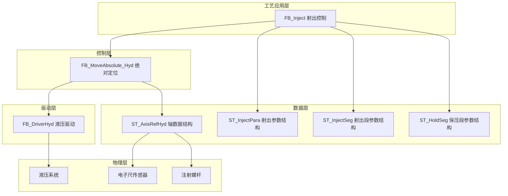
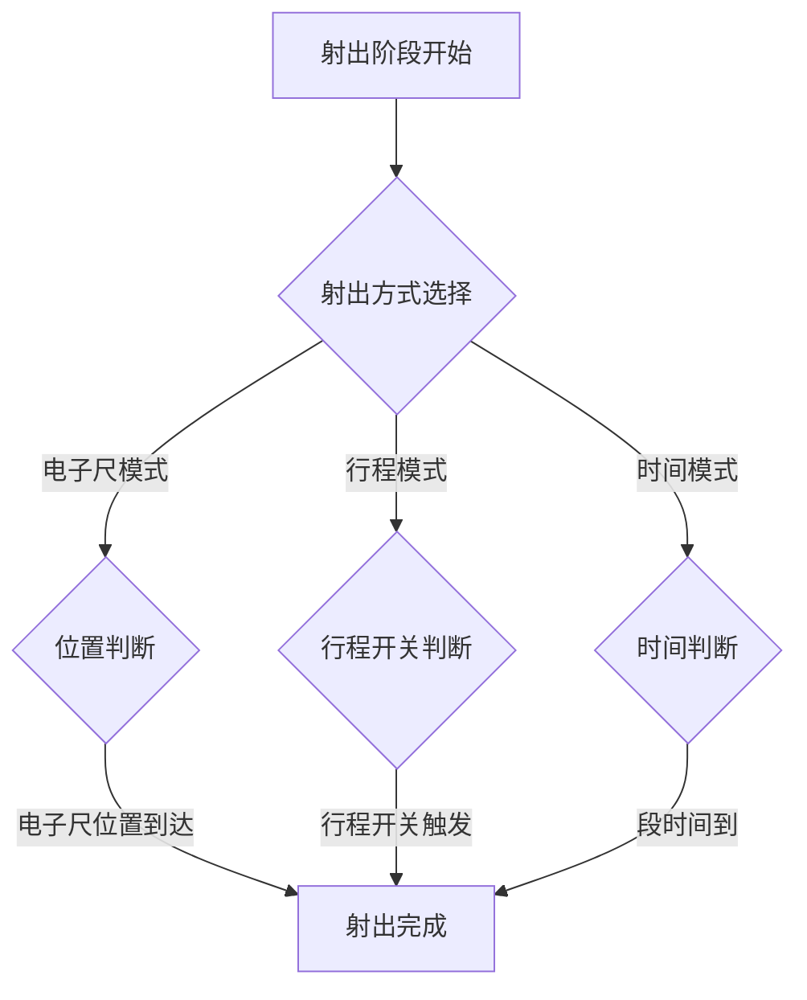
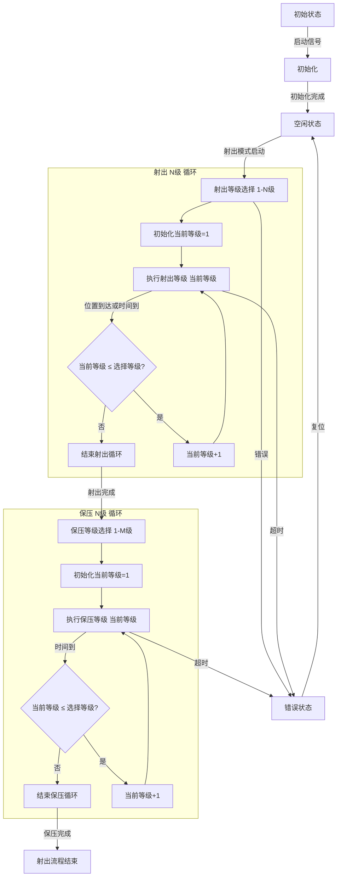
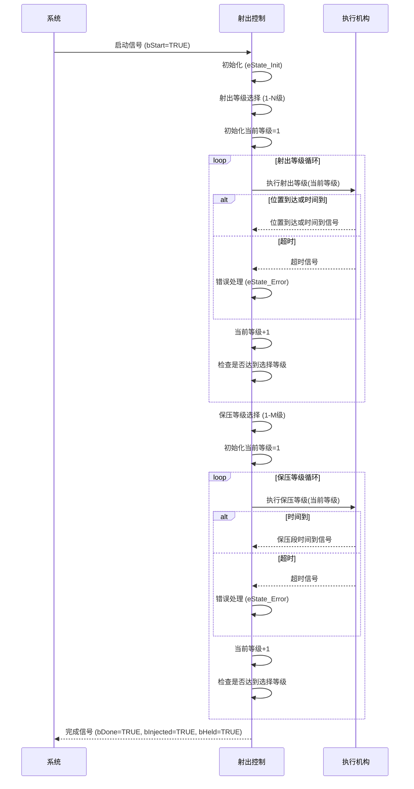
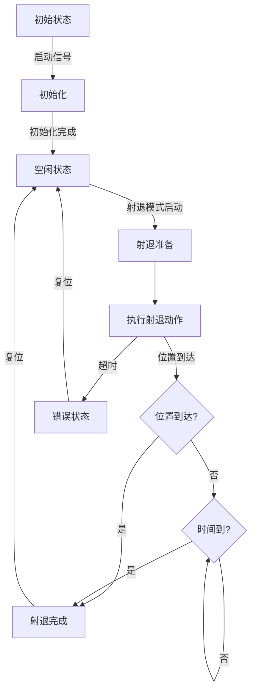
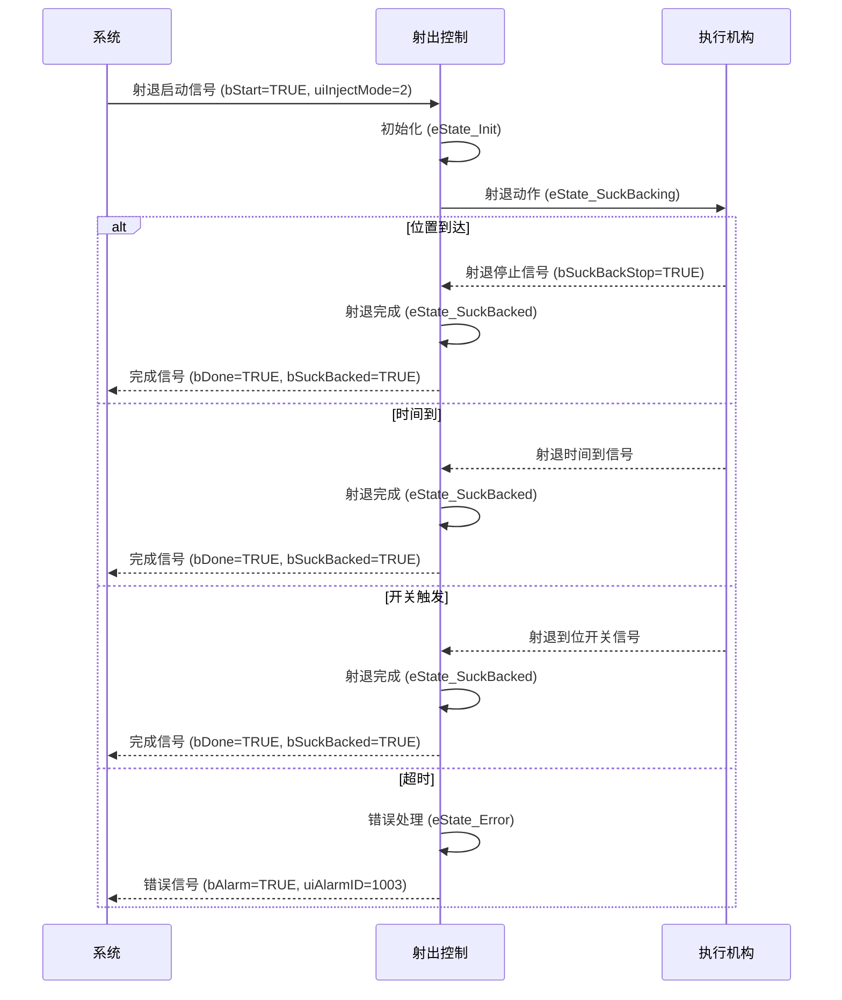
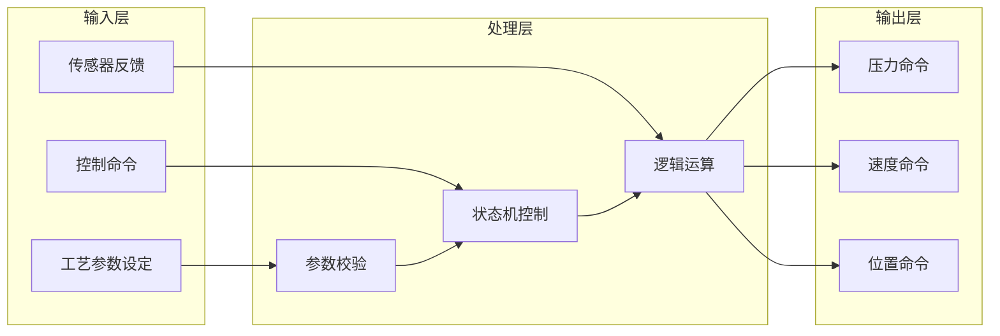

# 注塑机射出功能

## 1. 概述

### 1.1 功能简介

  
⚡

  <strong>核心功能</strong>
  
射出功能是注塑机的核心功能之一，负责将熔融状态的塑料通过注射螺杆高压高速地注入模具型腔。射出过程的控制精度直接影响产品的质量、尺寸稳定性和生产效率。

### 1.2 工艺特点

  <h4>工艺特性</h4>
  <ul>
    <li><strong>多段射出控制</strong>：支持10段射出工艺参数，可实现复杂的填充曲线</li>
    <li><strong>多段保压控制</strong>：支持8段保压工艺参数，确保制品尺寸稳定性</li>
    <li><strong>射退功能</strong>：支持射退动作，防止浇口拉丝和制品缺陷</li>
    <li><strong>多种控制方式</strong>：支持电子尺模式、行程模式、时间模式三种控制方式</li>
    <li><strong>斜率控制</strong>：支持压力和速度的启动/停止斜率控制</li>
    <li><strong>安全机制</strong>：包含超时保护、状态互锁等多重安全保障</li>
    <li><strong>平台兼容性</strong>：支持Luban平台（基于Beremiz二次开发）运行，采用标准IEC 61131-3 ST语法实现</li>
  </ul>

### 1.3 技术架构

本功能采用分层架构设计，参考研发部提供的液压系统建模方案，结合倍福TF8560塑料技术功能标准，实现模块化、标准化设计。

***

## 2. 核心控制机制

### 2.1 射出到位判断机制

  
✅

  <strong>多模式到位判断</strong>
  
射出到位判断支持三种模式：电子尺模式、行程模式和时间模式，根据实际工艺需求选择合适的控制方式。

1. **电子尺位置判断**：通过电子尺反馈的螺杆位置值判断
   - 触发条件：`电子尺位置值 >= 设定位置`
   - 对应参数：aInjSeg[1..10].udiPos

2. **行程开关判断**：通过外部DI传感器信号直接检测
   - 触发条件：外部行程开关信号触发
   - 对应参数：bInjSeg1Stop、bInjSeg2Stop、bInjStop

3. **时间判断**：通过计算各阶段的持续时间
   - 触发条件：各段时间达到设定值
   - 对应参数：aInjSeg[1..10].uiTime

### 2.2 电子尺功能说明

  <h4>电子尺作用</h4>
  <ul>
    <li><strong>位置反馈</strong>：通过电子尺实时反馈注射螺杆的实际位置</li>
    <li><strong>阶段切换控制</strong>：通过电子尺反馈的位置值控制各阶段的切换</li>
    <li><strong>参数映射</strong>：射出目标位置、各段位置等参数用于阶段控制</li>
  </ul>

***

## 3. 功能阶段定义

### 3.1 射出阶段（10段）

  <h4>射出阶段说明</h4>
  <ul>
    <li><strong>速度递减原则</strong>：遵循从快到慢的速度递减原则，确保填充过程平稳</li>
    <li><strong>压力递加原则</strong>：随着模具型腔填充率增加，压力逐渐增加</li>
    <li><strong>位置控制</strong>：通过电子尺位置反馈精确控制各段切换</li>
  </ul>

| 阶段编号 | 阶段名称 | 主要功能 | 控制参数 | 转换条件 |
|----------|----------|----------|----------|----------|
| 1 | 射出1段 | 初始慢速填充 | 压力、速度、位置、时间、斜率 | 位置到达或时间到 |
| 2 | 射出2段 | 二级射出 | 压力、速度、位置、时间、斜率 | 位置到达或时间到 |
| 3 | 射出3段 | 三级射出 | 压力、速度、位置、时间、斜率 | 位置到达或时间到 |
| 4 | 射出4段 | 四级射出 | 压力、速度、位置、时间、斜率 | 位置到达或时间到 |
| 5 | 射出5段 | 五级射出 | 压力、速度、位置、时间、斜率 | 位置到达或时间到 |
| 6 | 射出6段 | 六级射出 | 压力、速度、位置、时间、斜率 | 位置到达或时间到 |
| 7 | 射出7段 | 七级射出 | 压力、速度、位置、时间、斜率 | 位置到达或时间到 |
| 8 | 射出8段 | 八级射出 | 压力、速度、位置、时间、斜率 | 位置到达或时间到 |
| 9 | 射出9段 | 九级射出 | 压力、速度、位置、时间、斜率 | 位置到达或时间到 |
| 10 | 射出10段 | 十级射出 | 压力、速度、位置、时间、斜率 | 位置到达或时间到 |

### 3.2 保压阶段（8段）

  <h4>保压阶段说明</h4>
  <ul>
    <li><strong>时间控制</strong>：保压阶段主要通过时间控制</li>
    <li><strong>压力递减</strong>：随着保压进行，压力逐渐递减</li>
    <li><strong>尺寸稳定</strong>：确保制品尺寸稳定和内部质量</li>
  </ul>

| 阶段编号 | 阶段名称 | 主要功能 | 控制参数 | 转换条件 |
|----------|----------|----------|----------|----------|
| 1 | 保压1段 | 一级保压 | 压力、速度、时间 | 时间到 |
| 2 | 保压2段 | 二级保压 | 压力、速度、时间 | 时间到 |
| 3 | 保压3段 | 三级保压 | 压力、速度、时间 | 时间到 |
| 4 | 保压4段 | 四级保压 | 压力、速度、时间 | 时间到 |
| 5 | 保压5段 | 五级保压 | 压力、速度、时间 | 时间到 |
| 6 | 保压6段 | 六级保压 | 压力、速度、时间 | 时间到 |
| 7 | 保压7段 | 七级保压 | 压力、速度、时间 | 时间到 |
| 8 | 保压8段 | 八级保压 | 压力、速度、时间 | 时间到 |

### 3.3 射退阶段

  <h4>射退阶段说明</h4>
  <ul>
    <li><strong>防止拉丝</strong>：射退动作可防止浇口拉丝</li>
    <li><strong>位置控制</strong>：通过电子尺位置反馈控制射退距离</li>
    <li><strong>时间控制</strong>：支持时间模式控制射退过程</li>
  </ul>

| 阶段编号 | 阶段名称 | 主要功能 | 控制参数 | 转换条件 |
|----------|----------|----------|----------|----------|
| 1 | 射退中 | 射退动作执行 | 压力、速度、位置、时间、斜率 | 位置到达或时间到或开关触发 |

***

## 4. 控制流程

### 4.1 射出过程流程

#### 4.1.1 射出流程示意图

#### 4.1.2 射出流程序列图

### 4.2 射退过程流程

#### 4.2.1 射退流程示意图

#### 4.2.2 射退流程序列图

> ⚠️ **重要说明**：
>
> 1. 射出等级段数可通过`uiInjSegCnt`参数设定（1-10段）
> 2. 保压等级段数可通过`uiHoldSegCnt`参数设定（1-8段）
> 3. 射退可在保压完成后执行，防止浇口拉丝

***

## 5. 数据结构与功能块

### 5.1 核心数据结构

#### 5.1.1 E_InjectState 枚举类型

**用途**：定义射出动作的状态机状态

| 值 | 名称 | 说明 |
|----|------|------|
| 0 | eState_Idle | 空闲状态 |
| 1 | eState_Init | 初始化状态 |
| 2 | eState_Injecting | 射出中(10段) |
| 3 | eState_Injected | 射出完成 |
| 4 | eState_Holding | 保压中(8段) |
| 5 | eState_Held | 保压完成 |
| 6 | eState_SuckBacking | 射退中 |
| 7 | eState_SuckBacked | 射退完成 |
| 8 | eState_Error | 错误状态 |

#### 5.1.2 ST_InjectSeg 结构体

**用途**：定义射出单段工艺参数

| 字段名 | 类型 | 有效范围 | 说明 |
|--------|------|----------|------|
| uiPres | UINT | 0-1000 | 设定压力 |
| uiSpd | UINT | 0-1000 | 设定速度 |
| udiPos | UDINT | 0-4294967295 | 设定位置 |
| uiTime | UINT | 0-65535 | 设定时间 |
| uiPresGrad | UINT | 0-1000 | 设定压力斜率 |
| uiSpdGrad | UINT | 0-1000 | 设定速度斜率 |

#### 5.1.3 ST_HoldSeg 结构体

**用途**：定义保压单段工艺参数

| 字段名 | 类型 | 有效范围 | 说明 |
|--------|------|----------|------|
| uiPres | UINT | 0-1000 | 设定压力 |
| uiSpd | UINT | 0-1000 | 设定速度 |
| uiTime | UINT | 0-65535 | 设定时间 |

#### 5.1.4 ST_InjectPara 结构体

**用途**：定义完整射出工艺参数

##### 射出多段工艺参数

| 字段名 | 类型 | 有效范围 | 说明 |
|--------|------|----------|------|
| uiInjSegCnt | UINT | 1-10 | 射出段数选择 |
| uiInjMode | UINT | 0-2 | 射出方式 (0:电子尺 1:行程 2:时间) |
| uiInjTotalTime | UINT | 0-65535 | 射出总时间 |
| dwInjToHoldMode | DWORD | Bit0/Bit1/Bit2 | 转保压方式（按位组合） |
| uiInjToHoldTime | UINT | 0-65535 | 转保压时间阈值(ms) |
| uiInjToHoldPres | UINT | 0-1000 | 转保压压力阈值 |
| udiInjToHoldPos | UDINT | 0-1000 | 转保压位置阈值 |
| aInjSeg[1..10] | ARRAY OF ST_InjectSeg | - | 射出多段设定参数 |
| uiInjPresStartGrad | UINT | 0-1000 | 压力启动斜率 |
| uiInjPresStopGrad | UINT | 0-1000 | 压力停止斜率 |
| uiInjSpdStartGrad | UINT | 0-1000 | 速度启动斜率 |
| uiInjSpdStopGrad | UINT | 0-1000 | 速度停止斜率 |

##### 保压多段工艺参数

| 字段名 | 类型 | 有效范围 | 说明 |
|--------|------|----------|------|
| uiHoldSegCnt | UINT | 1-8 | 保压段数选择 |
| aHoldSeg[1..8] | ARRAY OF ST_HoldSeg | - | 保压多段设定参数 |

##### 射退工艺参数

| 字段名 | 类型 | 有效范围 | 说明 |
|--------|------|----------|------|
| uiSuckBackMode | UINT | 0-1 | 射退方式 (0:电子尺 1:时间) |
| stSuckBackSeg | ST_InjectSeg | - | 射退设定参数 |
| uiSuckBackPresStartGrad | UINT | 0-1000 | 压力启动斜率 |
| uiSuckBackPresStopGrad | UINT | 0-1000 | 压力停止斜率 |
| uiSuckBackSpdStartGrad | UINT | 0-1000 | 速度启动斜率 |
| uiSuckBackSpdStopGrad | UINT | 0-1000 | 速度停止斜率 |

### 5.2 功能块定义

#### 5.2.1 FB_Inject 功能块

**用途**：射出、保压和射退控制功能块

**输入输出参数**：

| 参数名 | 类型 | 说明 |
|--------|------|------|
| stInjectAxis | ST_AxisRefHyd | 轴数据结构 |

**输入参数**：

| 参数名 | 类型 | 有效范围 | 默认值 | 说明 |
|--------|------|----------|--------|------|
| bStart | BOOL | FALSE,TRUE | FALSE | 启动 |
| bStop | BOOL | FALSE,TRUE | FALSE | 停止(有减速停) |
| bEStop | BOOL | FALSE,TRUE | FALSE | 急停(立即停止) |
| bReset | BOOL | FALSE,TRUE | FALSE | 复位 |
| uiInjectMode | UINT | 0-2 | 0 | 模式选择 (0:无 1:射出 2:射退) |
| stInjectPara | ST_InjectPara | - | - | 工艺参数 |
| bInjSeg1Stop | BOOL | FALSE,TRUE | FALSE | 二级射出停止 |
| bInjSeg2Stop | BOOL | FALSE,TRUE | FALSE | 三级射出停止 |
| bInjStop | BOOL | FALSE,TRUE | FALSE | 射出停止 |
| bSuckBackStop | BOOL | FALSE,TRUE | FALSE | 射退停止 |
| udiInjElecRulerVal | UDINT | 0-4294967295 | 0 | 射胶电子尺值 |

**输出参数**：

| 参数名 | 类型 | 说明 |
|--------|------|------|
| bBusy | BOOL | 忙状态 |
| bDone | BOOL | 完成状态 |
| bAlarm | BOOL | 报警状态 |
| uiAlarmID | DWORD | 报警代码（按位标识：Bit0射出超时 Bit1保压超时 Bit2射退超时 Bit3位置超限） |
| uiActHint | UINT | 当前动作状态 |
| uiActTime | UINT | 当前动作运行时间 |
| bInjected | BOOL | 射出完成 |
| bHeld | BOOL | 保压完成 |
| bSuckBacked | BOOL | 射退完成 |
| uiPresCmd | UINT | 压力命令输出 |
| uiSpdCmd | UINT | 速度命令输出 |
| udiPosCmd | UDINT | 位置命令输出 |

***

## 6. 核心参数说明

### 6.1 射出关键参数

| 参数类别 | 参数名称 | 程序变量名 | 功能说明 |
|----------|----------|------------|----------|
| 段数参数 | 射出段数 | uiInjSegCnt | 设定射出段数 (1-10段) |
| 控制参数 | 射出方式 | uiInjMode | 0:电子尺 1:行程 2:时间 |
| 时间参数 | 射出总时间 | uiInjTotalTime | 射出和保压的总时间限制 |
| 转保压参数 | 转保压方式 | dwInjToHoldMode | 转保压触发方式（按位组合：Bit0时间 Bit1压力 Bit2位置） |
| 转保压参数 | 转保压时间阈值 | uiInjToHoldTime | 转保压时间阈值（ms） |
| 转保压参数 | 转保压压力阈值 | uiInjToHoldPres | 转保压压力阈值 |
| 转保压参数 | 转保压位置阈值 | udiInjToHoldPos | 转保压位置阈值 |
| 工艺参数 | 射出压力 | aInjSeg[1..10].uiPres | 射出各段压力设定 |
| 工艺参数 | 射出速度 | aInjSeg[1..10].uiSpd | 射出各段速度设定 |
| 工艺参数 | 射出位置 | aInjSeg[1..10].udiPos | 射出各段位置设定 |
| 工艺参数 | 射出时间 | aInjSeg[1..10].uiTime | 射出各段时间设定 |
| 斜率参数 | 压力启动斜率 | uiInjPresStartGrad | 射出压力启动斜率 |
| 斜率参数 | 压力停止斜率 | uiInjPresStopGrad | 射出压力停止斜率 |
| 斜率参数 | 速度启动斜率 | uiInjSpdStartGrad | 射出速度启动斜率 |
| 斜率参数 | 速度停止斜率 | uiInjSpdStopGrad | 射出速度停止斜率 |

#### 转保压方式说明

转保压触发采用**按位组合选择**模式，允许用户同时选择1-3种触发方式，满足任一条件即触发转保压。

| 位 | 值 | 触发方式 | 说明 |
|----|-----|---------|------|
| Bit0 | 1 | 时间触发 | 达到设定的 `uiInjToHoldTime` 时间后触发 |
| Bit1 | 2 | 压力触发 | 达到设定的 `uiInjToHoldPres` 压力后触发 |
| Bit2 | 4 | 位置触发 | 达到设定的 `udiInjToHoldPos` 位置后触发 |

**组合示例**：

| dwInjToHoldMode | 触发条件 | 说明 |
|-----------------|---------|------|
| 1 | 仅时间 | 只用时间判断 |
| 2 | 仅压力 | 只用压力判断 |
| 4 | 仅位置 | 只用位置判断 |
| 3 (1+2) | 时间或压力 | 两者任一满足即触发 |
| 5 (1+4) | 时间或位置 | 两者任一满足即触发 |
| 6 (2+4) | 压力或位置 | 两者任一满足即触发 |
| 7 (1+2+4) | 时间或压力或位置 | 三者任一满足即触发 |

**使用示例**：
- `dwInjToHoldMode = 3` 表示同时启用时间和压力判断，射出过程中达到任一阈值即转入保压阶段

### 6.2 保压关键参数

| 参数类别 | 参数名称 | 程序变量名 | 功能说明 |
|----------|----------|------------|----------|
| 段数参数 | 保压段数 | uiHoldSegCnt | 设定保压段数 (1-8段) |
| 工艺参数 | 保压压力 | aHoldSeg[1..8].uiPres | 保压各段压力设定 |
| 工艺参数 | 保压速度 | aHoldSeg[1..8].uiSpd | 保压各段速度设定 |
| 工艺参数 | 保压时间 | aHoldSeg[1..8].uiTime | 保压各段时间设定 |

### 6.3 射退关键参数

| 参数类别 | 参数名称 | 程序变量名 | 功能说明 |
|----------|----------|------------|----------|
| 控制参数 | 射退方式 | uiSuckBackMode | 0:电子尺 1:时间 |
| 工艺参数 | 射退压力 | stSuckBackSeg.uiPres | 射退压力设定 |
| 工艺参数 | 射退速度 | stSuckBackSeg.uiSpd | 射退速度设定 |
| 工艺参数 | 射退位置 | stSuckBackSeg.udiPos | 射退位置设定 |
| 工艺参数 | 射退时间 | stSuckBackSeg.uiTime | 射退时间设定 |
| 斜率参数 | 射退压力启动斜率 | uiSuckBackPresStartGrad | 射退压力启动斜率 |
| 斜率参数 | 射退压力停止斜率 | uiSuckBackPresStopGrad | 射退压力停止斜率 |
| 斜率参数 | 射退速度启动斜率 | uiSuckBackSpdStartGrad | 射退速度启动斜率 |
| 斜率参数 | 射退速度停止斜率 | uiSuckBackSpdStopGrad | 射退速度停止斜率 |

***

## 7. 功能块实现

### 7.1 动作提示码 (uiActHint)

| 值 | 名称 | 说明 |
|----|------|------|
| 0 | 无动作 | 当前无动作执行 |
| 1 | 报警状态 | 系统处于报警状态 |
| 2 | 射出完成 | 射出阶段已完成 |
| 3 | 保压完成 | 保压阶段已完成 |
| 4 | 射退完成 | 射退阶段已完成 |
| 5 | 射退中 | 射退阶段执行中 |
| 7 | 射出10段 | 射出10段执行中 |
| 10 | - | 预留 |
| 11-19 | 射出1-9段 | 射出各段状态 |
| 20 | - | 预留 |
| 21-28 | 保压1-8段 | 保压各段状态 |

### 7.2 报警代码 (uiAlarmID)

| 值 | 说明 |
|----|------|
| 0 | 无报警 |
| 1000 | 预留 |
| 1001 | 射出超时 |
| 1002 | 保压超时 |
| 1003 | 射退超时 |

***

## 8. 安全保护机制

### 8.1 超时保护

- **射出总时间保护**：监控整个射出和保压过程，超过设定总时间则报警
- **各段超时保护**：各段工艺参数都应有合理的时间限制

### 8.2 位置保护

- **电子尺位置监控**：实时监控注射螺杆位置
- **位置极限保护**：防止超出机械行程极限

### 8.3 状态互锁

- **状态机互锁**：各状态间应有明确的转换条件，防止异常跳转
- **命令互锁**：启动、停止、急停命令应有优先级处理

***

## 9. 平台兼容性

  <h4>支持平台</h4>
  <ul>
    <li><strong>Luban平台</strong>：基于Beremiz二次开发，支持标准IEC 61131-3 ST语法</li>
    <li><strong>倍福TF8560</strong>：参考倍福TF8560塑料技术功能标准实现</li>
  </ul>

***

## 10. 参数调整指南

### 10.1 射出参数调整

  
💡

  <strong>调整建议</strong>
  
射出参数的调整应根据产品材质、模具结构和制品要求进行优化。

1. **压力调整**：根据制品重量和材质选择合适的射出压力
   - 首段压力不宜过高，防止溅料
   - 后段压力适当增加，确保填充完整

2. **速度调整**：根据填充阶段调整速度
   - 首段速度较慢，保证熔融塑料平稳进入模具
   - 中段速度加快，提高生产效率
   - 末段速度减慢，确保模具填充完整

3. **位置调整**：电子尺位置用于精确控制各段切换点
   - 确保各段位置设置合理，避免欠注或过填充

### 10.2 保压参数调整

1. **保压压力**：根据制品收缩特性调整
   - 收缩率大的材质需要较高保压压力
   - 保压压力应逐段递减

2. **保压时间**：根据制品厚度和材质调整
   - 厚制品需要较长的保压时间
   - 保压时间不足会导致制品缩水

### 10.3 射退参数调整

1. **射退位置**：防止浇口拉丝
   - 射退距离不宜过大，防止空气进入
   - 射退速度应适中

***

## 11. 调试与故障排除

### 11.1 常见问题与解决方案

| 问题现象 | 可能原因 | 解决建议 |
|----------|----------|----------|
| 射出无力 | 压力参数设置过低 | 检查并调整射出压力参数 |
| 制品欠注 | 射出速度太慢或位置设置不当 | 调整射出速度和各段位置参数 |
| 制品过填充 | 射出压力过高或时间过长 | 减少射出压力或缩短射出时间 |
| 保压不足导致缩水 | 保压压力或时间不够 | 增加保压压力或延长保压时间 |
| 射退拉丝 | 射退距离或速度不当 | 调整射退参数 |
| 射出超时报警 | 各段时间设置过长 | 优化各段时间参数 |

### 11.2 报警处理

| 报警代码 | 说明 | 处理方法 |
|----------|------|----------|
| 1001 | 射出超时 | 检查射出各段时间设置，检查模具和螺杆状态 |
| 1002 | 保压超时 | 检查保压各段时间设置 |
| 1003 | 射退超时 | 检查射退位置和时间参数 |

***

## 12. 数据流说明

1. **输入层**：接收工艺参数设定、控制命令和传感器反馈
2. **处理层**：进行参数校验、状态机控制和逻辑运算
3. **输出层**：生成压力、速度和位置命令到液压驱动

***

## 13. 相关文档与参考

- [射胶定义.st](./ST%E5%AE%9A%E4%B9%89/%E5%B0%84%E8%83%B6%E5%AE%9A%E4%B9%89.st)
- [座台定义.st](./ST%E5%AE%9A%E4%B9%89/%E5%BA%A7%E5%8F%B0%E5%AE%9A%E4%B9%89.st)
- [托模定义.st](./ST%E5%AE%9A%E4%B9%89/%E6%89%98%E6%A8%A1%E5%AE%9A%E4%B9%89.st)
- [开合模功能整理.md](./01_%E5%BC%80%E5%90%88%E6%A8%A1%E5%8A%9F%E8%83%BD%E6%95%B4%E7%90%86.md)
- [托模功能整理.md](./07_%E6%89%98%E6%A8%A1%E5%8A%9F%E8%83%BD%E6%95%B4%E7%90%86.md)

***

## 14. 文档信息

**适用范围**：立式注塑机射出控制功能开发项目
**数据定义基准**：射胶定义.st

### 14.1 版本控制

  <h4>版本历史</h4>
  
文档的版本变更记录，跟踪文档的演进过程。

| 版本  | 日期         | 作者    | 变更说明                                              |
| --- | ---------- | ----- | ------------------------------------------------- |
| 1.0 | 2025-07-20 | 汪工    | 初始版本，完成基本功能描述                                     |
| 1.1 | 2026-03-26 | 周工/汪工    | 根据射胶定义.st更新内容； 调整文档结构与开合模保持一致； 更新流程图，参考开合模多级循环格式 |
| 1.2 | 2026-03-27 | 周工/汪工    | 完善参数说明，添加调试指南； 优化文档格式，添加页内导航支持               |
| 1.3 | 2026-03-27 | 周工/汪工    | uiAlarmID改为DWORD按位标识； dwInjToHoldMode改为按位组合选择，新增转保压时间和位置阈值参数 |
