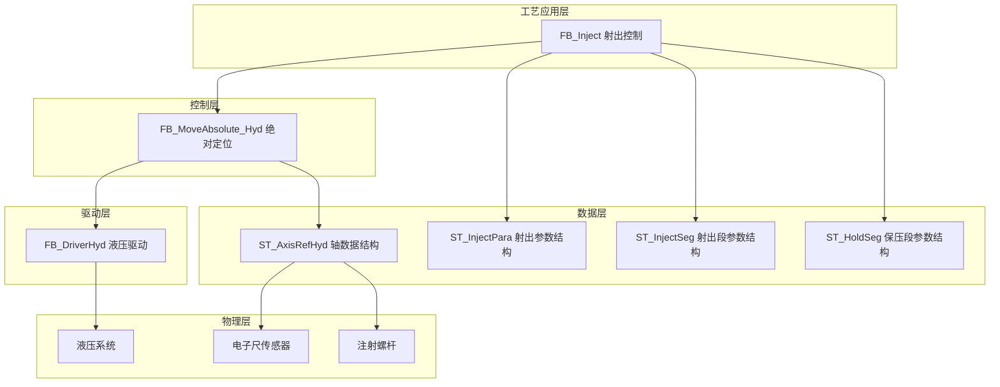
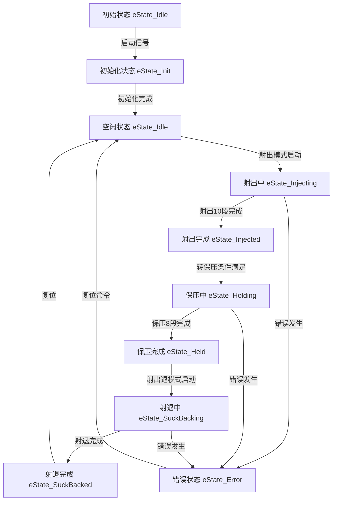
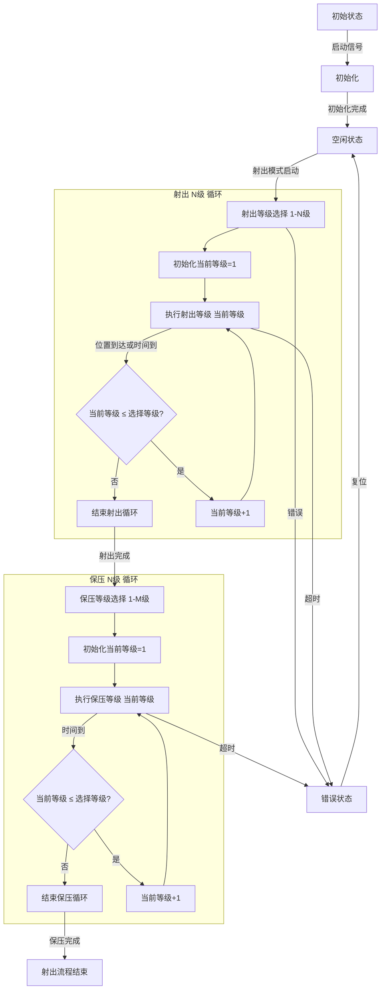
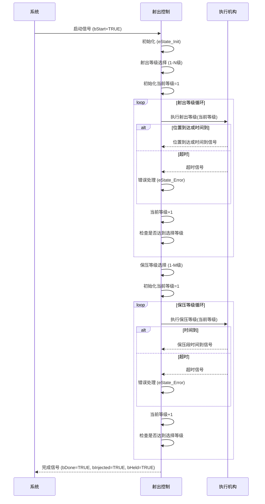
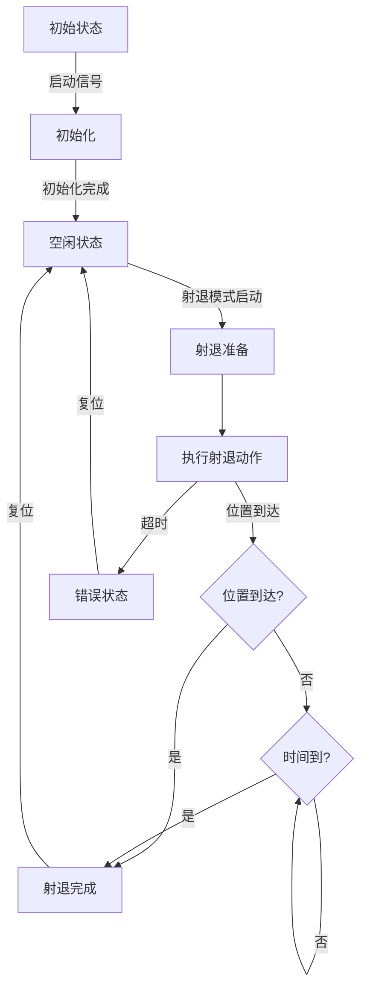
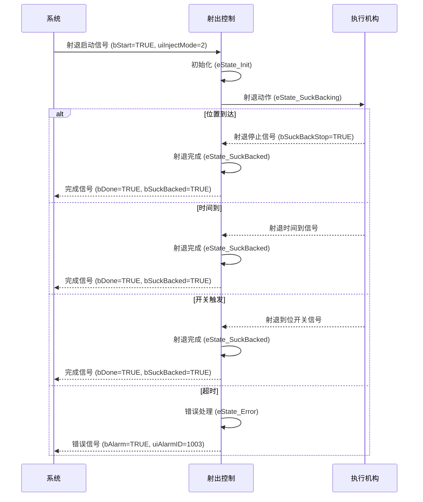

# 注塑机射出功能整理

## 文档信息
- **版本**: 1.1
- **更新日期**: 2026-03-26
- **适用平台**: Beremiz PLC编程环境
- **文档状态**: 根据射胶定义.st更新

---

## 1. 功能概述

### 1.1 功能简介

  
⚡

  <strong>核心功能</strong>
  
射出功能是注塑机的核心功能之一，负责将熔融状态的塑料通过注射螺杆高压高速地注入模具型腔。射出过程的控制精度直接影响产品的质量、尺寸稳定性和生产效率。本功能支持10段射出、8段保压以及射退控制，通过精确控制射出压力、速度、位置和时间等参数，实现高质量的塑料注射成型。

### 1.2 工艺特点

- **多段射出控制**：支持10段射出工艺参数，可实现复杂的填充曲线
- **多段保压控制**：支持8段保压工艺参数，确保制品尺寸稳定性
- **射退功能**：支持射退动作，防止浇口拉丝和制品缺陷
- **多种控制方式**：支持电子尺模式、行程模式、时间模式三种控制方式
- **斜率控制**：支持压力和速度的启动/停止斜率控制
- **安全机制**：包含超时保护、状态互锁等多重安全保障
- **平台兼容性**：支持Luban平台（基于Beremiz二次开发）运行，采用标准IEC 61131-3 ST语法实现

### 1.3 技术架构

---

## 2. 核心控制机制

### 2.1 状态管理机制

射出功能采用统一状态机管理，包含射出、保压和射退三个主要阶段：

#### 2.1.1 射出状态机 (E_InjectState)

#### 2.1.2 状态说明

| 状态值 | 名称 | 说明 |
|--------|------|------|
| 0 | eState_Idle | 空闲状态 |
| 1 | eState_Init | 初始化状态 |
| 2 | eState_Injecting | 射出中(10段) |
| 3 | eState_Injected | 射出完成 |
| 4 | eState_Holding | 保压中(8段) |
| 5 | eState_Held | 保压完成 |
| 6 | eState_SuckBacking | 射退中 |
| 7 | eState_SuckBacked | 射退完成 |
| 8 | eState_Error | 错误状态 |

### 2.2 控制命令机制

| 命令 | 说明 | 响应 |
|------|------|------|
| bStart | 启动命令 | 启动射出/保压/射退动作 |
| bStop | 停止命令 | 有减速停止 |
| bEStop | 急停命令 | 立即停止，无减速 |
| bReset | 复位命令 | 重置错误状态 |

### 2.3 模式选择机制

| 模式值 | 名称 | 说明 |
|--------|------|------|
| 0 | 无模式 | 不执行任何动作 |
| 1 | 射出模式 | 执行射出+保压动作 |
| 2 | 射退模式 | 执行射退动作 |

### 2.4 射出方式选择 (uiInjMode)

| 方式值 | 名称 | 说明 |
|--------|------|------|
| 0 | 电子尺模式 | 通过电子尺位置反馈控制 |
| 1 | 行程模式 | 通过行程开关控制 |
| 2 | 时间模式 | 通过时间控制各段切换 |

---

## 3. 功能阶段定义

### 3.1 射出阶段（10段）

| 阶段编号 | 阶段名称 | 主要功能 | 控制参数 | 转换条件 |
|----------|----------|----------|----------|----------|
| 1 | 射出1段 | 初始慢速填充 | 压力、速度、位置、时间、斜率 | 位置到达或时间到 |
| 2 | 射出2段 | 二级射出 | 压力、速度、位置、时间、斜率 | 位置到达或时间到 |
| 3 | 射出3段 | 三级射出 | 压力、速度、位置、时间、斜率 | 位置到达或时间到 |
| 4 | 射出4段 | 四级射出 | 压力、速度、位置、时间、斜率 | 位置到达或时间到 |
| 5 | 射出5段 | 五级射出 | 压力、速度、位置、时间、斜率 | 位置到达或时间到 |
| 6 | 射出6段 | 六级射出 | 压力、速度、位置、时间、斜率 | 位置到达或时间到 |
| 7 | 射出7段 | 七级射出 | 压力、速度、位置、时间、斜率 | 位置到达或时间到 |
| 8 | 射出8段 | 八级射出 | 压力、速度、位置、时间、斜率 | 位置到达或时间到 |
| 9 | 射出9段 | 九级射出 | 压力、速度、位置、时间、斜率 | 位置到达或时间到 |
| 10 | 射出10段 | 十级射出 | 压力、速度、位置、时间、斜率 | 位置到达或时间到 |

### 3.2 保压阶段（8段）

| 阶段编号 | 阶段名称 | 主要功能 | 控制参数 | 转换条件 |
|----------|----------|----------|----------|----------|
| 1 | 保压1段 | 一级保压 | 压力、速度、时间 | 时间到 |
| 2 | 保压2段 | 二级保压 | 压力、速度、时间 | 时间到 |
| 3 | 保压3段 | 三级保压 | 压力、速度、时间 | 时间到 |
| 4 | 保压4段 | 四级保压 | 压力、速度、时间 | 时间到 |
| 5 | 保压5段 | 五级保压 | 压力、速度、时间 | 时间到 |
| 6 | 保压6段 | 六级保压 | 压力、速度、时间 | 时间到 |
| 7 | 保压7段 | 七级保压 | 压力、速度、时间 | 时间到 |
| 8 | 保压8段 | 八级保压 | 压力、速度、时间 | 时间到 |

### 3.3 射退阶段

| 阶段编号 | 阶段名称 | 主要功能 | 控制参数 | 转换条件 |
|----------|----------|----------|----------|----------|
| 1 | 射退中 | 射退动作执行 | 压力、速度、位置、时间、斜率 | 位置到达或时间到或开关触发 |

---

## 4. 控制流程

### 4.1 射出过程流程

#### 4.1.1 射出流程示意图

#### 4.1.2 射出流程序列图

### 4.2 射退过程流程

#### 4.2.1 射退流程示意图

#### 4.2.2 射退流程序列图

> ⚠️ **重要说明**：
>
> 1. 射出等级段数可通过`uiInjSegCnt`参数设定（1-10段）
> 2. 保压等级段数可通过`uiHoldSegCnt`参数设定（1-8段）
> 3. 射退可在保压完成后执行，防止浇口拉丝

---

## 5. 数据结构与功能块

### 5.1 核心数据结构

#### 5.1.1 E_InjectState 枚举类型

**用途**：定义射出动作的状态机状态

| 值 | 名称 | 说明 |
|----|------|------|
| 0 | eState_Idle | 空闲状态 |
| 1 | eState_Init | 初始化 |
| 2 | eState_Injecting | 射出中(10段) |
| 3 | eState_Injected | 射出完成 |
| 4 | eState_Holding | 保压中(8段) |
| 5 | eState_Held | 保压完成 |
| 6 | eState_SuckBacking | 射退中 |
| 7 | eState_SuckBacked | 射退完成 |
| 8 | eState_Error | 错误状态 |

#### 5.1.2 ST_InjectSeg 结构体

**用途**：定义射出单段工艺参数

| 字段名 | 类型 | 有效范围 | 说明 |
|--------|------|----------|------|
| uiPres | UINT | 0-1000 | 设定压力 |
| uiSpd | UINT | 0-1000 | 设定速度 |
| udiPos | UDINT | 0-4294967295 | 设定位置 |
| uiTime | UINT | 0-65535 | 设定时间 |
| uiPresGrad | UINT | 0-1000 | 设定压力斜率 |
| uiSpdGrad | UINT | 0-1000 | 设定速度斜率 |

#### 5.1.3 ST_HoldSeg 结构体

**用途**：定义保压单段工艺参数

| 字段名 | 类型 | 有效范围 | 说明 |
|--------|------|----------|------|
| uiPres | UINT | 0-1000 | 设定压力 |
| uiSpd | UINT | 0-1000 | 设定速度 |
| uiTime | UINT | 0-65535 | 设定时间 |

#### 5.1.4 ST_InjectPara 结构体

**用途**：定义完整射出工艺参数

##### 射出多段工艺参数

| 字段名 | 类型 | 有效范围 | 说明 |
|--------|------|----------|------|
| uiInjSegCnt | UINT | 1-10 | 射出段数选择 |
| uiInjMode | UINT | 0-2 | 射出方式 (0:电子尺 1:行程 2:时间) |
| uiInjTotalTime | UINT | 0-65535 | 射出总时间 |
| uiInjToHoldMode | UINT | 0-2 | 转保压方式 |
| uiInjToHoldPres | UINT | 0-1000 | 转保压压力 |
| aInjSeg[1..10] | ARRAY OF ST_InjectSeg | - | 射出多段设定参数 |
| uiInjPresStartGrad | UINT | 0-1000 | 压力启动斜率 |
| uiInjPresStopGrad | UINT | 0-1000 | 压力停止斜率 |
| uiInjSpdStartGrad | UINT | 0-1000 | 速度启动斜率 |
| uiInjSpdStopGrad | UINT | 0-1000 | 速度停止斜率 |

##### 保压多段工艺参数

| 字段名 | 类型 | 有效范围 | 说明 |
|--------|------|----------|------|
| uiHoldSegCnt | UINT | 1-8 | 保压段数选择 |
| aHoldSeg[1..8] | ARRAY OF ST_HoldSeg | - | 保压多段设定参数 |

##### 射退工艺参数

| 字段名 | 类型 | 有效范围 | 说明 |
|--------|------|----------|------|
| uiSuckBackMode | UINT | 0-1 | 射退方式 (0:电子尺 1:时间) |
| stSuckBackSeg | ST_InjectSeg | - | 射退设定参数 |
| uiSuckBackPresStartGrad | UINT | 0-1000 | 压力启动斜率 |
| uiSuckBackPresStopGrad | UINT | 0-1000 | 压力停止斜率 |
| uiSuckBackSpdStartGrad | UINT | 0-1000 | 速度启动斜率 |
| uiSuckBackSpdStopGrad | UINT | 0-1000 | 速度停止斜率 |

### 5.2 功能块定义

#### 5.2.1 FB_Inject 功能块

**用途**：射出、保压和射退控制功能块

**输入输出参数**：

| 参数名 | 类型 | 说明 |
|--------|------|------|
| stInjectAxis | ST_AxisRefHyd | 轴数据结构 |

**输入参数**：

| 参数名 | 类型 | 有效范围 | 默认值 | 说明 |
|--------|------|----------|--------|------|
| bStart | BOOL | FALSE,TRUE | FALSE | 启动 |
| bStop | BOOL | FALSE,TRUE | FALSE | 停止(有减速停) |
| bEStop | BOOL | FALSE,TRUE | FALSE | 急停(立即停止) |
| bReset | BOOL | FALSE,TRUE | FALSE | 复位 |
| uiInjectMode | UINT | 0-2 | 0 | 模式选择 (0:无 1:射出 2:射退) |
| stInjectPara | ST_InjectPara | - | - | 工艺参数 |
| bInjSeg1Stop | BOOL | FALSE,TRUE | FALSE | 二级射出停止 |
| bInjSeg2Stop | BOOL | FALSE,TRUE | FALSE | 三级射出停止 |
| bInjStop | BOOL | FALSE,TRUE | FALSE | 射出停止 |
| bSuckBackStop | BOOL | FALSE,TRUE | FALSE | 射退停止 |
| udiInjElecRulerVal | UDINT | 0-4294967295 | 0 | 射胶电子尺值 |

**输出参数**：

| 参数名 | 类型 | 说明 |
|--------|------|------|
| bBusy | BOOL | 忙状态 |
| bDone | BOOL | 完成状态 |
| bAlarm | BOOL | 报警状态 |
| uiAlarmID | UINT | 报警代码 |
| uiActHint | UINT | 当前动作状态 |
| uiActTime | UINT | 当前动作运行时间 |
| bInjected | BOOL | 射出完成 |
| bHeld | BOOL | 保压完成 |
| bSuckBacked | BOOL | 射退完成 |
| uiPresCmd | UINT | 压力命令输出 |
| uiSpdCmd | UINT | 速度命令输出 |
| udiPosCmd | UDINT | 位置命令输出 |

---

## 6. 核心参数说明

### 6.1 射出关键参数

| 参数类别 | 参数名称 | 程序变量名 | 功能说明 |
|----------|----------|------------|----------|
| 段数参数 | 射出段数 | uiInjSegCnt | 设定射出段数 (1-10段) |
| 控制参数 | 射出方式 | uiInjMode | 0:电子尺 1:行程 2:时间 |
| 时间参数 | 射出总时间 | uiInjTotalTime | 射出和保压的总时间限制 |
| 转保压参数 | 转保压方式 | uiInjToHoldMode | 转保压触发方式 |
| 转保压参数 | 转保压压力 | uiInjToHoldPres | 转保压压力阈值 |
| 工艺参数 | 射出压力 | aInjSeg[1..10].uiPres | 射出各段压力设定 |
| 工艺参数 | 射出速度 | aInjSeg[1..10].uiSpd | 射出各段速度设定 |
| 工艺参数 | 射出位置 | aInjSeg[1..10].udiPos | 射出各段位置设定 |
| 工艺参数 | 射出时间 | aInjSeg[1..10].uiTime | 射出各段时间设定 |
| 斜率参数 | 压力启动斜率 | uiInjPresStartGrad | 射出压力启动斜率 |
| 斜率参数 | 压力停止斜率 | uiInjPresStopGrad | 射出压力停止斜率 |
| 斜率参数 | 速度启动斜率 | uiInjSpdStartGrad | 射出速度启动斜率 |
| 斜率参数 | 速度停止斜率 | uiInjSpdStopGrad | 射出速度停止斜率 |

### 6.2 保压关键参数

| 参数类别 | 参数名称 | 程序变量名 | 功能说明 |
|----------|----------|------------|----------|
| 段数参数 | 保压段数 | uiHoldSegCnt | 设定保压段数 (1-8段) |
| 工艺参数 | 保压压力 | aHoldSeg[1..8].uiPres | 保压各段压力设定 |
| 工艺参数 | 保压速度 | aHoldSeg[1..8].uiSpd | 保压各段速度设定 |
| 工艺参数 | 保压时间 | aHoldSeg[1..8].uiTime | 保压各段时间设定 |

### 6.3 射退关键参数

| 参数类别 | 参数名称 | 程序变量名 | 功能说明 |
|----------|----------|------------|----------|
| 控制参数 | 射退方式 | uiSuckBackMode | 0:电子尺 1:时间 |
| 工艺参数 | 射退压力 | stSuckBackSeg.uiPres | 射退压力设定 |
| 工艺参数 | 射退速度 | stSuckBackSeg.uiSpd | 射退速度设定 |
| 工艺参数 | 射退位置 | stSuckBackSeg.udiPos | 射退位置设定 |
| 工艺参数 | 射退时间 | stSuckBackSeg.uiTime | 射退时间设定 |
| 斜率参数 | 射退压力启动斜率 | uiSuckBackPresStartGrad | 射退压力启动斜率 |
| 斜率参数 | 射退压力停止斜率 | uiSuckBackPresStopGrad | 射退压力停止斜率 |
| 斜率参数 | 射退速度启动斜率 | uiSuckBackSpdStartGrad | 射退速度启动斜率 |
| 斜率参数 | 射退速度停止斜率 | uiSuckBackSpdStopGrad | 射退速度停止斜率 |

---

## 7. 功能块实现

### 7.1 动作提示码 (uiActHint)

| 值 | 名称 | 说明 |
|----|------|------|
| 0 | 无动作 | 当前无动作执行 |
| 1 | 报警状态 | 系统处于报警状态 |
| 2 | 射出完成 | 射出阶段已完成 |
| 3 | 保压完成 | 保压阶段已完成 |
| 4 | 射退完成 | 射退阶段已完成 |
| 5 | 射退中 | 射退阶段执行中 |
| 7 | 射出10段 | 射出10段执行中 |
| 10 | - | 预留 |
| 11-19 | 射出1-9段 | 射出各段状态 |
| 20 | - | 预留 |
| 21-28 | 保压1-8段 | 保压各段状态 |

### 7.2 报警代码 (uiAlarmID)

| 值 | 说明 |
|----|------|
| 0 | 无报警 |
| 1000 | 预留 |
| 1001 | 射出超时 |
| 1002 | 保压超时 |
| 1003 | 射退超时 |

---

## 8. 安全保护机制

### 8.1 超时保护

- **射出总时间保护**：监控整个射出和保压过程，超过设定总时间则报警
- **各段超时保护**：各段工艺参数都应有合理的时间限制

### 8.2 位置保护

- **电子尺位置监控**：实时监控注射螺杆位置
- **位置极限保护**：防止超出机械行程极限

### 8.3 状态互锁

- **状态机互锁**：各状态间应有明确的转换条件，防止异常跳转
- **命令互锁**：启动、停止、急停命令应有优先级处理

---

## 9. 参数调整指南

### 9.1 射出参数调整

1. **段数选择**：根据制品复杂程度选择合适的射出段数
2. **压力调整**：根据材料流动性调整，压力应确保完全填充
3. **速度调整**：速度影响填充时间和制品表面质量
4. **位置调整**：位置切换点应根据制品形状和壁厚调整
5. **斜率调整**：斜率控制可使动作更平滑，减少冲击

### 9.2 保压参数调整

1. **保压压力**：应略低于射出最终压力，防止制品过压
2. **保压时间**：根据制品壁厚和材料特性调整
3. **段数选择**：复杂制品可增加保压段数，细化压力控制

### 9.3 射退参数调整

1. **射退时机**：射退应在保压完成后执行
2. **射退距离**：根据浇口大小和制品特性调整
3. **射退速度**：应适中，防止产生气泡或制品变形

---

## 10. 调试与故障排除

### 10.1 常见问题

| 问题现象 | 可能原因 | 解决方法 |
|----------|----------|----------|
| 射出不到位 | 压力不足或速度过快 | 调整压力和速度参数 |
| 制品有气穴 | 射出速度过快或模具排气不良 | 降低射出速度，改善模具排气 |
| 制品缩水 | 保压压力不足或保压时间过短 | 增加保压压力或延长保压时间 |
| 射退后拉丝 | 射退速度过快或温度过高 | 降低射退速度或调整温度 |

### 10.2 调试建议

1. **参数记录**：每次调整参数后应记录，便于问题追溯
2. **分段调试**：先调试单段，确认正常后再启用多段
3. **数据监控**：利用电子尺反馈数据监控射出过程
4. **模具检查**：定期检查模具状况，确保排气良好

---

## 11. 相关文档

- [座台定义.st](../座台定义.st)
- [托模定义.st](../托模定义.st)
- [开合模功能整理.md](./01_开合模功能整理.md)
- [托模功能整理.md](./07_托模功能整理.md)
