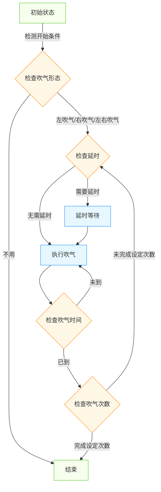

# 吹气功能整理文档

## 1. 功能概述

吹气功能是注塑机的重要辅助功能，主要用于需要吹气托模的模具上，通过向模具内吹气来辅助制品冷却或脱模，提高生产效率和制品质量。

## 2. 吹气参数配置

### 2.1 界面参数布局

吹气设定界面主要分为两大部分：
1. **射嘴开/关参数区**（左侧）：设置射嘴开、射嘴关的压力、流量和时间参数
2. **左右吹气参数区**（右侧）：设置左吹气和右吹气的时间、延时和开始位置参数

### 2.2 射嘴参数

| 触摸屏显示 | 程序变量名 | 默认值 | 单位 | 功能说明 |
|----------|-----------|-------|------|--------|
| 射嘴开压力 | NozzleOpenPressureParam | 25.0 | bar | 射嘴打开的压力设置 |
| 射嘴开流量 | NozzleOpenFlowParam | 20.0 | % | 射嘴打开的流量设置 |
| 射嘴开时间 | NozzleOpenTimeParam | 1.00 | s | 射嘴打开的时间设置 |
| 射嘴关压力 | NozzleClosePressureParam | 36.0 | bar | 射嘴关闭的压力设置 |
| 射嘴关流量 | NozzleCloseFlowParam | 27.0 | % | 射嘴关闭的流量设置 |
| 射嘴关时间 | NozzleCloseTimeParam | 1.00 | s | 射嘴关闭的时间设置 |

### 2.3 吹气参数

| 触摸屏显示 | 程序变量名 | 默认值 | 单位 | 功能说明 |
|----------|-----------|-------|------|--------|
| 左吹气时间 | LeftBlowAirTimeParam | 0.0 | s | 左侧吹气持续时间 |
| 左吹气延时 | LeftBlowAirDelayParam | 0.0 | s | 左侧吹气动作触发延时 |
| 左吹气开始位置 | LeftBlowAirStartPosParam | - | - | 左侧吹气开始位置选择 |
| 右吹气时间 | RightBlowAirTimeParam | 0.0 | s | 右侧吹气持续时间 |
| 右吹气延时 | RightBlowAirDelayParam | 0.0 | s | 右侧吹气动作触发延时 |
| 右吹气开始位置 | RightBlowAirStartPosParam | - | - | 右侧吹气开始位置选择 |

### 2.4 吹气形态设置

吹气形态可选择以下几种模式：
- 不用：不启用吹气功能
- 左吹气：仅左侧吹气
- 右吹气：仅右侧吹气
- 左右吹气：两侧同时吹气

### 2.5 开始位置设置

可选择以下两种吹气开始位置：
- 开模前：在开模动作开始前执行吹气
- 开模完：在开模动作完成后执行吹气

### 2.6 液压射嘴设置

液压射嘴功能选择：
- 不用：不启用液压射嘴功能
- 使用：启用液压射嘴功能，射胶前先开射咀，射咀开时间到才能射胶，射胶结束后射咀关闭

### 2.7 射出检测设置

射出检测功能选择：
- 不用：不启用射出检测功能
- 使用：启用射出检测功能，自动取前20模的射出终点平均数值作为射出检测点

射出检测相关参数：
| 触摸屏显示 | 程序变量名 | 默认值 | 单位 | 功能说明 |
|----------|-----------|-------|------|--------|
| 允许偏差 | InjectionAllowDeviationParam | 0.00 | mm | 射出检测允许的偏差范围 |
| 射出检测点 | InjectionCheckPointParam | 0.00 | mm | 射出终点检测位置 |

## 3. 操作流程

### 3.1 吹气参数设定

1. 在触摸屏主界面按【射出】键两次，进入吹气设定页面
2. 将资料锁开关从锁定状态切换到解锁状态
3. 使用光标键选择需要修改的参数项，包括：
   - 射嘴开/关参数（压力、流量、时间）
   - 左右吹气参数（时间、延时、开始位置）
   - 吹气形态选择（不用/左吹气/右吹气/左右吹气）
   - 液压射嘴选择（不用/使用）
   - 射出检测选择（不用/使用）及相关参数
4. 使用数字键输入新的参数值
5. 按下【输入】键确认修改
6. 参数修改完成后，将资料锁开关切回锁定状态

### 3.2 手动吹气操作

在手动模式下：
- 按下【吹气】(AIR BLAST)按键开始执行吹气动作
- 松开按键或计时到后停止吹气

## 4. 吹气动作控制逻辑

### 4.1 吹气动作流程

1. 系统检测吹气开始条件（根据设定的开始位置）
2. 如果设置了吹气延时，则等待延时时间到达
3. 启动吹气电磁阀，根据设定的吹气压力和流量执行吹气动作
4. 吹气时间到达后，关闭吹气电磁阀，停止吹气
5. 如果设置了多次吹气，则重复步骤2-4

### 4.2 控制流程图



## 5. 参数调整建议

### 5.1 吹气压力调整原则
- 应根据制品特性和模具结构设置，避免压力过高损坏制品
- 较薄或脆弱的制品应使用较低的吹气压力
- 大型制品或需要较强脱模力的场合可适当提高压力

### 5.2 吹气时间调整原则
- 应足够长以确保制品完全冷却或顺利脱模
- 时间过短可能导致脱模不完全
- 时间过长会影响生产效率

### 5.3 吹气时序调整原则
- 通常在顶出或开模过程中执行，用于辅助脱模
- 对于容易粘模的制品，建议在开模前开始吹气
- 对于需要冷却的制品，可在开模完成后吹气

## 6. PLC程序实现建议

### 6.1 参数变量定义

```st
(* 射嘴参数定义 *)
VAR
    NozzleOpenPressureParam      : REAL := 25.0;    // 射嘴开压力，单位bar
    NozzleOpenFlowParam          : REAL := 20.0;    // 射嘴开流量，单位%
    NozzleOpenTimeParam          : REAL := 1.00;    // 射嘴开时间，单位s
    NozzleClosePressureParam     : REAL := 36.0;    // 射嘴关压力，单位bar
    NozzleCloseFlowParam         : REAL := 27.0;    // 射嘴关流量，单位%
    NozzleCloseTimeParam         : REAL := 1.00;    // 射嘴关时间，单位s
    HydraulicNozzleEnable        : BOOL := FALSE;   // 液压射嘴启用标志
    
    (* 吹气参数定义 *)
    LeftBlowAirTimeParam         : REAL := 0.0;     // 左吹气时间，单位s
    LeftBlowAirDelayParam        : REAL := 0.0;     // 左吹气延时，单位s
    LeftBlowAirStartPosParam     : INT := 2;        // 左吹气开始位置：1=开模前, 2=开模完
    RightBlowAirTimeParam        : REAL := 0.0;     // 右吹气时间，单位s
    RightBlowAirDelayParam       : REAL := 0.0;     // 右吹气延时，单位s
    RightBlowAirStartPosParam    : INT := 2;        // 右吹气开始位置：1=开模前, 2=开模完
    BlowAirMode                  : INT := 0;        // 吹气模式：0=不用, 1=左吹气, 2=右吹气, 3=左右吹气
    
    (* 射出检测参数 *)
    InjectionCheckEnable         : BOOL := FALSE;   // 射出检测启用标志
    InjectionAllowDeviationParam : REAL := 0.00;    // 允许偏差，单位mm
    InjectionCheckPointParam     : REAL := 0.00;    // 射出检测点，单位mm
    
    (* 控制变量 *)
    NozzleOpenTimer              : TON;             // 射嘴打开计时器
    NozzleCloseTimer             : TON;             // 射嘴关闭计时器
    LeftBlowAirDelayTimer        : TON;             // 左吹气延时计时器
    LeftBlowAirTimer             : TON;             // 左吹气计时器
    RightBlowAirDelayTimer       : TON;             // 右吹气延时计时器
    RightBlowAirTimer            : TON;             // 右吹气计时器
    
    // 输出信号
    NozzleOpenValve              : BOOL := FALSE;   // 射嘴打开电磁阀
    NozzleCloseValve             : BOOL := FALSE;   // 射嘴关闭电磁阀
    LeftBlowAirValve             : BOOL := FALSE;   // 左吹气电磁阀
    RightBlowAirValve            : BOOL := FALSE;   // 右吹气电磁阀
END_VAR
```

### 6.2 功能块设计

#### 6.2.1 FB_BlowAir 功能块设计（左右吹气控制）

```st
FUNCTION_BLOCK FB_BlowAir
VAR_INPUT
    i_Enable               : BOOL;           // 使能信号
    i_StartTrigger         : BOOL;           // 开始触发信号
    i_BlowAirMode          : INT;            // 吹气模式：0=不用, 1=左吹气, 2=右吹气, 3=左右吹气
    i_LeftTimeParam        : REAL;           // 左吹气时间参数
    i_LeftDelayParam       : REAL;           // 左吹气延时参数
    i_RightTimeParam       : REAL;           // 右吹气时间参数
    i_RightDelayParam      : REAL;           // 右吹气延时参数
END_VAR

VAR_OUTPUT
    o_LeftBlowAir          : BOOL;           // 左吹气输出
    o_RightBlowAir         : BOOL;           // 右吹气输出
    o_BlowAirActive        : BOOL;           // 吹气活动状态
    o_BlowAirComplete      : BOOL;           // 吹气完成信号
END_VAR

VAR
    x_LeftStartFlag        : BOOL := FALSE;  // 左侧开始标志
    x_RightStartFlag       : BOOL := FALSE;  // 右侧开始标志
    t_LeftDelayTimer       : TON;            // 左吹气延时计时器
    t_LeftBlowTimer        : TON;            // 左吹气计时器
    t_RightDelayTimer      : TON;            // 右吹气延时计时器
    t_RightBlowTimer       : TON;            // 右吹气计时器
END_VAR

// 功能块实现逻辑
METHOD BlowAirControl
VAR_INPUT
    Clock : BOOL := TRUE;
END_VAR

// 初始化控制变量
IF NOT i_Enable OR i_BlowAirMode = 0 THEN
    x_LeftStartFlag := FALSE;
    x_RightStartFlag := FALSE;
    t_LeftDelayTimer(IN:=FALSE);
    t_LeftBlowTimer(IN:=FALSE);
    t_RightDelayTimer(IN:=FALSE);
    t_RightBlowTimer(IN:=FALSE);
    o_LeftBlowAir := FALSE;
    o_RightBlowAir := FALSE;
    o_BlowAirActive := FALSE;
    o_BlowAirComplete := FALSE;
    RETURN;
END_IF

// 开始吹气触发
IF i_StartTrigger THEN
    // 根据吹气模式设置相应的开始标志
    CASE i_BlowAirMode OF
        1:  // 左吹气
            x_LeftStartFlag := TRUE;
            t_LeftDelayTimer(IN:=TRUE, PT:=i_LeftDelayParam * 1000);
        2:  // 右吹气
            x_RightStartFlag := TRUE;
            t_RightDelayTimer(IN:=TRUE, PT:=i_RightDelayParam * 1000);
        3:  // 左右吹气
            x_LeftStartFlag := TRUE;
            x_RightStartFlag := TRUE;
            t_LeftDelayTimer(IN:=TRUE, PT:=i_LeftDelayParam * 1000);
            t_RightDelayTimer(IN:=TRUE, PT:=i_RightDelayParam * 1000);
    END_CASE
    i_StartTrigger := FALSE;  // 清除触发信号
END_IF

// 左侧吹气控制逻辑
IF x_LeftStartFlag THEN
    // 延时结束后开始左吹气
    IF t_LeftDelayTimer.Q THEN
        t_LeftDelayTimer(IN:=FALSE);
        o_LeftBlowAir := TRUE;
        t_LeftBlowTimer(IN:=TRUE, PT:=i_LeftTimeParam * 1000);
    END_IF
    
    // 左吹气时间到
    IF t_LeftBlowTimer.Q THEN
        t_LeftBlowTimer(IN:=FALSE);
        o_LeftBlowAir := FALSE;
        x_LeftStartFlag := FALSE;
    END_IF
END_IF

// 右侧吹气控制逻辑
IF x_RightStartFlag THEN
    // 延时结束后开始右吹气
    IF t_RightDelayTimer.Q THEN
        t_RightDelayTimer(IN:=FALSE);
        o_RightBlowAir := TRUE;
        t_RightBlowTimer(IN:=TRUE, PT:=i_RightTimeParam * 1000);
    END_IF
    
    // 右吹气时间到
    IF t_RightBlowTimer.Q THEN
        t_RightBlowTimer(IN:=FALSE);
        o_RightBlowAir := FALSE;
        x_RightStartFlag := FALSE;
    END_IF
END_IF

// 计算吹气活动状态和完成状态
o_BlowAirActive := o_LeftBlowAir OR o_RightBlowAir OR t_LeftDelayTimer.IN OR t_RightDelayTimer.IN;
o_BlowAirComplete := NOT o_BlowAirActive AND (i_BlowAirMode > 0);
END_METHOD
```

#### 6.2.2 FB_NozzleControl 功能块设计（射嘴控制）

```st
FUNCTION_BLOCK FB_NozzleControl
VAR_INPUT
    i_Enable               : BOOL;           // 使能信号
    i_StartOpenTrigger     : BOOL;           // 开始打开触发信号
    i_StartCloseTrigger    : BOOL;           // 开始关闭触发信号
    i_OpenTimeParam        : REAL;           // 射嘴打开时间参数
    i_CloseTimeParam       : REAL;           // 射嘴关闭时间参数
END_VAR

VAR_OUTPUT
    o_NozzleOpen           : BOOL;           // 射嘴打开输出
    o_NozzleClose          : BOOL;           // 射嘴关闭输出
    o_NozzleOpenComplete   : BOOL;           // 射嘴打开完成信号
    o_NozzleCloseComplete  : BOOL;           // 射嘴关闭完成信号
    o_InjectionAllowed     : BOOL;           // 允许射胶信号
END_VAR

VAR
    t_OpenTimer            : TON;            // 射嘴打开计时器
    t_CloseTimer           : TON;            // 射嘴关闭计时器
    x_OpenFlag             : BOOL := FALSE;  // 打开标志
    x_CloseFlag            : BOOL := FALSE;  // 关闭标志
END_VAR

// 功能块实现逻辑
METHOD NozzleControl
VAR_INPUT
    Clock : BOOL := TRUE;
END_VAR

// 初始化控制变量
IF NOT i_Enable THEN
    x_OpenFlag := FALSE;
    x_CloseFlag := FALSE;
    t_OpenTimer(IN:=FALSE);
    t_CloseTimer(IN:=FALSE);
    o_NozzleOpen := FALSE;
    o_NozzleClose := FALSE;
    o_NozzleOpenComplete := FALSE;
    o_NozzleCloseComplete := FALSE;
    o_InjectionAllowed := FALSE;
    RETURN;
END_IF

// 射嘴打开控制逻辑
IF i_StartOpenTrigger AND NOT x_CloseFlag THEN
    x_OpenFlag := TRUE;
    x_CloseFlag := FALSE;
    t_OpenTimer(IN:=TRUE, PT:=i_OpenTimeParam * 1000);
    o_NozzleOpen := TRUE;
    o_NozzleClose := FALSE;
    o_NozzleOpenComplete := FALSE;
    o_NozzleCloseComplete := FALSE;
    o_InjectionAllowed := FALSE;
END_IF

// 射嘴关闭控制逻辑
IF i_StartCloseTrigger AND NOT x_OpenFlag THEN
    x_CloseFlag := TRUE;
    x_OpenFlag := FALSE;
    t_CloseTimer(IN:=TRUE, PT:=i_CloseTimeParam * 1000);
    o_NozzleClose := TRUE;
    o_NozzleOpen := FALSE;
    o_NozzleOpenComplete := FALSE;
    o_NozzleCloseComplete := FALSE;
    o_InjectionAllowed := FALSE;
END_IF

// 射嘴打开完成检测
IF x_OpenFlag AND t_OpenTimer.Q THEN
    t_OpenTimer(IN:=FALSE);
    o_NozzleOpenComplete := TRUE;
    o_InjectionAllowed := TRUE;
END_IF

// 射嘴关闭完成检测
IF x_CloseFlag AND t_CloseTimer.Q THEN
    t_CloseTimer(IN:=FALSE);
    o_NozzleCloseComplete := TRUE;
END_IF
END_METHOD
```

## 7. 注意事项

1. **动作时序协调**：吹气动作的时序必须与主动作（开模、顶出等）协调，避免干涉

2. **参数一致性**：触摸屏上修改的参数应实时同步到PLC程序中，确保参数一致性

3. **参数存储**：重要参数应保存在PLC的掉电保持区域，确保断电后参数不丢失

4. **安全保护**：应设置吹气超时保护机制，防止吹气时间过长导致设备异常

5. **互锁保护**：应设置合理的互锁条件，确保在安全的条件下执行吹气动作

6. **压力监控**：建议监控实际吹气压力，用于异常检测和故障诊断