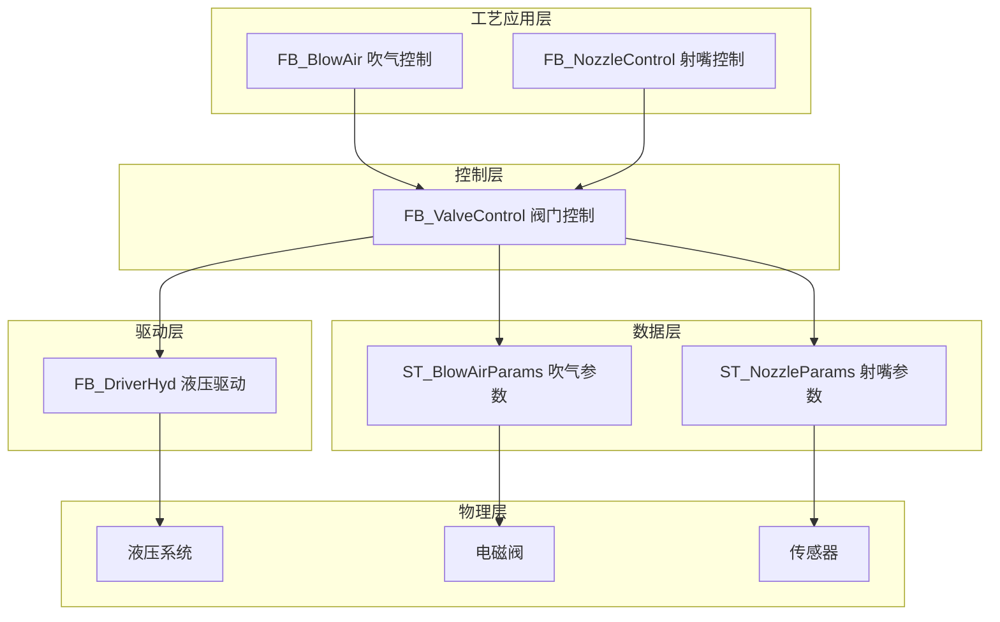
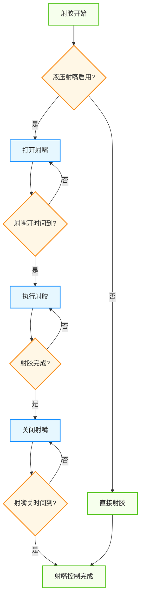
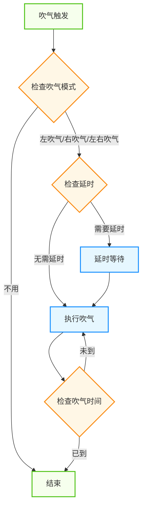
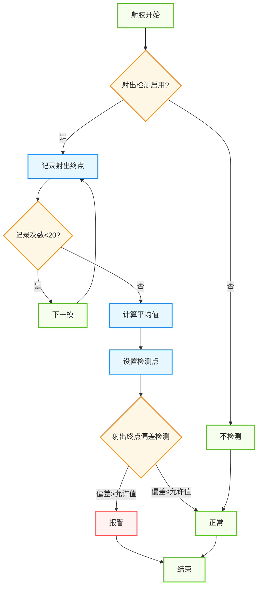
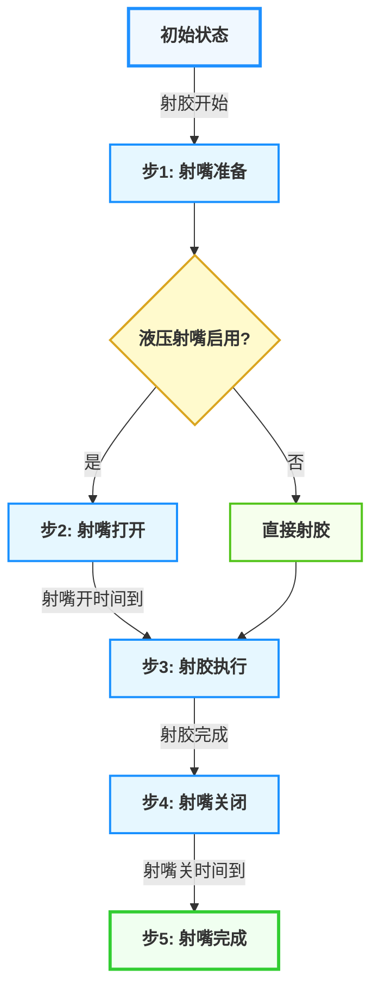
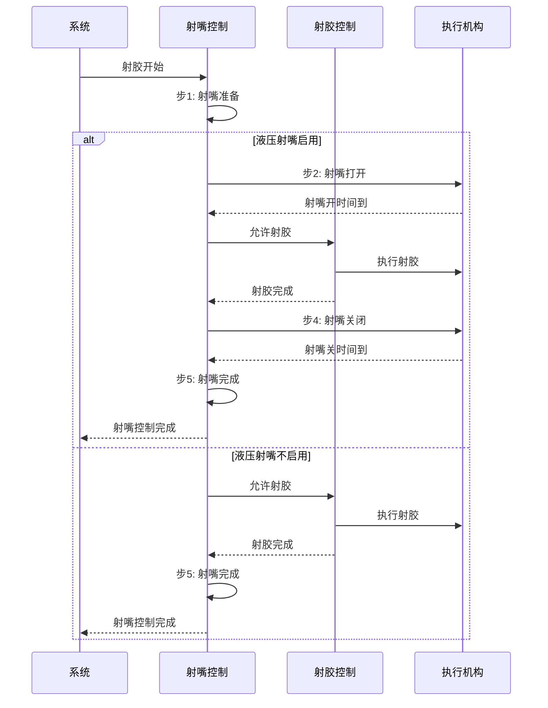
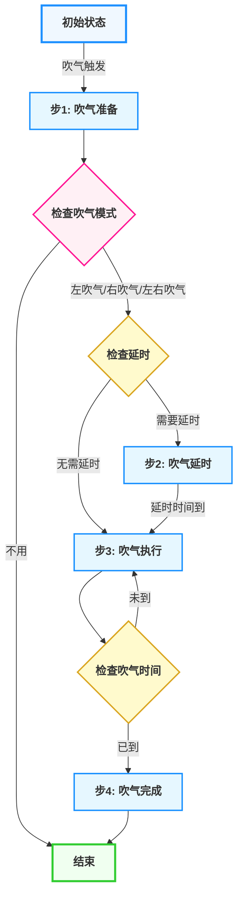
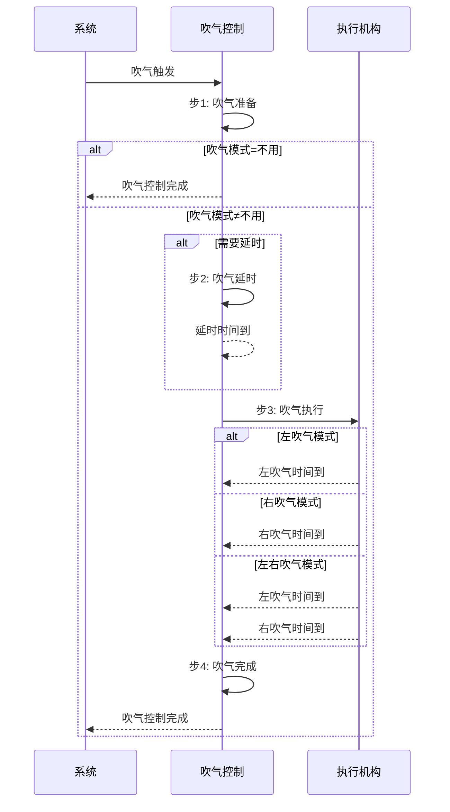

# 注塑机吹气功能

## 1. 概述

### 1.1 功能简介

吹气功能是注塑机的重要辅助功能，主要用于需要吹气托模的模具上，通过向模具内吹气来辅助制品冷却或脱模，提高生产效率和制品质量。该功能包含射嘴控制和左右吹气控制两个主要部分，支持多种吹气模式和灵活的时序配置。

### 1.2 工艺特点

- **射嘴控制**：支持液压射嘴的打开和关闭控制，确保射胶过程的密封性
- **吹气模式**：支持左吹气、右吹气、左右吹气等多种模式，适应不同模具需求
- **时序灵活**：可设置吹气延时和吹气时间，支持开模前或开模后触发
- **射出检测**：支持射出终点检测功能，自动学习检测点，确保射胶质量
- **平台兼容性**：支持Luban平台（基于Beremiz二次开发）运行，采用标准IEC 61131-3 ST语法实现

### 1.3 技术架构

本功能采用分层架构设计，参考研发部提供的液压系统建模方案，结合倍福TF8560塑料技术功能标准，实现模块化、标准化设计。



---

## 2. 核心控制机制

### 2.1 射嘴控制机制

射嘴控制采用时间控制方式，确保射胶过程的密封性和安全性：



1. **射嘴打开控制**：
   - 触发条件：射胶开始且液压射嘴启用
   - 对应参数：射嘴开压力、射嘴开流量、射嘴开时间
2. **射胶执行**：
   - 触发条件：射嘴打开时间到达
   - 对应参数：射胶参数（由射胶功能控制）
3. **射嘴关闭控制**：
   - 触发条件：射胶完成
   - 对应参数：射嘴关压力、射嘴关流量、射嘴关时间

### 2.2 吹气控制机制

吹气控制采用时序控制方式，支持多种吹气模式和灵活的触发时机：



1. **吹气模式选择**：
   - 不用：不启用吹气功能
   - 左吹气：仅左侧吹气
   - 右吹气：仅右侧吹气
   - 左右吹气：两侧同时吹气
2. **吹气延时控制**：
   - 触发条件：吹气触发信号到达
   - 对应参数：左/右吹气延时
3. **吹气时间控制**：
   - 触发条件：延时结束或无延时
   - 对应参数：左/右吹气时间
4. **吹气触发时机**：
   - 开模前：在开模动作开始前执行吹气
   - 开模完：在开模动作完成后执行吹气

### 2.3 射出检测机制

射出检测采用自动学习方式，确保射胶质量的稳定性：



1. **自动学习阶段**：
   - 触发条件：射出检测启用且记录次数<20
   - 对应参数：射出检测启用标志
2. **检测点设置**：
   - 触发条件：记录20次射出终点后
   - 对应参数：射出检测点
3. **偏差检测**：
   - 触发条件：射出终点到达
   - 对应参数：允许偏差

---

## 3. 功能阶段定义

### 3.1 射嘴控制功能阶段

| 阶段编号 | 阶段名称   | 主要功能         | 控制参数                 | 阶段转换条件           |
| -------- | ---------- | ---------------- | ------------------------ | ---------------------- |
| 1        | 射嘴准备   | 初始化参数       | 无                       | 射胶开始信号触发       |
| 2        | 射嘴打开   | 打开射嘴         | 压力、流量、时间         | 射嘴开时间到达         |
| 3        | 射胶执行   | 执行射胶         | 射胶参数（由射胶功能控制） | 射胶完成信号触发       |
| 4        | 射嘴关闭   | 关闭射嘴         | 压力、流量、时间         | 射嘴关时间到达         |
| 5        | 射嘴完成   | 保持关闭状态     | 无                       | 到达完成状态           |

### 3.2 吹气控制功能阶段

| 阶段编号 | 阶段名称   | 主要功能         | 控制参数                 | 阶段转换条件           |
| -------- | ---------- | ---------------- | ------------------------ | ---------------------- |
| 1        | 吹气准备   | 初始化参数       | 无                       | 吹气触发信号到达       |
| 2        | 吹气延时   | 等待延时时间     | 延时时间                 | 延时时间到达           |
| 3        | 吹气执行   | 执行吹气动作     | 压力、流量、时间         | 吹气时间到达           |
| 4        | 吹气完成   | 停止吹气         | 无                       | 到达完成状态           |

---

## 4. 控制流程

### 4.1 射嘴控制流程

#### 4.1.1 射嘴控制流程示意图



#### 4.1.2 射嘴控制序列图



### 4.2 吹气控制流程

#### 4.2.1 吹气控制流程示意图



#### 4.2.2 吹气控制序列图



> ⚠️ **重要说明**：
>
> 1. 吹气触发时机可选择开模前或开模完，需根据模具特性合理设置
> 2. 吹气模式支持左吹气、右吹气、左右吹气三种模式，可根据模具结构选择
> 3. 吹气延时和吹气时间需根据制品特性合理设置，确保吹气效果

---

## 5. 数据结构与功能块

### 5.1 核心数据结构

#### 5.1.1 ST_NozzleParams 结构体

**用途**：封装射嘴的所有工艺参数

| 字段名                   | 类型 | 有效范围   | 初始值 | 说明                           |
| ------------------------ | ---- | ---------- | ------ | ------------------------------ |
| `iOpenPressure`         | INT  | 0-1000     | 250    | 射嘴开压力(bar*10)             |
| `iOpenFlow`             | INT  | 0-1000     | 200    | 射嘴开流量(%*10)               |
| `iOpenTime`             | INT  | 0-100      | 10     | 射嘴开时间(s*10)               |
| `iClosePressure`        | INT  | 0-1000     | 360    | 射嘴关压力(bar*10)             |
| `iCloseFlow`            | INT  | 0-1000     | 270    | 射嘴关流量(%*10)               |
| `iCloseTime`            | INT  | 0-100      | 10     | 射嘴关时间(s*10)               |

#### 5.1.2 ST_BlowAirParams 结构体

**用途**：封装吹气的所有工艺参数

| 字段名                   | 类型 | 有效范围   | 初始值 | 说明                           |
| ------------------------ | ---- | ---------- | ------ | ------------------------------ |
| `iLeftTime`             | INT  | 0-100      | 0      | 左吹气时间(s*10)               |
| `iLeftDelay`            | INT  | 0-100      | 0      | 左吹气延时(s*10)               |
| `iLeftStartPos`         | INT  | 1-2        | 2      | 左吹气开始位置(1=开模前,2=开模完) |
| `iRightTime`            | INT  | 0-100      | 0      | 右吹气时间(s*10)               |
| `iRightDelay`           | INT  | 0-100      | 0      | 右吹气延时(s*10)               |
| `iRightStartPos`        | INT  | 1-2        | 2      | 右吹气开始位置(1=开模前,2=开模完) |
| `iBlowAirMode`          | INT  | 0-3        | 0      | 吹气模式(0=不用,1=左吹气,2=右吹气,3=左右吹气) |

#### 5.1.3 ST_InjectionCheckParams 结构体

**用途**：封装射出检测的所有工艺参数

| 字段名                   | 类型 | 有效范围   | 初始值 | 说明                           |
| ------------------------ | ---- | ---------- | ------ | ------------------------------ |
| `iAllowDeviation`       | INT  | 0-1000     | 0      | 允许偏差(mm*10)                |
| `iCheckPoint`            | INT  | 0-10000    | 0      | 射出检测点(mm*10)              |

### 5.2 功能块定义

#### 5.2.1 FB_BlowAir 功能块

**用途**：完整的吹气控制功能块，集成左吹气和右吹气控制
**指令格式**：

| 指令             | 名称 | FB/FC | LD/FBD表示             | ST表现                 | 说明 |
| ---------------- | ---- | ----- | ---------------------- | ---------------------- | ---- |
| `FB_BlowAir0`  | 吹气 | FB    |  |  | -    |

**输入输出参数**：

| 参数名        | 名称   | 类型 | 有效范围 | 初始值 | 说明       |
| ------------- | ------ | ---- | -------- | ------ | ---------- |
| `BlowAirAxis` | 吹气轴 |      | -        | -      | 吹气轴引用 |

**输入参数**：

| 参数名                | 名称             | 类型    | 有效范围     | 初始值 | 说明                                       |
| --------------------- | ---------------- | ------- | ------------ | ------ | ------------------------------------------ |
| `bExecute`           | 执行触发         | BOOL    | FALSE,TRUE   | FALSE  | 执行触发信号，上升沿启动                   |
| `stBlowAirParams`     | 吹气参数         | ST_BlowAirParams | -    | -      | 上位机设定参数输入                         |
| `bAutoMode`          | 自动模式         | BOOL    | FALSE,TRUE   | FALSE  | 自动模式标志                               |
| `bManualMode`        | 手动模式         | BOOL    | FALSE,TRUE   | TRUE   | 手动模式标志                               |
| `bFunctionEnable`    | 功能使能         | BOOL    | FALSE,TRUE   | TRUE   | 吹气功能使能                               |
| `bLeftBlowCmd`       | 左吹气命令       | BOOL    | FALSE,TRUE   | FALSE  | 左吹气命令                                 |
| `bRightBlowCmd`      | 右吹气命令       | BOOL    | FALSE,TRUE   | FALSE  | 右吹气命令                                 |
| `bOpenComplete`      | 开模完成         | BOOL    | FALSE,TRUE   | FALSE  | 开模完成信号                               |
| `bEStop`             | 急停             | BOOL    | FALSE,TRUE   | FALSE  | 急停信号                                   |

**输出参数**：

| 参数名              | 名称             | 类型   | 有效范围     | 初始值 | 说明           |
| ------------------- | ---------------- | ------ | ------------ | ------ | -------------- |
| `bLeftBlowOut`     | 左吹气输出       | BOOL   | FALSE,TRUE   | FALSE  | 左吹气输出     |
| `bRightBlowOut`    | 右吹气输出       | BOOL   | FALSE,TRUE   | FALSE  | 右吹气输出     |
| `bInProgress`      | 正在运行         | BOOL   | FALSE,TRUE   | FALSE  | 正在运行标志   |
| `bLeftBlowing`     | 左吹气中         | BOOL   | FALSE,TRUE   | FALSE  | 左吹气中标志   |
| `bRightBlowing`    | 右吹气中         | BOOL   | FALSE,TRUE   | FALSE  | 右吹气中标志   |
| `bCommandComplete` | 命令完成         | BOOL   | FALSE,TRUE   | FALSE  | 命令完成信号   |
| `bError`           | 错误状态         | BOOL   | FALSE,TRUE   | FALSE  | 错误信号       |
| `iErrorCode`       | 错误代码         | INT    | 0-65535      | 0      | 错误代码       |

#### 5.2.2 FB_NozzleControl 功能块

**用途**：完整的射嘴控制功能块，集成射嘴打开和关闭控制
**指令格式**：

| 指令                | 名称 | FB/FC | LD/FBD表示             | ST表现                 | 说明 |
| ------------------- | ---- | ----- | ---------------------- | ---------------------- | ---- |
| `FB_NozzleControl0` | 射嘴 | FB    |  |  | -    |

**输入输出参数**：

| 参数名        | 名称   | 类型 | 有效范围 | 初始值 | 说明       |
| ------------- | ------ | ---- | -------- | ------ | ---------- |
| `NozzleAxis` | 射嘴轴 |      | -        | -      | 射嘴轴引用 |

**输入参数**：

| 参数名                | 名称             | 类型    | 有效范围     | 初始值 | 说明                                       |
| --------------------- | ---------------- | ------- | ------------ | ------ | ------------------------------------------ |
| `bExecute`           | 执行触发         | BOOL    | FALSE,TRUE   | FALSE  | 执行触发信号，上升沿启动                   |
| `stNozzleParams`     | 射嘴参数         | ST_NozzleParams | -      | -      | 上位机设定参数输入                         |
| `bAutoMode`          | 自动模式         | BOOL    | FALSE,TRUE   | FALSE  | 自动模式标志                               |
| `bManualMode`        | 手动模式         | BOOL    | FALSE,TRUE   | TRUE   | 手动模式标志                               |
| `bFunctionEnable`    | 功能使能         | BOOL    | FALSE,TRUE   | TRUE   | 射嘴功能使能                               |
| `bOpenCmd`           | 射嘴开命令       | BOOL    | FALSE,TRUE   | FALSE  | 射嘴开命令                                 |
| `bCloseCmd`          | 射嘴关命令       | BOOL    | FALSE,TRUE   | FALSE  | 射嘴关命令                                 |
| `bInjectionComplete` | 射胶完成         | BOOL    | FALSE,TRUE   | FALSE  | 射胶完成信号                               |
| `bEStop`             | 急停             | BOOL    | FALSE,TRUE   | FALSE  | 急停信号                                   |

**输出参数**：

| 参数名              | 名称             | 类型   | 有效范围     | 初始值 | 说明           |
| ------------------- | ---------------- | ------ | ------------ | ------ | -------------- |
| `bOpenOut`          | 射嘴开输出       | BOOL   | FALSE,TRUE   | FALSE  | 射嘴开输出     |
| `bCloseOut`         | 射嘴关输出       | BOOL   | FALSE,TRUE   | FALSE  | 射嘴关输出     |
| `bInjectionAllowed` | 允许射胶         | BOOL   | FALSE,TRUE   | FALSE  | 允许射胶信号   |
| `bInProgress`      | 正在运行         | BOOL   | FALSE,TRUE   | FALSE  | 正在运行标志   |
| `bOpening`          | 射嘴开中         | BOOL   | FALSE,TRUE   | FALSE  | 射嘴开中标志   |
| `bClosing`          | 射嘴关中         | BOOL   | FALSE,TRUE   | FALSE  | 射嘴关中标志   |
| `bCommandComplete` | 命令完成         | BOOL   | FALSE,TRUE   | FALSE  | 命令完成信号   |
| `bError`           | 错误状态         | BOOL   | FALSE,TRUE   | FALSE  | 错误信号       |
| `iErrorCode`       | 错误代码         | INT    | 0-65535      | 0      | 错误代码       |

### 5.3 枚举类型定义

#### 5.3.1 吹气状态 E_BlowAirState

| 值 | 名称             | 说明         |
| -- | ---------------- | ------------ |
| 0  | eState_Idle      | 空闲状态     |
| 1  | eState_Prepare   | 准备状态     |
| 2  | eState_Delay     | 延时状态     |
| 3  | eState_Blowing   | 吹气中       |
| 4  | eState_Complete  | 完成状态     |
| 5  | eState_Error     | 错误状态     |

#### 5.3.2 射嘴状态 E_NozzleState

| 值 | 名称             | 说明         |
| -- | ---------------- | ------------ |
| 0  | eState_Idle      | 空闲状态     |
| 1  | eState_Prepare   | 准备状态     |
| 2  | eState_Opening   | 射嘴开中     |
| 3  | eState_Closing   | 射嘴关中     |
| 4  | eState_Complete  | 完成状态     |
| 5  | eState_Error     | 错误状态     |

---

## 6. 核心参数说明

### 6.1 射嘴参数

#### 6.1.1 射嘴开参数

| 参数名           | 名称         | 类型 | 有效范围   | 初始值 | 说明                           |
| ---------------- | ------------ | ---- | ---------- | ------ | ------------------------------ |
| `iOpenPressure` | 射嘴开压力   | INT  | 0-1000     | 250    | 射嘴打开压力(bar*10)           |
| `iOpenFlow`     | 射嘴开流量   | INT  | 0-1000     | 200    | 射嘴打开流量(%*10)             |
| `iOpenTime`     | 射嘴开时间   | INT  | 0-100      | 10     | 射嘴打开时间(s*10)             |

#### 6.1.2 射嘴关参数

| 参数名            | 名称         | 类型 | 有效范围   | 初始值 | 说明                           |
| ----------------- | ------------ | ---- | ---------- | ------ | ------------------------------ |
| `iClosePressure` | 射嘴关压力   | INT  | 0-1000     | 360    | 射嘴关闭压力(bar*10)           |
| `iCloseFlow`     | 射嘴关流量   | INT  | 0-1000     | 270    | 射嘴关闭流量(%*10)             |
| `iCloseTime`     | 射嘴关时间   | INT  | 0-100      | 10     | 射嘴关闭时间(s*10)             |

### 6.2 吹气参数

#### 6.2.1 左吹气参数

| 参数名          | 名称         | 类型 | 有效范围   | 初始值 | 说明                           |
| --------------- | ------------ | ---- | ---------- | ------ | ------------------------------ |
| `iLeftTime`    | 左吹气时间   | INT  | 0-100      | 0      | 左吹气时间(s*10)               |
| `iLeftDelay`   | 左吹气延时   | INT  | 0-100      | 0      | 左吹气延时(s*10)               |
| `iLeftStartPos` | 左吹气开始位置 | INT  | 1-2        | 2      | 左吹气开始位置(1=开模前,2=开模完) |

#### 6.2.2 右吹气参数

| 参数名           | 名称         | 类型 | 有效范围   | 初始值 | 说明                           |
| ---------------- | ------------ | ---- | ---------- | ------ | ------------------------------ |
| `iRightTime`    | 右吹气时间   | INT  | 0-100      | 0      | 右吹气时间(s*10)               |
| `iRightDelay`   | 右吹气延时   | INT  | 0-100      | 0      | 右吹气延时(s*10)               |
| `iRightStartPos` | 右吹气开始位置 | INT  | 1-2        | 2      | 右吹气开始位置(1=开模前,2=开模完) |

#### 6.2.3 吹气模式参数

| 参数名         | 名称     | 类型 | 有效范围 | 初始值 | 说明                                       |
| -------------- | -------- | ---- | -------- | ------ | ------------------------------------------ |
| `iBlowAirMode` | 吹气模式 | INT  | 0-3      | 0      | 吹气模式(0=不用,1=左吹气,2=右吹气,3=左右吹气) |

### 6.3 射出检测参数

| 参数名             | 名称         | 类型 | 有效范围   | 初始值 | 说明                           |
| ------------------ | ------------ | ---- | ---------- | ------ | ------------------------------ |
| `iAllowDeviation`  | 允许偏差     | INT  | 0-1000     | 0      | 允许偏差(mm*10)                |
| `iCheckPoint`      | 射出检测点   | INT  | 0-10000    | 0      | 射出检测点(mm*10)              |

---

## 7. 功能块实现

### 7.1 FB_BlowAir 功能块实现

```st
FUNCTION_BLOCK FB_BlowAir
VAR_INPUT
    bExecute               : BOOL;           // 执行触发信号
    stBlowAirParams        : ST_BlowAirParams;  // 吹气参数
    bAutoMode              : BOOL;           // 自动模式标志
    bManualMode            : BOOL;           // 手动模式标志
    bFunctionEnable        : BOOL;           // 功能使能
    bLeftBlowCmd           : BOOL;           // 左吹气命令
    bRightBlowCmd          : BOOL;           // 右吹气命令
    bOpenComplete          : BOOL;           // 开模完成信号
    bEStop                 : BOOL;           // 急停信号
END_VAR

VAR_OUTPUT
    bLeftBlowOut           : BOOL;           // 左吹气输出
    bRightBlowOut          : BOOL;           // 右吹气输出
    bInProgress            : BOOL;           // 正在运行标志
    bLeftBlowing           : BOOL;           // 左吹气中标志
    bRightBlowing          : BOOL;           // 右吹气中标志
    bCommandComplete       : BOOL;           // 命令完成信号
    bError                 : BOOL;           // 错误信号
    iErrorCode             : INT;            // 错误代码
END_VAR

VAR
    eState                 : E_BlowAirState := eState_Idle;  // 吹气状态
    tLeftDelayTimer        : TON;            // 左吹气延时计时器
    tLeftBlowTimer         : TON;            // 左吹气计时器
    tRightDelayTimer       : TON;            // 右吹气延时计时器
    tRightBlowTimer        : TON;            // 右吹气计时器
    xLeftStartFlag         : BOOL := FALSE;  // 左侧开始标志
    xRightStartFlag        : BOOL := FALSE;  // 右侧开始标志
    rExecuteEdge           : R_TRIG;         // 执行触发边沿检测
END_VAR

// 执行触发边沿检测
rExecuteEdge(CLK := bExecute);

// 状态机控制
CASE eState OF
    eState_Idle:
        // 空闲状态
        bLeftBlowOut := FALSE;
        bRightBlowOut := FALSE;
        bInProgress := FALSE;
        bLeftBlowing := FALSE;
        bRightBlowing := FALSE;
        bCommandComplete := FALSE;
        bError := FALSE;
        iErrorCode := 0;
        
        // 检查启动条件
        IF bFunctionEnable AND rExecuteEdge.Q THEN
            IF stBlowAirParams.iBlowAirMode > 0 THEN
                eState := eState_Prepare;
            END_IF
        END_IF
        
    eState_Prepare:
        // 准备状态
        bInProgress := TRUE;
        
        // 根据吹气模式设置开始标志
        CASE stBlowAirParams.iBlowAirMode OF
            1:  // 左吹气
                xLeftStartFlag := TRUE;
                IF stBlowAirParams.iLeftDelay > 0 THEN
                    tLeftDelayTimer(IN := TRUE, PT := stBlowAirParams.iLeftDelay * 100);
                    eState := eState_Delay;
                ELSE
                    eState := eState_Blowing;
                END_IF
            2:  // 右吹气
                xRightStartFlag := TRUE;
                IF stBlowAirParams.iRightDelay > 0 THEN
                    tRightDelayTimer(IN := TRUE, PT := stBlowAirParams.iRightDelay * 100);
                    eState := eState_Delay;
                ELSE
                    eState := eState_Blowing;
                END_IF
            3:  // 左右吹气
                xLeftStartFlag := TRUE;
                xRightStartFlag := TRUE;
                IF stBlowAirParams.iLeftDelay > 0 OR stBlowAirParams.iRightDelay > 0 THEN
                    tLeftDelayTimer(IN := TRUE, PT := stBlowAirParams.iLeftDelay * 100);
                    tRightDelayTimer(IN := TRUE, PT := stBlowAirParams.iRightDelay * 100);
                    eState := eState_Delay;
                ELSE
                    eState := eState_Blowing;
                END_IF
        END_CASE
        
    eState_Delay:
        // 延时状态
        // 检查延时是否完成
        IF (NOT xLeftStartFlag OR tLeftDelayTimer.Q) AND (NOT xRightStartFlag OR tRightDelayTimer.Q) THEN
            eState := eState_Blowing;
        END_IF
        
    eState_Blowing:
        // 吹气状态
        // 左侧吹气控制
        IF xLeftStartFlag THEN
            IF tLeftDelayTimer.Q OR stBlowAirParams.iLeftDelay = 0 THEN
                bLeftBlowOut := TRUE;
                bLeftBlowing := TRUE;
                IF NOT tLeftBlowTimer.IN THEN
                    tLeftBlowTimer(IN := TRUE, PT := stBlowAirParams.iLeftTime * 100);
                END_IF
            END_IF
            
            IF tLeftBlowTimer.Q THEN
                bLeftBlowOut := FALSE;
                bLeftBlowing := FALSE;
                xLeftStartFlag := FALSE;
            END_IF
        END_IF
        
        // 右侧吹气控制
        IF xRightStartFlag THEN
            IF tRightDelayTimer.Q OR stBlowAirParams.iRightDelay = 0 THEN
                bRightBlowOut := TRUE;
                bRightBlowing := TRUE;
                IF NOT tRightBlowTimer.IN THEN
                    tRightBlowTimer(IN := TRUE, PT := stBlowAirParams.iRightTime * 100);
                END_IF
            END_IF
            
            IF tRightBlowTimer.Q THEN
                bRightBlowOut := FALSE;
                bRightBlowing := FALSE;
                xRightStartFlag := FALSE;
            END_IF
        END_IF
        
        // 检查是否完成
        IF NOT xLeftStartFlag AND NOT xRightStartFlag THEN
            eState := eState_Complete;
        END_IF
        
    eState_Complete:
        // 完成状态
        bCommandComplete := TRUE;
        bInProgress := FALSE;
        
        // 复位
        IF NOT bExecute THEN
            eState := eState_Idle;
        END_IF
        
    eState_Error:
        // 错误状态
        bError := TRUE;
        bInProgress := FALSE;
        
        // 复位
        IF NOT bExecute THEN
            eState := eState_Idle;
        END_IF
END_CASE

// 急停处理
IF bEStop THEN
    bLeftBlowOut := FALSE;
    bRightBlowOut := FALSE;
    bInProgress := FALSE;
    bLeftBlowing := FALSE;
    bRightBlowing := FALSE;
    eState := eState_Idle;
END_IF
```

### 7.2 FB_NozzleControl 功能块实现

```st
FUNCTION_BLOCK FB_NozzleControl
VAR_INPUT
    bExecute               : BOOL;           // 执行触发信号
    stNozzleParams         : ST_NozzleParams;  // 射嘴参数
    bAutoMode              : BOOL;           // 自动模式标志
    bManualMode            : BOOL;           // 手动模式标志
    bFunctionEnable        : BOOL;           // 功能使能
    bOpenCmd               : BOOL;           // 射嘴开命令
    bCloseCmd              : BOOL;           // 射嘴关命令
    bInjectionComplete     : BOOL;           // 射胶完成信号
    bEStop                 : BOOL;           // 急停信号
END_VAR

VAR_OUTPUT
    bOpenOut               : BOOL;           // 射嘴开输出
    bCloseOut              : BOOL;           // 射嘴关输出
    bInjectionAllowed      : BOOL;           // 允许射胶信号
    bInProgress            : BOOL;           // 正在运行标志
    bOpening               : BOOL;           // 射嘴开中标志
    bClosing               : BOOL;           // 射嘴关中标志
    bCommandComplete       : BOOL;           // 命令完成信号
    bError                 : BOOL;           // 错误信号
    iErrorCode             : INT;            // 错误代码
END_VAR

VAR
    eState                 : E_NozzleState := eState_Idle;  // 射嘴状态
    tOpenTimer             : TON;            // 射嘴开计时器
    tCloseTimer            : TON;            // 射嘴关计时器
    rExecuteEdge           : R_TRIG;         // 执行触发边沿检测
END_VAR

// 执行触发边沿检测
rExecuteEdge(CLK := bExecute);

// 状态机控制
CASE eState OF
    eState_Idle:
        // 空闲状态
        bOpenOut := FALSE;
        bCloseOut := FALSE;
        bInjectionAllowed := FALSE;
        bInProgress := FALSE;
        bOpening := FALSE;
        bClosing := FALSE;
        bCommandComplete := FALSE;
        bError := FALSE;
        iErrorCode := 0;
        
        // 检查启动条件
        IF bFunctionEnable AND rExecuteEdge.Q THEN
            IF bOpenCmd THEN
                eState := eState_Prepare;
            ELSIF bCloseCmd THEN
                eState := eState_Prepare;
            END_IF
        END_IF
        
    eState_Prepare:
        // 准备状态
        bInProgress := TRUE;
        
        // 根据命令选择操作
        IF bOpenCmd THEN
            eState := eState_Opening;
        ELSIF bCloseCmd THEN
            eState := eState_Closing;
        END_IF
        
    eState_Opening:
        // 射嘴开状态
        bOpenOut := TRUE;
        bOpening := TRUE;
        bInjectionAllowed := FALSE;
        
        // 启动计时器
        IF NOT tOpenTimer.IN THEN
            tOpenTimer(IN := TRUE, PT := stNozzleParams.iOpenTime * 100);
        END_IF
        
        // 检查是否完成
        IF tOpenTimer.Q THEN
            bOpenOut := FALSE;
            bOpening := FALSE;
            bInjectionAllowed := TRUE;
            eState := eState_Complete;
        END_IF
        
    eState_Closing:
        // 射嘴关状态
        bCloseOut := TRUE;
        bClosing := TRUE;
        bInjectionAllowed := FALSE;
        
        // 启动计时器
        IF NOT tCloseTimer.IN THEN
            tCloseTimer(IN := TRUE, PT := stNozzleParams.iCloseTime * 100);
        END_IF
        
        // 检查是否完成
        IF tCloseTimer.Q THEN
            bCloseOut := FALSE;
            bClosing := FALSE;
            eState := eState_Complete;
        END_IF
        
    eState_Complete:
        // 完成状态
        bCommandComplete := TRUE;
        bInProgress := FALSE;
        
        // 复位
        IF NOT bExecute THEN
            eState := eState_Idle;
        END_IF
        
    eState_Error:
        // 错误状态
        bError := TRUE;
        bInProgress := FALSE;
        
        // 复位
        IF NOT bExecute THEN
            eState := eState_Idle;
        END_IF
END_CASE

// 急停处理
IF bEStop THEN
    bOpenOut := FALSE;
    bCloseOut := FALSE;
    bInjectionAllowed := FALSE;
    bInProgress := FALSE;
    bOpening := FALSE;
    bClosing := FALSE;
    eState := eState_Idle;
END_IF
```

---

## 8. 安全保护机制

### 8.1 吹气安全保护

| 保护类型 | 保护机制 | 触发条件 | 保护动作 |
| -------- | -------- | -------- | -------- |
| 超时保护 | 吹气时间限制 | 吹气时间超过设定值 | 停止吹气，报警 |
| 互锁保护 | 吹气互锁 | 吹气过程中不允许其他动作 | 暂停其他动作 |
| 压力保护 | 吹气压力限制 | 吹气压力超过设定值 | 停止吹气，报警 |

### 8.2 射嘴安全保护

| 保护类型 | 保护机制 | 触发条件 | 保护动作 |
| -------- | -------- | -------- | -------- |
| 超时保护 | 射嘴开/关时间限制 | 射嘴开/关时间超过设定值 | 停止射嘴动作，报警 |
| 互锁保护 | 射嘴互锁 | 射嘴开/关过程中不允许其他动作 | 暂停其他动作 |
| 压力保护 | 射嘴压力限制 | 射嘴压力超过设定值 | 停止射嘴动作，报警 |

### 8.3 错误代码说明

| 错误代码 | 错误名称 | 错误说明 | 处理方法 |
| -------- | -------- | -------- | -------- |
| 1 | 吹气超时 | 吹气时间超过设定值 | 检查吹气时间参数，检查吹气系统 |
| 2 | 射嘴开超时 | 射嘴开时间超过设定值 | 检查射嘴开时间参数，检查射嘴系统 |
| 3 | 射嘴关超时 | 射嘴关时间超过设定值 | 检查射嘴关时间参数，检查射嘴系统 |
| 4 | 吹气压力异常 | 吹气压力超过设定值 | 检查吹气压力参数，检查吹气系统 |
| 5 | 射嘴压力异常 | 射嘴压力超过设定值 | 检查射嘴压力参数，检查射嘴系统 |

---

## 9. 平台兼容性

本小节内容与开合模功能基本一致，详细操作说明请参考开合模功能章节。

---

## 10. 参数调整指南

### 10.1 射嘴参数调整原则

- **射嘴开压力**：应根据射胶要求设置，确保射嘴能够顺利打开
- **射嘴开流量**：应根据射嘴开速度要求设置，确保射嘴打开速度适中
- **射嘴开时间**：应足够长以确保射嘴完全打开，但不宜过长影响生产效率
- **射嘴关压力**：应根据射嘴关闭要求设置，确保射嘴能够顺利关闭
- **射嘴关流量**：应根据射嘴关速度要求设置，确保射嘴关闭速度适中
- **射嘴关时间**：应足够长以确保射嘴完全关闭，但不宜过长影响生产效率

### 10.2 吹气参数调整原则

- **吹气压力**：应根据制品特性和模具结构设置，避免压力过高损坏制品
- **吹气时间**：应足够长以确保制品完全冷却或顺利脱模
- **吹气延时**：应根据吹气触发时机设置，确保吹气在合适的时机开始
- **吹气模式**：应根据模具结构选择合适的吹气模式（左吹气/右吹气/左右吹气）
- **吹气开始位置**：应根据制品特性选择合适的吹气开始位置（开模前/开模完）

### 10.3 射出检测参数调整原则

- **允许偏差**：应根据射胶精度要求设置，确保射胶质量
- **射出检测点**：系统自动学习前20模的射出终点平均值，无需手动设置

---

## 11. 调试与故障排除

### 11.1 常见问题及解决方法

| 故障现象 | 可能原因 | 解决方法 |
| -------- | -------- | -------- |
| 吹气不动作 | 吹气模式设置错误 | 检查吹气模式设置，确保不为"不用" |
| 吹气时间不准确 | 吹气时间参数设置错误 | 检查吹气时间参数设置 |
| 射嘴不动作 | 液压射嘴未启用 | 检查液压射嘴启用设置 |
| 射嘴开/关时间不准确 | 射嘴开/关时间参数设置错误 | 检查射嘴开/关时间参数设置 |
| 射出检测报警 | 射出终点偏差超过允许值 | 检查射胶过程，调整允许偏差参数 |

### 11.2 调试建议

1. **参数设置**：在调试前，确保所有参数设置正确
2. **单步调试**：建议先进行单步调试，确认每个阶段的功能正常
3. **观察状态**：通过状态机观察功能块的运行状态，确认状态转换是否正常
4. **检查输出**：检查输出信号是否正常，确认执行机构是否正常工作
5. **记录日志**：记录调试过程中的关键信息，便于问题分析和解决

---

## 12. 数据流说明

本小节内容与开合模功能基本一致，详细操作说明请参考开合模功能章节。

---

## 13. 相关文档与参考

### 13.1 技术文档

- [开合模功能整理文档](./01_开合模功能整理.md)
- [中子功能整理文档](./10_中子功能整理文档.md)
- [托模功能整理文档](./07_托模功能整理文档.md)
- [绞牙功能整理文档](./11_绞牙功能整理文档.md)

### 13.2 命名规范

本小节内容与开合模功能基本一致，详细操作说明请参考开合模功能章节。

---

## 14. 文档信息

| 版本号 | 修订日期 | 修订人 | 修订说明 |
| ------ | -------- | ------ | -------- |
| 1.0 | 2024-01-15 | 研发部 | 初始版本 |
| 1.1 | 2024-01-20 | 研发部 | 完善参数说明，添加功能块实现 |
| 1.2 | 2024-01-25 | 研发部 | 统一文档结构，与开合模功能文档保持一致 |
