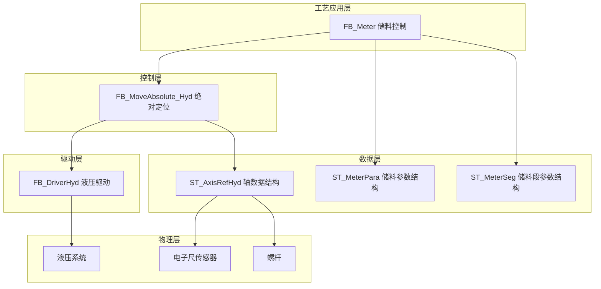
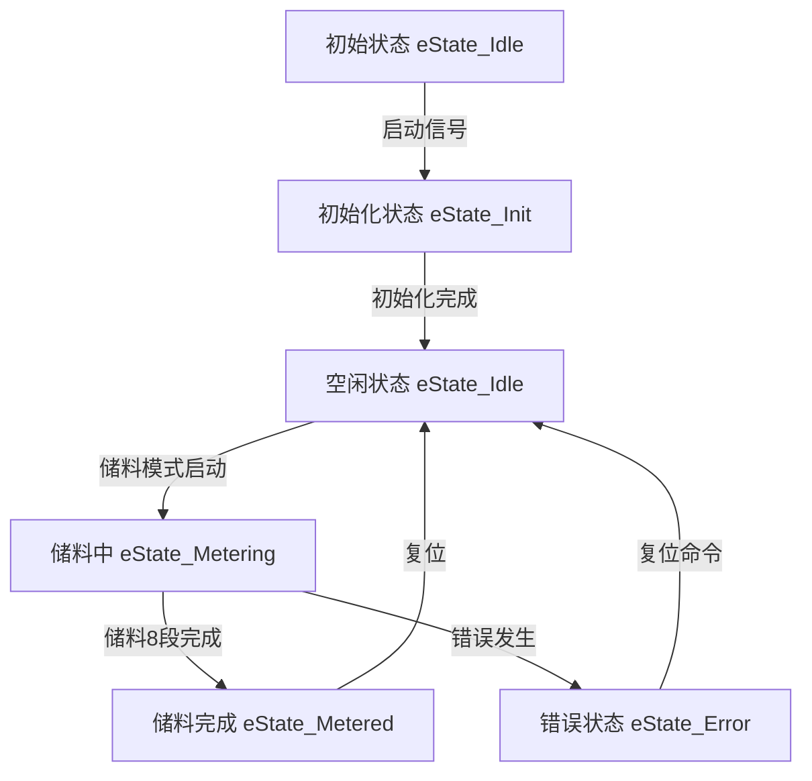
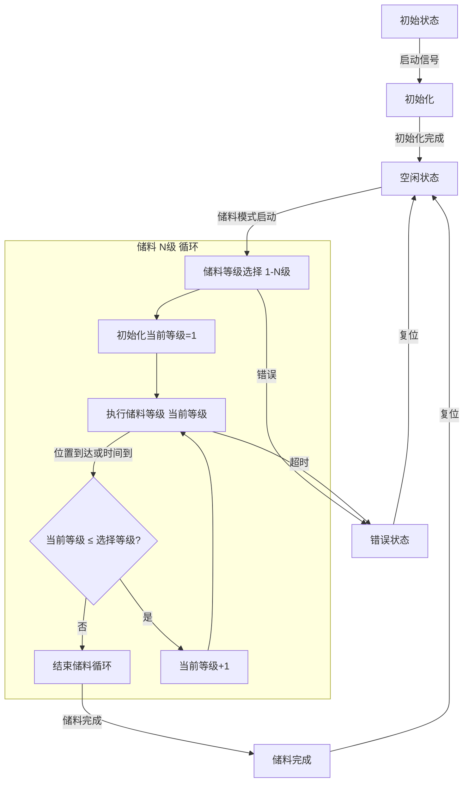
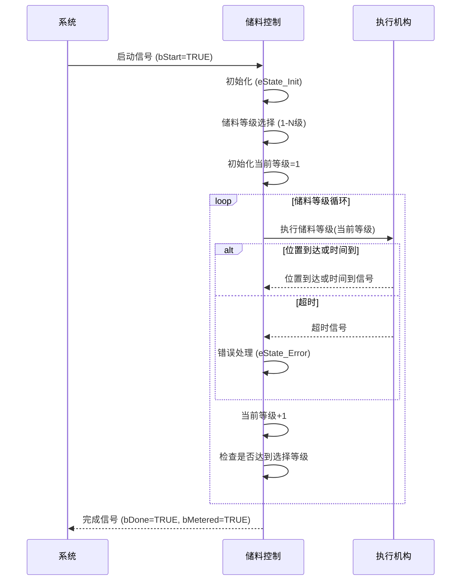
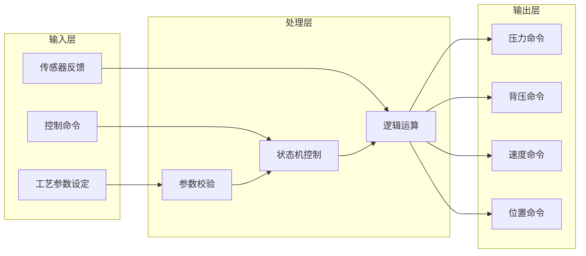
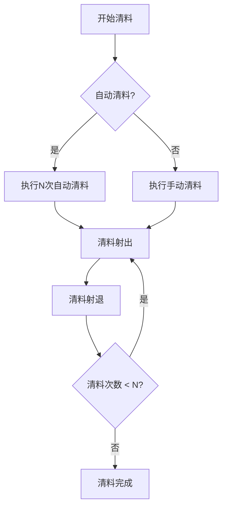

# 注塑机储料/清料功能

## 1. 概述

### 1.1 功能简介

  
🔄

  <strong>核心功能</strong>
  
储料功能是注塑机的重要功能之一，负责将塑料颗粒通过料筒加热熔融并输送到注射区域，为后续的射出过程做准备。储料过程的控制精度直接影响产品的重量一致性和成型质量。

### 1.2 工艺特点

  <h4>工艺特性</h4>
  <ul>
    <li><strong>多段储料控制</strong>：支持8段储料工艺参数，实现精确的物料计量</li>
    <li><strong>背压控制</strong>：支持储料背压控制，确保物料均匀熔融</li>
    <li><strong>位置控制</strong>：支持电子尺和行程开关两种位置控制方式</li>
    <li><strong>斜率控制</strong>：支持压力和速度的启动/停止斜率控制</li>
    <li><strong>安全机制</strong>：包含超时保护、状态互锁等多重安全保障</li>
    <li><strong>平台兼容性</strong>：支持Luban平台（基于Beremiz二次开发）运行，采用标准IEC 61131-3 ST语法实现</li>
  </ul>

### 1.3 技术架构

本功能采用分层架构设计，参考研发部提供的液压系统建模方案，结合倍福TF8560塑料技术功能标准，实现模块化、标准化设计。

---

## 2. 核心控制机制

### 2.1 储料状态机 (E_MeterState)

  
⚡

  <strong>状态机控制</strong>
  
储料功能采用统一状态机管理，包含空闲、初始化、储料中和储料完成等状态。

#### 状态说明

| 状态值 | 名称            | 说明        |
| ------ | --------------- | ----------- |
| 0      | eState_Idle     | 空闲状态    |
| 1      | eState_Init     | 初始化状态  |
| 2      | eState_Metering | 储料中(8段) |
| 3      | eState_Metered  | 储料完成    |
| 4      | eState_Error    | 错误状态    |

### 2.2 控制命令机制

| 命令   | 说明     | 响应             |
| ------ | -------- | ---------------- |
| bStart | 启动命令 | 启动储料动作     |
| bStop  | 停止命令 | 有减速停止       |
| bEStop | 急停命令 | 立即停止，无减速 |
| bReset | 复位命令 | 重置错误状态     |

### 2.3 储料方式选择 (uiMeterMode)

| 方式值 | 名称       | 说明                   |
| ------ | ---------- | ---------------------- |
| 0      | 电子尺模式 | 通过电子尺位置反馈控制 |
| 1      | 行程模式   | 通过行程开关控制       |

---

## 3. 功能阶段定义

### 3.1 储料阶段（8段）

  <h4>储料阶段说明</h4>
  <ul>
    <li><strong>多段控制</strong>：支持8段储料工艺参数，实现精确的物料计量</li>
    <li><strong>背压控制</strong>：各段可设置独立的背压参数</li>
    <li><strong>速度控制</strong>：各段可设置独立的压力、速度和位置参数</li>
    <li><strong>斜率控制</strong>：支持压力和速度的启动/停止斜率</li>
  </ul>

| 阶段编号 | 阶段名称 | 主要功能 | 控制参数                     | 转换条件         |
| -------- | -------- | -------- | ---------------------------- | ---------------- |
| 1        | 储料1段  | 一级储料 | 压力、背压、速度、位置、斜率 | 位置到达或时间到 |
| 2        | 储料2段  | 二级储料 | 压力、背压、速度、位置、斜率 | 位置到达或时间到 |
| 3        | 储料3段  | 三级储料 | 压力、背压、速度、位置、斜率 | 位置到达或时间到 |
| 4        | 储料4段  | 四级储料 | 压力、背压、速度、位置、斜率 | 位置到达或时间到 |
| 5        | 储料5段  | 五级储料 | 压力、背压、速度、位置、斜率 | 位置到达或时间到 |
| 6        | 储料6段  | 六级储料 | 压力、背压、速度、位置、斜率 | 位置到达或时间到 |
| 7        | 储料7段  | 七级储料 | 压力、背压、速度、位置、斜率 | 位置到达或时间到 |
| 8        | 储料8段  | 八级储料 | 压力、背压、速度、位置、斜率 | 位置到达或时间到 |

### 3.2 阀门输出控制

| 阶段     | 射退阀 (gvl_dqSuckBackControl) | 储料阀 (gvl_dqScrewBackControl) | 说明                     |
| -------- | ------------------------------ | ------------------------------- | ------------------------ |
| 前射退   | TRUE                           | FALSE                           | 射出完成后，螺杆向后移动 |
| 储料阶段 | TRUE                           | TRUE                            | 同时输出，确保储料稳定   |
| 后射退   | TRUE                           | FALSE                           | 防止熔料在喷嘴处固化     |
| 其他阶段 | FALSE                          | FALSE                           | 关闭所有阀门             |

---

## 4. 控制流程

### 4.1 储料过程流程

#### 4.1.1 储料流程示意图

#### 4.1.2 储料流程序列图

> ⚠️ **重要说明**：
>
> 1. 储料等级段数可通过 `uiMeterSegCnt`参数设定（1-8段）
> 2. 储料过程支持背压控制，可通过 `uiBackPres`参数设置

---

## 5. 数据结构与功能块

### 5.1 核心数据结构

#### 5.1.1 E_MeterState 枚举类型

**用途**：定义储料动作的状态机状态

| 值 | 名称            | 说明        |
| -- | --------------- | ----------- |
| 0  | eState_Idle     | 空闲状态    |
| 1  | eState_Init     | 初始化状态  |
| 2  | eState_Metering | 储料中(8段) |
| 3  | eState_Metered  | 储料完成    |
| 4  | eState_Error    | 错误状态    |

#### 5.1.2 ST_MeterSeg 结构体

**用途**：定义储料单段工艺参数

| 字段名     | 类型  | 有效范围     | 说明         |
| ---------- | ----- | ------------ | ------------ |
| uiSPres    | UINT  | 0-1000       | 设定压力     |
| uiBackPres | UINT  | 0-1000       | 设定背压     |
| uiSpd      | UINT  | 0-1000       | 设定速度     |
| udiPos     | UDINT | 0-4294967295 | 设定位置     |
| uiPresGrad | UINT  | 0-1000       | 设定压力斜率 |
| uiSpdGrad  | UINT  | 0-1000       | 设定速度斜率 |

#### 5.1.3 ST_MeterPara 结构体

**用途**：定义完整储料工艺参数

| 字段名               | 类型                 | 有效范围 | 说明                       |
| -------------------- | -------------------- | -------- | -------------------------- |
| uiMeterSegCnt        | UINT                 | 1-8      | 储料段数选择               |
| uiMeterMode          | UINT                 | 0-1      | 储料方式 (0:电子尺 1:行程) |
| uiMeterLimitTime     | UINT                 | 0-65535  | 储料限制时间               |
| aMeterSeg[1..8]      | ARRAY OF ST_MeterSeg | -        | 储料多段设定参数           |
| uiMeterPresStartGrad | UINT                 | 0-1000   | 压力启动斜率               |
| uiMeterPresStopGrad  | UINT                 | 0-1000   | 压力停止斜率               |
| uiMeterSpdStartGrad  | UINT                 | 0-1000   | 速度启动斜率               |
| uiMeterSpdStopGrad   | UINT                 | 0-1000   | 速度停止斜率               |

### 5.2 功能块定义

#### 5.2.1 FB_Meter 功能块

**用途**：储料控制功能块

**输入输出参数**：

| 参数名      | 类型          | 说明       |
| ----------- | ------------- | ---------- |
| stMeterAxis | ST_AxisRefHyd | 轴数据结构 |

**输入参数**：

| 参数名             | 类型         | 有效范围     | 默认值 | 说明           |
| ------------------ | ------------ | ------------ | ------ | -------------- |
| bStart             | BOOL         | FALSE,TRUE   | FALSE  | 启动           |
| bStop              | BOOL         | FALSE,TRUE   | FALSE  | 停止(有减速停) |
| bEStop             | BOOL         | FALSE,TRUE   | FALSE  | 急停(立即停止) |
| bReset             | BOOL         | FALSE,TRUE   | FALSE  | 复位           |
| stMeterPara        | ST_MeterPara | -            | -      | 工艺参数       |
| bMeterStop         | BOOL         | FALSE,TRUE   | FALSE  | 储料停止       |
| udiInjElecRulerVal | UDINT        | 0-4294967295 | 0      | 射胶电子尺值   |

**输出参数**：

| 参数名        | 类型  | 说明             |
| ------------- | ----- | ---------------- |
| bBusy         | BOOL  | 忙状态           |
| bDone         | BOOL  | 完成状态         |
| bAlarm        | BOOL  | 报警状态         |
| uiAlarmID     | UINT  | 报警代码         |
| uiActHint     | UINT  | 当前动作状态     |
| uiActTime     | UINT  | 当前动作运行时间 |
| bMetered      | BOOL  | 储料完成         |
| uiPresCmd     | UINT  | 压力命令输出     |
| uiBackPresCmd | UINT  | 背压命令输出     |
| uiSpdCmd      | UINT  | 速度命令输出     |
| udiPosCmd     | UDINT | 位置命令输出     |

---

## 6. 核心参数说明

### 6.1 储料关键参数

| 参数类别 | 参数名称     | 程序变量名                 | 功能说明             |
| -------- | ------------ | -------------------------- | -------------------- |
| 段数参数 | 储料段数     | uiMeterSegCnt              | 设定储料段数 (1-8段) |
| 控制参数 | 储料方式     | uiMeterMode                | 0:电子尺 1:行程      |
| 时间参数 | 储料限制时间 | uiMeterLimitTime           | 储料过程总时间限制   |
| 工艺参数 | 储料压力     | aMeterSeg[1..8].uiSPres    | 储料各段压力设定     |
| 工艺参数 | 储料背压     | aMeterSeg[1..8].uiBackPres | 储料各段背压设定     |
| 工艺参数 | 储料速度     | aMeterSeg[1..8].uiSpd      | 储料各段速度设定     |
| 工艺参数 | 储料位置     | aMeterSeg[1..8].udiPos     | 储料各段位置设定     |
| 斜率参数 | 压力启动斜率 | uiMeterPresStartGrad       | 储料压力启动斜率     |
| 斜率参数 | 压力停止斜率 | uiMeterPresStopGrad        | 储料压力停止斜率     |
| 斜率参数 | 速度启动斜率 | uiMeterSpdStartGrad        | 储料速度启动斜率     |
| 斜率参数 | 速度停止斜率 | uiMeterSpdStopGrad         | 储料速度停止斜率     |

---

## 7. 功能块实现

### 7.1 动作提示码 (uiActHint)

| 值    | 名称      | 说明             |
| ----- | --------- | ---------------- |
| 0     | 无动作    | 当前无动作执行   |
| 1     | 报警状态  | 系统处于报警状态 |
| 2     | 储料完成  | 储料阶段已完成   |
| 10    | -         | 预留             |
| 11-18 | 储料1-8段 | 储料各段状态     |

### 7.2 报警代码 (uiAlarmID)

| 值   | 说明     |
| ---- | -------- |
| 0    | 无报警   |
| 1000 | 未知错误 |
| 1001 | 储料超时 |
| 1002 | 位置超限 |

---

## 8. 安全保护机制

### 8.1 超时保护

- **储料限制时间保护**：监控整个储料过程，超过设定总时间则报警
- **各段超时保护**：各段工艺参数都应有合理的时间限制

### 8.2 位置保护

- **电子尺位置监控**：实时监控螺杆位置
- **位置极限保护**：防止超出机械行程极限

### 8.3 状态互锁

- **状态机互锁**：各状态间应有明确的转换条件，防止异常跳转
- **命令互锁**：启动、停止、急停命令应有优先级处理

---

## 9. 平台兼容性

  <h4>支持平台</h4>
  <ul>
    <li><strong>Luban平台</strong>：基于Beremiz二次开发，支持标准IEC 61131-3 ST语法</li>
    <li><strong>倍福TF8560</strong>：参考倍福TF8560塑料技术功能标准实现</li>
  </ul>

---

## 10. 参数调整指南

### 10.1 储料参数调整

  
💡

  <strong>调整建议</strong>
  
储料参数的调整应根据产品材质、模具结构和制品要求进行优化。

1. **背压调整**：根据物料特性和塑化要求选择合适的背压

   - 背压有助于物料均匀熔融
   - 背压过大可能导致温度升高和降解
2. **速度调整**：根据填充阶段调整速度

   - 初始阶段速度较慢，保证物料平稳进入料筒
   - 中段速度加快，提高生产效率
3. **位置调整**：电子尺位置用于精确控制各段切换点

   - 确保各段位置设置合理，保证计量精度

### 10.2 背压控制调整

1. **背压作用**：在熔融过程中建立背压，帮助物料均匀混合和熔融
2. **背压设置**：根据材料特性调整，过高会导致温度升高
3. **零背压选项**：某些材料可能需要零背压控制

---

## 11. 调试与故障排除

### 11.1 常见问题与解决方案

| 问题现象     | 可能原因               | 解决建议                 |
| ------------ | ---------------------- | ------------------------ |
| 储料不足     | 背压参数设置过低       | 检查并调整背压参数       |
| 制品重量不稳 | 储料位置不一致         | 检查电子尺信号和位置参数 |
| 储料超时     | 各段时间设置过长       | 优化各段时间参数         |
| 物料降解     | 背压过高或储料时间过长 | 降低背压和储料时间       |

### 11.2 报警处理

| 报警代码 | 说明     | 处理方法                                 |
| -------- | -------- | ---------------------------------------- |
| 1001     | 储料超时 | 检查储料各段时间设置，检查螺杆和料筒状态 |
| 1002     | 位置超限 | 检查储料位置参数是否超出机械行程         |

---

## 12. 数据流说明

1. **输入层**：接收工艺参数设定、控制命令和传感器反馈
2. **处理层**：进行参数校验、状态机控制、逻辑运算
3. **输出层**：生成压力、背压、速度和位置命令到液压驱动

---

## 13. 清料功能

### 13.1 功能概述

  
🧹

  <strong>清料功能</strong>
  
清料功能用于在更换原料或清理料筒时，将残留物料从料筒中推出。清料过程通过射出动作将物料从喷嘴处排出。

### 13.2 清料控制参数

| 参数名称 | 地址  | 说明             |
| -------- | ----- | ---------------- |
| 清料射出 | D0360 | 清料射出压力     |
| 清料射退 | D0350 | 清料射退压力     |
| 自动清料 | D0393 | 自动清料功能开关 |
| 清料次数 | D0394 | 自动清料次数     |

### 13.3 清料流程

### 13.4 阀门输出

| 阶段     | 射退阀 | 储料阀 | 说明                 |
| -------- | ------ | ------ | -------------------- |
| 清料射出 | FALSE  | FALSE  | 射出阀打开，物料射出 |
| 清料射退 | TRUE   | FALSE  | 射退阀打开，防止漏料 |

---

## 14. 相关文档与参考

- [储料定义.st](./%E5%80%9A%E6%96%99%E5%AE%9A%E4%B9%89.st)
- 《功能块使用指南.md》：功能块的详细使用说明
- 《注塑液压系统建模分析2.md》：研发部提供的液压系统建模方案
- 《GM2XX立式驱控一体使用说明书》：系统总体说明

---

## 15. 文档信息

**适用范围**：立式注塑机储料控制功能开发项目
**数据定义基准**：储料定义.st

### 15.1 版本控制

  <h4>版本历史</h4>
  
文档的版本变更记录，跟踪文档的演进过程。

| 版本 | 日期       | 作者      | 变更说明                                                                                                    |
| ---- | ---------- | --------- | ----------------------------------------------------------------------------------------------------------- |
| 1.0  | 2025-09-20 | 汪工      | 初始版本，完成基本功能描述。完善储料/清料流程图等                                                           |
| 1.1  | 2026-03-27 | 周工/汪工 | 根据储料定义.st更新内容；调整文档结构与开合模保持一致；更新流程图参考多级循环格式；完善参数说明和调试指南； |
