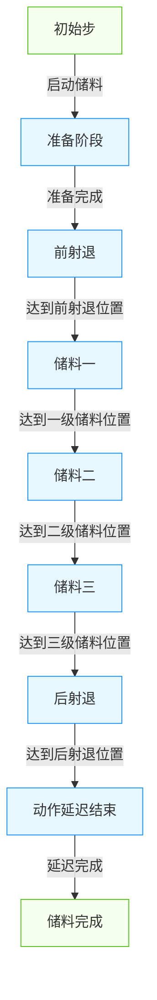
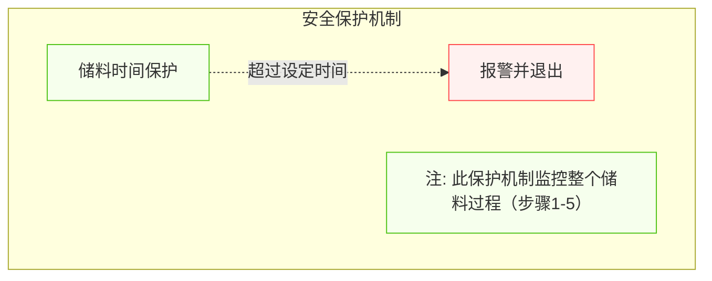
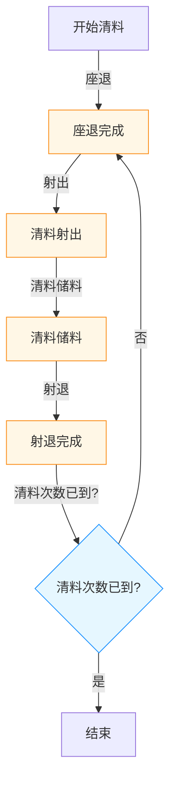

# 注塑机储料/清料功能整理

## 1. 功能概述

储料功能是注塑机的重要功能之一，负责将塑料颗粒通过料筒加热熔融并输送到注射区域，为后续的射出过程做准备。清料功能则用于料筒内物料的更换、清洗和维护。这两个功能密切相关，共同确保注塑过程中物料的质量和稳定性。

## 2. 功能组成

### 2.1 储料功能
- **一级储料**：初始快速储料阶段
- **二级储料**：减速储料阶段
- **三级储料**：最终慢速储料阶段
- **储料背压控制**：控制储料过程中的背压
- **储料位置控制**：精确控制储料的终止位置

### 2.2 清料功能
- **正向清料**：向前推动料筒内物料
- **反向清料**：向后排出料筒内物料
- **强力清料**：高压力快速清洗料筒
- **换料清洗**：不同材料更换时的清洗流程

### 2.3 储料辅助功能
- **储料监控**：实时监控储料过程参数
- **储料优化**：自动优化储料参数
- **异常检测**：检测储料过程中的异常情况

## 3. 储料过程控制流程图

储料过程动作流程：
前射退 → 储料一 → 储料二 → 储料三 → 后射退 → 动作延迟结束 → 储料完成

### 3.1 各阶段阀门输出状态

| 阶段名称 | 阀门输出状态 | 功能说明 |
|---------|------------|---------|
| **前射退（前抽）** | 射退阀输出（储料阀不输出） | 射出完成后，螺杆向后移动，防止熔料从喷嘴流出 |
| **一级储料** | 射退阀和储料阀同时输出 | 螺杆以较高速度和较低压力进行初步储料 |
| **二级储料** | 射退阀和储料阀同时输出 | 螺杆以中等速度和压力进行储料 |
| **三级储料** | 射退阀和储料阀同时输出 | 螺杆以较低速度和较高压力完成储料，确保储料量准确 |
| **后射退（后抽）** | 射退阀输出（储料阀不输出） | 储料完成后，螺杆再次向后移动，防止熔料在喷嘴处固化 |

## 4. 储料安全保护机制

## 5. 清料功能动作流程

清料功能动作流程如下：
1. 座退 → 射出 → 储料 → 射退
2. 重复上述动作，直到达到设定的清料次数

清料过程流程图：

## 6. 参数说明与映射表

### 6.1 储料相关全局变量

#### 6.1.1 储料位置参数
| 全局变量名 | 类型 | 默认值 | 功能说明 |
|----------|-----|-------|--------|
| gvl_PreRetractPosition | INT | 50 | 前射退位置 (mm*10) |
| gvl_ScrewBack1stStagePos | INT | 150 | 一级储料位置 (mm*10) |
| gvl_ScrewBack2ndStagePos | INT | 100 | 二级储料位置 (mm*10) |
| gvl_ScrewBackPosition | INT | 200 | 三级储料位置 (mm*10) |
| gvl_SuckBackPosition | INT | 180 | 后射退位置 (mm*10) |

#### 6.1.2 储料压力参数
| 全局变量名 | 类型 | 默认值 | 功能说明 |
|----------|-----|-------|--------|
| gvl_PreRetractPressure | INT | 25 | 前射退压力 (bar) |
| gvl_ScrewBack1stStagePressure | INT | 50 | 一级储料压力 (bar) |
| gvl_ScrewBack2ndStagePressure | INT | 45 | 二级储料压力 (bar) |
| gvl_ScrewBack3rdStagePressure | INT | 40 | 三级储料压力 (bar) |
| gvl_SuckBackPressure | INT | 30 | 后射退压力 (bar) |

#### 6.1.3 储料流量参数
| 全局变量名 | 类型 | 默认值 | 功能说明 |
|----------|-----|-------|--------|
| gvl_PreRetractFlow | INT | 20 | 前射退流量 (%) |
| gvl_ScrewBack1stStageFlow | INT | 60 | 一级储料流量 (%) |
| gvl_ScrewBack2ndStageFlow | INT | 55 | 二级储料流量 (%) |
| gvl_ScrewBack3rdStageFlow | INT | 50 | 三级储料流量 (%) |
| gvl_SuckBackFlow | INT | 25 | 后射退流量 (%) |

#### 6.1.4 储料控制参数
| 全局变量名 | 类型 | 默认值 | PLC地址 | 功能说明 |
|----------|-----|-------|--------|--------|
| gvl_FeedTimeLimitMs | UINT | 20000 | D69 | 储料限时 (0.01s单位) |
| gvl_PreCoolingTimeMs | UINT | 0 | D70 | 先冷却时间 (0.1s单位) |
| gvl_PostCoolingTimeMs | UINT | 0 | D71 | 后冷却时间 (0.1s单位) |
| gvl_ChargeKeySelfLock | UINT | 0 | D93 | 储料按键自锁选择 |
| gvl_ZeroBackPressureEnable | UINT | 0 | D1070 | 零背压控制 |
| gvl_ScrewBackStartDelay | UINT | 0 | D9506 | 压力起始延迟 (0.01s单位) |
| gvl_ScrewBackEndDelay | UINT | 0 | D9507 | 压力结束延迟 (0.01s单位) |

### 6.2 清料参数映射表
| 触摸屏显示 | 程序变量名 | 默认值(PLC侧) | PLC地址 | HMI显示值 | 单位 | 功能说明 |
|----------|-----------|--------------|--------|----------|------|--------|
| 射退压力 | CleanSuckBackPressure | 1234 | D80 | 123.4 | bar | 清料射退压力 |
| 射退流量 | CleanSuckBackFlow | 1234 | D81 | 123.4 | % | 清料射退流量 |
| 射退时间 | CleanSuckBackTime | 12345 | D82 | 123.45 | s | 清料射退时间 |
| 清料压力 | CleanPressure | 1234 | D83 | 123.4 | bar | 清料压力 |
| 清料流量 | CleanFlow | 1234 | D84 | 123.4 | % | 清料流量 |
| 清料时间 | CleanTime | 12345 | D85 | 123.45 | s | 清料时间 |
| 射出压力 | CleanInjectionPressure | 1234 | D86 | 123.4 | bar | 清料射出压力 |
| 射出流量 | CleanInjectionFlow | 1234 | D87 | 123.4 | % | 清料射出流量 |
| 射出时间 | CleanInjectionTime | 12345 | D88 | 123.45 | s | 清料射出时间 |
| 清料次数 | CleanCountParam | 123 | D89 | 123 | 次 | 自动清料循环次数 |
| 自动清料 | AutoCleanParam | 0 | D90 | 0 | 开关 | 自动清料功能开关(0-不用，1-使用) |

## 7. 清料功能操作说明
### 7.1 自动清料操作步骤
1. **功能启用**：在HMI上将「自动清料」功能设为[使用]（对应参数D90设为1）
2. **参数设置**：
   - 设置清料次数（参数D89）
   - 设置清料各阶段的压力、流量和时间参数（D80-D88）
3. **模式选择**：确保设备处于手动模式
4. **启动操作**：按**自动清料键**，系统开始执行清料动作
5. **自动执行**：系统自动重复执行清料动作流程，直到达到设定的清料次数
6. **完成停止**：清料完成后，系统自动停止清料动作并返回就绪状态

### 7.2 清料动作流程
清料动作流程如下：
1. **座退**：座台后退到指定位置
2. **射出**：执行清料射出动作
3. **储料**：执行清料储料动作
4. **射退**：执行清料射退动作
5. **循环检查**：检查是否达到设定的清料次数，若未达到则重复上述动作

### 7.3 清料注意事项
1. 清料功能仅在手动模式下可用
2. 清料前请确保模具已打开，避免材料溢出
3. 清料时需注意安全，避免高温物料喷出
4. 清料次数应根据实际需要合理设置，避免不必要的浪费
5. 不同材料需要调整不同的清料参数
6. 清料过程中，系统会实时显示当前清料次数和进度

### 7.4 清料完成状态
- 清料完成后，系统自动停止清料动作
- 设备返回就绪状态，等待下一个指令
- 清料完成信息会在HMI上显示
- 若清料过程中发生错误，系统会触发相应报警

## 8. 参数调整原则

### 8.1 位置参数调整
- **储料位置参数**：应按照从小到大的顺序设置（前射退位置 < 一级储料位置 < 二级储料位置 < 三级储料位置 < 后射退位置）
- **位置切换点**：应根据材料特性和制品要求调整

### 8.2 压力和流量参数调整
- **储料压力**：应根据材料特性设置，确保充分塑化
- **背压设置**：背压值应根据材料特性合理设置，过大容易导致温度升高，过小可能影响计量精度
- **清料参数**：清料速度通常高于正常储料速度，清料压力应设置为系统允许的较高值

### 8.3 时间参数调整
- **储料限时**：应设置为正常储料时间的1.5倍以上，避免频繁报警
- **冷却时间**：前冷却和后冷却时间应根据材料和制品要求合理设置，确保工艺稳定性
- **压力延迟**：压力起始延迟和结束延迟应根据系统响应特性调整

## 9. 功能实现

### 9.1 功能块与程序文件

#### 9.1.1 储料功能相关
- **FB_Charge.st**：储料控制功能块，实现多段储料控制、前射退和后射退控制
- **P14_Charge.st**：储料执行程序，调用FB_Charge功能块

#### 9.1.2 射退功能相关
- **FB_SuckBack.st**：射退控制功能块，实现独立的射退功能控制
- **P15_SuckBack.st**：射退执行程序，调用FB_SuckBack功能块

#### 9.1.3 清料功能相关
- **FB_AutoClean.st**：自动清料功能块，实现自动清料功能，重复执行射出、储料、射退动作，直到达到设定的清料次数
- **P15_AutoClean.st**：自动清料执行程序，调用FB_AutoClean功能块

### 9.2 关键控制逻辑

#### 9.2.1 储料控制逻辑
- 储料过程采用多级位置切换控制，根据螺杆位置自动切换不同阶段参数
- 支持前射退和后射退控制
- 支持背压控制
- 支持储料限时保护
- 支持压力起始延迟和结束延迟控制
- 每个阶段自动更新动作码和动作名称

#### 9.2.2 自动清料控制逻辑
- 自动清料功能独立于正常生产流程，仅在手动模式下可用
- 支持设定清料次数，自动重复执行清料动作
- 清料动作流程：座退 → 射出 → 储料 → 射退
- 每个清料阶段可独立设置压力、流量和时间参数
- 支持实时显示当前清料次数和进度
- 支持清料完成自动停止

### 9.3 功能块实现细节

#### 9.3.1 FB_Charge功能块

##### 9.3.1.1 功能说明
FB_Charge功能块是储料过程的核心控制模块，负责协调执行前射退、三级储料和后射退的完整流程。

##### 9.3.1.2 状态机设计
FB_Charge功能块采用状态机设计，包括以下状态：
- 0: 准备阶段
- 1: 前射退
- 2: 一级储料
- 3: 二级储料
- 4: 三级储料
- 5: 后射退
- 6: 动作延迟结束
- 7: 储料完成

##### 9.3.1.3 动作码管理
储料过程中，系统会实时更新动作码，HMI根据动作码显示相应的动作状态：
- 准备阶段：动作码5001，动作名称Feed Ready
- 前射退：动作码5002，动作名称Pre Retract
- 一级储料：动作码5003，动作名称Feed Stage 1
- 二级储料：动作码5004，动作名称Feed Stage 2
- 三级储料：动作码5005，动作名称Feed Stage 3
- 后射退：动作码5006，动作名称Post Retract
- 动作延迟结束：动作码5007，动作名称Feed End Delay
- 储料完成：动作码5008，动作名称Feed Complete

##### 9.3.1.4 阀门输出控制
FB_Charge功能块根据当前阶段控制射退阀和储料阀的输出状态：

| 阶段 | 射退阀(gvl_dqSuckBackControl) | 储料阀(gvl_dqScrewBackControl) |
|------|------------------------------|-------------------------------|
| 前射退 | TRUE | FALSE |
| 一级储料 | TRUE | TRUE |
| 二级储料 | TRUE | TRUE |
| 三级储料 | TRUE | TRUE |
| 后射退 | TRUE | FALSE |
| 其他阶段 | FALSE | FALSE |

这种输出逻辑确保了：
- 射退阶段（前射退和后射退）仅输出射退阀，防止熔料泄漏或固化
- 储料阶段同时输出射退阀和储料阀，确保储料过程的稳定性和准确性
- 其他阶段自动关闭所有阀门，节省能源并确保安全

##### 9.3.1.5 错误处理
储料过程中，系统会检测以下错误：
- 储料超时：错误码5006
- 未知步骤错误：错误码5000

发生错误时，系统会：
- 停止储料动作
- 设置错误标志
- 更新动作码为错误状态
- 触发相应报警

#### 9.3.2 FB_AutoClean功能块

##### 9.3.2.1 状态机设计
FB_AutoClean功能块采用状态机设计，包括以下状态：
- ST_IDLE：空闲状态
- ST_SEAT_BACK：座退状态
- ST_INJECTION：清料射出状态
- ST_SCREW_BACK：清料储料状态
- ST_SUCK_BACK：清料射退状态
- ST_CHECK_COUNT：检查清料次数状态
- ST_COMPLETE：清料完成状态
- ST_ERROR：错误状态

##### 9.3.2.2 动作码管理
自动清料过程中，系统会实时更新动作码，HMI根据动作码显示相应的动作状态：
- 座退：动作码114
- 清料射出：动作码44
- 清料储料：动作码11
- 清料射退：动作码13

### 9.3.3 FB_SuckBack功能块

##### 9.3.3.1 功能说明
FB_SuckBack功能块用于实现独立的射退功能控制，可用于：
- 手动模式下的射退操作
- 自动流程中的射退控制
- 清料过程中的射退动作

##### 9.3.3.2 工作原理
1. 收到启动信号后，功能块开始执行射退动作
2. 控制射退阀输出，螺杆向后移动
3. 实时监测螺杆位置，当达到目标位置时停止射退
4. 支持中途停止和复位操作
5. 发生错误时，会触发相应报警

## 10. 注意事项

1. **参数一致性**：触摸屏上修改的参数应实时同步到PLC程序中，确保参数一致性
2. **参数存储**：重要参数应保存在PLC的掉电保持区域，确保断电后参数不丢失
3. **参数限制**：应对关键参数设置合理的上下限，防止输入错误导致设备损坏
4. **储料限时保护**：储料时间超过设定限时，系统会触发报警并停止储料过程
5. **背压设置**：背压值应根据材料特性合理设置，过大容易导致温度升高，过小可能影响计量精度
6. **清料功能**：使用清料功能时，应确保模具已打开，避免材料溢出
7. **冷却时间设置**：前冷却和后冷却时间应根据材料和制品要求合理设置，确保工艺稳定性
8. **材料特性**：不同材料需要调整不同的储料参数
9. **温度控制**：储料前需确认料筒温度达到设定要求
10. **背压监控**：过高的背压可能导致材料降解和设备过载
11. **储料时间**：过长的储料时间可能导致材料降解
12. **清料安全**：清料时需注意安全，避免高温物料喷出
13. **定期维护**：定期检查储料系统的液压元件和机械部件

## 11. 相关文档

- 《功能块实现细节.md》：核心功能块的实现细节
- 《技术实现文档.md》：核心功能的技术实现细节
- 《注塑机触摸屏界面详细说明.md》：触摸屏界面操作说明
- 《调试指南.md》：功能调试和故障排除指南
- 《变量名和PLC地址检查指南.md》：变量命名和PLC地址映射指南