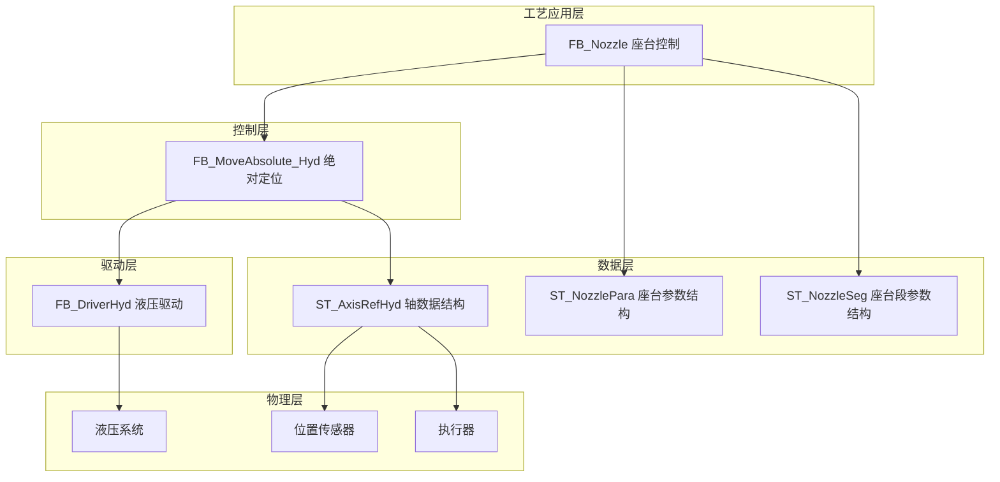
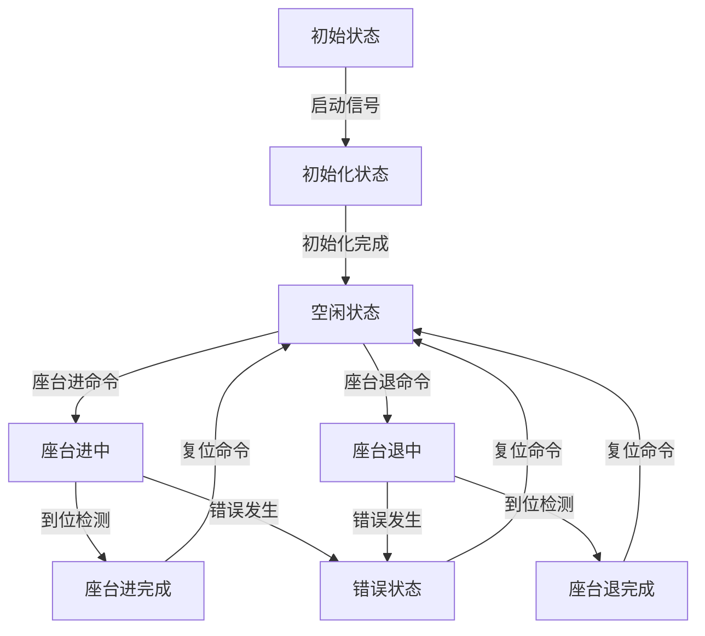
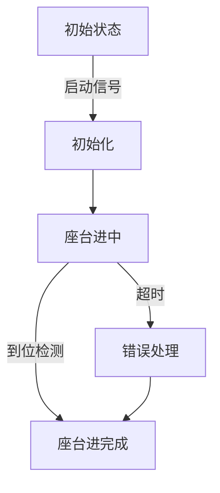
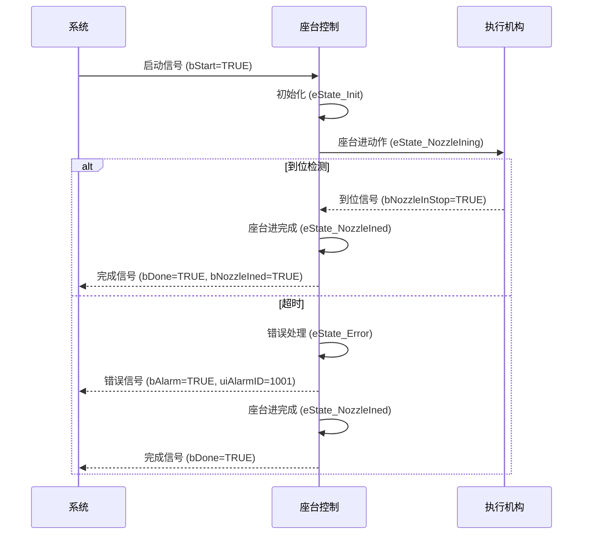
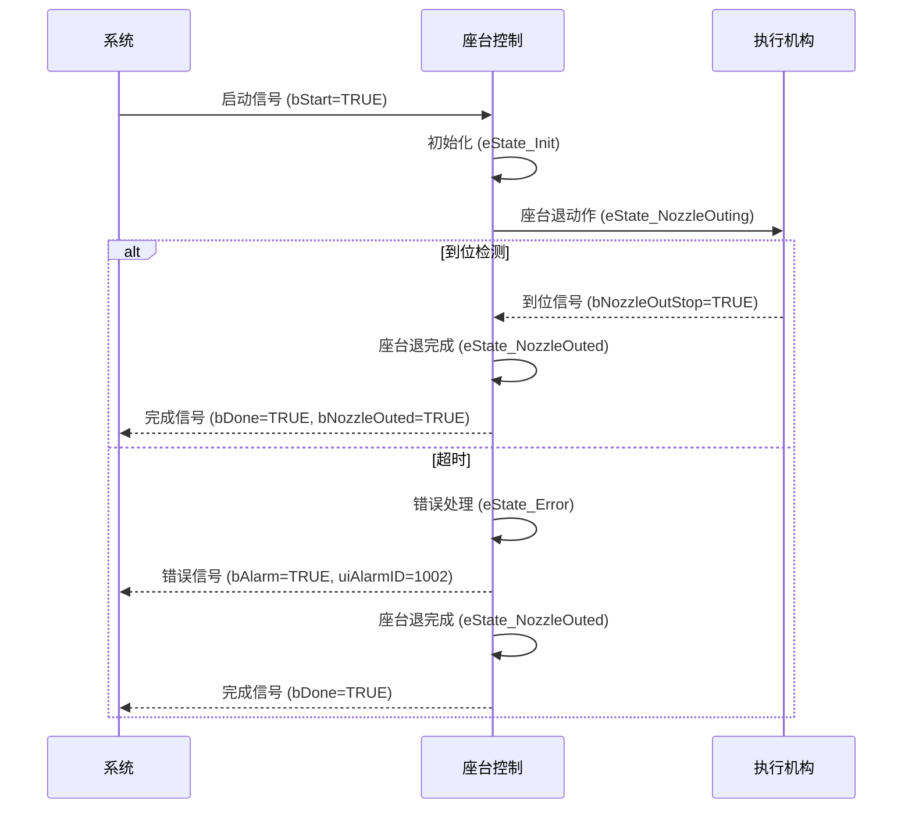

# 注塑机座台功能技术文档

## 1. 概述

### 1.1 功能简介

座台功能是注塑机的重要组成部分，主要负责控制喷嘴座台的前进和后退动作，实现喷嘴与模具的接触和分离。该功能通过精确控制压力、流量和位置参数，确保座台动作平稳、安全且高效，为注塑工艺提供可靠的喷嘴定位保障。

### 1.2 工艺特点

- **双向动作**：支持座台前进（座进）和后退（座退）两个方向的动作控制
- **多段控制**：支持2段座台进和2段座台退控制
- **多种停止方式**：支持时间、行程、位置三种停止方式
- **安全机制**：包含超时保护、状态互锁等多重安全保障
- **平台兼容性**：支持Luban平台（基于Beremiz二次开发）运行，采用标准IEC 61131-3 ST语法实现
- **参数控制**：支持压力、速度、时间、位置、斜率等多种控制参数

### 1.3 技术架构

本功能采用分层架构设计，参考研发部提供的液压系统建模方案，结合倍福TF8560塑料技术功能标准，实现模块化、标准化设计。



---

## 2. 核心控制机制

### 2.1 状态管理机制

座台功能采用状态机管理，控制座台的各种动作状态：

#### 2.1.1 座台动作状态机 (E_NozzleState)



### 2.2 控制命令机制

座台功能支持四种控制命令：

| 命令       | 说明     | 响应               |
| ---------- | -------- | ------------------ |
| `bStart` | 启动命令 | 启动座台动作       |
| `bStop`  | 停止命令 | 有减速停           |
| `bEStop` | 急停命令 | 立即停止，无减速停 |
| `bReset` | 复位命令 | 重置错误状态       |

### 2.3 模式选择机制

座台功能支持三种模式：

| 模式       | 值 | 说明           |
| ---------- | -- | -------------- |
| 无模式     | 0  | 不执行任何动作 |
| 座台进模式 | 1  | 执行座台进动作 |
| 座台退模式 | 2  | 执行座台退动作 |

---

## 3. 功能阶段定义

### 3.1 座台进功能阶段

| 阶段编号 | 阶段名称   | 主要功能             | 控制参数         | 阶段转换条件   |
| -------- | ---------- | -------------------- | ---------------- | -------------- |
| 1        | 初始化     | 初始化参数，准备动作 | 无               | 启动信号触发   |
| 2        | 座台进中   | 执行座台进动作       | 压力、速度、位置 | 到位检测或超时 |
| 3        | 座台进完成 | 保持完成状态         | 无               | 到位检测或超时 |

### 3.2 座台退功能阶段

| 阶段编号 | 阶段名称   | 主要功能             | 控制参数         | 阶段转换条件   |
| -------- | ---------- | -------------------- | ---------------- | -------------- |
| 1        | 初始化     | 初始化参数，准备动作 | 无               | 启动信号触发   |
| 2        | 座台退中   | 执行座台退动作       | 压力、速度、位置 | 到位检测或超时 |
| 3        | 座台退完成 | 保持完成状态         | 无               | 到位检测或超时 |

---

## 4. 控制流程

### 4.1 座台进过程流程

#### 4.1.1 座台进流程示意图



#### 4.1.2 座台进流程序列图



### 4.2 座台退过程流程

#### 4.2.1 座台退流程示意图


#### 4.2.2 座台退流程序列图



> ⚠️ **重要说明**：
>
> 1. 座台动作必须在合模完成后执行，避免与合模动作干涉
> 2. 座台进动作完成后才能进行射出动作

---

## 5. 数据结构与功能块

### 5.1 核心数据结构

#### 5.1.1 E_NozzleState 枚举类型

**用途**：定义座台动作的状态机状态

| 值 | 名称              | 说明         |
| -- | ----------------- | ------------ |
| 0  | eState_Idle       | 空闲状态     |
| 1  | eState_Init       | 初始化       |
| 2  | eState_NozzleIning | 座台进中     |
| 3  | eState_NozzleIned  | 座台进完成   |
| 4  | eState_NozzleOuting | 座台退中     |
| 5  | eState_NozzleOuted | 座台退完成   |
| 6  | eState_Error      | 错误状态     |

#### 5.1.2 ST_NozzleSeg 结构体

**用途**：定义座台单段工艺参数

| 字段名      | 类型 | 有效范围 | 初始值 | 说明         |
| ----------- | ---- | -------- | ------ | ------------ |
| `uiPres`  | UINT | 0-1000   | 0      | 设定压力     |
| `uiSpd`   | UINT | 0-1000   | 0      | 设定速度     |
| `udiPos`  | UDINT | 0-4294967295 | 0    | 设定位置     |
| `uiTime`  | UINT | 0-65535  | 0      | 设定时间     |
| `uiPresGrad` | UINT | 0-1000 | 0      | 设定压力斜率 |
| `uiSpdGrad`  | UINT | 0-1000 | 0      | 设定速度斜率 |

#### 5.1.3 ST_NozzlePara 结构体

**用途**：定义座台完整工艺参数

| 字段名                     | 类型       | 有效范围     | 初始值 | 说明                                  |
| -------------------------- | ---------- | ------------ | ------ | ------------------------------------- |
| `uiNozzleInSegCnt`        | UINT       | 1-2          | 0      | 座台进段数选择                        |
| `uiNozzleInMode`          | UINT       | 0-2          | 0      | 座台进方式选择 (0:时间 1:行程 2:位置) |
| `uiNozzleInLimitTime`     | UINT       | 0-65535      | 0      | 座台进限制时间                        |
| `aNozzleInSeg`            | ARRAY[1..2] OF ST_NozzleSeg | -    | -      | 座台进多段设定参数                    |
| `uiNozzleInPresStartGrad` | UINT       | 0-1000       | 0      | 压力启动斜率                          |
| `uiNozzleInPresStopGrad`  | UINT       | 0-1000       | 0      | 压力停止斜率                          |
| `uiNozzleInSpdStartGrad`  | UINT       | 0-1000       | 0      | 速度启动斜率                          |
| `uiNozzleInSpdStopGrad`   | UINT       | 0-1000       | 0      | 速度停止斜率                          |
| `uiNozzleOutSegCnt`       | UINT       | 1-2          | 0      | 座台退段数选择                        |
| `uiNozzleOutMode`         | UINT       | 0-2          | 0      | 座台退方式选择 (0:时间 1:行程 2:位置) |
| `uiNozzleOutLimitTime`    | UINT       | 0-65535      | 0      | 座台退限制时间                        |
| `aNozzleOutSeg`           | ARRAY[1..2] OF ST_NozzleSeg | -    | -      | 座台退多段设定参数                    |
| `uiNozzleOutPresStartGrad` | UINT      | 0-1000       | 0      | 压力启动斜率                          |
| `uiNozzleOutPresStopGrad`  | UINT      | 0-1000       | 0      | 压力停止斜率                          |
| `uiNozzleOutSpdStartGrad`  | UINT      | 0-1000       | 0      | 速度启动斜率                          |
| `uiNozzleOutSpdStopGrad`   | UINT      | 0-1000       | 0      | 速度停止斜率                          |

### 5.2 功能块定义

#### 5.2.1 FB_Nozzle 功能块

**用途**：座台动作控制功能块，负责座台进和座台退动作

**输入输出参数**：

| 参数名         | 类型          | 说明       |
| -------------- | ------------- | ---------- |
| `stNozzleAxis` | ST_AxisRefHyd | 轴数据结构 |

**输入参数**：

| 参数名           | 类型        | 有效范围   | 初始值 | 说明                                          |
| ---------------- | ----------- | ---------- | ------ | --------------------------------------------- |
| `bStart`       | BOOL        | FALSE,TRUE | FALSE  | 启动                                          |
| `bStop`        | BOOL        | FALSE,TRUE | FALSE  | 停止(有减速停)                                |
| `bEStop`       | BOOL        | FALSE,TRUE | FALSE  | 急停(立即停止，无减速停)                      |
| `bReset`       | BOOL        | FALSE,TRUE | FALSE  | 复位                                          |
| `uiNozzleMode`  | UINT        | 0-2        | 0      | 座台模式 (0:无模式 1:座台进模式 2:座台退模式) |
| `stNozzlePara`  | ST_NozzlePara | -          | -      | 上位机设定参数                                |
| `bNozzleInStop` | BOOL        | FALSE,TRUE | FALSE  | 座台进停止                                    |
| `bNozzleOutStop` | BOOL       | FALSE,TRUE | FALSE  | 座台退停止                                    |
| `udiNozzleElecRulerVal` | UDINT | 0-4294967295 | 0 | 座台电子尺值 |

**输出参数**：

| 参数名         | 类型  | 有效范围     | 初始值 | 说明             |
| -------------- | ----- | ------------ | ------ | ---------------- |
| `bBusy`      | BOOL  | FALSE,TRUE   | FALSE  | 忙状态           |
| `bDone`      | BOOL  | FALSE,TRUE   | FALSE  | 完成状态         |
| `bAlarm`     | BOOL  | FALSE,TRUE   | FALSE  | 报警状态         |
| `uiAlarmID`  | DWORD | 0-4294967295 | 0      | 报警代码（按位标识：Bit0座台进超时 Bit1座台退超时 Bit2位置超限 Bit3传感器异常） |
| `uiActHint`  | UINT  | 0-65535      | 0      | 当前动作状态（0:无动作 1:报警状态 2:座台进完成 3:座台退完成 10:预留 11-12:座台进1-2段 21-22:座台退1-2段）     |
| `uiActTime`  | UINT  | 0-65535      | 0      | 当前动作运行时间 |
| `bNozzleIned` | BOOL  | FALSE,TRUE   | FALSE  | 座台进完成       |
| `bNozzleOuted` | BOOL  | FALSE,TRUE   | FALSE  | 座台退完成       |
| `uiPresCmd`  | UINT  | 0-1000       | 0      | 压力命令输出     |
| `uiSpdCmd`   | UINT  | 0-1000       | 0      | 速度命令输出     |
| `udiPosCmd`  | UDINT | 0-4294967295 | 0      | 位置命令输出     |

---

## 6. 核心参数说明

### 6.1 座台进关键参数

| 参数类别 | 参数名称       | 程序变量名            | 功能说明                                        |
| -------- | -------------- | --------------------- | ----------------------------------------------- |
| 段数参数 | 座台进段数     | uiNozzleInSegCnt       | 设定座台进的段数 (1-2段)                        |
| 控制参数 | 座台进方式     | uiNozzleInMode         | 设定座台进停止的触发方式 (0:时间 1:行程 2:位置) |
| 时间参数 | 座台进限制时间 | uiNozzleInLimitTime    | 座台进动作的时间限制                            |
| 工艺参数 | 座台进压力     | aNozzleInSeg[1..2].uiPres | 座台进动作的压力设定 (2段)                    |
| 工艺参数 | 座台进速度     | aNozzleInSeg[1..2].uiSpd | 座台进动作的速度设定 (2段)                    |
| 工艺参数 | 座台进位置     | aNozzleInSeg[1..2].udiPos | 座台进动作的位置设定 (2段)                  |
| 工艺参数 | 座台进时间     | aNozzleInSeg[1..2].uiTime | 座台进动作的时间设定 (2段)                  |
| 斜率参数 | 压力启动斜率   | uiNozzleInPresStartGrad | 座台进压力的启动斜率                          |
| 斜率参数 | 压力停止斜率   | uiNozzleInPresStopGrad  | 座台进压力的停止斜率                          |
| 斜率参数 | 速度启动斜率   | uiNozzleInSpdStartGrad  | 座台进速度的启动斜率                          |
| 斜率参数 | 速度停止斜率   | uiNozzleInSpdStopGrad   | 座台进速度的停止斜率                          |

### 6.2 座台退关键参数

| 参数类别 | 参数名称       | 程序变量名             | 功能说明                                        |
| -------- | -------------- | ---------------------- | ----------------------------------------------- |
| 段数参数 | 座台退段数     | uiNozzleOutSegCnt       | 设定座台退的段数 (1-2段)                       |
| 控制参数 | 座台退方式     | uiNozzleOutMode         | 设定座台退停止的触发方式 (0:时间 1:行程 2:位置) |
| 时间参数 | 座台退限制时间 | uiNozzleOutLimitTime    | 座台退动作的时间限制                            |
| 工艺参数 | 座台退压力     | aNozzleOutSeg[1..2].uiPres | 座台退动作的压力设定 (2段)                   |
| 工艺参数 | 座台退速度     | aNozzleOutSeg[1..2].uiSpd | 座台退动作的速度设定 (2段)                   |
| 工艺参数 | 座台退位置     | aNozzleOutSeg[1..2].udiPos | 座台退动作的位置设定 (2段)                 |
| 工艺参数 | 座台退时间     | aNozzleOutSeg[1..2].uiTime | 座台退动作的时间设定 (2段)                 |
| 斜率参数 | 压力启动斜率   | uiNozzleOutPresStartGrad | 座台退压力的启动斜率                          |
| 斜率参数 | 压力停止斜率   | uiNozzleOutPresStopGrad  | 座台退压力的停止斜率                          |
| 斜率参数 | 速度启动斜率   | uiNozzleOutSpdStartGrad  | 座台退速度的启动斜率                          |
| 斜率参数 | 速度停止斜率   | uiNozzleOutSpdStopGrad   | 座台退速度的停止斜率                          |

> ⚠️ **重要说明**：
>
> 1. 所有参数均使用无符号整数类型存储，符合PLC编程规范
> 2. 实际使用时，需要根据硬件特性和工艺要求进行适当的参数调整

---

## 7. 功能块实现

### 7.1 FB_Nozzle 实现详解

#### 7.1.1 核心逻辑

1. **状态管理**：使用 `E_NozzleState` 枚举类型管理座台动作的各种状态
2. **模式控制**：根据 `uiNozzleMode` 参数选择座台进或座台退模式
3. **阶段控制**：
   - 座台进：初始化 → 座台进中 → 座台进完成
   - 座台退：初始化 → 座台退中 → 座台退完成
4. **多段控制**：支持2段座台进和2段座台退控制，根据uiNozzleInSegCnt和uiNozzleOutSegCnt参数选择段数
5. **到位判断**：通过DI传感器信号和位置值进行到位检测
6. **安全保护**：包含超时保护、状态互锁等安全机制
7. **命令输出**：根据当前状态输出压力、速度和位置命令

#### 7.1.2 状态转换逻辑

- **座台进流程**：空闲状态 → 初始化 → 座台进中 → 座台进完成
- **座台退流程**：空闲状态 → 初始化 → 座台退中 → 座台退完成
- **错误处理**：任何状态 → 错误状态（发生错误时）
- **复位流程**：错误状态 → 空闲状态（收到复位命令时）

### 7.2 使用示例

#### 7.2.1 FB_Nozzle 功能块使用示例

```pascal
PROGRAM Main
VAR
    (* 轴数据结构 *)
    stNozzleAxis: ST_AxisRefHyd;
    
    (* 控制命令 *)
    bStart: BOOL := FALSE;
    bStop: BOOL := FALSE;
    bEStop: BOOL := FALSE;
    bReset: BOOL := FALSE;
    
    (* 模式选择 *)
    uiNozzleMode: UINT := 0; (* 0:无模式 1:座台进模式 2:座台退模式 *)
    
    (* 工艺参数 *)
    stNozzlePara: ST_NozzlePara;
    
    (* 输入信号 *)
    bNozzleInStop: BOOL := FALSE;
    bNozzleOutStop: BOOL := FALSE;
    udiNozzleElecRulerVal: UDINT := 0;
    
    (* 输出信号 *)
    bBusy: BOOL;
    bDone: BOOL;
    bAlarm: BOOL;
    uiAlarmID: DWORD;  // 按位标识报警
    uiActHint: UINT;
    uiActTime: UINT;
    bNozzleIned: BOOL;
    bNozzleOuted: BOOL;
    uiPresCmd: UINT;
    uiSpdCmd: UINT;
    udiPosCmd: UDINT;
    
    (* 功能块实例 *)
    Nozzle: FB_Nozzle;
END_VAR

(* 初始化工艺参数 *)
stNozzlePara.uiNozzleInSegCnt := 1;
stNozzlePara.uiNozzleInMode := 1; (* 1:行程 *)
stNozzlePara.uiNozzleInLimitTime := 10000; (* 10秒 *)
stNozzlePara.aNozzleInSeg[1].uiPres := 500;
stNozzlePara.aNozzleInSeg[1].uiSpd := 300;
stNozzlePara.aNozzleInSeg[1].udiPos := 1000;

stNozzlePara.uiNozzleOutSegCnt := 1;
stNozzlePara.uiNozzleOutMode := 1; (* 1:行程 *)
stNozzlePara.uiNozzleOutLimitTime := 10000; (* 10秒 *)
stNozzlePara.aNozzleOutSeg[1].uiPres := 600;
stNozzlePara.aNozzleOutSeg[1].uiSpd := 400;
stNozzlePara.aNozzleOutSeg[1].udiPos := 0;

(* 调用座台功能块 *)
Nozzle(
    stNozzleAxis := stNozzleAxis,
    bStart := bStart,
    bStop := bStop,
    bEStop := bEStop,
    bReset := bReset,
    uiNozzleMode := uiNozzleMode,
    stNozzlePara := stNozzlePara,
    bNozzleInStop := bNozzleInStop,
    bNozzleOutStop := bNozzleOutStop,
    udiNozzleElecRulerVal := udiNozzleElecRulerVal,
    bBusy => bBusy,
    bDone => bDone,
    bAlarm => bAlarm,
    uiAlarmID => uiAlarmID,
    uiActHint => uiActHint,
    uiActTime => uiActTime,
    bNozzleIned => bNozzleIned,
    bNozzleOuted => bNozzleOuted,
    uiPresCmd => uiPresCmd,
    uiSpdCmd => uiSpdCmd,
    udiPosCmd => udiPosCmd
);

(* 座台控制 *)
IF NOT bBusy AND NOT bDone THEN
    IF 需要座台进 THEN
        uiNozzleMode := 1;
        bStart := TRUE;
    ELSIF 需要座台退 THEN
        uiNozzleMode := 2;
        bStart := TRUE;
    END_IF;
ELSE
    bStart := FALSE;
END_IF;

(* 错误处理 *)
IF bAlarm THEN
    (* 处理报警 *)
    bReset := TRUE;
ELSIF NOT bAlarm THEN
    bReset := FALSE;
END_IF;
END_PROGRAM
```

---

## 8. 安全保护机制

### 8.1 超时保护

| 项目     | 说明                                                          |
| -------- | ------------------------------------------------------------- |
| 触发条件 | 座台动作时间超过设定的时间限制                                |
| 响应措施 | 触发错误报警，停止当前动作                                    |
| 参数控制 | 通过 uiNozzleInLimitTime 和 uiNozzleOutLimitTime 参数设置时间限制 |

### 8.2 位置检测

| 项目     | 说明                                                   |
| -------- | ------------------------------------------------------ |
| 检测方式 | 通过DI传感器信号和电子尺值进行到位检测                 |
| 信号输入 | bNozzleInStop（座台进停止）和 bNozzleOutStop（座台退停止） |
| 电子尺输入 | udiNozzleElecRulerVal（座台电子尺值）                  |
| 优势     | 双重检测机制，提高可靠性                               |

### 8.3 状态互锁

| 项目     | 说明                                           |
| -------- | ---------------------------------------------- |
| 互锁机制 | 座台进和座台退动作互锁，避免同时输出           |
| 实现方式 | 在功能块逻辑中确保座台进和座台退状态不同时激活 |
| 优势     | 防止执行机构冲突，保护设备安全                 |

### 8.4 错误代码说明

| 错误代码 | 名称             | 说明                   |
| -------- | ---------------- | ---------------------- |
| 0        | 无错误           | 正常状态               |
| 1001     | 座台进未定时完成 | 座台进动作超过设定时间 |
| 1002     | 座台退未定时完成 | 座台退动作超过设定时间 |

---

## 9. 平台兼容性

### 9.1 Luban平台适配

本小节内容与开合模功能基本一致，详细操作说明请参考开合模功能章节。

---

## 10. 参数调整指南

### 10.1 压力流量参数调整

1. **压力参数**：

   - 座进压力：根据喷嘴与模具接触力要求设置，确保喷嘴与模具紧密接触，但避免压力过高导致模具损坏
   - 座退压力：通常设置略高于座进压力，确保座台可靠退回
2. **流量参数**：

   - 流量大小影响动作速度，应根据工艺要求和设备能力调整
   - 过大的流量可能导致动作过于剧烈，影响设备寿命
   - 多段控制时，可根据需要设置不同段的流量，实现平滑过渡

### 10.2 位置参数调整

1. **座进位置**：

   - 根据喷嘴与模具的接触位置设置，确保喷嘴与模具完全接触
   - 应留有适当余量，避免机械碰撞
   - 多段控制时，可设置不同的位置点，实现分段前进
2. **座退位置**：

   - 通常设置为0或接近0的位置，确保座台完全复位
   - 多段控制时，可设置不同的位置点，实现分段退回

### 10.3 时间参数调整

1. **时间限制**：

   - 应根据实际动作时间适当设置，避免频繁触发错误
   - 一般设置为实际动作时间的1.5-2倍

### 10.4 斜率参数调整

1. **压力斜率**：

   - 启动斜率：控制压力上升的快慢，影响动作的平稳性
   - 停止斜率：控制压力下降的快慢，影响动作的停止精度
2. **速度斜率**：

   - 启动斜率：控制速度上升的快慢，影响动作的平稳性
   - 停止斜率：控制速度下降的快慢，影响动作的停止精度

### 10.5 段数参数调整

1. **座台进段数**：

   - 根据喷嘴前进距离和工艺要求设置
   - 复杂工艺可使用多段控制，实现平稳前进
2. **座台退段数**：

   - 根据座台复位要求设置
   - 多段控制可实现平稳复位

---

## 11. 调试与故障排除

### 11.1 常见故障处理

| 故障现象     | 可能原因                         | 解决方法                           |
| ------------ | -------------------------------- | ---------------------------------- |
| 座台动作超时 | 压力不足、负载过大、位置检测故障 | 检查压力参数、负载情况、位置传感器 |
| 座台不到位   | 位置参数设置不当、传感器故障     | 调整位置参数、检查传感器           |
| 动作不顺畅   | 压力流量参数设置不当             | 调整压力流量参数                   |
| 错误信号触发 | 时间限制设置过短                 | 适当增加时间限制参数               |
| 多段控制异常 | 段数参数设置不当                 | 检查段数参数设置                   |

### 11.2 调试建议

1. **分步调试**：

   - 先测试座台进动作，再测试座台退动作
   - 从低压力、低流量开始，逐渐调整参数
   - 先测试单段控制，再测试多段控制
2. **状态监控**：

   - 观察功能块的状态输出，确保状态转换正确
   - 检查到位检测信号，确保传感器工作正常
   - 监控电子尺值，确保位置检测准确
3. **安全检查**：

   - 确保座台动作与其他动作协调，避免干涉
   - 测试急停功能，确保在紧急情况下能够立即停止
   - 测试多模式切换，确保模式转换正确

---

## 12. 数据流说明

本小节内容与开合模功能基本一致，详细操作说明请参考开合模功能章节。

---

## 13. 相关文档与参考

### 13.1 功能块实现文件

- FB_Nozzle.st：座台动作控制功能块实现
- ST_NozzlePara：座台参数结构体定义
- ST_NozzleSeg：座台段参数结构体定义
- E_NozzleState：座台动作状态枚举定义
- ST_AxisRefHyd：轴数据结构体定义
- FB_DriverHyd：液压驱动功能块

### 13.2 技术文档与命名规范

本小节内容与开合模功能基本一致，详细操作说明请参考开合模功能章节。

---

## 14. 文档信息

**适用范围**：立式注塑机座台控制功能开发项目
**数据定义基准**：座台定义.st v1.0

### 14.1 版本控制

| 版本 | 日期       | 作者      | 变更说明                                                                                                                         |
| ---- | ---------- | --------- | -------------------------------------------------------------------------------------------------------------------------------- |
| 1.0  | 2025-08-22 | 汪工      | 初始版本，完成基本功能描述                                                                                                       |
| 1.1  | 2026-03-20 | 周工/汪工 | 调整文档结构，优化内容组织； 更新数据结构定义，确保与代码一致性； 优化文档格式，添加页内导航支持 |
| 1.2  | 2026-03-26 | 周工/汪工 | 根据座台定义.st文件重新整理文档，确保与代码定义完全一致； 优化状态机设计，完善座台动作控制逻辑 |
| 1.3  | 2026-03-27 | 周工/汪工      | uiAlarmID改为DWORD按位标识，支持同时报告多个报警； uiActHint改为参数表内联显示，简化文档结构 |