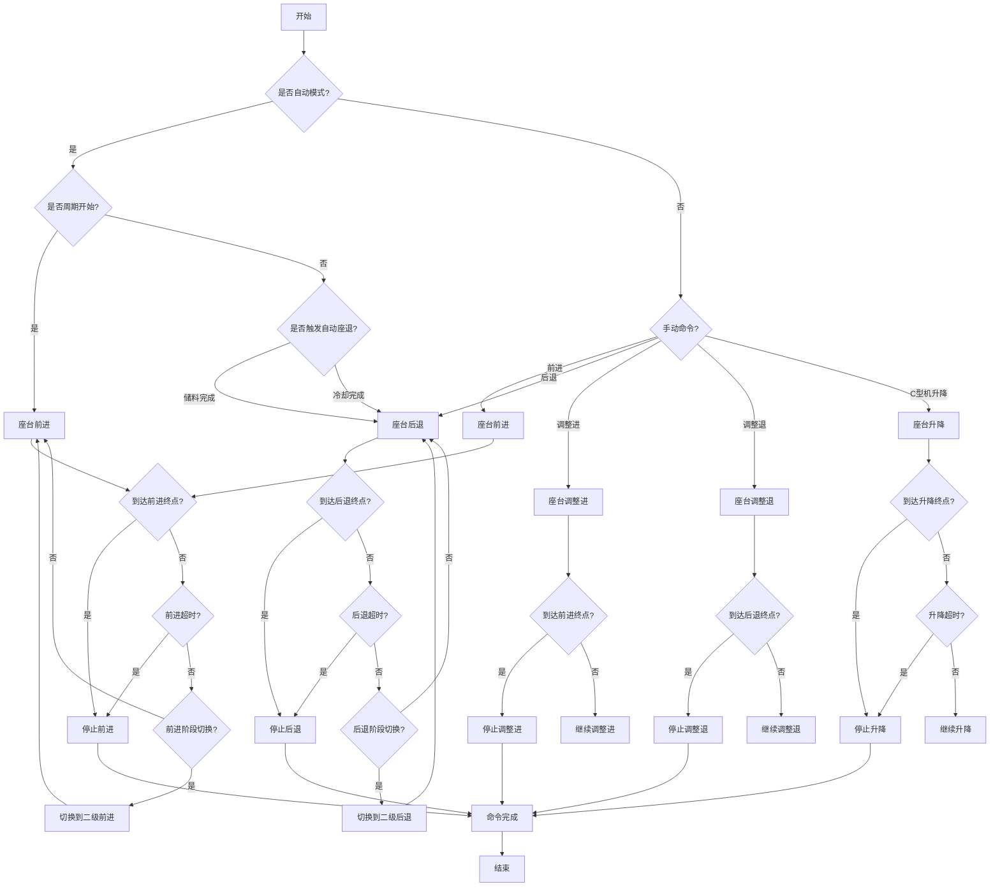

# 座台功能整理文档

## 1. 功能概述
座台功能是注塑机的重要组成部分，主要负责控制注射座的前进、后退以及调整，确保注射嘴能够准确地与模具浇口接触，实现塑料材料的注入。座台动作的精确控制对于注塑产品的质量和生产效率具有重要影响。

## 2. 参数配置与触摸屏映射

### 2.1 座台参数界面布局

座台参数设定页面主要包含以下参数区域：

#### 2.1.1 座台后退参数区
| 参数名称 | 单位 | 说明 | 默认值 | PLC变量名 | 触摸屏变量名 | 数据类型 |
|---------|------|------|--------|----------|------------|--------|
| 座台退二级压力 | bar | 座台后退二级动作的压力设定 | 35.0 | Ret2ndPressure | NozzleRet2ndPr | INT |
| 座台退二级流量 | % | 座台后退二级动作的流量设定 | 20.0 | Ret2ndFlow | NozzleRet2ndFl | INT |
| 座台退二级时间 | s | 座台后退二级动作的时间设定 | 1.00 | Ret2ndTime | NozzleRet2ndT | INT |
| 座台退一级压力 | bar | 座台后退一级动作的压力设定 | 45.0 | Ret1stPressure | NozzleRet1stPr | INT |
| 座台退一级流量 | % | 座台后退一级动作的流量设定 | 25.0 | Ret1stFlow | NozzleRet1stFl | INT |
| 座台退一级时间 | s | 座台后退一级动作的时间设定 | 1.00 | Ret1stTime | NozzleRet1stT | INT |

#### 2.1.2 座台前进参数区
| 参数名称 | 单位 | 说明 | 默认值 | PLC变量名 | 触摸屏变量名 | 数据类型 |
|---------|------|------|--------|----------|------------|--------|
| 座台进一级压力 | bar | 座台前进一级动作的压力设定 | 35.0 | Adv1stPressure | NozzleAdv1stPr | INT |
| 座台进一级流量 | % | 座台前进一级动作的流量设定 | 25.0 | Adv1stFlow | NozzleAdv1stFl | INT |
| 座台进一级时间 | s | 座台前进一级动作的时间设定 | 1.00 | Adv1stTime | NozzleAdv1stT | INT |
| 座台进二级压力 | bar | 座台前进二级动作的压力设定 | 45.0 | Adv2ndPressure | NozzleAdv2ndPr | INT |
| 座台进二级流量 | % | 座台前进二级动作的流量设定 | 30.0 | Adv2ndFlow | NozzleAdv2ndFl | INT |
| 座台进二级时间 | s | 座台前进二级动作的时间设定 | 1.00 | Adv2ndTime | NozzleAdv2ndT | INT |

#### 2.1.3 座台控制选项区
| 参数名称 | 选项 | 说明 | 默认值 | PLC变量名 | 触摸屏变量名 | 数据类型 |
|---------|------|------|--------|----------|------------|--------|
| 自动座退 | [不用] / [储料完] / [冷却完] | 自动座退触发条件选择 | 不用 | AutoRetType | AutoRetreatType | INT |
| 座台升降键 | [绞牙键] / [不用] | C型机座台升降功能选择 | 绞牙键 | NozzleLiftKeyType | NozzleLiftKeySelect | INT |

#### 2.1.4 座台调整参数区
| 参数名称 | 单位 | 说明 | 默认值 | PLC变量名 | 触摸屏变量名 | 数据类型 |
|---------|------|------|--------|----------|------------|--------|
| 座台调整进压力 | bar | 座台调整前进动作的压力设定 | 35.0 | AdjAdvPressure | NozzleAdjAdvPr | INT |
| 座台调整进流量 | % | 座台调整前进动作的流量设定 | 25.0 | AdjAdvFlow | NozzleAdjAdvFl | INT |
| 座台调整退压力 | bar | 座台调整后退动作的压力设定 | 30.0 | AdjRetPressure | NozzleAdjRetPr | INT |
| 座台调整退流量 | % | 座台调整后退动作的流量设定 | 20.0 | AdjRetFlow | NozzleAdjRetFl | INT |

#### 2.1.5 C型机座台升降参数区
| 参数名称 | 单位 | 说明 | 默认值 | PLC变量名 | 触摸屏变量名 | 数据类型 |
|---------|------|------|--------|----------|------------|--------|
| C型机座台升压力 | bar | C型机座台上升动作的压力设定 | 40.0 | CMachineLiftAdvPressure | CMachLiftAdvPr | INT |
| C型机座台升流量 | % | C型机座台上升动作的流量设定 | 35.0 | CMachineLiftAdvFlow | CMachLiftAdvFl | INT |
| C型机座台降压力 | bar | C型机座台下降动作的压力设定 | 40.0 | CMachineLiftRetPressure | CMachLiftRetPr | INT |
| C型机座台降流量 | % | C型机座台下降动作的流量设定 | 35.0 | CMachineLiftRetFlow | CMachLiftRetFl | INT |

#### 2.1.6 低压保护参数区
| 参数名称 | 单位 | 说明 | 默认值 | PLC变量名 | 触摸屏变量名 | 数据类型 |
|---------|------|------|--------|----------|------------|--------|
| 座台低压保护开启 | - | 是否开启座台低压保护 | 0 | LowPressureProtectEnable | NozzleLowPressProtEn | BOOL |
| 座台低压保护压力 | bar | 座台低压保护时的压力值 | 10.0 | LowPressureValue | NozzleLowPressVal | INT |
| 座台低压保护流量 | % | 座台低压保护时的流量值 | 25.0 | LowPressureFlow | NozzleLowPressFl | INT |
| 座台低压保护位置 | mm | 座台低压保护起始位置 | 100.0 | LowPressurePosition | NozzleLowPressPos | REAL |
| 座台低压保护时间 | s | 座台低压保护超时时间 | 5.00 | LowPressureTime | NozzleLowPressT | INT |
| 座台低压保护监控 | - | 座台低压保护监控状态 | 0 | LowPressureMonitor | NozzleLowPressMon | INT |

## 3. 操作流程

### 3.1 座台控制流程图



### 3.1 座台参数设定流程
1. 在触摸屏主界面，按[座台/托模]键进入座台设定页面
2. 解锁资料锁以允许参数修改
3. 使用光标键导航到需要修改的参数项
4. 输入新的参数值
5. 按[确认]键保存参数设置
6. 锁定资料锁以防止误操作

### 3.2 手动操作流程
1. 将机器切换到手动模式
2. 在主界面或功能键区，按[座台进]键，座台将前进
3. 按[座台退]键，座台将后退
4. 对于C型机，在调模状态下，按[绞牙进/退]键可控制座台上升/下降

### 3.3 自动操作流程
1. 将机器切换到半自动或全自动模式
2. 根据设定的[自动座退]选项，座台会在以下条件之一满足时自动后退：
   - [储料完]：储料完成后自动座退
   - [冷却完]：冷却完成后自动座退
   - [不用]：不进行自动座退，需要手动操作

### 3.4 低压保护操作说明
1. 确保低压保护参数已正确设定
2. 开启低压保护功能
3. 座台前进时，当到达低压保护位置时，系统自动切换到低压保护参数
4. 如果在低压保护时间内未到达前进终点，系统将报警并停止动作
5. 发生低压保护异常时，检查模具是否正确安装，注射嘴与浇口是否对准

## 4. 控制逻辑

### 4.1 座台动作状态流程图
```
开始 → 检查座台当前位置 → 根据命令执行相应动作 → 监控动作完成 → 结束
```

### 4.2 座台动作详细流程
1. 座台前进流程：
   - 接收座台前进命令
   - 检查座台是否在后退终点位置
   - 启动座台前进一级动作（压力、流量按设定值）
   - 到达指定位置或时间后，切换到座台前进二级动作
   - 到达前进终点位置或超时后，停止动作

2. 座台后退流程：
   - 接收座台后退命令
   - 检查座台是否在前进终点位置
   - 启动座台后退一级动作（压力、流量按设定值）
   - 到达指定位置或时间后，切换到座台后退二级动作
   - 到达后退终点位置或超时后，停止动作

3. 自动座退触发逻辑：
   - 检查[自动座退]参数设置
   - 如果设置为[储料完]，则在储料完成信号触发后执行座台后退
   - 如果设置为[冷却完]，则在冷却完成信号触发后执行座台后退
   - 如果设置为[不用]，则不执行自动座退

## 5. 参数调整建议

### 5.1 压力参数调整原则
- 座台前进一级压力：通常设定为较低值（20-40 bar），避免注射嘴快速接近模具时产生冲击
- 座台前进二级压力：根据模具要求设定（40-80 bar），确保注射嘴与模具紧密接触
- 座台后退压力：可适当提高（60-90 bar），以提高生产效率
- 调整进/退压力：应设定较低值（10-30 bar），便于精确调整位置
- C型机升降压力：根据座台重量调整（50-80 bar），确保升降平稳
- 低压保护压力：设定为较低值（5-25 bar），既能检测异常又不会损坏设备

### 5.2 流量参数调整原则
- 座台前进一级流量：设定为中等值（30-60%），控制初始前进速度
- 座台前进二级流量：可适当降低（20-40%），使注射嘴慢速接触模具
- 座台后退流量：可设定较高值（60-90%），提高生产效率
- 调整进/退流量：设定较低值（10-30%），便于精确调整
- C型机升降流量：根据速度要求调整（20-50%），确保平稳运行

### 5.3 位置参数调整原则
- 低压保护位置：设定在座台前进行程的前30-50%处
- 确保位置参数与实际机械行程相匹配
- 对于不同模具，可能需要调整低压保护位置

### 5.4 时间参数调整原则
- 座台前进一级时间：根据座台大小和速度调整（1-5秒）
- 座台前进二级时间：略大于实际动作时间（2-10秒）
- 座台后退时间：根据实际动作时间设定（1-8秒）
- 低压保护时间：设定为正常动作时间的1.5-2倍（3-15秒）

### 5.5 参数调整注意事项
- 调整参数时应逐步进行，避免参数变化过大
- 注意观察座台动作是否平稳，是否有异常噪声
- 确保座台前进终点时注射嘴与模具浇口对准
- 对于C型机，调整座台升降参数时应特别注意安全

## 6. PLC实现建议

### 6.1 功能块实现要求

#### 6.1.1 参数类型转换

- PLC内部使用INT类型存储参数值，触摸屏显示为实际值
- 压力、流量参数在MODBUS通信时需要进行以下转换：
  - 读取时：触摸屏值 = PLC值
  - 写入时：PLC值 = 触摸屏值

- 时间参数在MODBUS通信时需要进行以下转换：
  - 读取时：触摸屏显示值(秒) = PLC值
  - 写入时：PLC值 = 触摸屏显示值(秒)

- 位置参数在MODBUS通信时需要进行以下转换：
  - 读取时：触摸屏显示值(mm) = PLC值
  - 写入时：PLC值 = 触摸屏显示值(mm)

### 6.1 变量定义
```st
// 座台参数变量
NozzleRet2ndPressureParam : INT; // 座台退二级压力参数
NozzleRet2ndFlowParam : INT;     // 座台退二级流量参数
NozzleRet2ndTimeParam : INT;     // 座台退二级时间参数
NozzleRet1stPressureParam : INT; // 座台退一级压力参数
NozzleRet1stFlowParam : INT;     // 座台退一级流量参数
NozzleRet1stTimeParam : INT;     // 座台退一级时间参数
NozzleAdv1stPressureParam : INT; // 座台进一级压力参数
NozzleAdv1stFlowParam : INT;     // 座台进一级流量参数
NozzleAdv1stTimeParam : INT;     // 座台进一级时间参数
NozzleAdv2ndPressureParam : INT; // 座台进二级压力参数
NozzleAdv2ndFlowParam : INT;     // 座台进二级流量参数
NozzleAdv2ndTimeParam : INT;     // 座台进二级时间参数
AutoNozzleRet : INT;              // 自动座退选择参数
NozzleLiftKey : INT;              // 座台升降键选择参数
NozzleAdjAdvPressureParam : INT; // 座台调整进压力参数
NozzleAdjAdvFlowParam : INT;     // 座台调整进流量参数
NozzleAdjRetPressureParam : INT; // 座台调整退压力参数
NozzleAdjRetFlowParam : INT;     // 座台调整退流量参数
CMachineLiftAdvPressureParam : INT; // C型机座台升压力参数
CMachineLiftAdvFlowParam : INT;     // C型机座台升流量参数
CMachineLiftRetPressureParam : INT; // C型机座台降压力参数
CMachineLiftRetFlowParam : INT;     // C型机座台降流量参数

// 控制变量
NozzlePosition : REAL;          // 座台当前位置
NozzleAdvanceCmd : BOOL;        // 座台前进命令
NozzleRetreatCmd : BOOL;        // 座台后退命令
NozzleAdjustAdvCmd : BOOL;      // 座台调整进命令
NozzleAdjustRetCmd : BOOL;      // 座台调整退命令
CMachineLiftAdvCmd : BOOL;      // C型机座台升命令
CMachineLiftRetCmd : BOOL;      // C型机座台降命令

// 状态变量
NozzleAdvanceInProgress : BOOL; // 座台前进中
NozzleRetreatInProgress : BOOL; // 座台后退中
NozzleAdv1stStage : BOOL;       // 座台前进一级阶段
NozzleAdv2ndStage : BOOL;       // 座台前进二级阶段
NozzleRet1stStage : BOOL;       // 座台后退一级阶段
NozzleRet2ndStage : BOOL;       // 座台后退二级阶段
NozzleAtAdvEnd : BOOL;          // 座台在前进终点
NozzleAtRetEnd : BOOL;          // 座台在后退终点

// 输出信号
    NozzleAdvanceOut : BOOL;        // 座台前进输出
    NozzleRetreatOut : BOOL;        // 座台后退输出
    NozzlePressureOutput : INT;    // 座台压力输出
    NozzleFlowOutput : INT;        // 座台流量输出
    CMachineLiftAdvOut : BOOL;      // C型机座台升输出
    CMachineLiftRetOut : BOOL;      // C型机座台降输出
```

### 6.2 座台控制功能块设计

## 7. 注意事项

### 7.1 参数一致性
- PLC程序中的参数定义必须与触摸屏保持一致
- 参数名称、数据类型、地址分配必须一一对应
- 修改参数时，确保PLC程序和触摸屏程序同步更新

### 7.2 数据转换
- 压力、流量、位置、时间参数在MODBUS通信时需要注意数据格式
- 确保参数范围设置合理，避免溢出或无效值
- 参数写入时需要进行有效性检查

### 7.3 安全操作
- 在进行座台调整时，确保操作人员站在安全位置，避免被座台动作夹伤
- 座台前进时，确保注射嘴与模具浇口对准，避免损坏设备
- 对于C型机，在调整座台升降时，确保操作人员和设备安全

### 7.4 故障排除
- 如果座台动作异常，首先检查压力和流量参数是否合理
- 检查座台位置传感器是否正常工作
- 检查液压系统压力是否正常
- 对于C型机座台升降异常，检查调模状态是否正确激活
- 检查座台升降键选择参数是否设置为[绞牙键]
- 低压保护异常时，检查模具安装是否正确，注射嘴与浇口是否对准

### 7.5 超时处理
- 座台动作必须设置超时保护，防止设备长时间运行导致损坏
- 超时时间应根据实际动作时间合理设置
- 发生超时时，系统应发出报警并停止动作

### 7.6 互锁保护
- 座台前进和后退动作必须互锁，避免同时激活
- 座台动作与升降动作必须互锁，避免同时激活
- 在自动模式下，座台动作应与其他工艺动作协调

### 7.7 状态监控
- 系统应实时监控座台位置和状态
- 显示座台当前所在阶段（前进一级/二级、后退一级/二级等）
- 显示座台动作完成状态

## 8. 相关文档

- 01_注塑机控制系统概述文档.md
- 02_基本操作说明文档.md
- 03_射出功能整理文档.md
- 04_保压功能整理文档.md
- 05_储料清料功能整理文档.md
- 07_托模功能整理文档.md
- 08_调模功能整理文档.md
- 09_温度控制功能整理文档.md
- 10_液压系统控制文档.md
- 11_参数备份与恢复操作手册.md
```st
FUNCTION_BLOCK FB_NozzleControl
VAR_INPUT
    AutoMode : BOOL;           // 自动模式标志
    ManualMode : BOOL;         // 手动模式标志
    AdvanceCmd : BOOL;         // 前进命令
    RetreatCmd : BOOL;         // 后退命令
    AdjustAdvCmd : BOOL;       // 调整进命令
    AdjustRetCmd : BOOL;       // 调整退命令
    
    // C型机座台升降控制
    CMachineMode : BOOL;       // C型机模式标志
    MoldAdjustMode : BOOL;     // 调模状态标志
    CMachineLiftAdvCmd : BOOL; // C型机座台升命令
    CMachineLiftRetCmd : BOOL; // C型机座台降命令
    
    // 参数输入
    Ret2ndPressure : INT;     // 退二级压力
    Ret2ndFlow : INT;         // 退二级流量
    Ret2ndTime : INT;         // 退二级时间
    Ret1stPressure : INT;     // 退一级压力
    Ret1stFlow : INT;         // 退一级流量
    Ret1stTime : INT;         // 退一级时间
    Adv1stPressure : INT;     // 进一级压力
    Adv1stFlow : INT;         // 进一级流量
    Adv1stTime : INT;         // 进一级时间
    Adv2ndPressure : INT;     // 进二级压力
    Adv2ndFlow : INT;         // 进二级流量
    Adv2ndTime : INT;         // 进二级时间
    AdjAdvPressure : INT;     // 调整进压力
    AdjAdvFlow : INT;         // 调整进流量
    AdjRetPressure : INT;     // 调整退压力
    AdjRetFlow : INT;         // 调整退流量
    AutoRetType : INT;         // 自动座退类型
    NozzleLiftKeyType : INT;   // 座台升降键类型选择
    
    // C型机座台升降参数
    CMachineLiftAdvPressure : INT; // C型机座台升压力
    CMachineLiftAdvFlow : INT;     // C型机座台升流量
    CMachineLiftRetPressure : INT; // C型机座台降压力
    CMachineLiftRetFlow : INT;     // C型机座台降流量
    
    // 位置和状态输入
    CurrentPosition : REAL;    // 当前位置
    AtAdvEnd : BOOL;           // 在前进终点
    AtRetEnd : BOOL;           // 在后退终点
    AtLiftUpEnd : BOOL;        // 在上升终点
    AtLiftDownEnd : BOOL;      // 在下降终点
    ChargeComplete : BOOL;     // 储料完成
    CoolingComplete : BOOL;    // 冷却完成
    CycleStart : BOOL;         // 周期开始
END_VAR

VAR_OUTPUT
    AdvanceOut : BOOL;         // 前进输出
    RetreatOut : BOOL;         // 后退输出
    PressureOut : INT;        // 压力输出
    FlowOut : INT;            // 流量输出
    CMachineLiftAdvOut : BOOL; // C型机座台升输出
    CMachineLiftRetOut : BOOL; // C型机座台降输出
    
    // 状态输出
    AdvanceInProgress : BOOL;  // 前进中
    RetreatInProgress : BOOL;  // 后退中
    LiftInProgress : BOOL;     // 升降中
    LiftUpStage : BOOL;        // 上升阶段
    LiftDownStage : BOOL;      // 下降阶段
    Adv1stStage : BOOL;        // 前进一级阶段
    Adv2ndStage : BOOL;        // 前进二级阶段
    Ret1stStage : BOOL;        // 后退一级阶段
    Ret2ndStage : BOOL;        // 后退二级阶段
    CommandComplete : BOOL;    // 命令完成
END_VAR

VAR
    // 内部变量
    StageTimer : TON;          // 阶段计时器
    CommandTimer : TON;        // 命令计时器
    AutoRetTriggered : BOOL;   // 自动座退已触发
    CommandStart : BOOL;       // 命令开始标志
    LiftTimer : TON;           // 升降动作计时器
END_VAR

METHOD Execute : BOOL
    // 初始化输出
    CommandComplete := FALSE;
    
    // 处理自动模式下的座台控制
    IF AutoMode THEN
        // 周期开始时座台前进
        IF CycleStart AND NOT AdvanceInProgress AND NOT AtAdvEnd THEN
            StartAdvance();
        END_IF;
        
        // 处理自动座退
        HandleAutoRetreat();
    END_IF;
    
    // 处理手动模式下的座台控制
    IF ManualMode THEN
        // 处理C型机座台升降控制
        IF CMachineMode AND (NozzleLiftKeyType = 1) AND MoldAdjustMode THEN
            HandleCMachineLiftControl();
        ELSE
            // 标准座台动作控制
            HandleStandardNozzleControl();
        END_IF;
    END_IF;
    
    // 处理前进动作
    IF AdvanceInProgress THEN
        // 检查是否到达前进终点
        IF AtAdvEnd THEN
            StopMotion();
            CommandComplete := TRUE;
            RETURN TRUE;
        END_IF;
        
        // 处理前进阶段切换
        IF Adv1stStage THEN
            StageTimer(IN := TRUE, PT := T#1S * TO_REAL(Adv1stTime));
            IF StageTimer.Q THEN
                // 切换到二级前进
                Adv1stStage := FALSE;
                Adv2ndStage := TRUE;
                PressureOut := Adv2ndPressure;
                FlowOut := Adv2ndFlow;
                StageTimer(IN := FALSE);
            END_IF;
        ELSE
            // 二级前进计时
            StageTimer(IN := TRUE, PT := T#1S * TO_REAL(Adv2ndTime));
            IF StageTimer.Q THEN
                // 超时停止
                StopMotion();
                CommandComplete := TRUE;
                RETURN TRUE;
            END_IF;
        END_IF;
    
    // 处理后退动作
    IF RetreatInProgress THEN
        // 检查是否到达后退终点
        IF AtRetEnd THEN
            StopMotion();
            CommandComplete := TRUE;
            RETURN TRUE;
        END_IF;
        
        // 处理后退阶段切换
        IF Ret1stStage THEN
            StageTimer(IN := TRUE, PT := T#1S * TO_REAL(Ret1stTime));
            IF StageTimer.Q THEN
                // 切换到二级后退
                Ret1stStage := FALSE;
                Ret2ndStage := TRUE;
                PressureOut := Ret2ndPressure;
                FlowOut := Ret2ndFlow;
                StageTimer(IN := FALSE);
            END_IF;
        ELSE
            // 二级后退计时
            StageTimer(IN := TRUE, PT := T#1S * TO_REAL(Ret2ndTime));
            IF StageTimer.Q THEN
                // 超时停止
                StopMotion();
                CommandComplete := TRUE;
                RETURN TRUE;
            END_IF;
        END_IF;
    
    // 处理C型机座台升降动作
    IF LiftInProgress THEN
        // 处理上升动作
        IF LiftUpStage THEN
            // 检查是否到达上升终点
            IF AtLiftUpEnd THEN
                StopLiftMotion();
                CommandComplete := TRUE;
                RETURN TRUE;
            END_IF;
            
            // 上升动作超时检测
            LiftTimer(IN := TRUE, PT := T#5S); // 5秒超时保护
            IF LiftTimer.Q THEN
                StopLiftMotion();
                CommandComplete := TRUE;
                RETURN TRUE;
            END_IF;
        // 处理下降动作
        ELSEIF LiftDownStage THEN
            // 检查是否到达下降终点
            IF AtLiftDownEnd THEN
                StopLiftMotion();
                CommandComplete := TRUE;
                RETURN TRUE;
            END_IF;
            
            // 下降动作超时检测
            LiftTimer(IN := TRUE, PT := T#5S); // 5秒超时保护
            IF LiftTimer.Q THEN
                StopLiftMotion();
                CommandComplete := TRUE;
                RETURN TRUE;
            END_IF;
        END_IF;
    END_IF;
    
    RETURN FALSE;
END_METHOD

METHOD HandleStandardNozzleControl : BOOL
    // 手动前进命令
    IF AdvanceCmd AND NOT AtAdvEnd AND NOT LiftInProgress THEN
        IF NOT AdvanceInProgress THEN
            StartAdvance();
        END_IF;
    ELSE
        // 手动调整进命令
        IF AdjustAdvCmd AND NOT AtAdvEnd AND NOT LiftInProgress THEN
            AdvanceOut := TRUE;
            RetreatOut := FALSE;
            PressureOut := AdjAdvPressure;
            FlowOut := AdjAdvFlow;
            AdvanceInProgress := TRUE;
        ELSE
            // 手动后退命令
            IF RetreatCmd AND NOT AtRetEnd AND NOT LiftInProgress THEN
                IF NOT RetreatInProgress THEN
                    StartRetreat();
                END_IF;
            ELSE
                // 手动调整退命令
                IF AdjustRetCmd AND NOT AtRetEnd AND NOT LiftInProgress THEN
                    AdvanceOut := FALSE;
                    RetreatOut := TRUE;
                    PressureOut := AdjRetPressure;
                    FlowOut := AdjRetFlow;
                    RetreatInProgress := TRUE;
                ELSE
                    // 无命令时停止
                    IF (NOT AdvanceCmd AND NOT AdjustAdvCmd AND AdvanceInProgress) OR \
                       (NOT RetreatCmd AND NOT AdjustRetCmd AND RetreatInProgress) THEN
                        StopMotion();
                    END_IF;
                END_IF;
            END_IF;
        END_IF;
    END_IF;
    RETURN TRUE;
END_METHOD

METHOD HandleCMachineLiftControl : BOOL
    // 优先处理升降命令，升降与前进后退互锁
    IF CMachineLiftAdvCmd AND NOT AtLiftUpEnd AND NOT AdvanceInProgress AND NOT RetreatInProgress THEN
        IF NOT LiftInProgress THEN
            StartLiftUp();
        END_IF;
    ELSEIF CMachineLiftRetCmd AND NOT AtLiftDownEnd AND NOT AdvanceInProgress AND NOT RetreatInProgress THEN
        IF NOT LiftInProgress THEN
            StartLiftDown();
        END_IF;
    ELSE
        // 无升降命令时，允许标准座台动作
        HandleStandardNozzleControl();
        
        // 如果没有标准座台动作命令，则停止升降
        IF NOT LiftInProgress AND NOT AdvanceCmd AND NOT RetreatCmd AND NOT AdjustAdvCmd AND NOT AdjustRetCmd THEN
            StopLiftMotion();
        END_IF;
    END_IF;
    RETURN TRUE;
END_METHOD

METHOD StartLiftUp : BOOL
    // 停止座台动作
    AdvanceOut := FALSE;
    RetreatOut := FALSE;
    PressureOut := 0;
    FlowOut := 0;
    
    // 启动上升动作
    CMachineLiftAdvOut := TRUE;
    CMachineLiftRetOut := FALSE;
    
    // 更新状态
    AdvanceInProgress := FALSE;
    RetreatInProgress := FALSE;
    LiftInProgress := TRUE;
    LiftUpStage := TRUE;
    LiftDownStage := FALSE;
    
    // 重置计时器
    StageTimer(IN := FALSE);
    CommandTimer(IN := FALSE);
    LiftTimer(IN := FALSE);
    
    RETURN TRUE;
END_METHOD

METHOD StartLiftDown : BOOL
    // 停止座台动作
    AdvanceOut := FALSE;
    RetreatOut := FALSE;
    PressureOut := 0;
    FlowOut := 0;
    
    // 启动下降动作
    CMachineLiftAdvOut := FALSE;
    CMachineLiftRetOut := TRUE;
    
    // 更新状态
    AdvanceInProgress := FALSE;
    RetreatInProgress := FALSE;
    LiftInProgress := TRUE;
    LiftUpStage := FALSE;
    LiftDownStage := TRUE;
    
    // 重置计时器
    StageTimer(IN := FALSE);
    CommandTimer(IN := FALSE);
    LiftTimer(IN := FALSE);
    
    RETURN TRUE;
END_METHOD

METHOD StopLiftMotion : BOOL
    CMachineLiftAdvOut := FALSE;
    CMachineLiftRetOut := FALSE;
    LiftInProgress := FALSE;
    LiftUpStage := FALSE;
    LiftDownStage := FALSE;
    LiftTimer(IN := FALSE);
    RETURN TRUE;
END_METHOD

METHOD StartAdvance : BOOL
    AdvanceOut := TRUE;
    RetreatOut := FALSE;
    PressureOut := Adv1stPressure;
    FlowOut := Adv1stFlow;
    AdvanceInProgress := TRUE;
    RetreatInProgress := FALSE;
    Adv1stStage := TRUE;
    Adv2ndStage := FALSE;
    Ret1stStage := FALSE;
    Ret2ndStage := FALSE;
    StageTimer(IN := FALSE);
    CommandTimer(IN := FALSE);
    RETURN TRUE;
END_METHOD

METHOD StartRetreat : BOOL
    AdvanceOut := FALSE;
    RetreatOut := TRUE;
    PressureOut := Ret1stPressure;
    FlowOut := Ret1stFlow;
    AdvanceInProgress := FALSE;
    RetreatInProgress := TRUE;
    Adv1stStage := FALSE;
    Adv2ndStage := FALSE;
    Ret1stStage := TRUE;
    Ret2ndStage := FALSE;
    StageTimer(IN := FALSE);
    CommandTimer(IN := FALSE);
    RETURN TRUE;
END_METHOD

METHOD StopMotion : BOOL
    AdvanceOut := FALSE;
    RetreatOut := FALSE;
    PressureOut := 0;
    FlowOut := 0;
    AdvanceInProgress := FALSE;
    RetreatInProgress := FALSE;
    Adv1stStage := FALSE;
    Adv2ndStage := FALSE;
    Ret1stStage := FALSE;
    Ret2ndStage := FALSE;
    StageTimer(IN := FALSE);
    CommandTimer(IN := FALSE);
    
    // 如果正在升降，同时停止升降
    IF LiftInProgress THEN
        StopLiftMotion();
    END_IF;
    
    RETURN TRUE;
END_METHOD

METHOD HandleAutoRetreat : BOOL
    // 检查自动座退类型并触发
    CASE AutoRetType OF
        1: // 储料完
            IF ChargeComplete AND NOT AutoRetTriggered AND AtAdvEnd THEN
                StartRetreat();
                AutoRetTriggered := TRUE;
            END_IF;
        2: // 冷却完
            IF CoolingComplete AND NOT AutoRetTriggered AND AtAdvEnd THEN
                StartRetreat();
                AutoRetTriggered := TRUE;
            END_IF;
    END_CASE;
    
    // 重置自动座退触发标志
    IF CycleStart THEN
        AutoRetTriggered := FALSE;
    END_IF;
    
    RETURN TRUE;
END_METHOD
END_FUNCTION_BLOCK

// C型机座台升降专用功能块
FUNCTION_BLOCK FB_CMachineLiftControl
VAR_INPUT
    Enable : BOOL;             // 功能块使能
    CMachineMode : BOOL;       // C型机模式标志
    MoldAdjustMode : BOOL;     // 调模状态标志
    LiftKeyType : INT;         // 升降键类型
    LiftUpCmd : BOOL;          // 上升命令
    LiftDownCmd : BOOL;        // 下降命令
    
    // 参数输入
    LiftUpPressure : INT;      // 上升压力
    LiftUpFlow : INT;          // 上升流量
    LiftDownPressure : INT;    // 下降压力
    LiftDownFlow : INT;        // 下降流量
    
    // 位置输入
    AtUpEnd : BOOL;            // 上升终点
    AtDownEnd : BOOL;          // 下降终点
END_VAR

VAR_OUTPUT
    LiftUpOut : BOOL;          // 上升输出
    LiftDownOut : BOOL;        // 下降输出
    PressureOut : INT;         // 压力输出
    FlowOut : INT;             // 流量输出
    LiftInProgress : BOOL;     // 升降动作中
    Error : BOOL;              // 错误标志
END_VAR

VAR
    Timer : TON;               // 超时计时器
    OperationEnabled : BOOL;   // 操作使能
END_VAR

METHOD Execute : BOOL
    // 初始化输出
    Error := FALSE;
    
    // 检查操作条件
    OperationEnabled := Enable AND CMachineMode AND (LiftKeyType = 1) AND MoldAdjustMode;
    
    IF OperationEnabled THEN
        // 处理上升命令
        IF LiftUpCmd AND NOT AtUpEnd THEN
            LiftUpOut := TRUE;
            LiftDownOut := FALSE;
            PressureOut := LiftUpPressure;
            FlowOut := LiftUpFlow;
            LiftInProgress := TRUE;
            
            // 启动超时保护
            Timer(IN := TRUE, PT := T#1S * TO_REAL(10));
        
            IF Timer.Q THEN
                Error := TRUE;
                Stop();
            END_IF;
        // 处理下降命令
        ELSIF LiftDownCmd AND NOT AtDownEnd THEN
            LiftUpOut := FALSE;
            LiftDownOut := TRUE;
            PressureOut := LiftDownPressure;
            FlowOut := LiftDownFlow;
            LiftInProgress := TRUE;
            
            // 启动超时保护
            Timer(IN := TRUE, PT := T#1S * TO_REAL(10));
            IF Timer.Q THEN
                Error := TRUE;
                Stop();
            END_IF;
        ELSE
            // 到达终点或无命令时停止
            IF (AtUpEnd AND LiftInProgress) OR (AtDownEnd AND LiftInProgress) OR \
               (NOT LiftUpCmd AND NOT LiftDownCmd AND LiftInProgress) THEN
                Stop();
            END_IF;
        END_IF;
    ELSE
        // 功能块未使能时停止所有输出
        Stop();
    END_IF;
    
    RETURN LiftInProgress;
END_METHOD

METHOD Stop : BOOL
    LiftUpOut := FALSE;
    LiftDownOut := FALSE;
    PressureOut := 0;
    FlowOut := 0;
    LiftInProgress := FALSE;
    Timer(IN := FALSE);
    RETURN TRUE;
END_METHOD
END_FUNCTION_BLOCK
```

## 7. 注意事项

### 7.1 安全操作
- 在进行座台调整时，确保操作人员站在安全位置，避免被座台动作夹伤
- 座台前进时，确保注射嘴与模具浇口对准，避免损坏设备

### 7.2 参数一致性
- 座台前进和后退的压力、流量参数需要根据实际情况进行合理匹配
- 调整参数时应逐步进行，避免参数变化过大导致设备运行不稳定

### 7.3 故障排除
- 如果座台动作异常，首先检查压力和流量参数是否合理
- 检查座台位置传感器是否正常工作
- 检查液压系统压力是否正常
- 对于C型机座台升降异常，检查调模状态是否正确激活
- 检查座台升降键选择参数是否设置为[绞牙键]

### 7.4 维护保养
- 定期检查座台导轨和丝杠的润滑情况
- 检查座台驱动系统的紧固螺栓是否松动
- 定期校准座台位置传感器
- 对于C型机，定期检查座台升降机构的机械部件和液压系统
- 确保座台升降终点限位开关正常工作

## 8. 优化建议

### 8.1 控制优化
- 考虑采用闭环控制算法，提高座台定位精度
- 增加座台速度曲线控制，实现平滑加减速

### 8.2 功能扩展
- 增加座台位置记忆功能，方便快速切换不同模具
- 添加座台碰撞检测功能，提高操作安全性

### 8.3 诊断功能
- 增加座台动作时间监控，及时发现异常情况
- 添加座台压力曲线分析功能，优化工艺参数