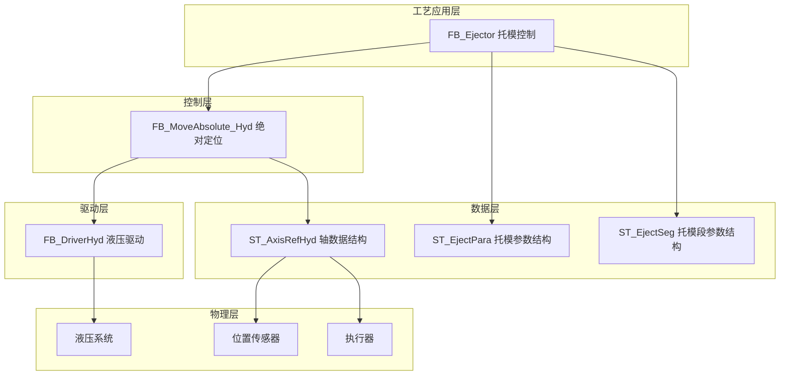
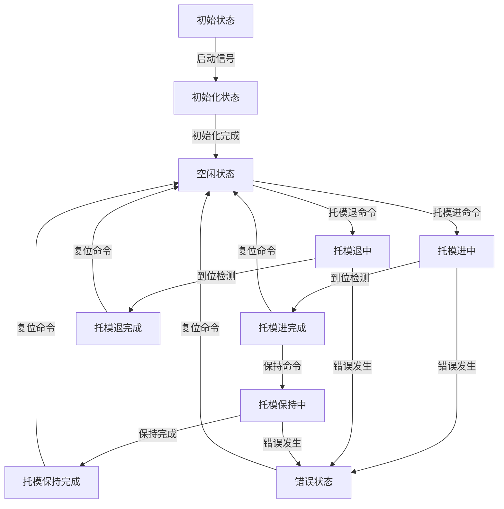
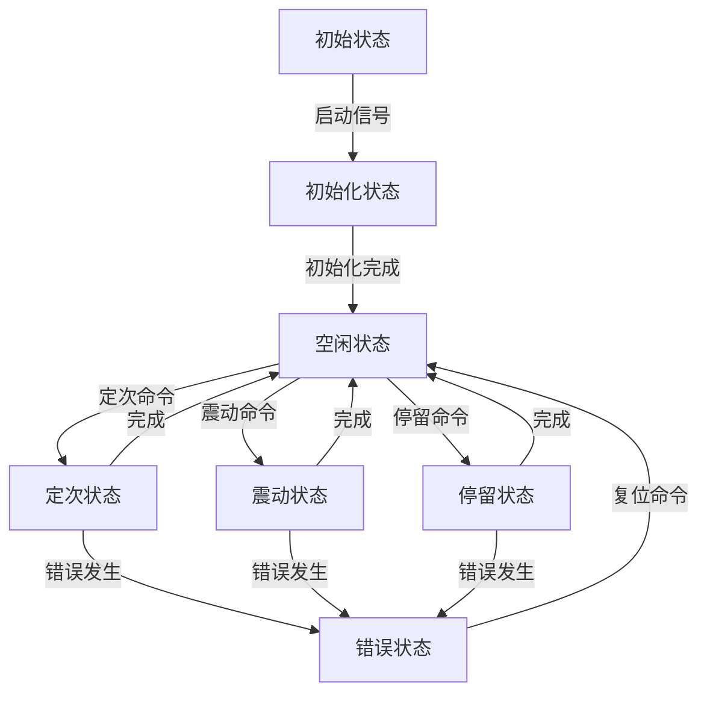
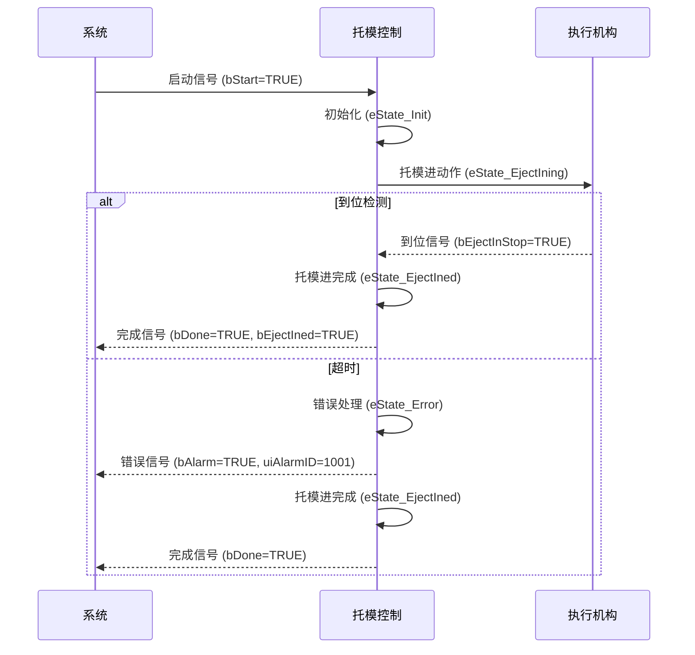
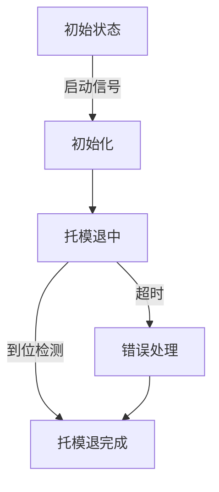
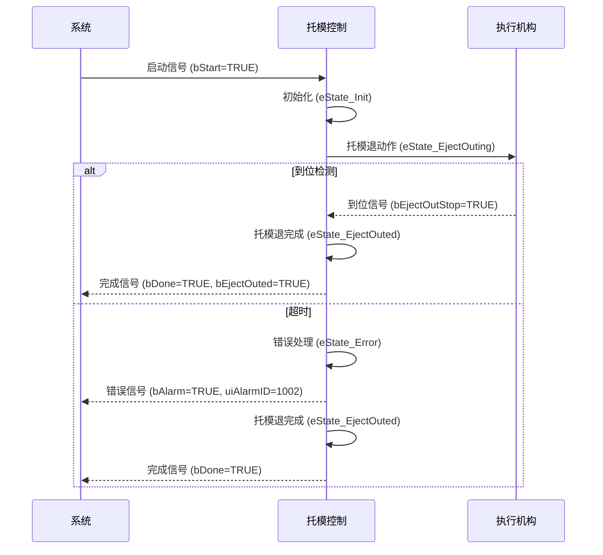

# 注塑机托模功能技术文档

## 1. 概述

### 1.1 功能简介

托模功能是注塑机的重要辅助功能，主要负责控制模具顶针的前进和后退动作，实现制品的脱模。该功能通过精确控制压力、流量和位置参数，确保托模动作平稳、安全且高效，为制品顺利脱模提供保障。

### 1.2 工艺特点

- **双向动作**：支持托模前进（托进）和后退（托退）两个方向的动作控制
- **循环控制**：支持多次托模循环，可根据制品特性设置托模次数
- **多段控制**：支持3段托模进和3段托模退控制
- **多种停止方式**：支持时间、行程、位置三种停止方式
- **安全机制**：包含超时保护、状态互锁等多重安全保障
- **平台兼容性**：支持Luban平台（基于Beremiz二次开发）运行，采用标准IEC 61131-3 ST语法实现
- **参数控制**：支持压力、速度、时间、位置、斜率等多种控制参数

### 1.3 技术架构

本功能采用分层架构设计，参考研发部提供的液压系统建模方案，结合倍福TF8560塑料技术功能标准，实现模块化、标准化设计。



---

## 2. 核心控制机制

### 2.1 状态管理机制

托模功能采用分层状态机管理，包括基本托模动作状态机和托模模式状态机：

#### 2.1.1 基本托模动作状态机 (E_EjectState)



#### 2.1.2 托模模式状态机 (E_EjectModeState)



### 2.2 控制命令机制

托模功能支持四种控制命令：

| 命令       | 说明     | 响应               |
| ---------- | -------- | ------------------ |
| `bStart` | 启动命令 | 启动托模动作       |
| `bStop`  | 停止命令 | 有减速停           |
| `bEStop` | 急停命令 | 立即停止，无减速停 |
| `bReset` | 复位命令 | 重置错误状态       |

### 2.3 模式选择机制

托模功能支持五种模式：

| 模式       | 值 | 说明           |
| ---------- | -- | -------------- |
| 无模式     | 0  | 不执行任何动作 |
| 定次模式   | 1  | 执行定次动作   |
| 震动模式   | 2  | 执行震动动作   |
| 停留模式   | 3  | 执行停留动作   |

> 说明：基本托模进和托模退动作通过独立的功能块控制，不在模式选择范围内

---

## 3. 功能阶段定义

### 3.1 托模进功能阶段

| 阶段编号 | 阶段名称   | 主要功能             | 控制参数         | 阶段转换条件   |
| -------- | ---------- | -------------------- | ---------------- | -------------- |
| 1        | 初始化     | 初始化参数，准备动作 | 无               | 启动信号触发   |
| 2        | 托模进中   | 执行托模进动作       | 压力、速度、位置 | 到位检测或超时 |
| 3        | 托模进完成 | 保持完成状态         | 无               | 到位检测或超时 |

### 3.2 托模退功能阶段

| 阶段编号 | 阶段名称   | 主要功能             | 控制参数         | 阶段转换条件   |
| -------- | ---------- | -------------------- | ---------------- | -------------- |
| 1        | 初始化     | 初始化参数，准备动作 | 无               | 启动信号触发   |
| 2        | 托模退中   | 执行托模退动作       | 压力、速度、位置 | 到位检测或超时 |
| 3        | 托模退完成 | 保持完成状态         | 无               | 到位检测或超时 |

### 3.3 托模保持功能阶段

| 阶段编号 | 阶段名称   | 主要功能             | 控制参数         | 阶段转换条件   |
| -------- | ---------- | -------------------- | ---------------- | -------------- |
| 1        | 初始化     | 初始化参数，准备动作 | 无               | 保持命令触发   |
| 2        | 托模保持中 | 执行托模保持动作     | 压力、时间       | 时间达到设定值 |
| 3        | 托模保持完成 | 保持完成状态         | 无               | 时间达到设定值 |

---

## 4. 控制流程

### 4.1 托模进过程流程

#### 4.1.1 托模进流程示意图


#### 4.1.2 托模进流程序列图



### 4.2 托模退过程流程

#### 4.2.1 托模退流程示意图



#### 4.2.2 托模退流程序列图



> ⚠️ **重要说明**：
>
> 1. 托模动作必须在开模完成后执行，避免与开模动作干涉
> 2. 托模循环次数可通过uiEjectTimes参数设定

---

## 5. 数据结构与功能块

### 5.1 核心数据结构

#### 5.1.1 E_EjectState 枚举类型

**用途**：定义基本托模动作的状态机状态

| 值 | 名称              | 说明         |
| -- | ----------------- | ------------ |
| 0  | eState_Idle       | 空闲状态     |
| 1  | eState_Init       | 初始化       |
| 2  | eState_EjectIning | 托模进中     |
| 3  | eState_EjectIned  | 托模进完成   |
| 4  | eState_EjectKeeping | 托模保持中   |
| 5  | eState_EjectKept  | 托模保持完成 |
| 6  | eState_EjectOuting | 托模退中     |
| 7  | eState_EjectOuted | 托模退完成   |
| 8  | eState_Error      | 错误状态     |

#### 5.1.2 E_EjectModeState 枚举类型

**用途**：定义托模模式的状态机状态

| 值 | 名称              | 说明         |
| -- | ----------------- | ------------ |
| 0  | eState_Idle       | 空闲状态     |
| 1  | eState_Init       | 初始化       |
| 2  | eState_EjectCount | 定次         |
| 3  | eState_EjectVibra | 震动         |
| 4  | eState_EjectHold  | 停留         |
| 5  | eState_Error      | 错误状态     |

#### 5.1.2 ST_EjectSeg 结构体

**用途**：定义托模单段工艺参数

| 字段名      | 类型 | 有效范围 | 初始值 | 说明         |
| ----------- | ---- | -------- | ------ | ------------ |
| `uiPres`  | UINT | 0-1000   | 0      | 设定压力     |
| `uiSpd`   | UINT | 0-1000   | 0      | 设定速度     |
| `udiPos`  | UDINT | 0-4294967295 | 0    | 设定位置     |
| `uiTime`  | UINT | 0-65535  | 0      | 设定时间     |
| `uiPresGrad` | UINT | 0-1000 | 0      | 设定压力斜率 |
| `uiSpdGrad`  | UINT | 0-1000 | 0      | 设定速度斜率 |

#### 5.1.3 ST_EjectPara 结构体

**用途**：定义托模完整工艺参数

| 字段名                     | 类型       | 有效范围     | 初始值 | 说明                                  |
| -------------------------- | ---------- | ------------ | ------ | ------------------------------------- |
| `uiEjectInSegCnt`        | UINT       | 1-3          | 0      | 托模进段数选择                        |
| `uiEjectInMode`          | UINT       | 0-2          | 0      | 托模进方式选择 (0:时间 1:行程 2:位置) |
| `uiEjectInLimitTime`     | UINT       | 0-65535      | 0      | 托模进限制时间                        |
| `aEjectInSeg`            | ARRAY[1..3] OF ST_EjectSeg | -    | -      | 托模进多段设定参数                    |
| `uiEjectInPresStartGrad` | UINT       | 0-1000       | 0      | 压力启动斜率                          |
| `uiEjectInPresStopGrad`  | UINT       | 0-1000       | 0      | 压力停止斜率                          |
| `uiEjectInSpdStartGrad`  | UINT       | 0-1000       | 0      | 速度启动斜率                          |
| `uiEjectInSpdStopGrad`   | UINT       | 0-1000       | 0      | 速度停止斜率                          |
| `stEjectKeepSeg`         | ST_EjectSeg | -            | -      | 托模保持设定参数                      |
| `uiEjectOutSegCnt`       | UINT       | 1-3          | 0      | 托模退段数选择                        |
| `uiEjectOutMode`         | UINT       | 0-2          | 0      | 托模退方式选择 (0:时间 1:行程 2:位置) |
| `uiEjectOutLimitTime`    | UINT       | 0-65535      | 0      | 托模退限制时间                        |
| `aEjectOutSeg`           | ARRAY[1..3] OF ST_EjectSeg | -    | -      | 托模退多段设定参数                    |
| `uiEjectOutPresStartGrad` | UINT      | 0-1000       | 0      | 压力启动斜率                          |
| `uiEjectOutPresStopGrad`  | UINT      | 0-1000       | 0      | 压力停止斜率                          |
| `uiEjectOutSpdStartGrad`  | UINT      | 0-1000       | 0      | 速度启动斜率                          |
| `uiEjectOutSpdStopGrad`   | UINT      | 0-1000       | 0      | 速度停止斜率                          |

### 5.2 功能块定义

#### 5.2.1 FB_Eject 功能块

**用途**：基本托模动作控制功能块，负责托模进、托模退和保持动作

**输入输出参数**：

| 参数名         | 类型          | 说明       |
| -------------- | ------------- | ---------- |
| `stEjectAxis` | ST_AxisRefHyd | 轴数据结构 |

**输入参数**：

| 参数名           | 类型        | 有效范围   | 初始值 | 说明                                          |
| ---------------- | ----------- | ---------- | ------ | --------------------------------------------- |
| `bStart`       | BOOL        | FALSE,TRUE | FALSE  | 启动                                          |
| `bStop`        | BOOL        | FALSE,TRUE | FALSE  | 停止(有减速停)                                |
| `bEStop`       | BOOL        | FALSE,TRUE | FALSE  | 急停(立即停止，无减速停)                      |
| `bReset`       | BOOL        | FALSE,TRUE | FALSE  | 复位                                          |
| `uiEjectMode`  | UINT        | 0-2        | 0      | 托模模式 (0:无模式 1:托模进模式 2:托模退模式) |
| `stEjectPara`  | ST_EjectPara | -          | -      | 上位机设定参数                                |
| `bEjectInStop` | BOOL        | FALSE,TRUE | FALSE  | 托模进停止                                    |
| `bEjectOutStop` | BOOL       | FALSE,TRUE | FALSE  | 托模退停止                                    |
| `udiEjectElecRulerVal` | UDINT | 0-4294967295 | 0 | 托模电子尺值 |

**输出参数**：

| 参数名         | 类型  | 有效范围     | 初始值 | 说明             |
| -------------- | ----- | ------------ | ------ | ---------------- |
| `bBusy`      | BOOL  | FALSE,TRUE   | FALSE  | 忙状态           |
| `bDone`      | BOOL  | FALSE,TRUE   | FALSE  | 完成状态         |
| `bAlarm`     | BOOL  | FALSE,TRUE   | FALSE  | 报警状态         |
| `uiAlarmID`  | UINT  | 0-65535      | 0      | 报警代码         |
| `uiActHint`  | UINT  | 0-65535      | 0      | 当前动作状态     |
| `uiActTime`  | UINT  | 0-65535      | 0      | 当前动作运行时间 |
| `bEjectIned` | BOOL  | FALSE,TRUE   | FALSE  | 托模进完成       |
| `bEjectOuted` | BOOL  | FALSE,TRUE   | FALSE  | 托模退完成       |
| `uiPresCmd`  | UINT  | 0-1000       | 0      | 压力命令输出     |
| `uiSpdCmd`   | UINT  | 0-1000       | 0      | 速度命令输出     |
| `udiPosCmd`  | UDINT | 0-4294967295 | 0      | 位置命令输出     |

#### 5.2.2 FB_EjectMode 功能块

**用途**：托模模式控制功能块，负责定次、震动和停留模式

**输入输出参数**：

| 参数名         | 类型          | 说明       |
| -------------- | ------------- | ---------- |
| `stEjectAxis` | ST_AxisRefHyd | 轴数据结构 |

**输入参数**：

| 参数名           | 类型        | 有效范围   | 初始值 | 说明                                          |
| ---------------- | ----------- | ---------- | ------ | --------------------------------------------- |
| `bStart`       | BOOL        | FALSE,TRUE | FALSE  | 启动                                          |
| `bStop`        | BOOL        | FALSE,TRUE | FALSE  | 停止(有减速停)                                |
| `bEStop`       | BOOL        | FALSE,TRUE | FALSE  | 急停(立即停止，无减速停)                      |
| `bReset`       | BOOL        | FALSE,TRUE | FALSE  | 复位                                          |
| `uiEjectMode`  | UINT        | 0-3        | 0      | 托模模式 (0:无模式 1:定次模式 2:震动模式 3:停留模式) |
| `uiEjectTimes` | UINT        | 0-65535    | 0      | 托模次数                                      |
| `stEjectPara`  | ST_EjectPara | -          | -      | 上位机设定参数                                |
| `bEjectInStop` | BOOL        | FALSE,TRUE | FALSE  | 托模进停止                                    |
| `bEjectOutStop` | BOOL       | FALSE,TRUE | FALSE  | 托模退停止                                    |
| `udiEjectElecRulerVal` | UDINT | 0-4294967295 | 0 | 托模电子尺值 |

**输出参数**：

| 参数名         | 类型  | 有效范围     | 初始值 | 说明             |
| -------------- | ----- | ------------ | ------ | ---------------- |
| `bBusy`      | BOOL  | FALSE,TRUE   | FALSE  | 忙状态           |
| `bDone`      | BOOL  | FALSE,TRUE   | FALSE  | 完成状态         |
| `bAlarm`     | BOOL  | FALSE,TRUE   | FALSE  | 报警状态         |
| `uiAlarmID`  | UINT  | 0-65535      | 0      | 报警代码         |
| `uiActHint`  | UINT  | 0-65535      | 0      | 当前动作状态     |
| `uiActTime`  | UINT  | 0-65535      | 0      | 当前动作运行时间 |
| `bEjectIned` | BOOL  | FALSE,TRUE   | FALSE  | 托模进完成       |
| `bEjectOuted` | BOOL  | FALSE,TRUE   | FALSE  | 托模退完成       |
| `uiPresCmd`  | UINT  | 0-1000       | 0      | 压力命令输出     |
| `uiSpdCmd`   | UINT  | 0-1000       | 0      | 速度命令输出     |
| `udiPosCmd`  | UDINT | 0-4294967295 | 0      | 位置命令输出     |

---

## 6. 核心参数说明

### 6.1 托模进关键参数

| 参数类别 | 参数名称       | 程序变量名            | 功能说明                                        |
| -------- | -------------- | --------------------- | ----------------------------------------------- |
| 段数参数 | 托模进段数     | uiEjectInSegCnt       | 设定托模进的段数 (1-3段)                        |
| 控制参数 | 托模进方式     | uiEjectInMode         | 设定托模进停止的触发方式 (0:时间 1:行程 2:位置) |
| 时间参数 | 托模进限制时间 | uiEjectInLimitTime    | 托模进动作的时间限制                            |
| 工艺参数 | 托模进压力     | aEjectInSeg[1..3].uiPres | 托模进动作的压力设定 (3段)                    |
| 工艺参数 | 托模进速度     | aEjectInSeg[1..3].uiSpd | 托模进动作的速度设定 (3段)                    |
| 工艺参数 | 托模进位置     | aEjectInSeg[1..3].udiPos | 托模进动作的位置设定 (3段)                  |
| 工艺参数 | 托模进时间     | aEjectInSeg[1..3].uiTime | 托模进动作的时间设定 (3段)                  |
| 斜率参数 | 压力启动斜率   | uiEjectInPresStartGrad | 托模进压力的启动斜率                          |
| 斜率参数 | 压力停止斜率   | uiEjectInPresStopGrad  | 托模进压力的停止斜率                          |
| 斜率参数 | 速度启动斜率   | uiEjectInSpdStartGrad  | 托模进速度的启动斜率                          |
| 斜率参数 | 速度停止斜率   | uiEjectInSpdStopGrad   | 托模进速度的停止斜率                          |

### 6.2 托模模式关键参数

| 参数类别 | 参数名称       | 程序变量名            | 功能说明                                        |
| -------- | -------------- | --------------------- | ----------------------------------------------- |
| 基本参数 | 托模次数       | uiEjectTimes          | 设定托模的循环次数 (仅在定次模式下有效)        |

### 6.3 托模退关键参数

| 参数类别 | 参数名称       | 程序变量名             | 功能说明                                        |
| -------- | -------------- | ---------------------- | ----------------------------------------------- |
| 段数参数 | 托模退段数     | uiEjectOutSegCnt       | 设定托模退的段数 (1-3段)                       |
| 控制参数 | 托模退方式     | uiEjectOutMode         | 设定托模退停止的触发方式 (0:时间 1:行程 2:位置) |
| 时间参数 | 托模退限制时间 | uiEjectOutLimitTime    | 托模退动作的时间限制                            |
| 工艺参数 | 托模退压力     | aEjectOutSeg[1..3].uiPres | 托模退动作的压力设定 (3段)                   |
| 工艺参数 | 托模退速度     | aEjectOutSeg[1..3].uiSpd | 托模退动作的速度设定 (3段)                   |
| 工艺参数 | 托模退位置     | aEjectOutSeg[1..3].udiPos | 托模退动作的位置设定 (3段)                 |
| 工艺参数 | 托模退时间     | aEjectOutSeg[1..3].uiTime | 托模退动作的时间设定 (3段)                 |
| 斜率参数 | 压力启动斜率   | uiEjectOutPresStartGrad | 托模退压力的启动斜率                          |
| 斜率参数 | 压力停止斜率   | uiEjectOutPresStopGrad  | 托模退压力的停止斜率                          |
| 斜率参数 | 速度启动斜率   | uiEjectOutSpdStartGrad  | 托模退速度的启动斜率                          |
| 斜率参数 | 速度停止斜率   | uiEjectOutSpdStopGrad   | 托模退速度的停止斜率                          |

### 6.3 托模保持关键参数

| 参数类别 | 参数名称       | 程序变量名            | 功能说明                                        |
| -------- | -------------- | --------------------- | ----------------------------------------------- |
| 工艺参数 | 托模保持压力   | stEjectKeepSeg.uiPres | 托模保持动作的压力设定                          |
| 工艺参数 | 托模保持速度   | stEjectKeepSeg.uiSpd  | 托模保持动作的速度设定                          |
| 工艺参数 | 托模保持位置   | stEjectKeepSeg.udiPos | 托模保持动作的位置设定                          |
| 工艺参数 | 托模保持时间   | stEjectKeepSeg.uiTime | 托模保持动作的时间设定                          |

> ⚠️ **重要说明**：
>
> 1. 所有参数均使用无符号整数类型存储，符合PLC编程规范
> 2. 实际使用时，需要根据硬件特性和工艺要求进行适当的参数调整

---

## 7. 功能块实现

### 7.1 FB_Eject 实现详解

#### 7.1.1 核心逻辑

1. **状态管理**：使用 `E_EjectState` 枚举类型管理基本托模动作的各种状态
2. **模式控制**：根据 `uiEjectMode` 参数选择托模进或托模退模式
3. **阶段控制**：
   - 托模进：初始化 → 托模进中 → 托模进完成
   - 托模退：初始化 → 托模退中 → 托模退完成
   - 托模保持：托模进完成 → 托模保持中 → 托模保持完成
4. **多段控制**：支持3段托模进和3段托模退控制，根据uiEjectInSegCnt和uiEjectOutSegCnt参数选择段数
5. **到位判断**：通过DI传感器信号和位置值进行到位检测
6. **安全保护**：包含超时保护、状态互锁等安全机制
7. **命令输出**：根据当前状态输出压力、速度和位置命令

#### 7.1.2 状态转换逻辑

- **托模进流程**：空闲状态 → 初始化 → 托模进中 → 托模进完成
- **托模退流程**：空闲状态 → 初始化 → 托模退中 → 托模退完成
- **托模保持流程**：托模进完成 → 托模保持中 → 托模保持完成
- **错误处理**：任何状态 → 错误状态（发生错误时）
- **复位流程**：错误状态 → 空闲状态（收到复位命令时）

### 7.2 FB_EjectMode 实现详解

#### 7.2.1 核心逻辑

1. **状态管理**：使用 `E_EjectModeState` 枚举类型管理托模模式的各种状态
2. **模式控制**：根据 `uiEjectMode` 参数选择定次、震动或停留模式
3. **子功能块调用**：内部调用 FB_Eject 功能块执行具体的托模动作
4. **循环控制**：在定次模式下，根据 uiEjectTimes 参数控制托模循环次数
5. **震动控制**：在震动模式下，实现快速的托模进退循环
6. **停留控制**：在停留模式下，控制托模保持的时间
7. **安全保护**：包含超时保护、状态互锁等安全机制

#### 7.2.2 状态转换逻辑

- **定次模式流程**：空闲状态 → 初始化 → 定次状态 → 完成 → 空闲状态
- **震动模式流程**：空闲状态 → 初始化 → 震动状态 → 完成 → 空闲状态
- **停留模式流程**：空闲状态 → 初始化 → 停留状态 → 完成 → 空闲状态
- **错误处理**：任何状态 → 错误状态（发生错误时）
- **复位流程**：错误状态 → 空闲状态（收到复位命令时）

### 7.3 使用示例

#### 7.3.1 FB_Eject 功能块使用示例

```st
PROGRAM Main
VAR
    (* 轴数据结构 *)
    stEjectAxis: ST_AxisRefHyd;
    
    (* 控制命令 *)
    bStart: BOOL := FALSE;
    bStop: BOOL := FALSE;
    bEjectStop: BOOL := FALSE;
    bReset: BOOL := FALSE;
    
    (* 模式选择 *)
    uiEjectMode: UINT := 0; (* 0:无模式 1:托模进模式 2:托模退模式 *)
    
    (* 工艺参数 *)
    stEjectPara: ST_EjectPara;
    
    (* 输入信号 *)
    bEjectInStop: BOOL := FALSE;
    bEjectOutStop: BOOL := FALSE;
    udiEjectElecRulerVal: UDINT := 0;
    
    (* 输出信号 *)
    bBusy: BOOL;
    bDone: BOOL;
    bAlarm: BOOL;
    uiAlarmID: UINT;
    uiActHint: UINT;
    uiActTime: UINT;
    bEjectIned: BOOL;
    bEjectOuted: BOOL;
    uiPresCmd: UINT;
    uiSpdCmd: UINT;
    udiPosCmd: UDINT;
    
    (* 功能块实例 *)
    Eject: FB_Eject;
END_VAR

(* 初始化工艺参数 *)
stEjectPara.uiEjectInSegCnt := 1;
stEjectPara.uiEjectInMode := 1; (* 1:行程 *)
stEjectPara.uiEjectInLimitTime := 10000; (* 10秒 *)
stEjectPara.aEjectInSeg[1].uiPres := 500;
stEjectPara.aEjectInSeg[1].uiSpd := 300;
stEjectPara.aEjectInSeg[1].udiPos := 1000;

stEjectPara.uiEjectOutSegCnt := 1;
stEjectPara.uiEjectOutMode := 1; (* 1:行程 *)
stEjectPara.uiEjectOutLimitTime := 10000; (* 10秒 *)
stEjectPara.aEjectOutSeg[1].uiPres := 600;
stEjectPara.aEjectOutSeg[1].uiSpd := 400;
stEjectPara.aEjectOutSeg[1].udiPos := 0;

(* 调用托模功能块 *)
Eject(
    stEjectAxis := stEjectAxis,
    bStart := bStart,
    bStop := bStop,
    bEStop := bEjectStop,
    bReset := bReset,
    uiEjectMode := uiEjectMode,
    stEjectPara := stEjectPara,
    bEjectInStop := bEjectInStop,
    bEjectOutStop := bEjectOutStop,
    udiEjectElecRulerVal := udiEjectElecRulerVal,
    bBusy => bBusy,
    bDone => bDone,
    bAlarm => bAlarm,
    uiAlarmID => uiAlarmID,
    uiActHint => uiActHint,
    uiActTime => uiActTime,
    bEjectIned => bEjectIned,
    bEjectOuted => bEjectOuted,
    uiPresCmd => uiPresCmd,
    uiSpdCmd => uiSpdCmd,
    udiPosCmd => udiPosCmd
);

(* 托模进控制 *)
IF NOT bBusy AND NOT bDone THEN
    IF 需要托模进 THEN
        uiEjectMode := 1;
        bStart := TRUE;
    ELSIF 需要托模退 THEN
        uiEjectMode := 2;
        bStart := TRUE;
    END_IF;
ELSE
    bStart := FALSE;
END_IF;

(* 错误处理 *)
IF bAlarm THEN
    (* 处理报警 *)
    bReset := TRUE;
ELSIF NOT bAlarm THEN
    bReset := FALSE;
END_IF;
END_PROGRAM
```

#### 7.3.2 FB_EjectMode 功能块使用示例

```st
PROGRAM Main
VAR
    (* 轴数据结构 *)
    stEjectAxis: ST_AxisRefHyd;
    
    (* 控制命令 *)
    bStart: BOOL := FALSE;
    bStop: BOOL := FALSE;
    bEjectStop: BOOL := FALSE;
    bReset: BOOL := FALSE;
    
    (* 模式选择 *)
    uiEjectMode: UINT := 0; (* 0:无模式 1:定次模式 2:震动模式 3:停留模式 *)
    uiEjectTimes: UINT := 3; (* 托模次数 *)
    
    (* 工艺参数 *)
    stEjectPara: ST_EjectPara;
    
    (* 输入信号 *)
    bEjectInStop: BOOL := FALSE;
    bEjectOutStop: BOOL := FALSE;
    udiEjectElecRulerVal: UDINT := 0;
    
    (* 输出信号 *)
    bBusy: BOOL;
    bDone: BOOL;
    bAlarm: BOOL;
    uiAlarmID: UINT;
    uiActHint: UINT;
    uiActTime: UINT;
    bEjectIned: BOOL;
    bEjectOuted: BOOL;
    uiPresCmd: UINT;
    uiSpdCmd: UINT;
    udiPosCmd: UDINT;
    
    (* 功能块实例 *)
    EjectMode: FB_EjectMode;
END_VAR

(* 初始化工艺参数 *)
stEjectPara.uiEjectInSegCnt := 1;
stEjectPara.uiEjectInMode := 1; (* 1:行程 *)
stEjectPara.uiEjectInLimitTime := 5000; (* 5秒 *)
stEjectPara.aEjectInSeg[1].uiPres := 500;
stEjectPara.aEjectInSeg[1].uiSpd := 300;
stEjectPara.aEjectInSeg[1].udiPos := 1000;

stEjectPara.uiEjectOutSegCnt := 1;
stEjectPara.uiEjectOutMode := 1; (* 1:行程 *)
stEjectPara.uiEjectOutLimitTime := 5000; (* 5秒 *)
stEjectPara.aEjectOutSeg[1].uiPres := 600;
stEjectPara.aEjectOutSeg[1].uiSpd := 400;
stEjectPara.aEjectOutSeg[1].udiPos := 0;

stEjectPara.stEjectKeepSeg.uiTime := 2000; (* 2秒保持时间 *)

(* 调用托模模式功能块 *)
EjectMode(
    stEjectAxis := stEjectAxis,
    bStart := bStart,
    bStop := bStop,
    bEStop := bEjectStop,
    bReset := bReset,
    uiEjectMode := uiEjectMode,
    uiEjectTimes := uiEjectTimes,
    stEjectPara := stEjectPara,
    bEjectInStop := bEjectInStop,
    bEjectOutStop := bEjectOutStop,
    udiEjectElecRulerVal := udiEjectElecRulerVal,
    bBusy => bBusy,
    bDone => bDone,
    bAlarm => bAlarm,
    uiAlarmID => uiAlarmID,
    uiActHint => uiActHint,
    uiActTime => uiActTime,
    bEjectIned => bEjectIned,
    bEjectOuted => bEjectOuted,
    uiPresCmd => uiPresCmd,
    uiSpdCmd => uiSpdCmd,
    udiPosCmd => udiPosCmd
);

(* 模式控制 *)
IF NOT bBusy AND NOT bDone THEN
    IF 需要定次模式 THEN
        uiEjectMode := 1;
        uiEjectTimes := 3; (* 执行3次托模循环 *)
        bStart := TRUE;
    ELSIF 需要震动模式 THEN
        uiEjectMode := 2;
        bStart := TRUE;
    ELSIF 需要停留模式 THEN
        uiEjectMode := 3;
        bStart := TRUE;
    END_IF;
ELSE
    bStart := FALSE;
END_IF;

(* 错误处理 *)
IF bAlarm THEN
    (* 处理报警 *)
    bReset := TRUE;
ELSIF NOT bAlarm THEN
    bReset := FALSE;
END_IF;
END_PROGRAM
```

---

## 8. 安全保护机制

### 8.1 超时保护

| 项目     | 说明                                                          |
| -------- | ------------------------------------------------------------- |
| 触发条件 | 托模动作时间超过设定的时间限制                                |
| 响应措施 | 触发错误报警，停止当前动作                                    |
| 参数控制 | 通过 uiEjectInLimitTime 和 uiEjectOutLimitTime 参数设置时间限制 |

### 8.2 位置检测

| 项目     | 说明                                                   |
| -------- | ------------------------------------------------------ |
| 检测方式 | 通过DI传感器信号和电子尺值进行到位检测                 |
| 信号输入 | bEjectInStop（托模进停止）和 bEjectOutStop（托模退停止） |
| 电子尺输入 | udiEjectElecRulerVal（托模电子尺值）                  |
| 优势     | 双重检测机制，提高可靠性                               |

### 8.3 状态互锁

| 项目     | 说明                                           |
| -------- | ---------------------------------------------- |
| 互锁机制 | 托模进和托模退动作互锁，避免同时输出           |
| 实现方式 | 在功能块逻辑中确保托模进和托模退状态不同时激活 |
| 优势     | 防止执行机构冲突，保护设备安全                 |

### 8.4 错误代码说明

| 错误代码 | 名称             | 说明                   |
| -------- | ---------------- | ---------------------- |
| 0        | 无错误           | 正常状态               |
| 1001     | 托模进未定时完成 | 托模进动作超过设定时间 |
| 1002     | 托模退未定时完成 | 托模退动作超过设定时间 |

---

## 9. 平台兼容性

### 9.1 Luban平台适配

本小节内容与开合模功能基本一致，详细操作说明请参考开合模功能章节。

---

## 10. 参数调整指南

### 10.1 压力流量参数调整

1. **压力参数**：

   - 托进压力：根据制品大小和脱模难度设置，确保能够顺利顶出制品，但避免压力过高导致制品变形或模具损坏
   - 托退压力：通常设置略高于托进压力，确保顶针可靠退回
   - 保持压力：根据需要设置，确保托模保持稳定
2. **流量参数**：

   - 流量大小影响动作速度，应根据工艺要求和设备能力调整
   - 过大的流量可能导致动作过于剧烈，影响设备寿命
   - 多段控制时，可根据需要设置不同段的流量，实现平滑过渡

### 10.2 位置参数调整

1. **托进位置**：

   - 根据模具顶出行程设置，确保制品完全顶出
   - 应留有适当余量，避免机械碰撞
   - 多段控制时，可设置不同的位置点，实现分段顶出
2. **托退位置**：

   - 通常设置为0或接近0的位置，确保顶针完全复位
   - 多段控制时，可设置不同的位置点，实现分段退回

### 10.3 时间参数调整

1. **时间限制**：

   - 应根据实际动作时间适当设置，避免频繁触发错误
   - 一般设置为实际动作时间的1.5-2倍
2. **保持时间**：

   - 根据工艺要求设置，确保托模保持足够的时间
   - 应考虑制品冷却时间和脱模难度

### 10.4 斜率参数调整

1. **压力斜率**：

   - 启动斜率：控制压力上升的快慢，影响动作的平稳性
   - 停止斜率：控制压力下降的快慢，影响动作的停止精度
2. **速度斜率**：

   - 启动斜率：控制速度上升的快慢，影响动作的平稳性
   - 停止斜率：控制速度下降的快慢，影响动作的停止精度

### 10.5 段数参数调整

1. **托模进段数**：

   - 根据制品脱模难度和顶出行程设置
   - 复杂制品可使用多段控制，实现平稳顶出
2. **托模退段数**：

   - 根据顶针复位要求设置
   - 多段控制可实现平稳复位

---

## 11. 调试与故障排除

### 11.1 常见故障处理

| 故障现象     | 可能原因                         | 解决方法                           |
| ------------ | -------------------------------- | ---------------------------------- |
| 托模动作超时 | 压力不足、负载过大、位置检测故障 | 检查压力参数、负载情况、位置传感器 |
| 托模不到位   | 位置参数设置不当、传感器故障     | 调整位置参数、检查传感器           |
| 动作不顺畅   | 压力流量参数设置不当             | 调整压力流量参数                   |
| 错误信号触发 | 时间限制设置过短                 | 适当增加时间限制参数               |
| 多段控制异常 | 段数参数设置不当                 | 检查段数参数设置                   |

### 11.2 调试建议

1. **分步调试**：

   - 先测试托模进动作，再测试托模退动作
   - 从低压力、低流量开始，逐渐调整参数
   - 先测试单段控制，再测试多段控制
2. **状态监控**：

   - 观察功能块的状态输出，确保状态转换正确
   - 检查到位检测信号，确保传感器工作正常
   - 监控电子尺值，确保位置检测准确
3. **安全检查**：

   - 确保托模动作与其他动作协调，避免干涉
   - 测试急停功能，确保在紧急情况下能够立即停止
   - 测试多模式切换，确保模式转换正确

---

## 12. 数据流说明

本小节内容与开合模功能基本一致，详细操作说明请参考开合模功能章节。

---

## 13. 相关文档与参考

### 13.1 功能块实现文件

- FB_Eject.st：基本托模动作控制功能块实现
- FB_EjectMode.st：托模模式控制功能块实现
- ST_EjectPara：托模参数结构体定义
- ST_EjectSeg：托模段参数结构体定义
- E_EjectState：基本托模动作状态枚举定义
- E_EjectModeState：托模模式状态枚举定义
- ST_AxisRefHyd：轴数据结构体定义
- FB_DriverHyd：液压驱动功能块

### 13.2 技术文档与命名规范

本小节内容与开合模功能基本一致，详细操作说明请参考开合模功能章节。

---

## 14. 文档信息

**适用范围**：立式注塑机托模控制功能开发项目
**数据定义基准**：托模定义.st v1.0

### 14.1 版本控制

| 版本 | 日期       | 作者      | 变更说明                                                                                                                         |
| ---- | ---------- | --------- | -------------------------------------------------------------------------------------------------------------------------------- |
| 1.0  | 2025-08-22 | 汪工      | 初始版本，完成基本功能描述                                                                                                       |
| 1.1  | 2026-03-20 | 周工/汪工 | 调整文档结构，优化内容组织； 更新数据结构定义，确保与代码一致性； 优化文档格式，添加页内导航支持 |
| 1.2  | 2026-03-24 | 周工/汪工 | 根据托模定义.st文件重新整理文档，确保与代码定义完全一致； 优化状态机设计，分离基本托模动作和托模模式控制 |