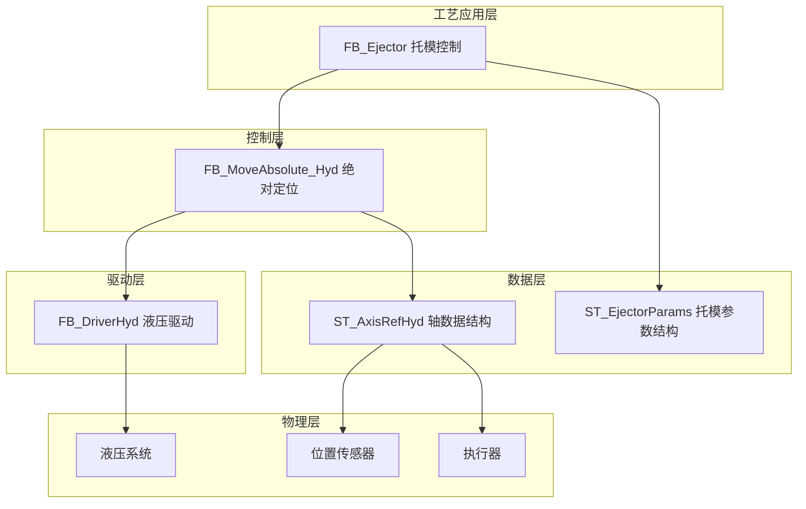
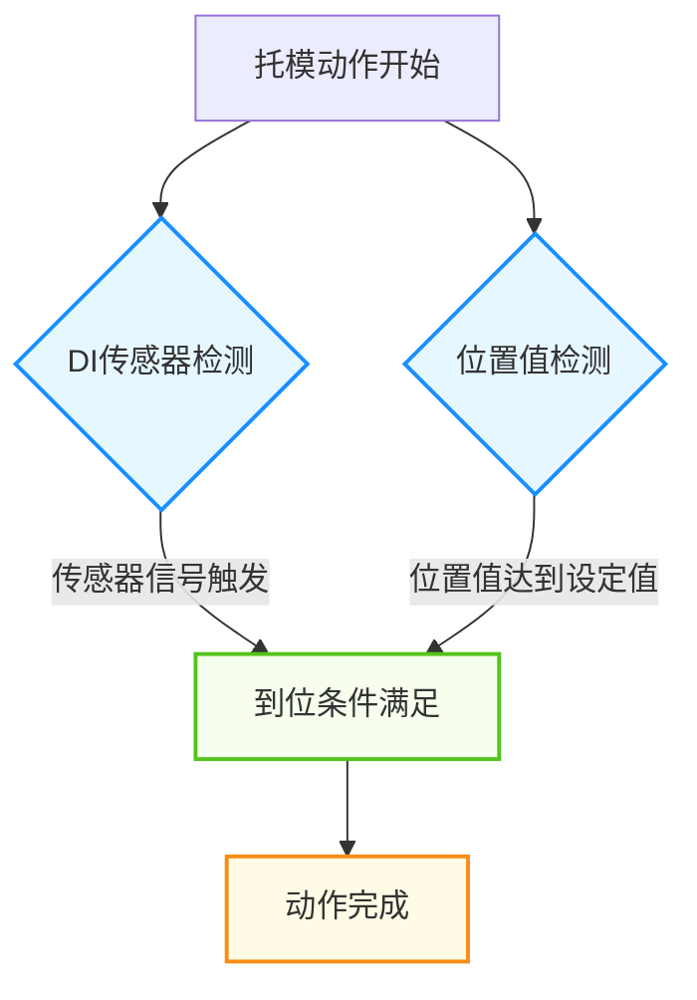
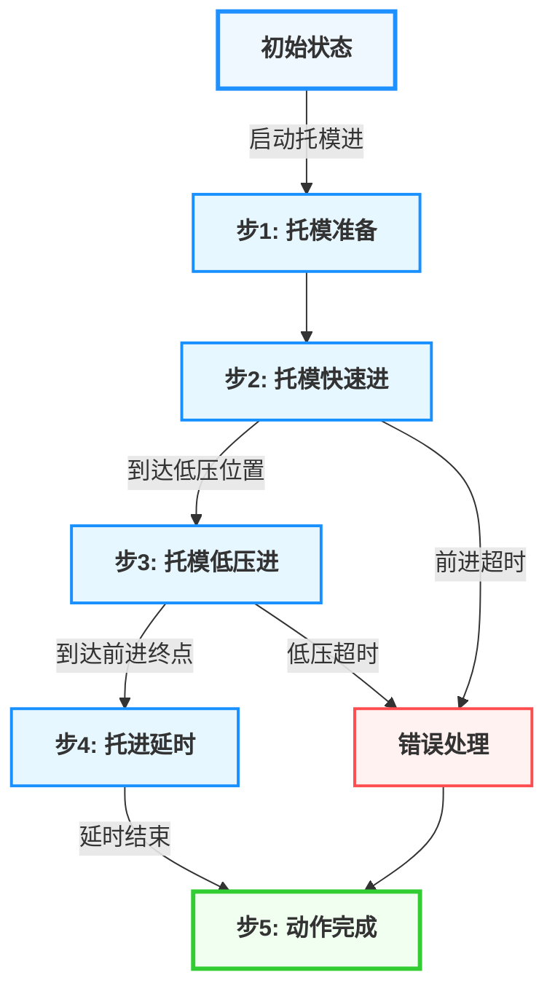
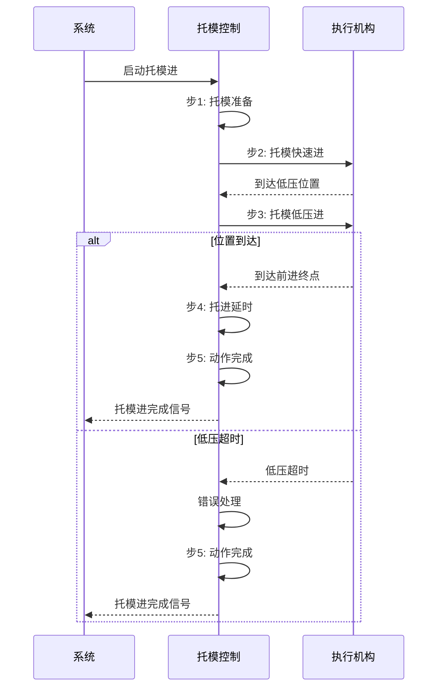
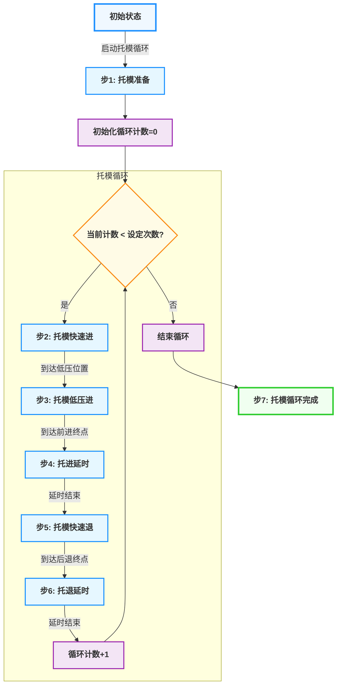

# 注塑机托模功能技术文档

## 1. 概述

### 1.1 功能简介

托模功能是注塑机的重要辅助功能，主要负责控制模具顶针的前进和后退动作，实现制品的脱模。该功能通过精确控制压力、流量和位置参数，确保托模动作平稳、安全且高效，为制品顺利脱模提供保障。

### 1.2 工艺特点

- **双向动作**：支持托模前进（托进）和后退（托退）两个方向的动作控制
- **循环控制**：支持多次托模循环，可根据制品特性设置托模次数
- **低压保护**：包含低压保护机制，防止制品卡住或模具损坏
- **延时控制**：支持托进延时和托退延时，确保制品充分掉落
- **平台兼容性**：支持Luban平台（基于Beremiz二次开发）运行，采用标准IEC 61131-3 ST语法实现
- **MODBUS适配**：所有参数使用INT类型存储，符合MODBUS通信协议要求

### 1.3 技术架构

本功能采用分层架构设计，参考研发部提供的液压系统建模方案，结合倍福TF8560塑料技术功能标准，实现模块化、标准化设计。

---

## 2. 核心控制机制

### 2.1 到位检测机制

托模到位检测采用双重机制，确保到位检测的可靠性：

1. **DI传感器检测**：通过外部DI传感器信号直接检测
   - 触发条件：外部到位传感器信号触发
   - 对应参数：AtAdvEnd（托进终点）、AtRetEnd（托退终点）
2. **位置值检测**：通过位置值判断
   - 触发条件：当前位置达到设定位置
   - 对应参数：CurrentPosition、AdvPos、RetPos

### 2.2 低压保护机制

托模低压保护是防止制品卡住或模具损坏的重要安全机制：

1. **触发条件**：托模前进到达低压保护位置时，系统自动切换到低压保护参数
2. **保护逻辑**：如果在低压保护时间内未到达前进终点，系统将报警并停止动作
3. **参数控制**：通过LowPressure、LowFlow、LowPos、LowTimeLimit参数设置低压保护

---

## 3. 功能阶段定义

### 3.1 托模进功能阶段

| 阶段编号 | 阶段名称   | 主要功能             | 控制参数                    | 阶段转换条件       |
| -------- | ---------- | -------------------- | --------------------------- | ------------------ |
| 1        | 托模准备   | 初始化参数，准备动作 | 无                          | 启动信号触发       |
| 2        | 托模快速进 | 快速托模前进         | AdvPressure、AdvFlow        | 到达低压位置       |
| 3        | 托模低压进 | 低压保护阶段         | LowPressure、LowFlow        | 到达前进终点或超时 |
| 4        | 托进延时   | 停留等待             | AdvDelayTime                | 延时时间达到设定值 |
| 5        | 动作完成   | 完成信号输出         | 无                          | 延时结束           |

### 3.2 托模退功能阶段

| 阶段编号 | 阶段名称   | 主要功能             | 控制参数             | 阶段转换条件       |
| -------- | ---------- | -------------------- | -------------------- | ------------------ |
| 1        | 托模准备   | 初始化参数，准备动作 | 无                   | 启动信号触发       |
| 2        | 托模快速退 | 快速托模后退         | RetPressure、RetFlow | 到达后退终点或超时 |
| 3        | 托退延时   | 停留等待             | RetDelayTime         | 延时时间达到设定值 |
| 4        | 动作完成   | 完成信号输出         | 无                   | 延时结束           |

---

## 4. 控制流程

### 4.1 托模进过程流程

#### 4.1.1 托模进流程示意图

#### 4.1.2 托模进流程序列图

### 4.2 托模循环流程

#### 4.2.1 托模循环流程示意图

> ⚠️ **重要说明**：
>
> 1. 托模动作必须在开模完成后执行，避免与开模动作干涉
> 2. 托模循环次数可通过CycleCount参数设定

---

## 5. 数据结构与功能块

### 5.1 核心数据结构

#### 5.1.1 ST_EjectorParams 结构体

**用途**：封装托模的所有工艺参数

| 字段名                   | 类型 | 有效范围   | 初始值 | 说明                           |
| ------------------------ | ---- | ---------- | ------ | ------------------------------ |
| `iAdvPressure`         | INT  | 0-1000     | 350    | 托进压力(bar*10)               |
| `iAdvFlow`             | INT  | 0-1000     | 300    | 托进流量(%*10)                 |
| `iAdvPos`              | INT  | 0-10000    | 800    | 托进到位位置(mm*10)            |
| `iAdvTimeLimit`        | INT  | 0-100      | 25     | 托进时间限制(s*10)             |
| `iAdvDelayTime`        | INT  | 0-100      | 5      | 托进延时(s*10)                 |
| `iRetPressure`         | INT  | 0-1000     | 400    | 托退压力(bar*10)               |
| `iRetFlow`             | INT  | 0-1000     | 350    | 托退流量(%*10)                 |
| `iRetPos`              | INT  | 0-10000    | 0      | 托退到位位置(mm*10)            |
| `iRetTimeLimit`        | INT  | 0-100      | 25     | 托退时间限制(s*10)             |
| `iRetDelayTime`        | INT  | 0-100      | 3      | 托退延时(s*10)                 |
| `iCycleCount`          | INT  | 1-10       | 1      | 托模次数                       |
| `iLowPressure`         | INT  | 0-1000     | 250    | 托进低压压力(bar*10)           |
| `iLowFlow`             | INT  | 0-1000     | 200    | 托进低压流量(%*10)             |
| `iLowPos`              | INT  | 0-10000    | 600    | 托进低压位置(mm*10)            |
| `iLowTimeLimit`        | INT  | 0-100      | 15     | 托进低压时间限制(s*10)         |

### 5.2 功能块定义

#### 5.2.1 FB_Ejector 功能块

**用途**：完整的托模控制功能块，集成托模进、托模退和循环控制
**指令格式**：

| 指令             | 名称 | FB/FC | LD/FBD表示             | ST表现                 | 说明 |
| ---------------- | ---- | ----- | ---------------------- | ---------------------- | ---- |
| `FB_Ejector0`  | 托模 | FB    |  |  | -    |

**输入输出参数**：

| 参数名         | 名称   | 类型 | 有效范围 | 初始值 | 说明       |
| -------------- | ------ | ---- | -------- | ------ | ---------- |
| `EjectorAxis` | 托模轴 |      | -        | -      | 托模轴引用 |

**输入参数**：

| 参数名              | 名称             | 类型    | 有效范围     | 初始值 | 说明                                     |
| ------------------- | ---------------- | ------- | ------------ | ------ | ---------------------------------------- |
| `bExecute`        | 执行触发         | BOOL    | FALSE,TRUE   | FALSE  | 执行触发信号，上升沿启动                 |
| `iMode`           | 托模模式         | INT     | 0-2          | 0      | 托模模式 (0: 停止, 1: 托模进, 2: 托模退) |
| `stEjectorParams` | 托模参数         | ST_EjectorParams | -    | -      | 上位机设定参数输入                       |
| `bAutoMode`       | 自动模式         | BOOL    | FALSE,TRUE   | FALSE  | 自动模式标志                             |
| `bManualMode`     | 手动模式         | BOOL    | FALSE,TRUE   | TRUE   | 手动模式标志                             |
| `bFunctionEnable` | 功能使能         | BOOL    | FALSE,TRUE   | TRUE   | 托模功能使能                             |
| `bAdvCmd`         | 托进命令         | BOOL    | FALSE,TRUE   | FALSE  | 托进命令                                 |
| `bRetCmd`         | 托退命令         | BOOL    | FALSE,TRUE   | FALSE  | 托退命令                                 |
| `bStartCmd`       | 启动循环命令     | BOOL    | FALSE,TRUE   | FALSE  | 启动托模循环命令                         |
| `bAtAdvEnd`       | 托进终点         | BOOL    | FALSE,TRUE   | FALSE  | 托进终点信号                             |
| `bAtRetEnd`       | 托退终点         | BOOL    | FALSE,TRUE   | FALSE  | 托退终点信号                             |
| `bAtLowPos`       | 低压位置         | BOOL    | FALSE,TRUE   | FALSE  | 到达低压位置信号                         |
| `rCurrentPosition`| 当前位置         | REAL    | 0.0-1000.0   | 0.0    | 当前位置(mm)                             |
| `rCurrentPressure`| 当前压力         | REAL    | 0.0-1000.0   | 0.0    | 当前压力(bar)                            |

**输出参数**：

| 参数名                  | 名称             | 类型   | 有效范围     | 初始值 | 说明           |
| ----------------------- | ---------------- | ------ | ------------ | ------ | -------------- |
| `bAdvOut`             | 托进输出         | BOOL   | FALSE,TRUE   | FALSE  | 托进输出控制   |
| `bRetOut`             | 托退输出         | BOOL   | FALSE,TRUE   | FALSE  | 托退输出控制   |
| `iPressureOut`        | 压力输出         | INT    | 0-1000       | 0      | 压力输出(bar*10) |
| `iFlowOut`            | 流量输出         | INT    | 0-1000       | 0      | 流量输出(%*10) |
| `bInProgress`         | 正在运行         | BOOL   | FALSE,TRUE   | FALSE  | 正在运行标志   |
| `bAdvanceInProgress`  | 托进中           | BOOL   | FALSE,TRUE   | FALSE  | 托进中标志     |
| `bRetreatInProgress`  | 托退中           | BOOL   | FALSE,TRUE   | FALSE  | 托退中标志     |
| `bDelayInProgress`    | 延时中           | BOOL   | FALSE,TRUE   | FALSE  | 延时中标志     |
| `bCommandComplete`    | 命令完成         | BOOL   | FALSE,TRUE   | FALSE  | 命令完成信号   |
| `iCurrentCount`       | 当前计数         | INT    | 0-10         | 0      | 当前循环计数   |
| `bError`              | 错误状态         | BOOL   | FALSE,TRUE   | FALSE  | 错误信号       |
| `iErrorCode`          | 错误代码         | INT    | 0-65535      | 0      | 错误代码       |

### 5.3 枚举类型定义

#### 5.3.1 托模状态 E_EjectorState

| 值 | 名称                 | 说明         |
| -- | -------------------- | ------------ |
| 0  | eState_Idle          | 空闲状态     |
| 1  | eState_Prepare       | 准备状态     |
| 2  | eState_Advancing     | 托进中       |
| 3  | eState_LowPressure   | 低压保护阶段 |
| 4  | eState_AdvDelay      | 托进延时     |
| 5  | eState_Retreating    | 托退中       |
| 6  | eState_RetDelay      | 托退延时     |
| 7  | eState_Complete      | 完成状态     |
| 8  | eState_Error         | 错误状态     |

---

## 6. 核心参数说明

### 6.1 托模进关键参数

| 参数类别 | 参数名称     | 程序变量名        | 功能说明                     |
| -------- | ------------ | ----------------- | ---------------------------- |
| 压力参数 | 托进压力     | iAdvPressure      | 托模进动作的压力设定(bar*10) |
| 流量参数 | 托进流量     | iAdvFlow          | 托模进动作的流量设定(%*10)   |
| 位置参数 | 托进到位位置 | iAdvPos           | 托模进到位的位置设定(mm*10)  |
| 时间参数 | 托进时间限制 | iAdvTimeLimit     | 托模进动作的时间限制(s*10)   |
| 时间参数 | 托进延时     | iAdvDelayTime     | 托模进动作的延时时间(s*10)   |

### 6.2 托模退关键参数

| 参数类别 | 参数名称     | 程序变量名        | 功能说明                     |
| -------- | ------------ | ----------------- | ---------------------------- |
| 压力参数 | 托退压力     | iRetPressure      | 托模退动作的压力设定(bar*10) |
| 流量参数 | 托退流量     | iRetFlow          | 托模退动作的流量设定(%*10)   |
| 位置参数 | 托退到位位置 | iRetPos           | 托模退到位的位置设定(mm*10)  |
| 时间参数 | 托退时间限制 | iRetTimeLimit     | 托模退动作的时间限制(s*10)   |
| 时间参数 | 托退延时     | iRetDelayTime     | 托模退动作的延时时间(s*10)   |

### 6.3 低压保护参数

| 参数类别 | 参数名称         | 程序变量名        | 功能说明                         |
| -------- | ---------------- | ----------------- | -------------------------------- |
| 压力参数 | 托进低压压力     | iLowPressure      | 托模进低压保护压力设定(bar*10)   |
| 流量参数 | 托进低压流量     | iLowFlow          | 托模进低压保护流量设定(%*10)     |
| 位置参数 | 托进低压位置     | iLowPos           | 托模进低压保护开始位置(mm*10)    |
| 时间参数 | 托进低压时间限制 | iLowTimeLimit     | 托模进低压保护时间限制(s*10)     |

### 6.4 其他参数

| 参数类别 | 参数名称 | 程序变量名  | 功能说明           |
| -------- | -------- | ----------- | ------------------ |
| 循环参数 | 托模次数 | iCycleCount | 单次循环的托模次数 |

> ⚠️ **重要说明**：
>
> 1. 所有压力、流量、位置参数均使用INT类型存储，符合MODBUS通信协议要求
> 2. 实际使用时，需要根据硬件特性和工艺要求进行适当的参数调整

---

## 7. 功能块实现

### 7.1 FB_Ejector 实现详解

#### 7.1.1 核心逻辑

1. **状态管理**：使用 `E_EjectorState` 枚举类型管理托模的各种状态
2. **模式控制**：根据 `iMode` 参数选择托模进或托模退模式
3. **阶段控制**：
   - 托模进：准备 → 快速进 → 低压进 → 延时 → 完成
   - 托模退：准备 → 快速退 → 延时 → 完成
4. **循环控制**：根据 `iCycleCount` 参数控制托模循环次数
5. **到位判断**：支持DI传感器和位置值两种到位检测方式
6. **安全保护**：包含超时保护、低压保护等安全机制

#### 7.1.2 状态转换逻辑

- **托模进流程**：空闲状态 → 准备状态 → 托进中 → 低压保护 → 托进延时 → 完成状态
- **托模退流程**：空闲状态 → 准备状态 → 托退中 → 托退延时 → 完成状态
- **错误处理**：任何状态 → 错误状态（发生错误时）

---

## 8. 安全保护机制

### 8.1 超时保护

| 项目     | 说明                                                          |
| -------- | ------------------------------------------------------------- |
| 触发条件 | 托模动作时间超过设定的时间限制                                |
| 响应措施 | 触发错误报警，停止当前动作                                    |
| 参数控制 | 通过 iAdvTimeLimit 和 iRetTimeLimit 参数设置时间限制          |

### 8.2 低压保护

| 项目     | 说明                                           |
| -------- | ---------------------------------------------- |
| 触发条件 | 托模前进到达低压位置后，在设定时间内未到达终点 |
| 响应措施 | 触发错误报警，停止当前动作                     |
| 参数控制 | 通过 iLowTimeLimit 参数设置低压保护时间        |

### 8.3 状态互锁

| 项目     | 说明                                                     |
| -------- | -------------------------------------------------------- |
| 互锁机制 | 托模进和托模退动作互锁，避免同时输出                     |
| 实现方式 | 在功能块逻辑中确保 AdvOut 和 RetOut 不同时为 TRUE        |
| 优势     | 防止执行机构冲突，保护设备安全                           |

### 8.4 错误代码说明

| 错误代码 | 名称                       | 说明           |
| -------- | -------------------------- | -------------- |
| 1501     | cError_EjectorAdvTimeout   | 托模进超时错误 |
| 1502     | cError_EjectorRetTimeout   | 托模退超时错误 |
| 1503     | cError_EjectorLowPressure  | 低压保护错误   |
| 1504     | cError_EjectorPosition     | 位置检测错误   |

---

## 9. 平台兼容性

本小节内容与开合模功能基本一致，详细操作说明请参考开合模功能章节。

---

## 10. 参数调整指南

### 10.1 压力流量参数调整

1. **压力参数**：
   - 托进压力：根据制品大小和脱模难度设置，确保能够顺利顶出制品，但避免压力过高导致制品变形或模具损坏
   - 托退压力：通常设置略高于托进压力，确保顶针可靠退回
   - 低压保护压力：应设置较低，用于检测障碍物或制品卡住情况

2. **流量参数**：
   - 托进流量：影响顶出速度，应根据制品特性调整，避免速度过快导致制品损坏
   - 托退流量：通常设置较高，以提高生产效率
   - 流量与压力匹配：流量参数应与压力参数匹配，确保平稳动作

### 10.2 位置参数调整

1. **托进到位位置**：
   - 根据模具顶出行程设置，确保制品完全顶出
   - 应留有适当余量，避免机械碰撞

2. **托退到位位置**：
   - 通常设置为0或接近0的位置，确保顶针完全复位

### 10.3 时间参数调整

1. **时间限制**：
   - 应根据实际动作时间适当设置，避免频繁触发错误
   - 一般设置为实际动作时间的1.5-2倍

2. **延时参数**：
   - 托进延时应足够长以确保制品掉落
   - 托退延时可较短

### 10.4 托模次数调整

1. **单模制品**：通常设置为1次
2. **复杂制品**：可能需要多次顶出以避免制品卡在模具中
3. **特殊工艺**：根据实际需要调整托模次数

---

## 11. 调试与故障排除

### 11.1 常见故障处理

| 故障现象     | 可能原因                         | 解决方法                           |
| ------------ | -------------------------------- | ---------------------------------- |
| 托模动作超时 | 压力不足、负载过大、位置检测故障 | 检查压力参数、负载情况、位置传感器 |
| 托模不到位   | 位置参数设置不当、传感器故障     | 调整位置参数、检查传感器           |
| 低压保护触发 | 制品卡住、模具问题               | 检查制品、模具                     |
| 动作不顺畅   | 压力流量参数设置不当             | 调整压力流量参数                   |
| 错误信号触发 | 时间限制设置过短                 | 适当增加时间限制参数               |

### 11.2 调试建议

1. **手动模式调试**：
   - 在手动模式下，分别测试托进和托退动作
   - 观察位置检测信号，确保到位检测可靠

2. **自动模式调试**：
   - 设置单次循环，测试完整的托模循环
   - 观察各阶段的切换情况

3. **参数记录**：
   - 记录调试过程中的参数变化，便于优化
   - 进行多次测试，确保动作稳定性

---

## 12. 数据流说明

本小节内容与开合模功能基本一致，详细操作说明请参考开合模功能章节。

---

## 13. 相关文档与参考

### 13.1 功能块实现文件

- FB_Ejector.st：托模控制功能块实现
- ST_EjectorParams：托模参数结构体定义
- E_EjectorState：托模状态枚举定义
- ST_AxisRefHyd：轴数据结构体定义
- FB_DriverHyd：液压驱动功能块

### 13.2 技术文档与命名规范

本小节内容与开合模功能基本一致，详细操作说明请参考开合模功能章节。

---

## 14. 文档信息

**适用范围**：立式注塑机托模控制功能开发项目
**数据定义基准**：数据定义初版.st v1.0

### 14.1 版本控制

| 版本 | 日期       | 作者      | 变更说明                                                                                         |
| ---- | ---------- | --------- | ------------------------------------------------------------------------------------------------ |
| 1.0  | 2025-08-22 | 汪工      | 初始版本，完成基本功能描述                                                                       |
| 1.1  | 2026-03-20 | 周工/汪工 | 调整文档结构，优化内容组织； 更新数据结构定义，确保与代码一致性； 优化文档格式，添加页内导航支持 |
