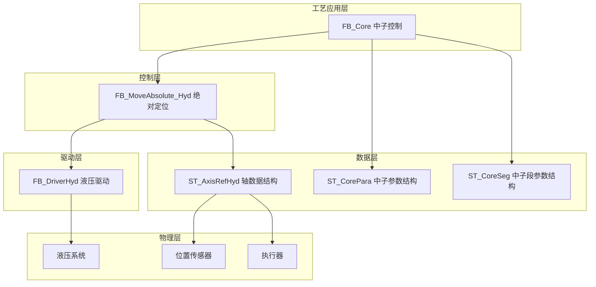
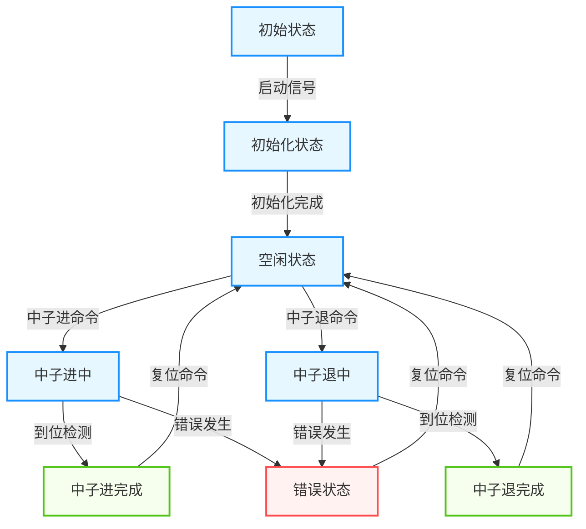
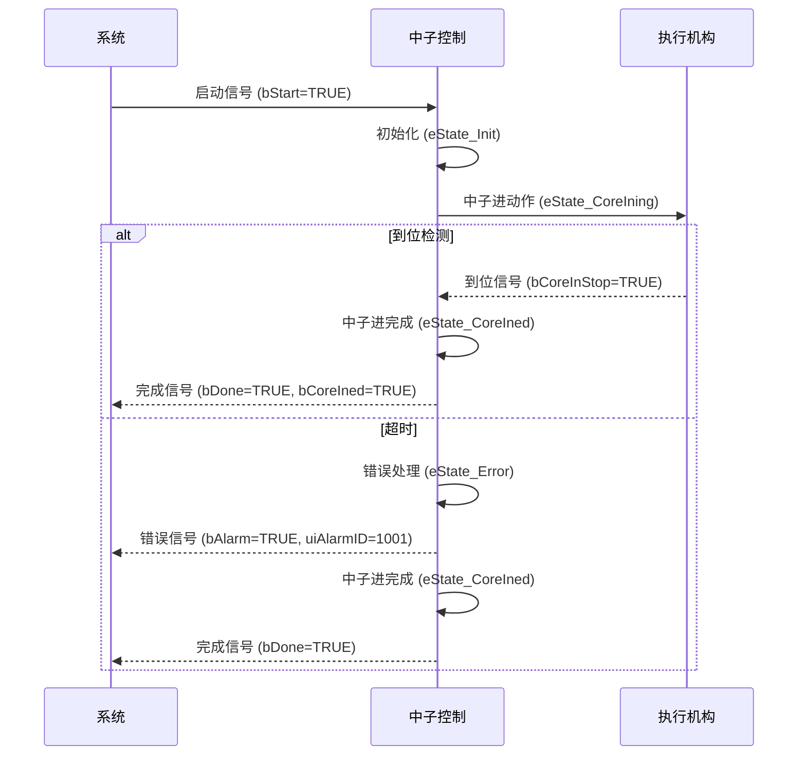
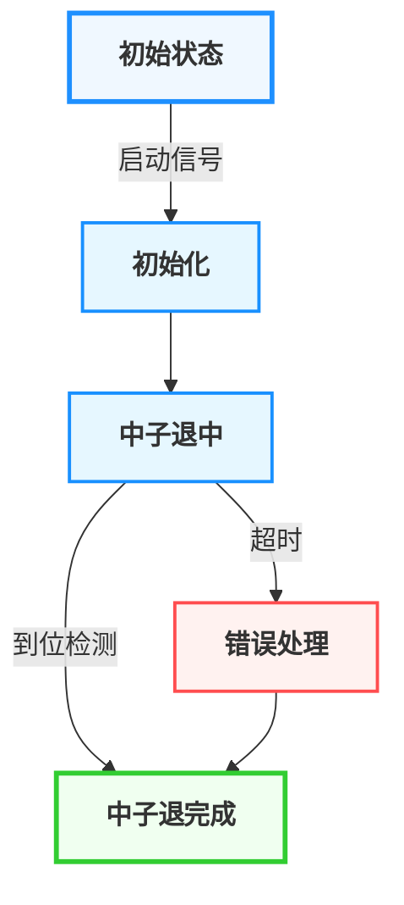
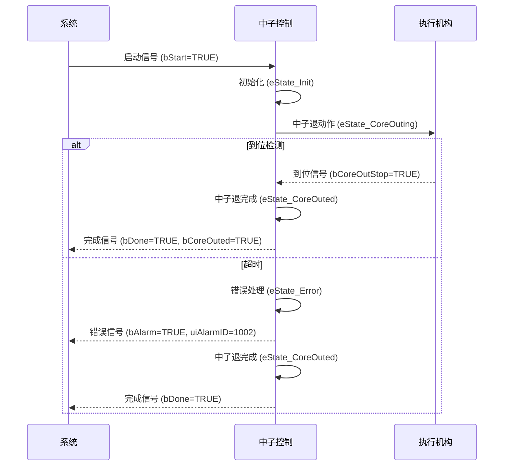
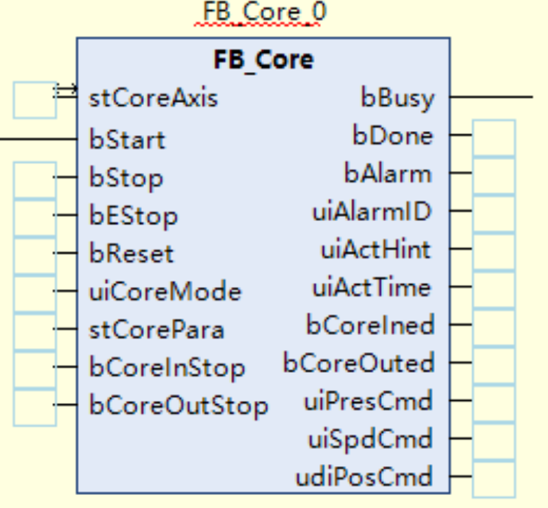
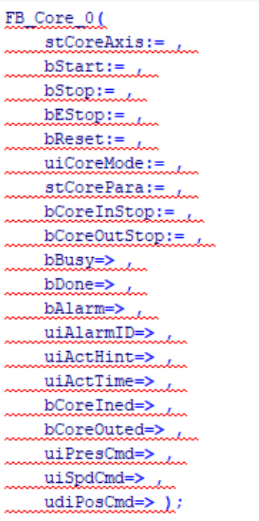

# 注塑机中子功能技术文档

## 1. 概述

### 1.1 功能简介

中子功能是注塑机的重要辅助功能，用于模具的侧向抽芯，在注塑过程中起关键作用。该功能通过精确控制中子的前进和后退动作，确保模具的侧向抽芯和复位过程平稳、安全且高效。

### 1.2 工艺特点

- **双向动作**：支持中子前进和后退两个方向的动作控制
- **位置检测**：支持DI传感器位置检测
- **安全机制**：包含超时保护、位置检测、状态互锁等多重安全保障
- **平台兼容性**：支持Luban平台（基于Beremiz二次开发）运行，采用标准IEC 61131-3 ST语法实现
- **参数控制**：支持压力、速度、时间、计数等多种控制参数

### 1.3 技术架构

本功能采用分层架构设计，参考研发部提供的液压系统建模方案，结合倍福TF8560塑料技术功能标准，实现模块化、标准化设计。

---

## 2. 核心控制机制

### 2.1 状态管理机制

中子功能采用状态机管理，通过 `E_CoreState` 枚举类型定义了7种状态：

### 2.2 控制命令机制

中子功能支持四种控制命令：

| 命令       | 说明     | 响应               |
| ---------- | -------- | ------------------ |
| `bStart` | 启动命令 | 启动中子动作       |
| `bStop`  | 停止命令 | 有减速停           |
| `bEStop` | 急停命令 | 立即停止，无减速停 |
| `bReset` | 复位命令 | 重置错误状态       |

### 2.3 模式选择机制

中子功能支持三种模式：

| 模式       | 值 | 说明           |
| ---------- | -- | -------------- |
| 无模式     | 0  | 不执行任何动作 |
| 中子进模式 | 1  | 执行中子进动作 |
| 中子退模式 | 2  | 执行中子退动作 |

---

## 3. 功能阶段定义

### 3.1 中子进功能阶段

| 阶段编号 | 阶段名称   | 主要功能             | 控制参数         | 阶段转换条件   |
| -------- | ---------- | -------------------- | ---------------- | -------------- |
| 1        | 初始化     | 初始化参数，准备动作 | 无               | 启动信号触发   |
| 2        | 中子进中   | 执行中子进动作       | 压力、速度、位置 | 到位检测或超时 |
| 3        | 中子进完成 | 保持完成状态         | 无               | 到位检测或超时 |

### 3.2 中子退功能阶段

| 阶段编号 | 阶段名称   | 主要功能             | 控制参数         | 阶段转换条件   |
| -------- | ---------- | -------------------- | ---------------- | -------------- |
| 1        | 初始化     | 初始化参数，准备动作 | 无               | 启动信号触发   |
| 2        | 中子退中   | 执行中子退动作       | 压力、速度、位置 | 到位检测或超时 |
| 3        | 中子退完成 | 保持完成状态         | 无               | 到位检测或超时 |

---

## 4. 控制流程

### 4.1 中子进过程流程

#### 4.1.1 中子进流程示意图

#### 4.1.2 中子进流程序列图

### 4.2 中子退过程流程

#### 4.2.1 中子退流程示意图

#### 4.2.2 中子退流程序列图

> ⚠️ **重要说明**：
>
> 1. 中子动作必须与开模、合模等动作协调，避免干涉
> 2. 中子进动作通常在合模前执行，中子退动作通常在开模后执行

---

## 5. 数据结构与功能块

### 5.1 核心数据结构

#### 5.1.1 E_CoreState 枚举类型

**用途**：定义中子功能的状态机状态

| 值 | 名称              | 说明       |
| -- | ----------------- | ---------- |
| 0  | eState_Idle       | 空闲状态   |
| 1  | eState_Init       | 初始化     |
| 2  | eState_CoreIning  | 中子进中   |
| 3  | eState_CoreIned   | 中子进完成 |
| 4  | eState_CoreOuting | 中子退中   |
| 5  | eState_CoreOuted  | 中子退完成 |
| 6  | eState_Error      | 错误状态   |

#### 5.1.2 ST_CoreSeg 结构体

**用途**：定义中子单段工艺参数

| 字段名      | 类型 | 有效范围 | 初始值 | 说明         |
| ----------- | ---- | -------- | ------ | ------------ |
| `uiPres`  | UINT | 0-1000   | 0      | 设定压力     |
| `uiSpd`   | UINT | 0-1000   | 0      | 设定速度     |
| `uiTime`  | UINT | 0-65535  | 0      | 设定停止时间 |
| `uiCount` | UINT | 0-65535  | 0      | 设定停止计数 |

#### 5.1.3 ST_CorePara 结构体

**用途**：定义中子完整工艺参数

| 字段名                     | 类型       | 有效范围     | 初始值 | 说明                                  |
| -------------------------- | ---------- | ------------ | ------ | ------------------------------------- |
| `uiCoreInStartMode`      | UINT       | 0-1          | 0      | 中子进开始方式 (0:行程 1:位置)        |
| `uiCoreInStroke`         | UINT       | 0-65535      | 0      | 中子进开始行程                        |
| `udiCoreInPos`           | UDINT      | 0-4294967295 | 0      | 中子进开始位置                        |
| `uiCoreInStopMode`       | UINT       | 0-2          | 0      | 中子进停止方式 (0:时间 1:行程 2:计数) |
| `uiCoreInLimitTime`      | UINT       | 0-65535      | 0      | 中子进限制时间                        |
| `stCoreInSeg`            | ST_CoreSeg | -            | -      | 中子进设定参数                        |
| `uiCoreInPresStartGrad`  | UINT       | 0-1000       | 0      | 压力启动斜率                          |
| `uiCoreInPresStopGrad`   | UINT       | 0-1000       | 0      | 压力停止斜率                          |
| `uiCoreInSpdStartGrad`   | UINT       | 0-1000       | 0      | 速度启动斜率                          |
| `uiCoreInSpdStopGrad`    | UINT       | 0-1000       | 0      | 速度停止斜率                          |
| `uiCoreOutStartMode`     | UINT       | 0-1          | 0      | 中子退开始方式 (0:行程 1:位置)        |
| `uiCoreOutStroke`        | UINT       | 0-65535      | 0      | 中子退开始行程                        |
| `udiCoreOutPos`          | UDINT      | 0-4294967295 | 0      | 中子退开始位置                        |
| `uiCoreOutStopMode`      | UINT       | 0-2          | 0      | 中子退停止方式 (0:时间 1:行程 2:计数) |
| `uiCoreOutLimitTime`     | UINT       | 0-65535      | 0      | 中子退限制时间                        |
| `stCoreOutSeg`           | ST_CoreSeg | -            | -      | 中子退设定参数                        |
| `uiCoreOutPresStartGrad` | UINT       | 0-1000       | 0      | 压力启动斜率                          |
| `uiCoreOutPresStopGrad`  | UINT       | 0-1000       | 0      | 压力停止斜率                          |
| `uiCoreOutSpdStartGrad`  | UINT       | 0-1000       | 0      | 速度启动斜率                          |
| `uiCoreOutSpdStopGrad`   | UINT       | 0-1000       | 0      | 速度停止斜率                          |

### 5.2 功能块定义

#### 5.2.1 FB_Core 功能块

**用途**：完整的中子控制功能块，集成中子进和中子退控制

**指令格式**：

| 指令        | 名称 | FB/FC | LD/FBD表示                                              | ST表现                                                  | 说明 |
| ----------- | ---- | ----- | ------------------------------------------------------- | ------------------------------------------------------- | ---- |
| `FB_Core` | 中子 | FB    |  |  |      |

**输入输出参数**： 

| 参数名         | 类型          | 说明       |
| -------------- | ------------- | ---------- |
| `stCoreAxis` | ST_AxisRefHyd | 轴数据结构 |

**输入参数**：

| 参数名           | 类型        | 有效范围   | 初始值 | 说明                                          |
| ---------------- | ----------- | ---------- | ------ | --------------------------------------------- |
| `bStart`       | BOOL        | FALSE,TRUE | FALSE  | 启动                                          |
| `bStop`        | BOOL        | FALSE,TRUE | FALSE  | 停止(有减速停)                                |
| `bEStop`       | BOOL        | FALSE,TRUE | FALSE  | 急停(立即停止，无减速停)                      |
| `bReset`       | BOOL        | FALSE,TRUE | FALSE  | 复位                                          |
| `uiCoreMode`   | UINT        | 0-2        | 0      | 中子模式 (0:无模式 1:中子进模式 2:中子退模式) |
| `stCorePara`   | ST_CorePara | -          | -      | 上位机设定参数                                |
| `bCoreInStop`  | BOOL        | FALSE,TRUE | FALSE  | 中子进停止                                    |
| `bCoreOutStop` | BOOL        | FALSE,TRUE | FALSE  | 中子退停止                                    |

**输出参数**：

| 参数名         | 类型  | 有效范围     | 初始值 | 说明             |
| -------------- | ----- | ------------ | ------ | ---------------- |
| `bBusy`      | BOOL  | FALSE,TRUE   | FALSE  | 忙状态           |
| `bDone`      | BOOL  | FALSE,TRUE   | FALSE  | 完成状态         |
| `bAlarm`     | BOOL  | FALSE,TRUE   | FALSE  | 报警状态         |
| `uiAlarmID`  | UINT  | 0-65535      | 0      | 报警代码         |
| `uiActHint`  | UINT  | 0-65535      | 0      | 当前动作状态     |
| `uiActTime`  | UINT  | 0-65535      | 0      | 当前动作运行时间 |
| `bCoreIned`  | BOOL  | FALSE,TRUE   | FALSE  | 中子进完成       |
| `bCoreOuted` | BOOL  | FALSE,TRUE   | FALSE  | 中子退完成       |
| `uiPresCmd`  | UINT  | 0-1000       | 0      | 压力命令输出     |
| `uiSpdCmd`   | UINT  | 0-1000       | 0      | 速度命令输出     |
| `udiPosCmd`  | UDINT | 0-4294967295 | 0      | 位置命令输出     |

---

## 6. 核心参数说明

### 6.1 中子进关键参数

| 参数类别 | 参数名称       | 程序变量名            | 功能说明                                        |
| -------- | -------------- | --------------------- | ----------------------------------------------- |
| 启动参数 | 中子进开始方式 | uiCoreInStartMode     | 设定中子进开始的触发方式 (0:行程 1:位置)        |
| 启动参数 | 中子进开始行程 | uiCoreInStroke        | 中子进开始的行程值                              |
| 启动参数 | 中子进开始位置 | udiCoreInPos          | 中子进开始的位置值                              |
| 停止参数 | 中子进停止方式 | uiCoreInStopMode      | 设定中子进停止的触发方式 (0:时间 1:行程 2:计数) |
| 停止参数 | 中子进限制时间 | uiCoreInLimitTime     | 中子进动作的时间限制                            |
| 工艺参数 | 中子进压力     | stCoreInSeg.uiPres    | 中子进动作的压力设定                            |
| 工艺参数 | 中子进速度     | stCoreInSeg.uiSpd     | 中子进动作的速度设定                            |
| 工艺参数 | 中子进停止时间 | stCoreInSeg.uiTime    | 中子进到位后的停止时间                          |
| 工艺参数 | 中子进停止计数 | stCoreInSeg.uiCount   | 中子进到位后的停止计数                          |
| 斜率参数 | 压力启动斜率   | uiCoreInPresStartGrad | 中子进压力的启动斜率                            |
| 斜率参数 | 压力停止斜率   | uiCoreInPresStopGrad  | 中子进压力的停止斜率                            |
| 斜率参数 | 速度启动斜率   | uiCoreInSpdStartGrad  | 中子进速度的启动斜率                            |
| 斜率参数 | 速度停止斜率   | uiCoreInSpdStopGrad   | 中子进速度的停止斜率                            |

### 6.2 中子退关键参数

| 参数类别 | 参数名称       | 程序变量名             | 功能说明                                        |
| -------- | -------------- | ---------------------- | ----------------------------------------------- |
| 启动参数 | 中子退开始方式 | uiCoreOutStartMode     | 设定中子退开始的触发方式 (0:行程 1:位置)        |
| 启动参数 | 中子退开始行程 | uiCoreOutStroke        | 中子退开始的行程值                              |
| 启动参数 | 中子退开始位置 | udiCoreOutPos          | 中子退开始的位置值                              |
| 停止参数 | 中子退停止方式 | uiCoreOutStopMode      | 设定中子退停止的触发方式 (0:时间 1:行程 2:计数) |
| 停止参数 | 中子退限制时间 | uiCoreOutLimitTime     | 中子退动作的时间限制                            |
| 工艺参数 | 中子退压力     | stCoreOutSeg.uiPres    | 中子退动作的压力设定                            |
| 工艺参数 | 中子退速度     | stCoreOutSeg.uiSpd     | 中子退动作的速度设定                            |
| 工艺参数 | 中子退停止时间 | stCoreOutSeg.uiTime    | 中子退到位后的停止时间                          |
| 工艺参数 | 中子退停止计数 | stCoreOutSeg.uiCount   | 中子退到位后的停止计数                          |
| 斜率参数 | 压力启动斜率   | uiCoreOutPresStartGrad | 中子退压力的启动斜率                            |
| 斜率参数 | 压力停止斜率   | uiCoreOutPresStopGrad  | 中子退压力的停止斜率                            |
| 斜率参数 | 速度启动斜率   | uiCoreOutSpdStartGrad  | 中子退速度的启动斜率                            |
| 斜率参数 | 速度停止斜率   | uiCoreOutSpdStopGrad   | 中子退速度的停止斜率                            |

> ⚠️ **重要说明**：
>
> 1. 所有参数均使用无符号整数类型存储，符合PLC编程规范
> 2. 实际使用时，需要根据硬件特性和工艺要求进行适当的参数调整

---

## 7. 功能块实现

### 7.1 FB_Core 实现详解

#### 7.1.1 核心逻辑

1. **状态管理**：使用 `E_CoreState` 枚举类型管理中子的各种状态
2. **模式控制**：根据 `uiCoreMode` 参数选择中子进或中子退模式
3. **阶段控制**：
   - 中子进：初始化 → 中子进中 → 中子进完成
   - 中子退：初始化 → 中子退中 → 中子退完成
4. **到位判断**：通过DI传感器信号进行到位检测
5. **安全保护**：包含超时保护、状态互锁等安全机制
6. **命令输出**：根据当前状态输出压力、速度和位置命令

#### 7.1.2 状态转换逻辑

- **中子进流程**：空闲状态 → 初始化 → 中子进中 → 中子进完成
- **中子退流程**：空闲状态 → 初始化 → 中子退中 → 中子退完成
- **错误处理**：任何状态 → 错误状态（发生错误时）
- **复位流程**：错误状态 → 空闲状态（收到复位命令时）

---

## 8. 安全保护机制

### 8.1 超时保护

| 项目     | 说明                                                          |
| -------- | ------------------------------------------------------------- |
| 触发条件 | 中子动作时间超过设定的时间限制                                |
| 响应措施 | 触发错误报警，停止当前动作                                    |
| 参数控制 | 通过 uiCoreInLimitTime 和 uiCoreOutLimitTime 参数设置时间限制 |

### 8.2 位置检测

| 项目     | 说明                                                   |
| -------- | ------------------------------------------------------ |
| 检测方式 | 通过DI传感器信号进行到位检测                           |
| 信号输入 | bCoreInStop（中子进停止）和 bCoreOutStop（中子退停止） |
| 优势     | 直接可靠，不受其他因素影响                             |

### 8.3 状态互锁

| 项目     | 说明                                           |
| -------- | ---------------------------------------------- |
| 互锁机制 | 中子进和中子退动作互锁，避免同时输出           |
| 实现方式 | 在功能块逻辑中确保中子进和中子退状态不同时激活 |
| 优势     | 防止执行机构冲突，保护设备安全                 |

### 8.4 错误代码说明

| 错误代码 | 名称             | 说明                   |
| -------- | ---------------- | ---------------------- |
| 0        | 无错误           | 正常状态               |
| 1001     | 中子进未定时完成 | 中子进动作超过设定时间 |
| 1002     | 中子退未定时完成 | 中子退动作超过设定时间 |

---

## 9. 平台兼容性

### 9.1 Luban平台适配

本小节内容与开合模功能基本一致，详细操作说明请参考开合模功能章节。

---

## 10. 参数调整指南

### 10.1 压力流量参数调整

1. **压力参数**：

   - 中子进压力：根据模具抽芯力大小调整，确保能够克服抽芯阻力
   - 中子退压力：通常略大于中子进压力，确保能够可靠复位
2. **流量参数**：

   - 流量大小影响动作速度，应根据工艺要求和设备能力调整
   - 过大的流量可能导致动作过于剧烈，影响设备寿命

### 10.2 位置参数调整

1. **开始位置/行程**：

   - 根据模具运动轨迹设定，确保中子动作与其他动作协调
   - 应留有适当余量，避免机械碰撞
2. **停止方式**：

   - 根据工艺要求选择合适的停止方式（时间、行程或计数）
   - 时间停止方式适用于动作时间相对固定的场景
   - 行程或计数停止方式适用于需要精确定位的场景

### 10.3 时间参数调整

1. **时间限制**：

   - 应根据实际动作时间适当设置，避免频繁触发错误
   - 一般设置为实际动作时间的1.5-2倍
2. **停止时间**：

   - 根据工艺要求设置，确保中子到位后有足够的稳定时间

### 10.4 斜率参数调整

1. **压力斜率**：

   - 启动斜率：控制压力上升的快慢，影响动作的平稳性
   - 停止斜率：控制压力下降的快慢，影响动作的停止精度
2. **速度斜率**：

   - 启动斜率：控制速度上升的快慢，影响动作的平稳性
   - 停止斜率：控制速度下降的快慢，影响动作的停止精度

---

## 11. 调试与故障排除

### 11.1 常见故障处理

| 故障现象     | 可能原因                         | 解决方法                           |
| ------------ | -------------------------------- | ---------------------------------- |
| 中子动作超时 | 压力不足、负载过大、位置检测故障 | 检查压力参数、负载情况、位置传感器 |
| 中子不到位   | 位置参数设置不当、传感器故障     | 调整位置参数、检查传感器           |
| 动作不顺畅   | 压力流量参数设置不当             | 调整压力流量参数                   |
| 错误信号触发 | 时间限制设置过短                 | 适当增加时间限制参数               |

### 11.2 调试建议

1. **分步调试**：

   - 先测试中子进动作，再测试中子退动作
   - 从低压力、低流量开始，逐渐调整参数
2. **状态监控**：

   - 观察功能块的状态输出，确保状态转换正确
   - 检查到位检测信号，确保传感器工作正常
3. **安全检查**：

   - 确保中子动作与其他动作协调，避免干涉
   - 测试急停功能，确保在紧急情况下能够立即停止

---

## 12. 数据流说明

本小节内容与开合模功能基本一致，详细操作说明请参考开合模功能章节。

---

## 13. 相关文档与参考

### 13.1 功能块实现文件

- FB_Core.st：中子控制功能块实现
- ST_CorePara：中子参数结构体定义
- ST_CoreSeg：中子段参数结构体定义
- E_CoreState：中子状态枚举定义
- ST_AxisRefHyd：轴数据结构体定义
- FB_DriverHyd：液压驱动功能块

### 13.2 技术文档与命名规范

本小节内容与开合模功能基本一致，详细操作说明请参考开合模功能章节。

---

## 14. 文档信息

**适用范围**：立式注塑机中子控制功能开发项目
**数据定义基准**：中子定义.st v1.0

### 14.1 版本控制

| 版本 | 日期       | 作者      | 变更说明                                                                                                                         |
| ---- | ---------- | --------- | -------------------------------------------------------------------------------------------------------------------------------- |
| 1.0  | 2025-08-22 | 汪工      | 初始版本，完成基本功能描述                                                                                                       |
| 1.1  | 2026-03-20 | 周工/汪工 | 完善功能描述，添加详细参数说明；调整文档结构，优化内容组织； 更新数据结构定义，确保与代码一致性； 优化文档格式，添加页内导航支持 |
| 1.2  | 2026-03-23 | 周工/汪工 | 根据中子定义.st文件重新整理文档，确保与代码定义完全一致                                                                          |
