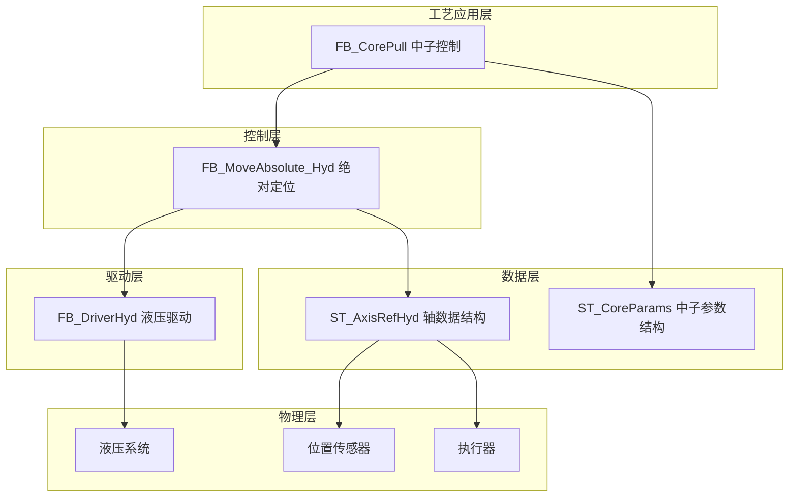
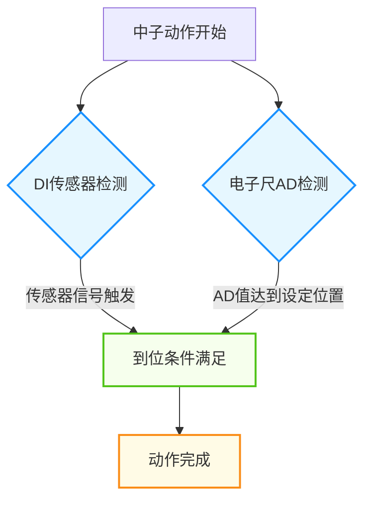
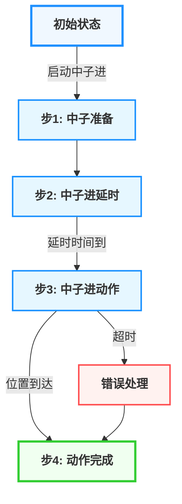
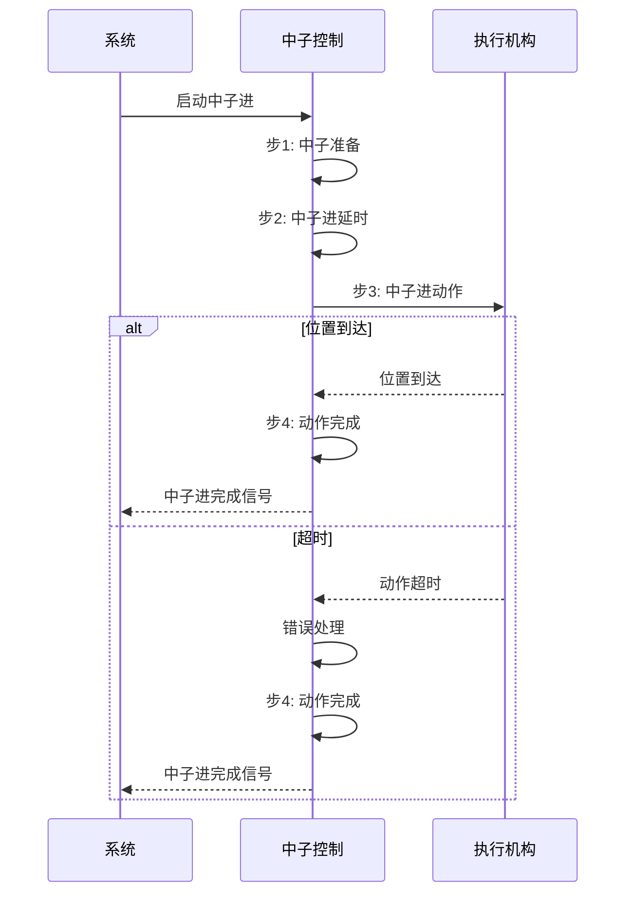
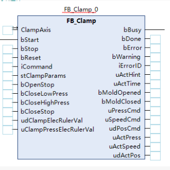
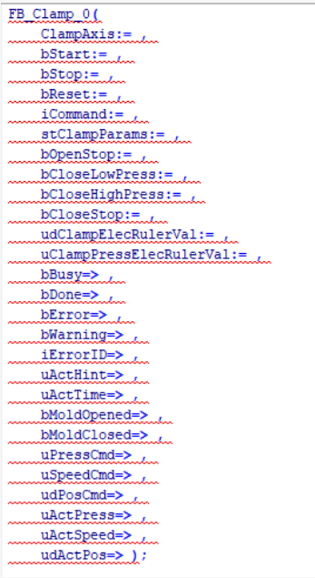

# 注塑机中子功能技术文档

## 1. 概述

### 1.1 功能简介

中子功能是注塑机的重要辅助功能，用于模具的侧向抽芯，在注塑过程中起关键作用。该功能通过精确控制中子的前进和后退动作，确保模具的侧向抽芯和复位过程平稳、安全且高效。

### 1.2 工艺特点

- **双向动作**：支持中子前进和后退两个方向的动作控制
- **位置检测**：支持DI传感器和电子尺AD输入两种位置检测方式
- **安全机制**：包含超时保护、位置检测冗余、状态互锁等多重安全保障
- **平台兼容性**：支持Luban平台（基于Beremiz二次开发）运行，采用标准IEC 61131-3 ST语法实现
- **MODBUS适配**：所有参数使用INT类型存储，符合MODBUS通信协议要求

### 1.3 技术架构

本功能采用分层架构设计，参考研发部提供的液压系统建模方案，结合倍福TF8560塑料技术功能标准，实现模块化、标准化设计。

---

## 2. 核心控制机制

### 2.1 位置检测机制

中子位置检测采用双重机制，确保到位检测的可靠性：

1. **DI传感器检测**：通过外部DI传感器信号直接检测

   - 触发条件：外部到位传感器信号触发
   - 对应参数：ForwardPositionSensorInput、BackwardPositionSensorInput
2. **电子尺AD检测**：通过电子尺AD输入值判断

   - 触发条件：AD输入值达到设定位置
   - 对应参数：RealADInput、ForwardPos、BackwardPos

### 2.2 仿真模式说明

中子功能支持仿真模式，可以在没有实际硬件的情况下模拟中子动作，便于调试和测试：

- **位置模拟**：通过内部变量模拟中子位置变化
- **速度调节**：通过SimSpeed参数调整仿真速度
- **状态反馈**：提供与实际运行相同的状态反馈

---

## 3. 功能阶段定义

### 3.1 中子进功能阶段

| 阶段编号 | 阶段名称   | 主要功能             | 控制参数                                 | 阶段转换条件       |
| -------- | ---------- | -------------------- | ---------------------------------------- | ------------------ |
| 1        | 中子准备   | 初始化参数，准备动作 | 无                                       | 启动信号触发       |
| 2        | 中子进延时 | 延时等待             | ForwardDelay                             | 延时时间达到设定值 |
| 3        | 中子进动作 | 执行中子进动作       | ForwardPressure、ForwardFlow、ForwardPos | 位置到达或超时     |
| 4        | 动作完成   | 完成信号输出         | 无                                       | 到位检测或超时     |

### 3.2 中子退功能阶段

| 阶段编号 | 阶段名称   | 主要功能             | 控制参数                                    | 阶段转换条件       |
| -------- | ---------- | -------------------- | ------------------------------------------- | ------------------ |
| 1        | 中子准备   | 初始化参数，准备动作 | 无                                          | 启动信号触发       |
| 2        | 中子退延时 | 延时等待             | BackwardDelay                               | 延时时间达到设定值 |
| 3        | 中子退动作 | 执行中子退动作       | BackwardPressure、BackwardFlow、BackwardPos | 位置到达或超时     |
| 4        | 动作完成   | 完成信号输出         | 无                                          | 到位检测或超时     |

---

## 4. 控制流程

### 4.1 中子进过程流程

#### 4.1.1 中子进流程示意图

#### 4.1.2 中子进流程序列图

### 4.2 中子退过程流程

#### 4.2.1 中子退流程示意图

#### 4.2.2 中子退流程序列图

> ⚠️ **重要说明**：
>
> 1. 中子动作必须与开模、合模等动作协调，避免干涉
> 2. 中子进动作通常在合模前执行，中子退动作通常在开模后执行

---

## 5. 数据结构与功能块

### 5.1 核心数据结构

#### 5.1.1 ST_CoreParams 结构体

**用途**：封装中子的所有工艺参数

| 字段名                   | 类型 | 有效范围   | 初始值 | 说明                           |
| ------------------------ | ---- | ---------- | ------ | ------------------------------ |
| `iForwardPressure`     | INT  | 0-1000     | 350    | 前进压力(bar*10)               |
| `iForwardFlow`         | INT  | 0-1000     | 300    | 前进流量(%*10)                 |
| `iForwardPos`          | INT  | 0-10000    | 600    | 前进到位位置(mm*10)            |
| `iForwardTimeLimit`    | INT  | 0-100      | 15     | 前进时间限制(0.1s*10)          |
| `iForwardDelay`        | INT  | 0-1000     | 0      | 前进延时(0.01s*100)            |
| `iBackwardPressure`    | INT  | 0-1000     | 400    | 后退压力(bar*10)               |
| `iBackwardFlow`        | INT  | 0-1000     | 350    | 后退流量(%*10)                 |
| `iBackwardPos`         | INT  | 0-10000    | 0      | 后退到位位置(mm*10)            |
| `iBackwardTimeLimit`   | INT  | 0-100      | 15     | 后退时间限制(0.1s*10)          |
| `iBackwardDelay`       | INT  | 0-1000     | 0      | 后退延时(0.01s*100)            |
| `iSimSpeed`            | INT  | 1-10       | 5      | 仿真速度(1-10, 10最快)         |
| `bUseDIPositionSensor` | BOOL | FALSE,TRUE | FALSE  | 是否使用DI输入信号作为到位检测 |
| `bUseRealADInput`      | BOOL | FALSE,TRUE | FALSE  | 是否使用实际电子尺AD输入       |

### 5.2 功能块定义

#### 5.2.1 FB_CorePull 功能块

**用途**：完整的中子控制功能块，集成中子进和中子退控制
**指令格式**：

| 指令             | 名称 | FB/FC | LD/FBD表示             | ST表现                 | 说明 |
| ---------------- | ---- | ----- | ---------------------- | ---------------------- | ---- |
| `FB_CorePull0` | 中子 | FB    |  |  | -    |

**输入输出参数**：

| 参数名       | 名称   | 类型 | 有效范围 | 初始值 | 说明       |
| ------------ | ------ | ---- | -------- | ------ | ---------- |
| `CoreAxis` | 中子轴 |      | -        | -      | 中子轴引用 |

**输入参数**：

| 参数名                           | 名称               | 类型 | 有效范围   | 初始值 | 说明                                     |
| -------------------------------- | ------------------ | ---- | ---------- | ------ | ---------------------------------------- |
| `bExecute`                     | 执行触发           | BOOL | FALSE,TRUE | FALSE  | 执行触发信号，上升沿启动                 |
| `iMode`                        | 中子模式           | INT  | 0-2        | 0      | 中子模式 (0: 停止, 1: 中子进, 2: 中子退) |
| `iSimSpeed`                    | 仿真速度           | INT  | 1-10       | 5      | 仿真速度 (1-10, 10最快)                  |
| `bUseDIPositionSensor`         | 使用DI位置传感器   | BOOL | FALSE,TRUE | FALSE  | 是否使用DI输入信号作为到位检测           |
| `bForwardPositionSensorInput`  | 前进到位传感器输入 | BOOL | FALSE,TRUE | FALSE  | 前进到位传感器                           |
| `bBackwardPositionSensorInput` | 后退到位传感器输入 | BOOL | FALSE,TRUE | FALSE  | 后退到位传感器                           |
| `bUseRealADInput`              | 使用实际AD输入     | BOOL | FALSE,TRUE | FALSE  | 是否使用实际电子尺AD输入                 |
| `iRealADInput`                 | 实际AD输入值       | INT  | 0-65535    | 0      | 实际电子尺AD输入值                       |
| `iForwardPressure`             | 前进压力           | INT  | 0-1000     | 350    | 前进压力(bar*10)                         |
| `iForwardFlow`                 | 前进流量           | INT  | 0-1000     | 300    | 前进流量(%*10)                           |
| `iForwardPos`                  | 前进到位位置       | INT  | 0-10000    | 600    | 前进到位位置(mm*10)                      |
| `iForwardTimeLimit`            | 前进时间限制       | INT  | 0-100      | 15     | 前进时间限制(0.1s*10)                    |
| `iForwardDelay`                | 前进延时           | INT  | 0-1000     | 0      | 前进延时(0.01s*100)                      |
| `iBackwardPressure`            | 后退压力           | INT  | 0-1000     | 400    | 后退压力(bar*10)                         |
| `iBackwardFlow`                | 后退流量           | INT  | 0-1000     | 350    | 后退流量(%*10)                           |
| `iBackwardPos`                 | 后退到位位置       | INT  | 0-10000    | 0      | 后退到位位置(mm*10)                      |
| `iBackwardTimeLimit`           | 后退时间限制       | INT  | 0-100      | 15     | 后退时间限制(0.1s*10)                    |
| `iBackwardDelay`               | 后退延时           | INT  | 0-1000     | 0      | 后退延时(0.01s*100)                      |

**输出参数**：

| 参数名               | 名称         | 类型   | 有效范围   | 初始值 | 说明           |
| -------------------- | ------------ | ------ | ---------- | ------ | -------------- |
| `bDone`            | 完成状态     | BOOL   | FALSE,TRUE | FALSE  | 动作完成信号   |
| `bError`           | 错误状态     | BOOL   | FALSE,TRUE | FALSE  | 错误信号       |
| `iCurrentStep`     | 当前执行步骤 | INT    | 0-6        | 0      | 当前执行步骤   |
| `sStepName`        | 当前步骤名称 | STRING | -          | ''     | 当前步骤名称   |
| `iCurrentPosition` | 当前位置     | INT    | 0-10000    | 0      | 当前位置       |
| `bCoreInOut`       | 中子进输出   | BOOL   | FALSE,TRUE | FALSE  | 中子进输出控制 |
| `bCoreOutOut`      | 中子退输出   | BOOL   | FALSE,TRUE | FALSE  | 中子退输出控制 |

### 5.3 枚举类型定义

#### 5.3.1 中子状态 E_CoreState

| 值 | 名称                 | 说明     |
| -- | -------------------- | -------- |
| 0  | eState_Idle          | 空闲状态 |
| 1  | eState_Prepare       | 准备状态 |
| 2  | eState_ForwardDelay  | 前进延时 |
| 3  | eState_Forward       | 前进中   |
| 4  | eState_BackwardDelay | 后退延时 |
| 5  | eState_Backward      | 后退中   |
| 6  | eState_Complete      | 完成状态 |
| 7  | eState_Error         | 错误状态 |

---

## 6. 核心参数说明

### 6.1 中子进关键参数

| 参数类别 | 参数名称     | 程序变量名        | 功能说明                        |
| -------- | ------------ | ----------------- | ------------------------------- |
| 压力参数 | 前进压力     | iForwardPressure  | 中子进动作的压力设定(bar*10)    |
| 流量参数 | 前进流量     | iForwardFlow      | 中子进动作的流量设定(%*10)      |
| 位置参数 | 前进到位位置 | iForwardPos       | 中子进到位的位置设定(mm*10)     |
| 时间参数 | 前进时间限制 | iForwardTimeLimit | 中子进动作的时间限制(0.1s*10)   |
| 时间参数 | 前进延时     | iForwardDelay     | 中子进动作的延时时间(0.01s*100) |

### 6.2 中子退关键参数

| 参数类别 | 参数名称     | 程序变量名         | 功能说明                        |
| -------- | ------------ | ------------------ | ------------------------------- |
| 压力参数 | 后退压力     | iBackwardPressure  | 中子退动作的压力设定(bar*10)    |
| 流量参数 | 后退流量     | iBackwardFlow      | 中子退动作的流量设定(%*10)      |
| 位置参数 | 后退到位位置 | iBackwardPos       | 中子退到位的位置设定(mm*10)     |
| 时间参数 | 后退时间限制 | iBackwardTimeLimit | 中子退动作的时间限制(0.1s*10)   |
| 时间参数 | 后退延时     | iBackwardDelay     | 中子退动作的延时时间(0.01s*100) |

### 6.3 其他参数

| 参数类别 | 参数名称         | 程序变量名           | 功能说明                         |
| -------- | ---------------- | -------------------- | -------------------------------- |
| 仿真参数 | 仿真速度         | iSimSpeed            | 仿真模式下的速度调节(1-10)       |
| 检测参数 | 使用DI位置传感器 | bUseDIPositionSensor | 是否使用DI传感器进行到位检测     |
| 检测参数 | 使用实际AD输入   | bUseRealADInput      | 是否使用电子尺AD输入进行到位检测 |

> ⚠️ **重要说明**：
>
> 1. 所有压力、流量、位置参数均使用INT类型存储，符合MODBUS通信协议要求
> 2. 实际使用时，需要根据硬件特性和工艺要求进行适当的参数调整

---

## 7. 功能块实现

### 7.1 FB_CorePull 实现详解

#### 7.1.1 核心逻辑

1. **状态管理**：使用 `E_CoreState` 枚举类型管理中子的各种状态
2. **模式控制**：根据 `iMode` 参数选择中子进或中子退模式
3. **阶段控制**：
   - 中子进：准备 → 延时 → 动作 → 完成
   - 中子退：准备 → 延时 → 动作 → 完成
4. **到位判断**：支持DI传感器和电子尺AD输入两种到位检测方式
5. **安全保护**：包含超时保护、状态互锁等安全机制
6. **仿真模式**：在没有实际硬件的情况下模拟中子动作

#### 7.1.2 状态转换逻辑

- **中子进流程**：空闲状态 → 准备状态 → 前进延时 → 前进中 → 完成状态
- **中子退流程**：空闲状态 → 准备状态 → 后退延时 → 后退中 → 完成状态
- **错误处理**：任何状态 → 错误状态（发生错误时）

---

## 8. 安全保护机制

### 8.1 超时保护

| 项目     | 说明                                                          |
| -------- | ------------------------------------------------------------- |
| 触发条件 | 中子动作时间超过设定的时间限制                                |
| 响应措施 | 触发错误报警，停止当前动作                                    |
| 参数控制 | 通过 iForwardTimeLimit 和 iBackwardTimeLimit 参数设置时间限制 |

### 8.2 位置检测冗余

| 项目     | 说明                                           |
| -------- | ---------------------------------------------- |
| 检测方式 | 支持DI传感器输入和电子尺AD输入两种位置检测方式 |
| 切换方式 | 通过 bUseDIPositionSensor 参数切换检测方式     |
| 优势     | 提高位置检测的可靠性，避免单一检测方式的局限性 |

### 8.3 状态互锁

| 项目     | 说明                                                     |
| -------- | -------------------------------------------------------- |
| 互锁机制 | 中子进和中子退动作互锁，避免同时输出                     |
| 实现方式 | 在功能块逻辑中确保 CoreInOut 和 CoreOutOut 不同时为 TRUE |
| 优势     | 防止执行机构冲突，保护设备安全                           |

### 8.4 错误代码说明

| 错误代码 | 名称                       | 说明           |
| -------- | -------------------------- | -------------- |
| 1401     | cError_CoreForwardTimeout  | 中子进超时错误 |
| 1402     | cError_CoreBackwardTimeout | 中子退超时错误 |
| 1403     | cError_CorePositionSensor  | 位置传感器错误 |
| 1404     | cError_CorePressure        | 压力异常错误   |

---

## 9. 平台兼容性

### 9.1 Luban平台适配

本小节内容与开合模功能基本一致，详细操作说明请参考开合模功能章节。

---

## 10. 参数调整指南

### 10.1 压力流量参数调整

1. **压力参数**：

   - 中子进压力：根据模具抽芯力大小调整，确保能够克服抽芯阻力
   - 中子退压力：通常略大于中子进压力，确保能够可靠复位
2. **流量参数**：

   - 流量大小影响动作速度，应根据工艺要求和设备能力调整
   - 过大的流量可能导致动作过于剧烈，影响设备寿命

### 10.2 位置参数调整

1. **前进到位位置**：

   - 根据模具抽芯距离设定，确保抽芯完全
   - 应留有适当余量，避免机械碰撞
2. **后退到位位置**：

   - 通常设置为0或接近0的位置，确保中子完全复位

### 10.3 时间参数调整

1. **时间限制**：

   - 应根据实际动作时间适当设置，避免频繁触发错误
   - 一般设置为实际动作时间的1.5-2倍
2. **延时参数**：

   - 根据工艺要求设置，确保与其他动作的时序协调

---

## 11. 调试与故障排除

### 11.1 常见故障处理

| 故障现象     | 可能原因                         | 解决方法                           |
| ------------ | -------------------------------- | ---------------------------------- |
| 中子动作超时 | 压力不足、负载过大、位置检测故障 | 检查压力参数、负载情况、位置传感器 |
| 中子不到位   | 位置参数设置不当、传感器故障     | 调整位置参数、检查传感器           |
| 动作不顺畅   | 压力流量参数设置不当             | 调整压力流量参数                   |
| 错误信号触发 | 时间限制设置过短                 | 适当增加时间限制参数               |

### 11.2 调试建议

1. **仿真模式调试**：

   - 在没有实际硬件的情况下，使用仿真模式进行逻辑调试
   - 通过调整 SimSpeed 参数控制仿真速度
2. **实际调试**：

   - 从低压力、低流量开始，逐渐调整参数
   - 观察位置检测信号，确保到位检测可靠
   - 进行多次测试，确保动作稳定性

---

## 12. 数据流说明

本小节内容与开合模功能基本一致，详细操作说明请参考开合模功能章节。

---

## 13. 相关文档与参考

### 13.1 功能块实现文件

- FB_CorePull.st：中子控制功能块实现
- ST_CoreParams：中子参数结构体定义
- E_CoreState：中子状态枚举定义
- ST_AxisRefHyd：轴数据结构体定义
- FB_DriverHyd：液压驱动功能块

### 13.2 技术文档与命名规范

本小节内容与开合模功能基本一致，详细操作说明请参考开合模功能章节。

---

## 14. 文档信息

**适用范围**：立式注塑机中子控制功能开发项目
**数据定义基准**：数据定义初版.st v1.0

### 14.1 版本控制

| 版本 | 日期       | 作者      | 变更说明                                                                                                                         |
| ---- | ---------- | --------- | -------------------------------------------------------------------------------------------------------------------------------- |
| 1.0  | 2025-08-22 | 汪工      | 初始版本，完成基本功能描述                                                                                                       |
| 1.1  | 2026-03-20 | 周工/汪工 | 完善功能描述，添加详细参数说明；调整文档结构，优化内容组织； 更新数据结构定义，确保与代码一致性； 优化文档格式，添加页内导航支持 |
|      |            |           |                                                                                                                                  |
