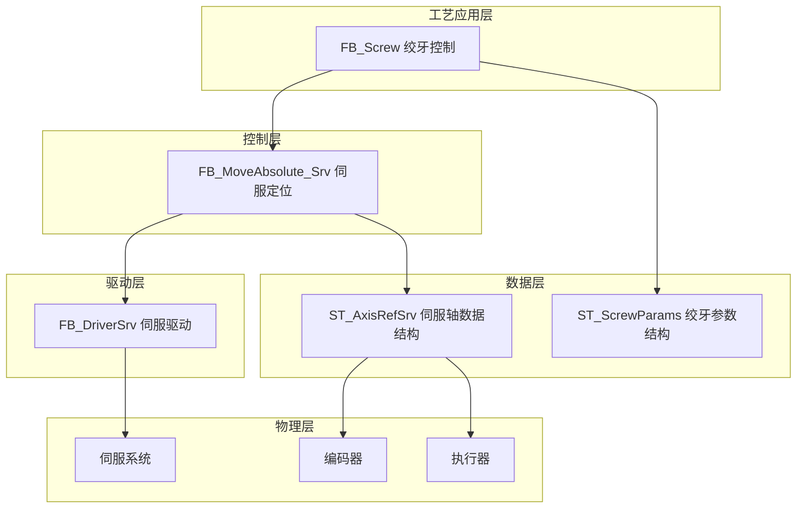
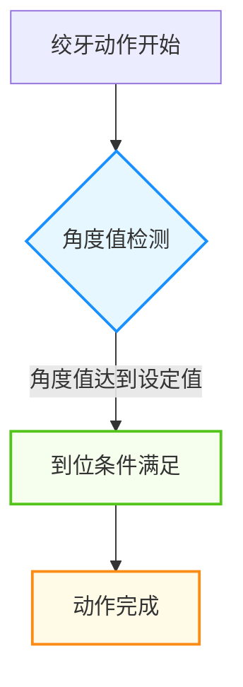
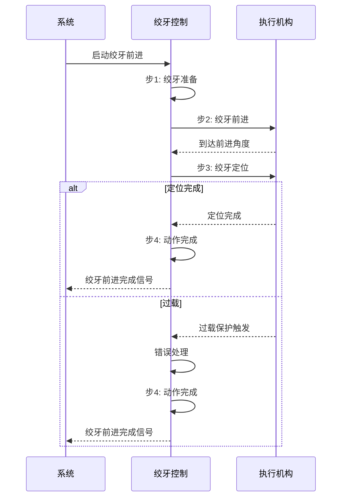
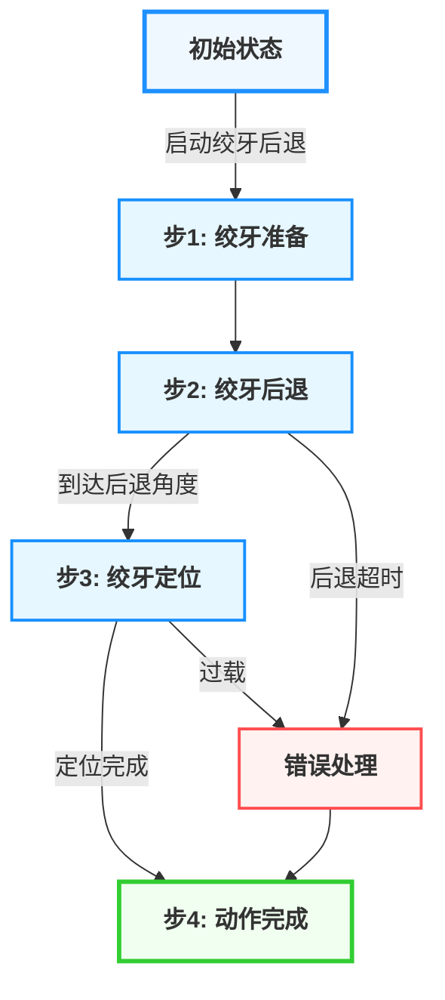

# 注塑机绞牙功能技术文档

## 1. 概述

### 1.1 功能简介

绞牙功能是注塑机的特殊功能之一，主要用于具有螺纹结构的塑料制品成型。该功能通过控制绞牙电机的旋转运动，实现螺纹型芯的旋转脱模，确保带有螺纹的产品能够顺利从模具中脱出而不损坏产品。绞牙功能通常与中子功能配合使用，是复杂注塑产品成型的重要技术手段。

### 1.2 工艺特点

- **旋转控制**：通过编码器精确控制绞牙旋转角度，实现螺纹型芯的精确脱模
- **同步控制**：支持与开模/合模动作的同步控制，确保绞牙动作与模具动作协调
- **过载保护**：包含压力控制和过载保护机制，防止电机过载损坏
- **多种模式**：支持位置控制、时间控制、压力控制等多种控制模式
- **平台兼容性**：支持Luban平台（基于Beremiz二次开发）运行，采用标准IEC 61131-3 ST语法实现
- **实时监控**：支持绞牙过程的实时监控和参数显示

### 1.3 技术架构

本功能采用分层架构设计，参考研发部提供的液压系统建模方案，结合倍福TF8560塑料技术功能标准，实现模块化、标准化设计。

---

## 2. 核心控制机制

### 2.1 到位检测机制

绞牙到位检测采用编码器角度检测机制，确保到位检测的可靠性：

1. **编码器角度检测**：通过编码器反馈的角度值判断
   - 触发条件：当前角度达到设定角度
   - 对应参数：CurrentAngle、AdvAngle、RetAngle

### 2.2 过载保护机制

绞牙过载保护是防止电机过载和设备损坏的重要安全机制：

1. **触发条件**：绞牙压力超过设定的过载保护压力时，系统将报警并停止动作
2. **保护逻辑**：过载保护触发后，绞牙电机立即停止，避免设备损坏
3. **参数控制**：通过OverloadPressure参数设置过载保护压力

### 2.3 同步控制机制

绞牙与开模/合模的同步控制是确保产品质量的重要机制：

1. **开模同步**：开模到达同步位置时，开始绞牙后退动作
2. **合模同步**：合模到达同步位置时，开始绞牙前进动作
3. **同步参数**：通过OpenSyncPos和CloseSyncPos参数设置同步位置

---

## 3. 功能阶段定义

### 3.1 绞牙前进功能阶段

| 阶段编号 | 阶段名称   | 主要功能             | 控制参数                    | 阶段转换条件       |
| -------- | ---------- | -------------------- | --------------------------- | ------------------ |
| 1        | 绞牙准备   | 初始化参数，准备动作 | 无                          | 启动信号触发       |
| 2        | 绞牙前进   | 旋转前进           | AdvSpeed、AdvPressure        | 到达前进角度       |
| 3        | 绞牙定位   | 精确定位           | PosSpeed                    | 定位完成           |
| 4        | 动作完成   | 完成信号输出         | 无                          | 定位完成           |

### 3.2 绞牙后退功能阶段

| 阶段编号 | 阶段名称   | 主要功能             | 控制参数             | 阶段转换条件       |
| -------- | ---------- | -------------------- | -------------------- | ------------------ |
| 1        | 绞牙准备   | 初始化参数，准备动作 | 无                   | 启动信号触发       |
| 2        | 绞牙后退   | 旋转后退           | RetSpeed、RetPressure | 到达后退角度       |
| 3        | 绞牙定位   | 精确定位           | PosSpeed             | 定位完成           |
| 4        | 动作完成   | 完成信号输出         | 无                   | 定位完成           |

---

## 4. 控制流程

### 4.1 绞牙前进过程流程

#### 4.1.1 绞牙前进流程示意图

#### 4.1.2 绞牙前进流程序列图

### 4.2 绞牙后退过程流程

#### 4.2.1 绞牙后退流程示意图

#### 4.2.2 绞牙后退流程序列图

> ⚠️ **重要说明**：
>
> 1. 绞牙前进动作必须在合模完成后执行，避免与合模动作干涉
> 2. 绞牙后退动作必须在开模到达同步位置后执行，确保模具打开足够距离
> 3. 绞牙角度应根据产品螺纹的导程和圈数精确计算

---

## 5. 数据结构与功能块

### 5.1 核心数据结构

#### 5.1.1 ST_ScrewParams 结构体

**用途**：封装绞牙的所有工艺参数

| 字段名                   | 类型 | 有效范围   | 初始值 | 说明                           |
| ------------------------ | ---- | ---------- | ------ | ------------------------------ |
| `iAdvAngle`          | INT  | 0-36000   | 7200   | 绞牙前进角度(度*100)          |
| `iAdvSpeed`          | INT  | 0-10000   | 500    | 绞牙前进速度(rpm*10)          |
| `iAdvPressure`       | INT  | 0-1000    | 400    | 绞牙前进压力(bar*10)          |
| `iAdvTimeLimit`      | INT  | 0-100     | 30     | 绞牙前进时间限制(s*10)         |
| `iRetAngle`          | INT  | 0-36000   | 0      | 绞牙后退角度(度*100)          |
| `iRetSpeed`          | INT  | 0-10000   | 600    | 绞牙后退速度(rpm*10)          |
| `iRetPressure`       | INT  | 0-1000    | 450    | 绞牙后退压力(bar*10)          |
| `iRetTimeLimit`      | INT  | 0-100     | 30     | 绞牙后退时间限制(s*10)         |
| `iPosAngle`          | INT  | 0-36000   | 0      | 绞牙定位角度(度*100)          |
| `iPosSpeed`          | INT  | 0-5000    | 100    | 绞牙定位速度(rpm*10)          |
| `iOverloadPressure`  | INT  | 0-1000    | 600    | 绞牙过载保护压力(bar*10)      |
| `iOpenSyncPos`       | INT  | 0-10000   | 5000   | 开模同步位置(mm*10)           |
| `iCloseSyncPos`      | INT  | 0-10000   | 100    | 合模同步位置(mm*10)           |
| `iWaitTime`          | INT  | 0-100     | 10     | 绞牙等待时间(s*10)             |

### 5.2 功能块定义

#### 5.2.1 FB_Screw 功能块

**用途**：完整的绞牙控制功能块，集成绞牙前进、后退和定位控制
**指令格式**：

| 指令            | 名称 | FB/FC | LD/FBD表示             | ST表现                 | 说明 |
| --------------- | ---- | ----- | ---------------------- | ---------------------- | ---- |
| `FB_Screw0`  | 绞牙 | FB    |  |  | -    |

**输入输出参数**：

| 参数名       | 名称   | 类型 | 有效范围 | 初始值 | 说明       |
| ------------ | ------ | ---- | -------- | ------ | ---------- |
| `ScrewAxis` | 绞牙轴 |      | -        | -      | 绞牙轴引用 |

**输入参数**：

| 参数名                | 名称             | 类型    | 有效范围     | 初始值 | 说明                                     |
| --------------------- | ---------------- | ------- | ------------ | ------ | ---------------------------------------- |
| `bExecute`           | 执行触发         | BOOL    | FALSE,TRUE   | FALSE  | 执行触发信号，上升沿启动                 |
| `iMode`              | 绞牙模式         | INT     | 0-2          | 0      | 绞牙模式 (0: 停止, 1: 绞牙前进, 2: 绞牙后退) |
| `stScrewParams`       | 绞牙参数         | ST_ScrewParams | -    | -      | 上位机设定参数输入                       |
| `bAutoMode`          | 自动模式         | BOOL    | FALSE,TRUE   | FALSE  | 自动模式标志                             |
| `bManualMode`        | 手动模式         | BOOL    | FALSE,TRUE   | TRUE   | 手动模式标志                             |
| `bFunctionEnable`     | 功能使能         | BOOL    | FALSE,TRUE   | TRUE   | 绞牙功能使能                             |
| `bAdvCmd`            | 绞牙前进命令     | BOOL    | FALSE,TRUE   | FALSE  | 绞牙前进命令                             |
| `bRetCmd`            | 绞牙后退命令     | BOOL    | FALSE,TRUE   | FALSE  | 绞牙后退命令                             |
| `bAtAdvEnd`          | 绞牙前进终点     | BOOL    | FALSE,TRUE   | FALSE  | 绞牙前进终点信号                         |
| `bAtRetEnd`          | 绞牙后退终点     | BOOL    | FALSE,TRUE   | FALSE  | 绞牙后退终点信号                         |
| `rCurrentAngle`       | 当前角度         | REAL    | 0.0-360.0   | 0.0    | 当前角度(度)                             |
| `rCurrentPressure`    | 当前压力         | REAL    | 0.0-1000.0   | 0.0    | 当前压力(bar)                            |

**输出参数**：

| 参数名                  | 名称             | 类型   | 有效范围     | 初始值 | 说明           |
| ----------------------- | ---------------- | ------ | ------------ | ------ | -------------- |
| `bAdvOut`              | 绞牙前进输出     | BOOL   | FALSE,TRUE   | FALSE  | 绞牙前进输出   |
| `bRetOut`              | 绞牙后退输出     | BOOL   | FALSE,TRUE   | FALSE  | 绞牙后退输出   |
| `iPressureOut`         | 压力输出         | INT    | 0-1000       | 0      | 压力输出(bar*10) |
| `bInProgress`          | 正在运行         | BOOL   | FALSE,TRUE   | FALSE  | 正在运行标志   |
| `bAdvancingInProgress`  | 绞牙前进中       | BOOL   | FALSE,TRUE   | FALSE  | 绞牙前进中标志 |
| `bRetreatingInProgress`  | 绞牙后退中       | BOOL   | FALSE,TRUE   | FALSE  | 绞牙后退中标志 |
| `bPositioningInProgress` | 定位中           | BOOL   | FALSE,TRUE   | FALSE  | 定位中标志     |
| `bCommandComplete`     | 命令完成         | BOOL   | FALSE,TRUE   | FALSE  | 命令完成信号   |
| `bError`               | 错误状态         | BOOL   | FALSE,TRUE   | FALSE  | 错误信号       |
| `iErrorCode`            | 错误代码         | INT    | 0-65535      | 0      | 错误代码       |

### 5.3 枚举类型定义

#### 5.3.1 绞牙状态 E_ScrewState

| 值 | 名称                 | 说明         |
| -- | -------------------- | ------------ |
| 0  | eState_Idle          | 空闲状态     |
| 1  | eState_Prepare       | 准备状态     |
| 2  | eState_Advancing     | 绞牙前进中   |
| 3  | eState_Retreating    | 绞牙后退中   |
| 4  | eState_Positioning   | 定位中       |
| 5  | eState_Complete      | 完成状态     |
| 6  | eState_Error         | 错误状态     |

---

## 6. 核心参数说明

### 6.1 绞牙前进关键参数

| 参数类别 | 参数名称       | 程序变量名  | 功能说明                     |
| -------- | -------------- | ----------- | ---------------------------- |
| 位置参数 | 绞牙前进角度   | iAdvAngle   | 绞牙前进的总旋转角度(度*100) |
| 速度参数 | 绞牙前进速度   | iAdvSpeed   | 绞牙前进的旋转速度(rpm*10)   |
| 压力参数 | 绞牙前进压力   | iAdvPressure| 绞牙前进的压力设定(bar*10)   |
| 时间参数 | 绞牙前进时间限制 | iAdvTimeLimit| 绞牙前进的时间限制(s*10)     |

### 6.2 绞牙后退关键参数

| 参数类别 | 参数名称       | 程序变量名  | 功能说明                     |
| -------- | -------------- | ----------- | ---------------------------- |
| 位置参数 | 绞牙后退角度   | iRetAngle   | 绞牙后退的总旋转角度(度*100) |
| 速度参数 | 绞牙后退速度   | iRetSpeed   | 绞牙后退的旋转速度(rpm*10)   |
| 压力参数 | 绞牙后退压力   | iRetPressure| 绞牙后退的压力设定(bar*10)   |
| 时间参数 | 绞牙后退时间限制 | iRetTimeLimit| 绞牙后退的时间限制(s*10)     |

### 6.3 定位参数

| 参数类别 | 参数名称     | 程序变量名 | 功能说明                   |
| -------- | ------------ | ----------- | -------------------------- |
| 位置参数 | 绞牙定位角度 | iPosAngle   | 绞牙精确定位的角度(度*100) |
| 速度参数 | 绞牙定位速度 | iPosSpeed   | 绞牙精确定位的速度(rpm*10)   |

### 6.4 过载保护参数

| 参数类别 | 参数名称         | 程序变量名      | 功能说明                   |
| -------- | ---------------- | ------------- | -------------------------- |
| 压力参数 | 绞牙过载保护压力 | iOverloadPressure | 绞牙过载保护压力(bar*10) |

### 6.5 同步参数

| 参数类别 | 参数名称       | 程序变量名  | 功能说明                   |
| -------- | -------------- | ----------- | -------------------------- |
| 位置参数 | 开模同步位置   | iOpenSyncPos | 开模同步位置(mm*10)     |
| 位置参数 | 合模同步位置   | iCloseSyncPos| 合模同步位置(mm*10)     |

### 6.6 其他参数

| 参数类别 | 参数名称     | 程序变量名 | 功能说明           |
| -------- | ------------ | ----------- | ------------------ |
| 时间参数 | 绞牙等待时间 | iWaitTime   | 绞牙等待时间(s*10) |

> ⚠️ **重要说明**：
>
> 1. 所有角度参数使用INT类型存储，单位为度*100
> 2. 所有速度参数使用INT类型存储，单位为rpm*10
> 3. 所有压力参数使用INT类型存储，单位为bar*10
> 4. 绞牙角度应根据产品螺纹的导程和圈数精确计算
> 5. 新模具首次使用时应预留一定的调整余量

---

## 7. 功能块实现

### 7.1 FB_Screw 实现详解

#### 7.1.1 核心逻辑

1. **状态管理**：使用 `E_ScrewState` 枚举类型管理绞牙的各种状态
2. **模式控制**：根据 `iMode` 参数选择绞牙前进或后退模式
3. **阶段控制**：
   - 绞牙前进：准备 → 前进 → 定位 → 完成
   - 绞牙后退：准备 → 后退 → 定位 → 完成
4. **同步控制**：根据开模/合模同步位置控制绞牙动作启动时机
5. **到位判断**：通过编码器角度值判断到位
6. **安全保护**：包含超时保护、过载保护等安全机制

#### 7.1.2 状态转换逻辑

- **绞牙前进流程**：空闲状态 → 准备状态 → 绞牙前进中 → 定位中 → 完成状态
- **绞牙后退流程**：空闲状态 → 准备状态 → 绞牙后退中 → 定位中 → 完成状态
- **错误处理**：任何状态 → 错误状态（发生错误时）

---

## 8. 安全保护机制

### 8.1 超时保护

| 项目     | 说明                                                          |
| -------- | ------------------------------------------------------------- |
| 触发条件 | 绞牙动作时间超过设定的时间限制                                |
| 响应措施 | 触发错误报警，停止当前动作                                    |
| 参数控制 | 通过 iAdvTimeLimit 和 iRetTimeLimit 参数设置时间限制          |

### 8.2 过载保护

| 项目     | 说明                                           |
| -------- | ---------------------------------------------- |
| 触发条件 | 绞牙压力超过设定的过载保护压力           |
| 响应措施 | 触发错误报警，停止当前动作                     |
| 参数控制 | 通过 iOverloadPressure 参数设置过载保护压力        |

### 8.3 状态互锁

| 项目     | 说明                                                     |
| -------- | -------------------------------------------------------- |
| 互锁机制 | 绞牙前进和后退动作互锁，避免同时输出                     |
| 实现方式 | 在功能块逻辑中确保 AdvOut 和 RetOut 不同时为 TRUE        |
| 优势     | 防止执行机构冲突，保护设备安全                           |

### 8.4 错误代码说明

| 错误代码 | 名称                       | 说明           |
| -------- | -------------------------- | -------------- |
| 1801     | cError_ScrewAdvTimeout   | 绞牙前进超时错误 |
| 1802     | cError_ScrewRetTimeout   | 绞牙后退超时错误 |
| 1803     | cError_ScrewOverload     | 过载保护错误   |
| 1804     | cError_ScrewPosition     | 位置检测错误   |

---

## 9. 平台兼容性

本小节内容与开合模功能基本一致，详细操作说明请参考开合模功能章节。

---

## 10. 参数调整指南

### 10.1 位置参数调整

1. **绞牙前进角度**：
   - 根据产品螺纹的导程和圈数精确计算
   - 新模具首次使用时应预留一定的调整余量
   - 绞牙原点位置应定期校准

2. **绞牙后退角度**：
   - 通常设置为0或接近0的角度，确保螺纹型芯完全复位

3. **绞牙定位角度**：
   - 根据产品要求设置精确定位角度
   - 定位阶段应使用较低速度以确保定位精度

### 10.2 速度参数调整

1. **绞牙前进速度**：
   - 根据产品材料特性和螺纹结构调整
   - 高粘度材料或复杂螺纹应使用较低的绞牙速度

2. **绞牙后退速度**：
   - 通常设置较高，以提高生产效率

3. **绞牙定位速度**：
   - 定位阶段应使用较低速度以确保定位精度

### 10.3 压力参数调整

1. **绞牙前进压力**：
   - 绞牙压力应足够但不宜过高，避免电机过载
   - 不同材料和螺纹结构需要不同的压力设置

2. **绞牙后退压力**：
   - 通常设置略高于绞牙前进压力，确保螺纹型芯可靠复位

3. **绞牙过载保护压力**：
   - 过载保护压力应设置为正常工作压力的1.2-1.5倍

### 10.4 时间参数调整

1. **时间限制**：
   - 应根据实际动作时间适当设置，避免频繁触发错误
   - 一般设置为实际动作时间的1.5-2倍

2. **等待时间**：
   - 根据工艺要求设置，确保与其他动作的时序协调

### 10.5 同步参数调整

1. **开模同步位置**：
   - 应确保模具打开足够距离，避免干涉

2. **合模同步位置**：
   - 应确保模具闭合足够紧密，保证产品质量

3. **同步时机的调整**：
   - 直接影响产品质量和生产效率

---

## 11. 调试与故障排除

### 11.1 常见故障处理

| 故障现象       | 可能原因                         | 解决方法                           |
| -------------- | -------------------------------- | ---------------------------------- |
| 绞牙动作超时   | 压力不足、负载过大、角度检测故障 | 检查压力参数、负载情况、编码器   |
| 绞牙不到位     | 角度参数设置不当、编码器故障     | 调整角度参数、检查编码器           |
| 过载保护触发   | 负载过大、压力参数设置不当     | 检查负载情况、调整压力参数       |
| 动作不顺畅     | 速度压力参数设置不当             | 调整速度压力参数                   |
| 同步时机错误   | 同步位置参数设置不当             | 调整同步位置参数                   |
| 错误信号触发   | 时间限制设置过短                 | 适当增加时间限制参数               |

### 11.2 调试建议

1. **手动模式调试**：
   - 在手动模式下，分别测试绞牙前进和后退动作
   - 观察角度检测信号，确保到位检测可靠

2. **自动模式调试**：
   - 测试绞牙与开模/合模的同步控制
   - 观察各阶段的切换情况

3. **参数记录**：
   - 记录调试过程中的参数变化，便于优化
   - 进行多次测试，确保动作稳定性

4. **定期校准**：
   - 定期校准绞牙角度和位置
   - 定期检查绞牙电机和传动机构

---

## 12. 数据流说明

本小节内容与开合模功能基本一致，详细操作说明请参考开合模功能章节。

---

## 13. 相关文档与参考

### 13.1 功能块实现文件

- FB_Screw.st：绞牙控制功能块实现
- ST_ScrewParams：绞牙参数结构体定义
- E_ScrewState：绞牙状态枚举定义
- ST_AxisRefSrv：伺服轴数据结构体定义
- FB_DriverSrv：伺服驱动功能块

### 13.2 技术文档与命名规范

本小节内容与开合模功能基本一致，详细操作说明请参考开合模功能章节。

---

## 14. 文档信息

**适用范围**：立式注塑机绞牙控制功能开发项目
**数据定义基准**：数据定义初版.st v1.0

### 14.1 版本控制

| 版本 | 日期       | 作者      | 变更说明                                                                                         |
| ---- | ---------- | --------- | ------------------------------------------------------------------------------------------------ |
| 1.0  | 2025-08-22 | 汪工      | 初始版本，完成基本功能描述                                                                       |
| 1.1  | 2026-03-20 | 周工/汪工 | 调整文档结构，优化内容组织； 更新数据结构定义，确保与代码一致性； 优化文档格式，添加页内导航支持 |
| 1.2  | 2026-04-02 | 周工/汪工 | uiAlarmID改为dwAlarmID |

