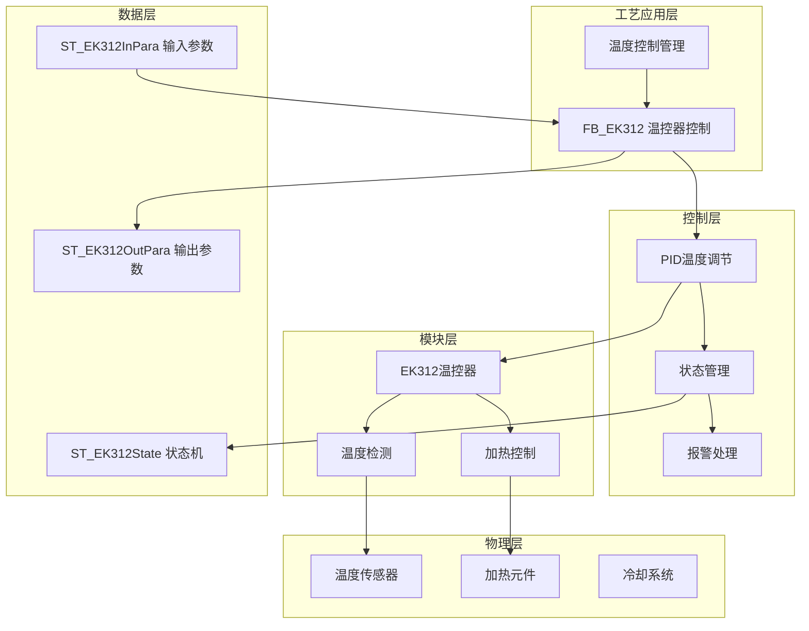

# 注塑机温度功能

## 1. 概述

### 1.1 功能简介

  
⚙️

  <strong>核心功能</strong>
  
温度功能是注塑机的关键功能之一，负责控制料筒、模具和其他加热部件的温度。精确的温度控制对于塑料的塑化质量、流动性能和最终产品质量至关重要。本功能通过多级温度控制和精确的温度调节，确保注塑过程中温度参数的稳定性和一致性。

### 1.2 工艺特点

  <h4>工艺特性</h4>
  <ul>
    <li><strong>多级温度控制</strong>：支持料筒多段温度控制，确保塑料在不同区域的塑化质量</li>
    <li><strong>EK312温控器</strong>：集成EK312温控器，提供12段温度控制，满足复杂模具的温度需求，实现精确检测和控制</li>
    <li><strong>预热功能</strong>：支持定时预加热，提高生产效率</li>
    <li><strong>温度保护</strong>：具备超温、低温报警和保护功能，确保设备安全</li>
    <li><strong>平台兼容性</strong>：支持Luban平台（基于Beremiz二次开发）运行，采用标准IEC 61131-3 ST语法实现</li>
  </ul>

### 1.3 技术架构

本功能采用分层架构设计，结合EK312温控器，实现模块化、标准化的温度控制系统。

## 2. 功能组成

### 2.1 料筒温度控制
- **料筒前段温度**：控制料筒前端的加热温度
- **料筒中段温度**：控制料筒中部的加热温度
- **料筒后段温度**：控制料筒后部的加热温度
- **喷嘴温度**：控制喷嘴部分的加热温度
- **法兰温度**：控制法兰连接部分的加热温度

### 2.2 模具温度控制
- **模具温度**：控制模具的加热/冷却温度
- **热流道温度**：控制热流道系统的加热温度
- **模温机控制**：控制外接模温机的工作状态
- **EK312温控器**：提供12段温度控制功能，用于模具加热

### 2.3 预热控制功能
- **定时加热**：可设置一周七天的定时预加热功能
- **预开/预关时间**：可设定每天的加热开启和关闭时间
- **自动化预热**：在操作员上班前自动将料筒加热到工作温度

### 2.4 温度监控与保护
- **温度显示**：实时显示各温度点的实际温度
- **温度偏差监控**：监控实际温度与设定温度的偏差
- **超温保护**：防止温度超过安全范围
- **低温报警**：检测温度过低的异常情况
- **温度曲线记录**：记录温度变化曲线

## 3. 参数说明

### 3.1 触摸屏参数设置界面
#### 3.1.1 基础温度设置界面
在触摸屏上按【温度 TEMP.】键，将进入基础温度设定页面。界面显示以下主要参数：
- 实际温度显示（射咀、一段至九段）
- 状态显示（正常/异常）
- 设定温度（射咀、一段至九段）
- 上限值（射咀、一段至九段）
- 下限值（射咀、一段至九段）
- 射咀方式选择（开环/闭环）
- 开环控制周期
- 螺杆冷启动时间
- 保温功能（可用/不可用）
- 保温低于设定值

#### 3.1.2 EK312温控器设置界面
EK312温控器提供12段温度控制，界面显示以下主要参数：
- 实际温度显示（1-12段）
- 状态显示（正常/异常）
- 设定温度（1-12段）
- P值设定（1-12段）
- D值设定（1-12段）
- 上限值（1-12段）
- 下限值（1-12段）
- 功能选择（1-12段，0:不用 1:使用）

#### 3.1.3 预热设置界面
在触摸屏上按【温度 TEMP.】键三次，将进入预热设定页面。界面显示以下主要参数：
- 定时加温：选择"不用"或"使用"定时加热功能
- 星期设置：日、一、二、三、四、五、六
- 预开功能：各星期的预开功能开关（OFF/ON）
- 预开时间：可设置三个不同的预开时间段（00:00~23:59）
- 预关功能：各星期的预关功能开关（OFF/ON）
- 预关时间：设置预关时间（00:00~23:59）

### 3.2 温度设定参数
- **料筒前段温度设定**：料筒前端的目标温度
- **料筒中段温度设定**：料筒中部的目标温度
- **料筒后段温度设定**：料筒后部的目标温度
- **喷嘴温度设定**：喷嘴部分的目标温度
- **模具温度设定**：模具的目标温度
- **热流道温度设定**：热流道系统的目标温度
- **EK312温控器温度设定**：EK312温控器提供12段温度设定，用于模具加热

### 3.3 温度控制参数
- **温度控制方式**：PID控制参数设置
- **加热输出比例**：加热元件的输出比例
- **冷却控制参数**：冷却系统的控制参数
- **温度采样周期**：温度检测的采样时间间隔
- **射咀控制方式**：可选择"开环"或"闭环"控制方式，闭环控制精度更高
- **开环控制周期**：射咀采用开环控制时的控制周期时间
- **螺杆冷启动**：开机后各段实际温度第一次均到达设定范围内并保持设定时间，确保安全启动
- **保温功能**：可选择"使用"或"不用"，选择使用时，实际设定温度为设定温度减去保温低于设定值
- **EK312温控器控制参数**：

| 参数名称 | 程序变量名 | 数据类型 | 功能说明 |
|----------|-----------|----------|--------|
| 站号 | uiStationNo | UINT | 站号 |
| 单双三色选择 | uiColorSelect | UINT | 单双三色选择 |
| A色开选择 | uiAColor | UINT | A色开选择 |
| B色开选择 | uiBColor | UINT | B色开选择 |
| C色开选择 | uiCColor | UINT | C色开选择 |
| A色射咀方式 | uiANozMode | UINT | A色射咀方式 |
| B色射咀方式 | uiBNozMode | UINT | B色射咀方式 |
| C色射咀方式 | uiCNozMode | UINT | C色射咀方式 |
| A色射咀百分比 | uiANozPerc | UINT | A色射咀百分比 |
| B色射咀百分比 | uiBNozPerc | UINT | B色射咀百分比 |
| C色射咀百分比 | uiCNozPerc | UINT | C色射咀百分比 |
| 接触器和固态继电器选择 | uiContSSR | UINT | 接触器和固态继电器选择 |
| 射咀控制周期 | uiNozCtrlCycle | UINT | 射咀控制周期 |

### 3.4 温度保护参数
- **温度上偏差**：温度允许的正向偏差值（上限值），默认为10.0℃
- **温度下偏差**：温度允许的负向偏差值（下限值），默认为10.0℃
- **超温报警温度**：触发超温报警的温度值
- **超温保护温度**：触发超温保护停机的温度值
- **低温报警温度**：触发低温报警的温度值
- **温度偏差报警值**：允许的最大温度偏差
- **加热超时设定**：温度达到设定值的最大允许时间
- **EK312温控器温度保护**：EK312温控器具备温度上下限保护和状态监控功能

### 3.5 其他参数
- **温度校准参数**：温度传感器的校准参数
- **温度显示单位**：温度显示的单位选择（摄氏度/华氏度）
- **预热时间设定**：开机后的预热时间
- **EK312温控器输入输出地址**：
  - 输入地址（aInputAddr）：50个输入地址
  - 输出地址（aOutputAddr）：100个输出地址

## 4. 温度参数映射表

### 4.1 EK312温控器温度参数映射

> **说明**：本节以第1段为例，第2-12段参数结构相同，仅需将数组索引`[1]`替换为对应段数索引`[2]`至`[12]`。

| 触摸屏显示 | 程序变量名 | 默认值 | 单位 | 功能说明 |
|----------|-----------|-------|------|--------|
| EK312第1段温度设定 | stInPara.aSeg[1].uiSetTemp | 0 | °C | 温度设定值 |
| EK312第1段功能 | stInPara.aSeg[1].uiFunc | 0 | - | 功能选择（0:不用 1:使用） |
| EK312第1段P值 | stInPara.aSeg[1].uiP | 0 | - | P值 |
| EK312第1段D值 | stInPara.aSeg[1].uiD | 0 | - | D值 |
| EK312第1段上限 | stInPara.aSeg[1].uiMax | 0 | °C | 温度上限 |
| EK312第1段下限 | stInPara.aSeg[1].uiMin | 0 | °C | 温度下限 |
### 4.2 EK312温控器控制参数映射
| 触摸屏显示 | 程序变量名 | 默认值 | 单位 | 功能说明 |
|----------|-----------|-------|------|--------|
| EK312站号 | stInPara.uiStationNo | 0 | - | EK312站号 |
| 单双三色选择 | stInPara.uiColorSelect | 0 | - | 单双三色选择 |
| A色开选择 | stInPara.uiAColor | 0 | - | A色开选择 |
| B色开选择 | stInPara.uiBColor | 0 | - | B色开选择 |
| C色开选择 | stInPara.uiCColor | 0 | - | C色开选择 |
| A色射咀方式 | stInPara.uiANozMode | 0 | - | A色射咀方式 |
| B色射咀方式 | stInPara.uiBNozMode | 0 | - | B色射咀方式 |
| C色射咀方式 | stInPara.uiCNozMode | 0 | - | C色射咀方式 |
| A色射咀百分比 | stInPara.uiANozPerc | 0 | % | A色射咀百分比 |
| B色射咀百分比 | stInPara.uiBNozPerc | 0 | % | B色射咀百分比 |
| C色射咀百分比 | stInPara.uiCNozPerc | 0 | % | C色射咀百分比 |
| 接触器和固态继电器选择 | stInPara.uiContSSR | 0 | - | 接触器和固态继电器选择 |
| 射咀控制周期 | stInPara.uiNozCtrlCycle | 0 | ms | 射咀控制周期 |

### 4.3 EK312温控器状态参数映射

> **说明**：本节以第1段为例，第2-12段参数结构相同。

| 触摸屏显示 | 程序变量名 | 默认值 | 单位 | 功能说明 |
|----------|-----------|-------|------|--------|
| EK312第1段实际温度 | stOutPara.aSeg[1].uiActualTemp | 0 | °C | 实际温度值 |
| EK312第1段状态 | stOutPara.aSeg[1].uiState | 0 | - | 状态（0:正常 1:偏低 2:偏高 3:断线） |
| 温度加热状态 | uiHeatState | 0 | - | 加热状态 |
| 版本号 | uiVersion | 0 | - | 版本号 |
| 报警ID | dwAlarmID | 0 | - | 报警代码 |

## 5. 控制流程

### 5.1 温度加热流程
1. **温度设定**：设定各加热区域的目标温度
2. **加热启动**：启动加热系统
3. **温度监控**：实时监控各温度点的实际温度
4. **PID调节**：根据温度偏差进行PID调节
5. **温度稳定**：温度达到设定值并保持稳定
6. **保温控制**：维持温度在设定范围内

### 5.2 EK312温控器控制流程
1. **温控器初始化**：系统对EK312温控器进行初始化（eState_Init）
2. **参数设置**：设置EK312温控器的站号、控制参数等
3. **温度设定**：设定12段温度的目标值、P值、D值等参数
4. **启动控制**：通过bStart命令启动EK312温控器（进入eState_Heating状态）
5. **温度监控**：实时监控12段温度的实际值和状态
6. **PID调节**：根据温度偏差进行PID调节
7. **状态管理**：根据温度状态进行相应处理
8. **异常处理**：当温度异常时，进入eState_Error状态并触发报警
9. **停止控制**：通过bStop命令停止EK312温控器（进入eState_Idle状态）

### 5.3 预热控制流程
1. **进入预热设置**：按【温度 TEMP.】键三次进入预热设定页面
2. **功能启用**：将定时加温设置为"使用"状态
3. **时间设置**：
   - 选择需要预加热的星期（日至六）
   - 设置预开功能为ON
   - 设置三个预开时间段（00:00~23:59）
   - 根据需要设置预关功能和预关时间
4. **自动执行**：系统根据设定的时间自动控制加热系统的开启和关闭
5. **温度准备**：在操作员上班前，系统自动将料筒加热到工作温度

### 5.4 温度保护流程
1. **温度检测**：检测各温度点的实际温度
2. **异常判断**：判断温度是否超出允许范围
3. **报警处理**：根据异常类型发出相应报警
4. **保护动作**：必要时启动保护停机
5. **恢复处理**：温度恢复正常后的处理

## 6. 参数调整原则

### 6.1 温度设定调整
- 料筒温度应根据材料类型和特性设定
- 料筒温度分布通常采用后段到前段逐渐升高的梯度
- 模具温度应根据产品结构和材料要求设定
- 热流道温度应略高于料筒最高温度
- EK312温控器温度设定应根据模具加热要求设定，不同模具区域可能需要不同的温度值
- 预热时间设定应考虑料筒尺寸和环境温度，确保在操作员上班前达到工作温度

### 6.2 PID参数调整
- 比例参数(P)：影响温度响应速度和稳定性
- 积分参数(I)：消除温度静差
- 微分参数(D)：减小温度波动
- 不同加热区域可能需要不同的PID参数
- 射咀闭环控制时需要调整PID参数以获得最佳控制效果

### 6.3 保护参数调整
- 超温保护温度应设置为比正常工作温度高10-20℃
- 低温报警温度应设置为比正常工作温度低5-10℃
- 温度偏差报警值应根据工艺要求设置，通常为±3-5℃

## 7. 功能实现

### 7.1 温度检测
- 使用高精度温度传感器检测各加热区域温度
- 实现温度信号的采集和转换
- 设计温度信号的滤波处理电路
- EK312温控器：使用EK312温控器实现12段温度的精确检测和控制

### 7.2 温度控制
- 采用PID控制算法实现精确温度控制
- 设计加热和冷却的复合控制逻辑
- 实现多区域温度的独立控制
- EK312温控器：通过FB_EK312功能块实现12段温度的PID控制

### 7.3 温度监控与保护
- 设计温度异常的实时检测算法
- 实现分级温度保护机制
- 设计温度数据的实时显示和记录功能
- EK312温控器：通过状态机（ST_EK312State）实现温度异常的实时监控和处理

## 8. 注意事项

1. **温度均匀性**：确保各加热区域温度分布均匀
2. **传感器校准**：定期校准温度传感器以确保准确性
3. **加热元件维护**：定期检查和更换加热元件
4. **冷却系统维护**：确保冷却系统正常工作
5. **材料适应性**：不同材料需要不同的温度设置
6. **安全操作**：高温部件操作时注意安全防护
7. **温度精度**：温度设定值精度为0.1℃[摄氏度]，注意精确调整
8. **热电偶选择**：立式机料筒温度经K型/J型[可选]热电偶线反馈至控制系统
9. **温度保护**：温度低于下限时不能进行射出、储料等动作，防止冷螺杆起动
10. **射咀控制方式**：根据需要选择射咀的"开环"或"闭环"控制方式
11. **保温功能**：使用保温功能时，实际设定温度为设定温度减去保温低于设定值
12. **EK312温控器**：提供12段温度控制，专为模具加热设计，需根据模具要求合理设置
13. **预热功能**：使用定时加热功能时，可设置一周七天的预加热计划，减少操作员等待时间
14. **时间设置**：预热时间采用24小时制，00:00表示午夜12:00，设置时注意区分上午和下午时间
15. **EK312温控器注意事项**：
    - 确保EK312温控器正确安装和接线
    - 定期检查EK312温控器的通信状态
    - 合理设置EK312温控器的站号和控制参数
    - 注意EK312温控器的输入输出地址分配
    - 当EK312温控器出现报警时，及时检查温度传感器和加热元件

## 9. 相关文档

- 《14_系统参数配置与触摸屏映射.md》：温度参数配置和映射关系（详见文档2.1、2.2和2.3节）
- 《技术实现文档.md》：温度功能的技术实现细节
- 《注塑机触摸屏界面详细说明.md》：触摸屏上的温度显示界面
- 《调试指南.md》：温度功能的调试和故障排除
- 《辅助功能参数配置与触摸屏映射.md》：辅助功能参数配置参考

---

## 10. 版本信息

### 10.1 版本控制

  <h4>版本历史</h4>
  
文档的版本变更记录，跟踪文档的演进过程。

| 版本 | 日期       | 作者      | 变更说明                                                                                         |
| ---- | ---------- | --------- | ------------------------------------------------------------------------------------------------ |
| 1.0  | 2025-08-17 | 汪工      | 初始版本，完成基本功能描述                                                                       |
| 1.1  | 2026-03-23 | 周工/汪工 | 简化变量名称，添加提示信息，提高代码可读性和一致性； 优化Mermaid图表样式                         |
| 1.2  | 2026-03-27 | 周工/汪工 | uiAlarmID改为DWORD按位标识，支持同时报告多个报警                                                 |
| 1.3  | 2026-03-30 | 周工/汪工 | 统一使用EK312温控器术语，删除外扩温度重复表述； 完善EK312温控器参数映射和控制流程                |
