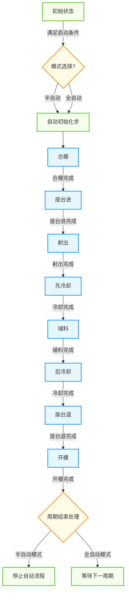
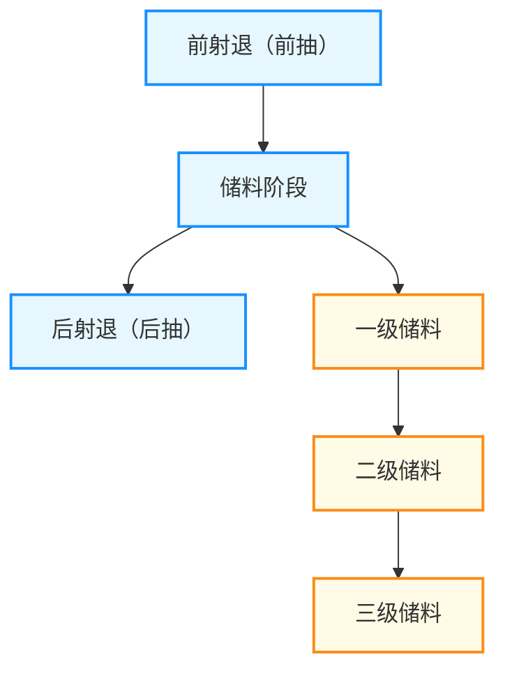

# 注塑机自动流程功能整理文档

## 文档信息
- **版本**: 1.0
- **更新日期**: 2025-12-13
- **适用平台**: Beremiz PLC编程环境
- **文档状态**: 已完成

---

## 1. 功能概述

自动流程是注塑机的核心生产模式，通过预设的动作序列自动完成完整的注塑成型周期。该功能实现了从合模到开模的全自动化控制，提高生产效率并保证产品质量一致性。

- **半自动模式**: 完成一个生产周期后自动停止，等待操作员再次启动
- **全自动模式**: 连续执行生产周期，循环运行
- **流程控制**: 精确控制各动作的顺序、参数和转换条件
- **兼容性**: 支持Beremiz平台运行，与各功能模块无缝集成

## 2. 核心流程说明

自动流程包含完整的注塑成型周期，主要动作步骤如下：

1. **初始步**: 系统准备就绪，等待启动条件
2. **模式选择**: 选择半自动或全自动模式
3. **自动初始化步**: 在模式选择之后，合模之前执行的初始化操作
4. **合模**: 执行模具闭合动作，完成高压锁模
5. **座台进**: 座台前进至注射位置
6. **射出**: 执行注射动作，将塑料熔体注入模具
7. **先冷却**: 注射完成后进入保压冷却阶段
8. **储料**: 完整储料过程包括：前射退（前抽）-》储料-》后射退（后抽），为下一周期准备塑料熔体
9. **后冷却**: 继续冷却确保产品充分固化
10. **座台退**: 座台后退至初始位置
11. **开模**: 执行模具打开动作，完成开模到位
12. **周期结束**: 根据模式选择进入下一周期或停止

## 3. 流程图

### 3.1 自动/半自动完整流程

### 3.2 错误处理说明

在自动流程执行过程中，若任何步骤发生错误，系统将执行以下处理：

1. **错误检测**: 各功能模块实时监控执行状态
2. **错误类型**:
   - 合模错误：合模未完成、低压保护触发
   - 座台错误：座台进/退不到位
   - 射出错误：射出压力异常、位置偏差
   - 冷却超时：冷却时间超过设定值
   - 储料错误：储料不到位、压力异常
   - 开模错误：开模未完成、位置异常
3. **错误处理动作**:
   - 立即停止当前动作
   - 记录错误代码和位置
   - 触发报警提示
   - 半自动模式：停止自动流程
   - 全自动模式：暂停并等待处理

## 4. 流程详细说明

### 4.1 启动条件

进入自动流程需满足以下条件：

| 条件类型 | 具体要求 | 参数/信号 |
|---------|---------|---------|
| **安全条件** | 安全门关闭 | DI安全门信号 |
| | 液压系统正常 | 压力传感器信号 |
| | 温度达到设定值 | 各段温度信号 |
| **系统状态** | 无故障报警 | 报警状态标志 |
| | 手动操作已完成 | 手动模式标志 |

### 4.2 各步骤转换条件

| 步骤名称 | 转换条件 | 对应功能模块 |
|---------|---------|------------|
| 初始步 → 模式选择 | 满足所有启动条件 | - |
| 模式选择 → 自动初始化 | 自动/半自动按钮触发 | - |
| 自动初始化 → 合模 | 初始化完成 | FB_MoldClose |
| 合模 → 座台进 | 合模完成信号 | FB_NozzleAdvance |
| 座台进 → 射出 | 座台进完成信号 | FB_Injection |
| 射出 → 先冷却 | 射出完成信号 | 冷却计时器 |
| 先冷却 → 储料 | 先冷却时间到达 | FB_Charge |
| 储料 → 后冷却 | 储料完成信号（包含前射退、三级储料、后射退完整过程） | 冷却计时器 |
| 后冷却 → 座台退 | 后冷却时间到达 | FB_NozzleRetreat |
| 座台退 → 开模 | 座台退完成信号 | FB_MoldOpen |
| 开模 → 周期结束 | 开模完成信号 | - |
| 周期结束 → 下一周期 | 全自动模式且条件满足 | - |
| 周期结束 → 停止 | 半自动模式或条件不满足 | - |

### 4.3 模式区别

| 特性 | 半自动模式 | 全自动模式 |
|------|-----------|-----------|
| 启动方式 | 每周期手动启动 | 一次启动连续运行 |
| 结束动作 | 完成一周期后停止 | 循环执行生产周期 |
| 适用场景 | 调试、小批量生产 | 大批量连续生产 |
| 操作员干预 | 每周期需要干预 | 仅需定期监控 |

## 5. 相关参数

| 参数类别 | 参数名称 | 功能说明 |
|---------|---------|---------|
| **冷却参数** | 先冷却时间 | 注射完成后的保压冷却时间 |
| | 后冷却时间 | 储料完成后的最终冷却时间 |
| **模式控制** | 半自动模式选择 | 切换半自动运行模式 |
| | 全自动模式选择 | 切换全自动运行模式 |
| **循环控制** | 周期计数器 | 记录完成的生产周期数 |
| | 自动停止条件 | 设定全自动停止的条件（如计数达到） |

## 6. 储料过程详细说明

储料是注塑机自动流程中的关键步骤，负责为下一周期准备塑料熔体。完整的储料过程包括三个主要阶段：

### 6.1 储料流程概述

### 6.2 各阶段阀门输出逻辑

| 阶段名称 | 阀门输出状态 | 功能说明 |
|---------|------------|---------|
| **前射退（前抽）** | 射退阀输出（储料阀不输出） | 射出完成后，螺杆向后移动，防止熔料从喷嘴流出 |
| **一级储料** | 射退阀和储料阀同时输出 | 螺杆以较高速度和较低压力进行初步储料 |
| **二级储料** | 射退阀和储料阀同时输出 | 螺杆以中等速度和压力进行储料 |
| **三级储料** | 射退阀和储料阀同时输出 | 螺杆以较低速度和较高压力完成储料，确保储料量准确 |
| **后射退（后抽）** | 射退阀输出（储料阀不输出） | 储料完成后，螺杆再次向后移动，防止熔料在喷嘴处固化 |

### 6.3 控制逻辑实现

储料过程通过`FB_Charge`功能块实现，该功能块采用状态机设计，依次执行：
1. 前射退阶段（状态1）
2. 三级储料阶段（状态2-4）
3. 后射退阶段（状态5）

每个阶段的参数（位置、压力、流量）可通过人机界面进行配置，确保储料过程的精确控制。

## 7. 射退功能说明

射退功能用于控制螺杆的前后移动，防止熔料泄漏或固化。射退动作可在手动模式下单独控制，也可在自动流程的储料过程中自动执行。

### 7.1 手动射退控制

手动模式下，操作员可通过按钮控制射退动作：
- **射退启动**: 触发射退阀输出，螺杆向后移动
- **射退停止**: 停止射退动作
- **射退复位**: 清除射退状态

### 7.2 自动射退控制

自动流程中，射退动作作为储料过程的一部分自动执行：
- **前射退**: 储料开始前执行，防止熔料泄漏
- **后射退**: 储料完成后执行，防止熔料固化

射退功能通过`FB_SuckBack`功能块实现，支持位置控制和压力控制，确保射退动作的精确性和稳定性。
