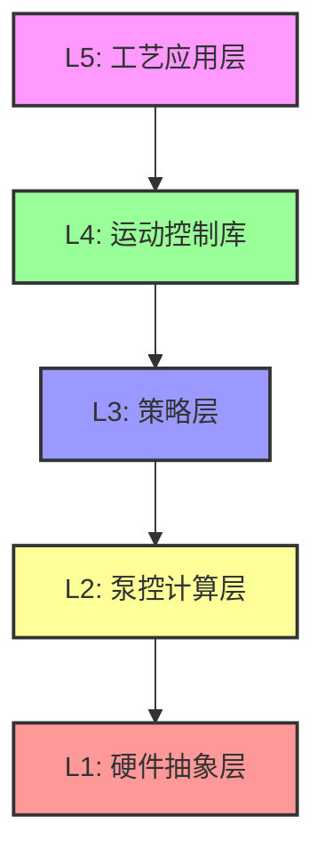

# 注塑机液压运动控制分层架构方案评估与决议

> **文档说明**：本文档合并了原《PLAN.md》与《分层方案对比分析》的全部核心要点，消除了重复与冲突，形成了针对本项目“伺服单泵多缸注塑机控制系统”的最终架构开发指导方针。

---

## 1. 背景与核心争议点

在设计符合现代软件工程（IEC 61131-3 / PLCopen 规范）的注塑机控制系统时，核心争议在于**液压换向阀与高压阀的时序控制权归属**。由此衍生出两种截然不同的架构路线：

* **方案A：底层液压库封装方案（高内聚，指令驱动）**
  运动控制库完全接管阀的时序、硬件互锁与伺服泵的流量/压力计算。工艺层仅发送“运动意图”（如：`MC_MoveAbsolute(目标位置)`），不直接操作具体阀门。
* **方案B：工艺层控制方案（薄底层，业务驱动）**
  底层库仅作为纯数学和泵控计算器，工艺层承担“液压机理”逻辑，根据阶段（如模保、建压、卸压）显式调用开/关具体的电磁阀。

---

## 2. 方案深度对比分析

### 2.1 方案A：底层液压库封装（核心轴首选）

**优势 (Pros)：**

1. **极高的安全性与实时性（硬互锁下沉）**：注塑机动作对时序极度敏感。将“开模前泄压”、“模保异常立即停机”下沉到底层 1ms 级循环，能彻底杜绝工艺层时延抖动导致的压伤模具或水锤冲击，并在库内强制执行阀互锁，防止液压短路。
2. **工艺层解耦（真正的意图驱动）**：工艺代码只负责节拍编排与配方下发。未来若迁移至全电动注塑机，工艺层代码可实现几乎 0 修改复用。
3. **单泵多轴资源仲裁的必然要求**：多轴并发时（如开模同步顶出），谁占流量、谁占压力取决于轴的当前“液压相位”。如果阀和相位在工艺层，底层库将无法获取足够上下文进行合理的泵流量仲裁。
4. **仿真与测试的闭环性**：控制器与阀时序在同一闭环内，极大地便利了在 PC 端构建纯 C 语言的 `HydraulicSimModel` 仿真验证。

**风险与缺点 (Cons & Risks)：**

1. **初期黑盒化**：对现场工艺调试人员而言，看不见直接的“阀控制”可能不直观，排障困难。
2. **非标机型适配成本高**：遇非标液压油路修改，可能需要修改底层 C 代码和重编固件。

### 2.2 方案B：工艺层直接控制（传统 PLC 常见做法）

**优势 (Pros)：**

1. **所见即所得的极高灵活性**：现场人员无需改写底层固件，即可在工艺脚本中随意增删阀动作、调整延时，非常适合老旧系统改造和非标定制。
2. **底层库极简**：运动控制库非常薄，开发速度极快。

**风险与缺点 (Cons & Risks)：**

1. **致命的安全性隐患与跨层耦合**：将建压、泄压、模保判据、阀反馈超时等液压强相关逻辑散落在工艺层，极易出错（例如漏写一次泄压就开模，直接损坏机械结构）。
2. **代码极度臃肿 (Spaghetti Code)**：每一次写动作序列都要重复写阀逻辑，工艺代码与当前机型的具体液压原理图深度死锁，无法形成可复用的标准产品库。
3. **动态特性的妥协**：很难实现诸如“提前 20ms 给泵加速以弥补阀换向压降”的高阶机电液协同补偿。

---

## 3. 场景适用性深度剖析

注塑机并非简单的“气缸动作”，其核心部件（尤其是**合模肘杆机构**与**射胶保压**）具有**强机电液耦合**特性。

对本项目而言：

* **合模轴**必须经历：快进 -> 减速 -> 模保 -> 锁模建压 -> 泄压 -> 开模。
* **射胶轴**必须经历：推进 -> V/P切换 -> 保压 -> 回抽。
  在此类场景中，**“阀的切换与压力状态”本质上是运动控制语义（机理）的一部分，而不是上层业务逻辑**。将其上移到工艺层，只会增加全系统的混沌度。

---

## 4. 最终架构决议与实施边界

综合上述评估，为了兼顾代码现代软件工程化与现场的实用性，本项目明确采取**“核心封装，辅助开放”的混合架构策略（以方案 A 为绝对核心）**。

### 4.1 L4/L5 核心运动库职责（严守方案 A）

对于所有**核心轴**（合模、射胶、顶针、座台进退）：

* 内部全权处理：轴状态机、阀拓扑与互锁、相位的压力/位置判据、单泵资源仲裁、故障锁存机制。
* 严禁工艺层在自动运行中跨过库去操作这部分核心阀门。

### 分层架构简要说明

1. **L5: 工艺应用层**：负责自动循环工序编排、配方管理和HMI交互，调用PLCopen规范接口（如MC_MoveAbsolute、MC_Stop等）。
2. **L4: 运动控制库**：处理核心轴状态机、阀拓扑与互锁、相位压力/位置判据、单泵资源仲裁、故障锁存机制和V/P切换逻辑。
3. **L3: 策略层**：封装合模、射胶、顶针等液压策略，采用OOP策略模式实现不同液压机理的封装。
4. **L2: 泵控计算层**：负责伺服泵流量/压力指令计算、多轴流量需求叠加与仲裁算法、泵加速补偿等。
5. **L1: 硬件抽象层**：提供ADC/DAC/PWM/GPIO驱动、阀输出映射、传感器输入映射和Modbus等通信驱动。

### 4.2 工艺层职责

* 仅调用 PLCopen 规范接口（`MC_MoveAbsolute`、`MC_Stop` 等）。
* 选择动作目标、配方参数（速度档、压力档）。
* 组织整机的工艺工序与节拍。

### 4.3 预留的灵活性接口（缓解方案A缺点的对策）

为解决方案 A 带来的“黑盒”和“非标适配”问题，底层必须提供以下辅助接口：

1. **只读诊断观察接口**：暴露详细的内部数据，如 `Current_Phase`（当前液压相位）、建议压力段、实际输出的阀命令、以及具体的 `Fault_Code`（如：建压超时、阀反馈不匹配）。
2. **服务/手动调试模式**：仅在机器处于“手动/维修”模式时，开放安全绕过机制，允许单独的点动强制阀门输出，用于现场排障。
3. **辅助轴的 IO 开放（退化至方案B）**：针对高度非标、慢速且无复杂动态规划的辅助动作（如外接吹气、中子抽芯气缸），不使用运动库管理，直接开放给工艺层做简单的 IO 映射控制。

## 5. 结论

本决议确立了“意图与机理分离”的设计哲学。底层运动控制库将采用面向对象（OOP in C）与策略模式（Strategy Pattern）进行重构，将合模与射胶的不同液压机理封装在策略层，最终对工艺层暴露统一、安全、极简的 PLCopen 风格 API。
